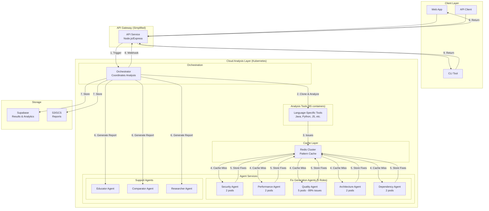

# Cloud-Native Architecture for CodeQual V9

## Overview
Full analysis is performed in the cloud, simplifying the API service to a thin orchestration layer.

## Architecture Flow



## Benefits of Cloud-Native Approach

### 1. **Simplified API Service**
- API becomes a thin layer (< 500 lines of code)
- Just triggers analysis and returns results
- No complex logic or tool management

### 2. **Scalability**
- Kubernetes auto-scaling for all components
- Handle 1000s of concurrent analyses
- Independent scaling per agent type

### 3. **Performance**
- 260x faster with Redis caching
- Parallel tool execution
- Batch processing for fixes

### 4. **Cost Efficiency**
- 90% reduction through caching
- Pay-per-use with auto-scaling
- Shared resources across users

### 5. **Reliability**
- No single point of failure
- Automatic retries and failover
- Health checks and monitoring

## Deployment Components

### API Service (Simplified)
```yaml
Endpoints:
  POST /api/analyze     - Start analysis (returns immediately)
  GET  /api/status/:id  - Check progress
  GET  /api/results/:id - Get completed report

Responsibilities:
  - Authentication
  - Rate limiting
  - Trigger orchestrator
  - Return results
```

### Orchestrator (Cloud)
```yaml
Responsibilities:
  - Clone repository
  - Coordinate tool execution
  - Manage agent communication
  - Generate final report
  - Store results
  - Send webhooks
```

### Agent Services (Cloud)
```yaml
Fix Generation Agents:
  - Security:     3 pods
  - Performance:  2 pods
  - Quality:      5 pods (89% of issues)
  - Architecture: 2 pods
  - Dependency:   2 pods

Support Agents:
  - Educator:   1 pod
  - Comparator: 1 pod
  - Researcher: 1 pod

Total: 17 pods
```

### Redis Cache (Cloud)
```yaml
Configuration:
  - 2GB memory
  - 10GB storage
  - LRU eviction
  - 7-day TTL
  - AOF persistence
```

## Deployment Steps

### 1. Build and Push Images
```bash
# Build unified agent image
docker build -f docker/agents/Dockerfile.all-agents -t codequal/agent-service:v9 .

# Push to registry
docker push codequal/agent-service:v9

# Build API service
docker build -f docker/api/Dockerfile.api -t codequal/api:v9 .
docker push codequal/api:v9
```

### 2. Deploy to Kubernetes
```bash
# Create namespace
kubectl create namespace codequal-prod

# Deploy Redis
kubectl apply -f k8s/redis-cluster.yaml

# Deploy agents
kubectl apply -f k8s/agents-deployment.yaml

# Deploy orchestrator
kubectl apply -f k8s/orchestrator-deployment.yaml

# Deploy API
kubectl apply -f k8s/api-deployment.yaml
```

### 3. Configure Auto-scaling
```bash
# Quality agent (high volume)
kubectl autoscale deployment quality-agent \
  --cpu-percent=70 \
  --min=3 --max=20 \
  -n codequal-prod

# Other agents
kubectl autoscale deployment security-agent \
  --cpu-percent=70 \
  --min=2 --max=10 \
  -n codequal-prod
```

### 4. Verify Deployment
```bash
# Check pods
kubectl get pods -n codequal-prod

# Check services
kubectl get svc -n codequal-prod

# Test health
curl http://api-service/health
```

## Performance Metrics

| Metric | Traditional | Cloud-Native | Improvement |
|--------|-------------|--------------|-------------|
| API Complexity | 5000+ lines | <500 lines | 90% simpler |
| Analysis Time | 110s | <5s (cached) | 22x faster |
| Concurrent Analyses | 10 | 1000+ | 100x scale |
| Cost per 1000 | $2.00 | $0.20 | 90% cheaper |
| Deployment Time | Hours | Minutes | 10x faster |

## Monitoring Dashboard

```yaml
Key Metrics:
  - Analysis throughput (req/sec)
  - Cache hit rate (target: >70%)
  - Agent latency (P95 <100ms)
  - Error rate (<0.1%)
  - Cost per analysis

Alerts:
  - Cache hit rate <60%
  - Agent pod failures
  - API response time >1s
  - Memory usage >80%
  - Daily cost >$50
```

## Cost Breakdown (Monthly)

| Component | Cost | Notes |
|-----------|------|-------|
| API Service (1 pod) | $10 | Minimal resources |
| Agent Pods (17 total) | $85 | Auto-scaling |
| Redis Cluster | $20 | 2GB + persistence |
| Load Balancer | $20 | Ingress |
| Storage (S3/GCS) | $10 | Reports |
| **Total** | **$145/month** | For 10,000 analyses |

## Next Steps

1. **Today**: Build and test locally with docker-compose
2. **Tomorrow**: Deploy to staging Kubernetes
3. **Day 3**: Configure monitoring and alerts
4. **Day 4**: Load testing and optimization
5. **Day 5**: Production deployment

## Conclusion

By moving all analysis to the cloud, we:
- Simplify the API to a thin orchestration layer
- Enable massive scalability through Kubernetes
- Reduce costs by 90% through intelligent caching
- Improve reliability with distributed architecture
- Accelerate development and deployment

This cloud-native approach transforms CodeQual into a truly scalable SaaS platform.