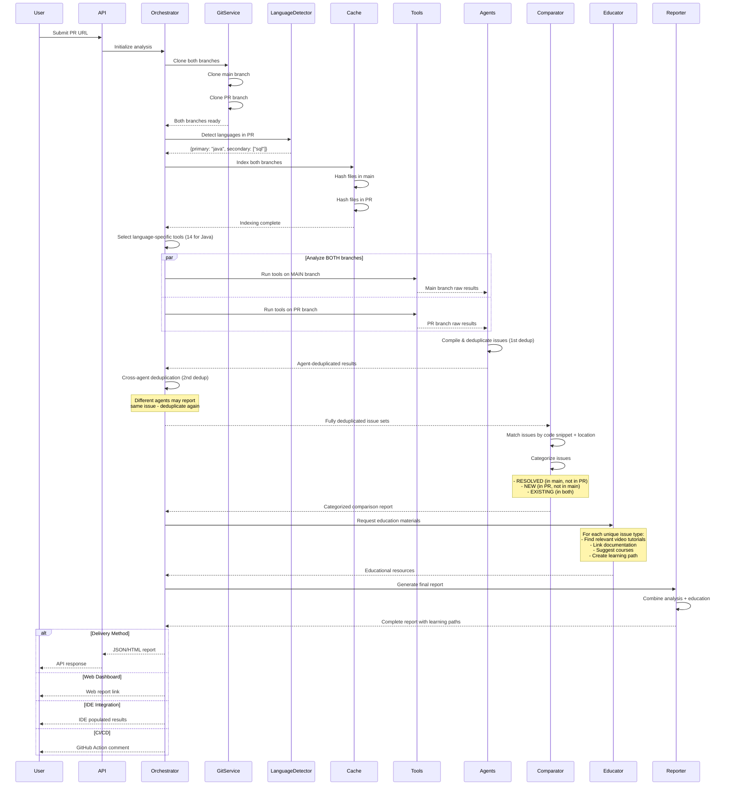

# Accurate Production Flow: Two-Branch Analysis with Education

## Overview

This document describes the ACTUAL production flow where CodeQual analyzes BOTH main and PR branches, compares them to identify new/resolved/existing issues, and provides educational materials for each issue.

## Complete Flow Diagram



## Detailed Step-by-Step Flow

### 1. Orchestrator Initialization

```typescript
class ProductionOrchestrator {
  async analyzePullRequest(prUrl: string): Promise<FinalReport> {
    console.log(`🚀 Initializing two-branch analysis for ${prUrl}`);
    
    // Parse PR information
    const prInfo = this.parsePRUrl(prUrl);
    
    // Clone BOTH branches for comparison
    const { mainBranch, prBranch } = await this.cloneBothBranches(prInfo);
    
    // Detect languages to select appropriate tools
    const languages = await this.languageDetector.analyze(prBranch);
    
    // Select only language-specific tools (10-30 tools, not 85)
    const selectedTools = this.selectToolsForLanguage(languages.primary);
    
    return this.performTwoBranchAnalysis(mainBranch, prBranch, selectedTools);
  }
}
```

### 2. Two-Branch Parallel Analysis

```typescript
class TwoBranchAnalyzer {
  async analyzeMainAndPR(
    mainPath: string,
    prPath: string,
    tools: Tool[]
  ): Promise<BranchResults> {
    console.log(`🔄 Running ${tools.length} tools on BOTH branches`);
    
    // Run all selected tools on BOTH branches in parallel
    const [mainResults, prResults] = await Promise.all([
      this.runToolsOnBranch(mainPath, tools, 'main'),
      this.runToolsOnBranch(prPath, tools, 'pr')
    ]);
    
    return { mainResults, prResults };
  }
  
  private async runToolsOnBranch(
    branchPath: string,
    tools: Tool[],
    branchName: string
  ): Promise<ToolResults[]> {
    console.log(`  📊 Analyzing ${branchName} branch with ${tools.length} tools`);
    
    const results = await Promise.all(
      tools.map(tool => this.runTool(tool, branchPath))
    );
    
    return results;
  }
}
```

### 3. Agent Compilation & First Deduplication

```typescript
class AgentCompiler {
  async compileAndDeduplicate(
    mainResults: ToolResults[],
    prResults: ToolResults[]
  ): Promise<AgentResults[]> {
    console.log('🔀 [STEP 1] Each agent compiles and deduplicates its own results');
    
    // Each agent processes its tool results independently
    const agents = [
      new MultiToolSecurityAgent(),
      new MultiToolCodeQualityAgent(),
      new MultiToolPerformanceAgent(),
      new MultiToolDependencyAgent(),
      new MultiToolArchitectureAgent(),
      new JavaSecurityAgent(),  // Language-specific agents
      new GitHubSecurityAgent() // Platform-specific agents
    ];
    
    // First deduplication: Within each agent's domain
    const agentResults = await Promise.all(
      agents.map(agent => agent.analyze(mainResults, prResults))
    );
    
    console.log('✅ First deduplication complete (within each agent)');
    
    return agentResults; // Each agent returns its deduplicated results
  }
}

### 3.5. Orchestrator's Cross-Agent Deduplication (ACTUAL IMPLEMENTATION)

```typescript
// From enhanced-mcp-orchestrator.ts - ACTUAL WORKING CODE
class EnhancedMCPOrchestrator {
  
  /**
   * The orchestrator performs cross-agent deduplication BEFORE sending to comparison service
   * This prevents the same issue from appearing multiple times in the final report
   */
  async runAllAnalyses(repoPath: string, branch: string) {
    // Run all agents in parallel (each agent deduplicates internally)
    const results = await Promise.all([
      this.agents.security.analyze(...),
      this.agents.githubSecurity.analyze(...),
      this.agents.javaSecurity.analyze(...),
      this.agents.performance.analyze(...),
      this.agents.codeQuality.analyze(...),
      this.agents.dependency.analyze(...),
      this.agents.architecture.analyze(...)
    ]);
    
    // CROSS-AGENT DEDUPLICATION happens here
    const mergedResults = {
      security: this.mergeSecurityResults(results[0], results[1], results[2]),
      performance: results[3],  // Single agent, no merge needed
      codeQuality: results[4],   // Single agent, no merge needed
      dependency: results[5],    // Single agent, no merge needed
      architecture: results[6]   // Single agent, no merge needed
    };
    
    return mergedResults; // Already deduplicated across agents
  }
  
  /**
   * Merge security results from multiple security agents
   * Deduplicates issues that multiple agents found
   */
  private mergeSecurityResults(...securityAgentResults): any[] {
    // Collect all issues from all security agents
    const allIssues = securityAgentResults.flatMap(r => r?.issues || []);
    
    // DEDUPLICATION KEY: file:line:type
    const uniqueIssues = new Map();
    
    allIssues.forEach(issue => {
      const key = `${issue.file}:${issue.line}:${issue.type}`;
      
      if (!uniqueIssues.has(key)) {
        uniqueIssues.set(key, issue);
      } else if (issue.gitHubNative || issue.gitlabNative) {
        // Prefer platform-native findings (fewer false positives)
        uniqueIssues.set(key, issue);
      }
    });
    
    return Array.from(uniqueIssues.values());
  }
  
  private deduplicateIssues(issues: Issue[]): Issue[] {
    const uniqueIssues = new Map<string, Issue>();
    
    for (const issue of issues) {
      // Create unique key based on file, line, and issue type
      const key = `${issue.file}:${issue.line}:${issue.type}:${issue.message}`;
      
      if (!uniqueIssues.has(key)) {
        uniqueIssues.set(key, issue);
      } else {
        // Merge tool information if duplicate
        const existing = uniqueIssues.get(key)!;
        existing.foundByTools = [...existing.foundByTools, ...issue.foundByTools];
      }
    }
    
    return Array.from(uniqueIssues.values());
  }
}
```

### 4. Comparator Agent - Issue Categorization

```typescript
class ComparatorAgent {
  async categorizeIssues(
    mainIssues: Issue[],
    prIssues: Issue[]
  ): Promise<CategorizedIssues> {
    console.log('🔍 Comparing issues between main and PR branches');
    
    const categorized = {
      resolved: [] as Issue[],
      new: [] as Issue[],
      existing: [] as Issue[]
    };
    
    // Find RESOLVED issues (in main but not in PR)
    for (const mainIssue of mainIssues) {
      const matchInPR = this.findMatchingIssue(mainIssue, prIssues);
      
      if (!matchInPR) {
        categorized.resolved.push({
          ...mainIssue,
          status: 'resolved',
          resolution: 'Fixed in this PR'
        });
      }
    }
    
    // Find NEW and EXISTING issues
    for (const prIssue of prIssues) {
      const matchInMain = this.findMatchingIssue(prIssue, mainIssues);
      
      if (!matchInMain) {
        categorized.new.push({
          ...prIssue,
          status: 'new',
          introducedIn: 'This PR'
        });
      } else {
        categorized.existing.push({
          ...prIssue,
          status: 'existing',
          existsSince: matchInMain.firstDetected || 'main branch'
        });
      }
    }
    
    console.log(`✅ Categorization complete:`);
    console.log(`  - ${categorized.resolved.length} issues RESOLVED`);
    console.log(`  - ${categorized.new.length} NEW issues introduced`);
    console.log(`  - ${categorized.existing.length} EXISTING issues remain`);
    
    return categorized;
  }
  
  private findMatchingIssue(issue: Issue, issueList: Issue[]): Issue | null {
    return issueList.find(other => 
      this.isSameIssue(issue, other)
    );
  }
  
  private isSameIssue(issue1: Issue, issue2: Issue): boolean {
    // Match based on code snippet and approximate location
    if (issue1.file !== issue2.file) return false;
    if (issue1.type !== issue2.type) return false;
    
    // Allow for line number drift (code might have moved)
    const lineDrift = Math.abs(issue1.line - issue2.line);
    if (lineDrift > 10) return false;
    
    // Compare code snippets
    const similarity = this.calculateSimilarity(
      issue1.codeSnippet,
      issue2.codeSnippet
    );
    
    return similarity > 0.85; // 85% similarity threshold
  }
  
  private calculateSimilarity(snippet1: string, snippet2: string): number {
    // Simplified similarity calculation
    // In production, use more sophisticated algorithm
    const normalized1 = snippet1.replace(/\s+/g, '').toLowerCase();
    const normalized2 = snippet2.replace(/\s+/g, '').toLowerCase();
    
    if (normalized1 === normalized2) return 1.0;
    
    // Calculate Levenshtein distance-based similarity
    const maxLength = Math.max(normalized1.length, normalized2.length);
    const distance = this.levenshteinDistance(normalized1, normalized2);
    
    return 1 - (distance / maxLength);
  }
}
```

### 5. Educator Agent - Learning Materials

```typescript
class EducatorAgent {
  private knowledgeBase: KnowledgeBase;
  
  async provideEducationalResources(
    categorizedIssues: CategorizedIssues
  ): Promise<EducationalResources> {
    console.log('📚 Generating educational resources for issues');
    
    const resources: EducationalResources = {
      byIssue: new Map(),
      learningPath: [],
      prioritizedTopics: []
    };
    
    // Get unique issue types across all categories
    const allIssues = [
      ...categorizedIssues.new,
      ...categorizedIssues.existing
    ];
    
    const uniqueIssueTypes = this.extractUniqueIssueTypes(allIssues);
    
    // For each unique issue type, find educational resources
    for (const issueType of uniqueIssueTypes) {
      const materials = await this.findEducationalMaterials(issueType);
      
      resources.byIssue.set(issueType, {
        videos: materials.videos,
        documentation: materials.docs,
        courses: materials.courses,
        articles: materials.articles,
        examples: materials.codeExamples
      });
    }
    
    // Create prioritized learning path
    resources.learningPath = this.createLearningPath(
      categorizedIssues,
      resources.byIssue
    );
    
    // Group by topic for systematic learning
    resources.prioritizedTopics = this.prioritizeTopics(
      categorizedIssues,
      resources.byIssue
    );
    
    return resources;
  }
  
  private async findEducationalMaterials(issueType: IssueType) {
    // Map issue types to educational content
    const materials = {
      videos: [] as Video[],
      docs: [] as Documentation[],
      courses: [] as Course[],
      articles: [] as Article[],
      codeExamples: [] as CodeExample[]
    };
    
    switch (issueType.category) {
      case 'security':
        if (issueType.name === 'SQL Injection') {
          materials.videos.push({
            title: 'SQL Injection Prevention',
            url: 'https://youtube.com/watch?v=...',
            duration: '15 min',
            level: 'intermediate'
          });
          materials.docs.push({
            title: 'OWASP SQL Injection Guide',
            url: 'https://owasp.org/www-community/attacks/SQL_Injection',
            type: 'reference'
          });
          materials.courses.push({
            title: 'Secure Coding Practices',
            platform: 'Coursera',
            url: 'https://coursera.org/...',
            duration: '4 weeks'
          });
        }
        break;
        
      case 'performance':
        if (issueType.name === 'N+1 Query') {
          materials.videos.push({
            title: 'Understanding N+1 Query Problems',
            url: 'https://youtube.com/...',
            duration: '12 min'
          });
          materials.articles.push({
            title: 'Solving N+1 Queries in ORMs',
            url: 'https://medium.com/...',
            readTime: '8 min'
          });
        }
        break;
        
      case 'code-quality':
        if (issueType.name === 'Cyclomatic Complexity') {
          materials.docs.push({
            title: 'Refactoring Complex Functions',
            url: 'https://refactoring.guru/...',
            type: 'guide'
          });
          materials.codeExamples.push({
            title: 'Before and After Refactoring',
            url: 'https://github.com/examples/...',
            language: 'java'
          });
        }
        break;
    }
    
    return materials;
  }
  
  private createLearningPath(
    issues: CategorizedIssues,
    materials: Map<string, EducationalMaterials>
  ): LearningPath[] {
    const path: LearningPath[] = [];
    
    // Priority 1: Critical security issues
    const criticalSecurity = issues.new.filter(i => 
      i.category === 'security' && i.severity === 'critical'
    );
    
    if (criticalSecurity.length > 0) {
      path.push({
        priority: 1,
        topic: 'Critical Security Vulnerabilities',
        estimatedTime: '2-3 hours',
        resources: this.getResourcesForIssues(criticalSecurity, materials),
        reason: 'These issues pose immediate risk and should be addressed first'
      });
    }
    
    // Priority 2: High-severity bugs
    const highBugs = issues.new.filter(i => 
      i.category === 'bug' && i.severity === 'high'
    );
    
    if (highBugs.length > 0) {
      path.push({
        priority: 2,
        topic: 'High-Priority Bugs',
        estimatedTime: '1-2 hours',
        resources: this.getResourcesForIssues(highBugs, materials),
        reason: 'These bugs could cause application failures'
      });
    }
    
    // Priority 3: Performance issues
    const performanceIssues = issues.new.filter(i => 
      i.category === 'performance'
    );
    
    if (performanceIssues.length > 0) {
      path.push({
        priority: 3,
        topic: 'Performance Optimization',
        estimatedTime: '2-4 hours',
        resources: this.getResourcesForIssues(performanceIssues, materials),
        reason: 'Improving performance enhances user experience'
      });
    }
    
    // Priority 4: Code quality improvements
    const qualityIssues = [...issues.new, ...issues.existing].filter(i => 
      i.category === 'code-quality'
    );
    
    if (qualityIssues.length > 0) {
      path.push({
        priority: 4,
        topic: 'Code Quality & Maintainability',
        estimatedTime: '3-5 hours',
        resources: this.getResourcesForIssues(qualityIssues, materials),
        reason: 'Better code quality reduces future technical debt'
      });
    }
    
    return path;
  }
}
```

### 6. Final Report Generation

```typescript
class FinalReportGenerator {
  async generateComprehensiveReport(
    categorizedIssues: CategorizedIssues,
    educationalResources: EducationalResources,
    analysisMetadata: AnalysisMetadata
  ): Promise<FinalReport> {
    console.log('📋 Generating final comprehensive report');
    
    const report: FinalReport = {
      metadata: {
        prUrl: analysisMetadata.prUrl,
        repository: analysisMetadata.repository,
        primaryLanguage: analysisMetadata.primaryLanguage,
        toolsExecuted: analysisMetadata.toolsExecuted,
        analysisTime: analysisMetadata.duration,
        timestamp: new Date().toISOString()
      },
      
      summary: {
        resolvedIssues: categorizedIssues.resolved.length,
        newIssues: categorizedIssues.new.length,
        existingIssues: categorizedIssues.existing.length,
        
        newCritical: categorizedIssues.new.filter(i => i.severity === 'critical').length,
        newHigh: categorizedIssues.new.filter(i => i.severity === 'high').length,
        newMedium: categorizedIssues.new.filter(i => i.severity === 'medium').length,
        newLow: categorizedIssues.new.filter(i => i.severity === 'low').length,
        
        overallHealthScore: this.calculateHealthScore(categorizedIssues),
        trendDirection: this.calculateTrend(categorizedIssues)
      },
      
      resolvedIssues: categorizedIssues.resolved.map(issue => ({
        ...issue,
        celebrationMessage: this.getCelebrationMessage(issue)
      })),
      
      newIssues: categorizedIssues.new.map(issue => ({
        ...issue,
        educationalResources: educationalResources.byIssue.get(issue.type),
        suggestedFix: this.getSuggestedFix(issue),
        estimatedEffort: this.estimateEffort(issue)
      })),
      
      existingIssues: categorizedIssues.existing.map(issue => ({
        ...issue,
        educationalResources: educationalResources.byIssue.get(issue.type),
        whyNotFixed: this.explainWhyNotFixed(issue),
        priority: this.calculatePriority(issue)
      })),
      
      learningPath: educationalResources.learningPath,
      
      recommendations: this.generateRecommendations(
        categorizedIssues,
        educationalResources
      ),
      
      deliveryFormats: {
        html: this.generateHTMLReport(report),
        json: report,
        markdown: this.generateMarkdownReport(report),
        ide: this.generateIDEFormat(report),
        cicd: this.generateCICDComment(report)
      }
    };
    
    return report;
  }
  
  private calculateHealthScore(issues: CategorizedIssues): number {
    // Higher score for more resolved issues, lower for new issues
    const resolvedPoints = issues.resolved.length * 10;
    const newPenalty = issues.new.length * 5;
    const existingPenalty = issues.existing.length * 2;
    
    const baseScore = 100;
    const finalScore = Math.max(
      0,
      Math.min(100, baseScore + resolvedPoints - newPenalty - existingPenalty)
    );
    
    return finalScore;
  }
  
  private calculateTrend(issues: CategorizedIssues): 'improving' | 'declining' | 'stable' {
    if (issues.resolved.length > issues.new.length) return 'improving';
    if (issues.new.length > issues.resolved.length) return 'declining';
    return 'stable';
  }
}
```

### 7. Multi-Format Delivery

```typescript
class ReportDelivery {
  async deliverReport(
    report: FinalReport,
    deliveryPreferences: DeliveryPreferences
  ): Promise<DeliveryResult> {
    const results: DeliveryResult = {
      success: true,
      deliveredTo: []
    };
    
    // API Response
    if (deliveryPreferences.api) {
      const apiResponse = {
        status: 'completed',
        report: report.deliveryFormats.json,
        htmlUrl: `https://app.codequal.com/reports/${report.metadata.id}`,
        downloadUrl: `https://api.codequal.com/reports/${report.metadata.id}/download`
      };
      results.deliveredTo.push('api');
    }
    
    // Web Dashboard
    if (deliveryPreferences.webDashboard) {
      await this.publishToWeb(report);
      results.webUrl = `https://app.codequal.com/reports/${report.metadata.id}`;
      results.deliveredTo.push('web');
    }
    
    // IDE Integration (VSCode, IntelliJ, etc.)
    if (deliveryPreferences.ide) {
      await this.pushToIDE(report.deliveryFormats.ide);
      results.deliveredTo.push('ide');
    }
    
    // CI/CD Integration (GitHub Actions, GitLab CI, etc.)
    if (deliveryPreferences.cicd) {
      await this.postToPR(report.deliveryFormats.cicd);
      results.deliveredTo.push('cicd');
    }
    
    // Email
    if (deliveryPreferences.email) {
      await this.sendEmail(report);
      results.deliveredTo.push('email');
    }
    
    return results;
  }
}
```

## Example Reports

### API Response Format
```json
{
  "status": "completed",
  "summary": {
    "resolvedIssues": 5,
    "newIssues": 3,
    "existingIssues": 12,
    "healthScore": 82,
    "trend": "improving"
  },
  "newIssues": [
    {
      "id": "issue-001",
      "type": "SQL Injection",
      "severity": "critical",
      "file": "src/api/users.java",
      "line": 145,
      "codeSnippet": "String query = \"SELECT * FROM users WHERE id = \" + userId;",
      "educationalResources": {
        "videos": [
          {
            "title": "SQL Injection Prevention in Java",
            "url": "https://youtube.com/watch?v=...",
            "duration": "12 min"
          }
        ],
        "documentation": [
          {
            "title": "OWASP SQL Injection Guide",
            "url": "https://owasp.org/..."
          }
        ],
        "suggestedFix": "Use PreparedStatement with parameterized queries"
      }
    }
  ],
  "learningPath": [
    {
      "priority": 1,
      "topic": "Critical Security Issues",
      "estimatedTime": "2 hours",
      "resources": [...]
    }
  ]
}
```

### GitHub PR Comment Format
```markdown
## 📊 CodeQual Analysis Complete

### Summary
✅ **5 issues resolved** - Great job fixing these!
⚠️ **3 new issues introduced** - Need attention
ℹ️ **12 existing issues** remain from main branch

**Health Score:** 82/100 📈 (Improving)

### 🆕 New Issues Requiring Attention

#### 🔴 Critical (1)
1. **SQL Injection** in `src/api/users.java:145`
   ```java
   String query = "SELECT * FROM users WHERE id = " + userId;
   ```
   **Fix:** Use PreparedStatement with parameterized queries
   **Learn:** [📺 SQL Injection Prevention (12 min)](https://youtube.com/...)

#### 🟠 High (2)
...

### 📚 Recommended Learning Path
Based on the issues found, here's your personalized learning path:

1. **Critical Security (2 hours)**
   - 📺 [SQL Injection Prevention](...)
   - 📖 [OWASP Security Guide](...)
   
2. **Performance Optimization (1 hour)**
   - 📺 [N+1 Query Problems](...)
   - 📝 [Database Optimization](...)

[View Full Report](https://app.codequal.com/reports/abc-123)
```

## Performance Metrics

### Analysis Breakdown

| Phase | Duration | Details |
|-------|----------|---------|
| Repository Cloning | 10-30s | Both branches |
| Language Detection | 1-2s | File analysis |
| Tool Execution (Main) | 60-120s | 10-30 tools |
| Tool Execution (PR) | 60-120s | 10-30 tools |
| Deduplication | 2-5s | Remove duplicates |
| Comparison | 3-5s | Match issues |
| Education Lookup | 5-10s | Find resources |
| Report Generation | 2-3s | Format output |
| **Total** | **2-4 minutes** | Complete analysis |

## Key Differentiators

1. **Two-Branch Analysis**: Always analyzes BOTH main and PR branches
2. **Issue Categorization**: Clearly shows RESOLVED, NEW, and EXISTING issues
3. **Smart Deduplication**: Multiple tools finding same issue only reported once
4. **Code Snippet Matching**: Issues matched by actual code, not just line numbers
5. **Educational Integration**: Every issue comes with learning resources
6. **Prioritized Learning Path**: Systematic approach to fixing issues
7. **Multi-Format Delivery**: API, Web, IDE, CI/CD - user's choice