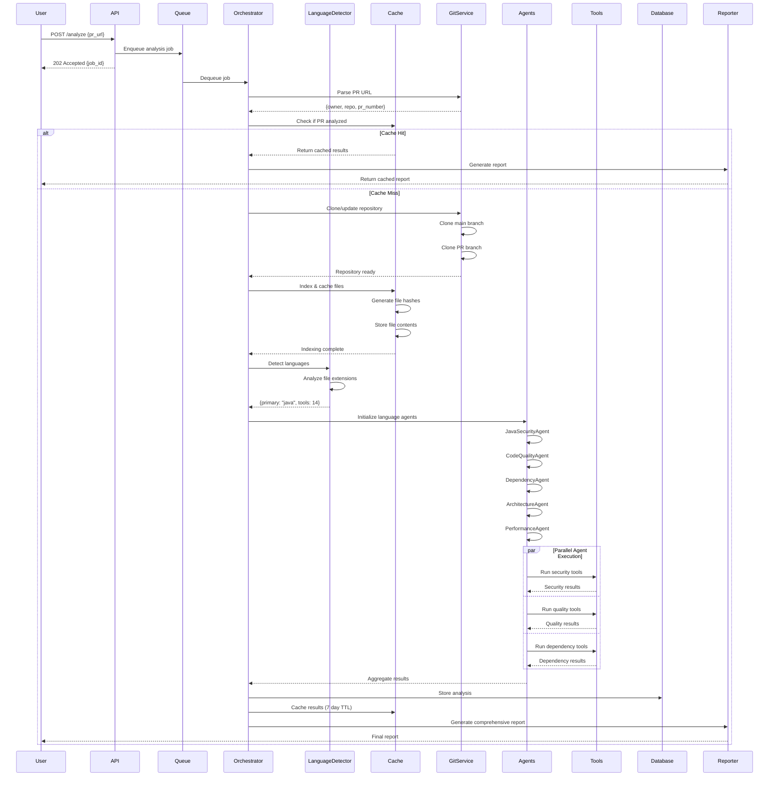

# Complete Cloud Flow: PR URL to Report

## Overview

This document describes the complete end-to-end flow when a user submits a PR URL to CodeQual's cloud infrastructure. The entire process runs on an 8GB Kubernetes cluster with language-specific tool execution.

## Flow Diagram



## Detailed Step-by-Step Flow

### 1. User Submits PR URL

```bash
POST https://api.codequal.com/analyze
{
  "pr_url": "https://github.com/facebook/react/pull/12345",
  "priority": "normal",
  "options": {
    "deep_analysis": true,
    "security_focus": false
  }
}
```

**Response:**
```json
{
  "job_id": "job-uuid-12345",
  "status": "queued",
  "estimated_time": "2-4 minutes",
  "position_in_queue": 3,
  "webhook_url": "https://api.codequal.com/status/job-uuid-12345"
}
```

### 2. API Validates & Enqueues

```typescript
class AnalysisAPI {
  async submitPR(request: PRAnalysisRequest): Promise<JobResponse> {
    // Validate PR URL format
    const prInfo = this.validatePRUrl(request.pr_url);
    
    // Check rate limits
    await this.checkRateLimit(request.user_id);
    
    // Check if analysis exists in cache
    const cached = await this.cache.get(`pr:${prInfo.owner}:${prInfo.repo}:${prInfo.pr}`);
    if (cached && !request.force_refresh) {
      return { job_id: cached.job_id, cached: true };
    }
    
    // Enqueue job
    const job = await this.queue.add({
      type: 'pr_analysis',
      pr_url: request.pr_url,
      priority: request.priority || 'normal',
      user_id: request.user_id,
      options: request.options
    });
    
    return {
      job_id: job.id,
      status: 'queued',
      estimated_time: this.estimateTime(prInfo),
      position_in_queue: await this.queue.position(job.id)
    };
  }
}
```

### 3. Orchestrator Processes Job

```typescript
class CloudOrchestrator {
  async processAnalysisJob(job: AnalysisJob): Promise<void> {
    try {
      // Update job status
      await this.updateJobStatus(job.id, 'processing', 'Initializing analysis');
      
      // Parse PR information
      const prInfo = this.parsePRUrl(job.pr_url);
      
      // Clone repositories (main + PR branch)
      await this.updateJobStatus(job.id, 'processing', 'Cloning repository');
      const { mainPath, prPath } = await this.gitService.cloneForComparison(
        prInfo.owner,
        prInfo.repo, 
        prInfo.pr_number
      );
      
      // Index and cache repository files
      await this.updateJobStatus(job.id, 'processing', 'Indexing files');
      await this.cacheManager.indexRepository(mainPath);
      await this.cacheManager.indexRepository(prPath);
      
      // Detect languages
      await this.updateJobStatus(job.id, 'processing', 'Detecting languages');
      const languages = await this.languageDetector.analyze(prPath);
      
      // Select appropriate tools (10-30 instead of 85)
      const selectedTools = this.selectToolsForLanguages(languages);
      console.log(`Selected ${selectedTools.length} tools for ${languages.primary} project`);
      
      // Initialize agents based on detected language
      await this.updateJobStatus(job.id, 'processing', 'Initializing agents');
      const agents = await this.initializeAgents(languages.primary, languages.secondary);
      
      // Run analysis with selected tools
      await this.updateJobStatus(job.id, 'processing', 'Running analysis');
      const results = await this.runParallelAnalysis(
        agents,
        selectedTools,
        mainPath,
        prPath
      );
      
      // Generate comprehensive report
      await this.updateJobStatus(job.id, 'processing', 'Generating report');
      const report = await this.generateReport(results, prInfo, languages);
      
      // Store results
      await this.storeResults(job.id, report);
      
      // Update job status
      await this.updateJobStatus(job.id, 'completed', 'Analysis complete', report);
      
      // Send webhook if configured
      if (job.webhook_url) {
        await this.sendWebhook(job.webhook_url, report);
      }
      
    } catch (error) {
      await this.handleJobError(job.id, error);
    }
  }
}
```

### 4. Language Detection & Tool Selection

```typescript
class LanguageBasedToolSelector {
  selectTools(languages: LanguageProfile): Tool[] {
    const tools: Tool[] = [];
    
    // Always include universal security tools (5 tools)
    tools.push(...this.getUniversalTools());
    
    // Add primary language tools
    switch(languages.primary) {
      case 'python':
        tools.push(...this.getPythonTools()); // 17 tools
        break;
      case 'javascript':
      case 'typescript':
        tools.push(...this.getJavaScriptTools()); // 10 tools
        break;
      case 'java':
        tools.push(...this.getJavaTools()); // 9 tools
        break;
      case 'go':
        tools.push(...this.getGoTools()); // 12 tools
        break;
      case 'rust':
        tools.push(...this.getRustTools()); // 16 tools
        break;
      case 'ruby':
        tools.push(...this.getRubyTools()); // 9 tools
        break;
      case 'php':
        tools.push(...this.getPHPTools()); // 7 tools
        break;
      case 'cpp':
        tools.push(...this.getCppTools()); // 5 tools
        break;
    }
    
    // Add secondary language tools if >10% of codebase
    for (const lang of languages.secondary) {
      if (lang.percentage > 10) {
        tools.push(...this.getToolsForLanguage(lang.name));
      }
    }
    
    return tools; // Returns 10-30 tools instead of 85
  }
}
```

### 5. Agent Initialization & Execution

```typescript
class AgentManager {
  async initializeAgents(primary: string, secondary: string[]): Promise<Agent[]> {
    const agents: Agent[] = [];
    
    // Core agents (always run)
    agents.push(new MultiToolSecurityAgent());
    agents.push(new MultiToolCodeQualityAgent());
    agents.push(new MultiToolDependencyAgent());
    
    // Language-specific agents
    switch(primary) {
      case 'java':
        agents.push(new JavaSecurityAgent());
        agents.push(new ImprovedJavaSecurityAgent());
        break;
      case 'python':
        agents.push(new PythonSecurityAgent());
        break;
      case 'rust':
        agents.push(new EnhancedRustSecurityAgent());
        break;
      case 'cpp':
        agents.push(new CppSecurityAgent());
        break;
      case 'ruby':
        agents.push(new RubySecurityAgent());
        break;
      case 'php':
        agents.push(new PHPSecurityAgent());
        break;
    }
    
    // Platform-specific agents
    if (this.isGitHub) {
      agents.push(new GitHubSecurityAgent());
    } else if (this.isGitLab) {
      agents.push(new GitLabSecurityAgent());
    }
    
    // License compliance (if needed)
    agents.push(new LicenseComplianceAgent());
    
    return agents;
  }
  
  async runParallelAnalysis(
    agents: Agent[],
    tools: Tool[],
    mainPath: string,
    prPath: string
  ): Promise<AnalysisResults> {
    // Read from cache for unchanged files
    const cachedResults = await this.getCachedResults(prPath, tools);
    
    // Run agents in parallel (within memory constraints)
    const agentPromises = agents.map(agent => 
      this.runAgentWithMemoryLimit(agent, tools, mainPath, prPath, cachedResults)
    );
    
    const results = await Promise.allSettled(agentPromises);
    
    return this.aggregateResults(results);
  }
}
```

### 6. Caching Strategy

```typescript
class CacheManager {
  private redis: Redis;
  
  async indexRepository(repoPath: string): Promise<void> {
    const files = await this.getAllFiles(repoPath);
    
    for (const file of files) {
      const content = await fs.readFile(file, 'utf-8');
      const hash = this.hashContent(content);
      
      // Cache file content (avoids repeated disk I/O)
      await this.redis.setex(
        `file:content:${hash}`,
        86400 * 7, // 7 days
        content
      );
      
      // Store file metadata
      await this.redis.hset(
        `repo:${repoPath}:files`,
        file,
        JSON.stringify({
          hash,
          size: content.length,
          language: this.detectLanguage(file),
          lastModified: Date.now()
        })
      );
    }
  }
  
  async getCachedAnalysis(
    fileHash: string,
    toolName: string
  ): Promise<any | null> {
    const key = `analysis:${fileHash}:${toolName}`;
    const cached = await this.redis.get(key);
    
    if (cached) {
      console.log(`Cache hit for ${toolName} on ${fileHash}`);
      return JSON.parse(cached);
    }
    
    return null;
  }
  
  async cacheAnalysis(
    fileHash: string,
    toolName: string,
    result: any
  ): Promise<void> {
    const key = `analysis:${fileHash}:${toolName}`;
    await this.redis.setex(
      key,
      86400 * 7, // 7 days
      JSON.stringify(result)
    );
  }
}
```

### 7. Report Generation

```typescript
class ReportGenerator {
  async generateComprehensiveReport(
    results: AnalysisResults,
    prInfo: PRInfo,
    languages: LanguageProfile
  ): Promise<ComprehensiveReport> {
    const report: ComprehensiveReport = {
      metadata: {
        pr_url: prInfo.url,
        repository: `${prInfo.owner}/${prInfo.repo}`,
        pr_number: prInfo.pr_number,
        primary_language: languages.primary,
        languages_detected: languages.all,
        tools_executed: results.toolsExecuted,
        analysis_time: results.duration,
        timestamp: new Date().toISOString()
      },
      
      summary: {
        total_issues: results.issues.length,
        critical: results.issues.filter(i => i.severity === 'critical').length,
        high: results.issues.filter(i => i.severity === 'high').length,
        medium: results.issues.filter(i => i.severity === 'medium').length,
        low: results.issues.filter(i => i.severity === 'low').length,
        
        security_score: this.calculateSecurityScore(results),
        quality_score: this.calculateQualityScore(results),
        performance_score: this.calculatePerformanceScore(results),
        
        files_analyzed: results.filesAnalyzed,
        lines_of_code: results.linesOfCode,
        test_coverage: results.testCoverage
      },
      
      issues_by_category: {
        security: results.issues.filter(i => i.category === 'security'),
        bugs: results.issues.filter(i => i.category === 'bug'),
        code_smell: results.issues.filter(i => i.category === 'code_smell'),
        performance: results.issues.filter(i => i.category === 'performance'),
        style: results.issues.filter(i => i.category === 'style')
      },
      
      agent_reports: {
        security: results.agentReports.security,
        code_quality: results.agentReports.codeQuality,
        dependencies: results.agentReports.dependencies,
        architecture: results.agentReports.architecture,
        performance: results.agentReports.performance
      },
      
      recommendations: this.generateRecommendations(results),
      
      metrics: {
        cyclomatic_complexity: results.metrics.complexity,
        maintainability_index: results.metrics.maintainability,
        technical_debt: results.metrics.technicalDebt,
        duplication_percentage: results.metrics.duplication
      }
    };
    
    return report;
  }
}
```

## API Endpoints

### Submit PR for Analysis
```http
POST /api/v1/analyze
Content-Type: application/json
Authorization: Bearer {api_key}

{
  "pr_url": "https://github.com/owner/repo/pull/123",
  "priority": "high",
  "options": {
    "deep_analysis": true,
    "security_focus": false,
    "skip_cache": false
  }
}
```

### Check Job Status
```http
GET /api/v1/status/{job_id}
Authorization: Bearer {api_key}
```

### Get Analysis Report
```http
GET /api/v1/report/{job_id}
Authorization: Bearer {api_key}
```

### Webhook Payload
```json
{
  "job_id": "job-uuid-12345",
  "status": "completed",
  "pr_url": "https://github.com/owner/repo/pull/123",
  "summary": {
    "total_issues": 15,
    "critical": 0,
    "high": 3,
    "medium": 7,
    "low": 5,
    "security_score": 92,
    "quality_score": 87
  },
  "report_url": "https://api.codequal.com/report/job-uuid-12345",
  "dashboard_url": "https://app.codequal.com/reports/job-uuid-12345"
}
```

## Infrastructure Components

### 1. Kubernetes Pods

```yaml
codequal namespace:
  - api-deployment (2 replicas)
  - worker-deployment (1 replica)
  - analyzer-deployment (1 replica)
  - redis-deployment (1 replica)
  - web-deployment (2 replicas)
```

### 2. Redis Cache Structure

```
Keys:
  pr:{owner}:{repo}:{pr_number}          # Complete PR analysis
  job:{job_id}                           # Job metadata
  file:content:{hash}                    # File contents
  analysis:{file_hash}:{tool}           # Tool results per file
  repo:{owner}:{repo}:index             # Repository file index
  queue:analysis:pending                 # Pending jobs
  queue:analysis:processing              # Active jobs
  rate_limit:{user_id}                  # Rate limiting
```

### 3. Database Schema

```sql
-- Analysis results table
CREATE TABLE analysis_results (
  id UUID PRIMARY KEY,
  job_id UUID NOT NULL,
  pr_url VARCHAR(500) NOT NULL,
  repository VARCHAR(200) NOT NULL,
  pr_number INTEGER NOT NULL,
  primary_language VARCHAR(50),
  tools_executed INTEGER,
  total_issues INTEGER,
  critical_issues INTEGER,
  high_issues INTEGER,
  medium_issues INTEGER,
  low_issues INTEGER,
  security_score INTEGER,
  quality_score INTEGER,
  analysis_time_seconds INTEGER,
  report JSONB,
  created_at TIMESTAMP DEFAULT NOW(),
  updated_at TIMESTAMP DEFAULT NOW()
);

-- Jobs table
CREATE TABLE analysis_jobs (
  id UUID PRIMARY KEY,
  user_id UUID NOT NULL,
  pr_url VARCHAR(500) NOT NULL,
  status VARCHAR(50) NOT NULL,
  priority VARCHAR(20) DEFAULT 'normal',
  position_in_queue INTEGER,
  started_at TIMESTAMP,
  completed_at TIMESTAMP,
  error_message TEXT,
  created_at TIMESTAMP DEFAULT NOW()
);
```

## Performance Characteristics

### Timing Breakdown

| Phase | Duration | Details |
|-------|----------|---------|
| Queue Wait | 0-30s | Depends on queue depth |
| Repository Clone | 10-30s | Depends on repo size |
| File Indexing | 5-15s | Hash generation & caching |
| Language Detection | 1-3s | File extension analysis |
| Tool Selection | <1s | Based on language |
| Agent Initialization | 2-5s | Loading configurations |
| Analysis Execution | 60-180s | Running tools (main time) |
| Report Generation | 3-5s | Aggregating results |
| **Total** | **2-4 minutes** | For typical PR |

### Concurrency Model

```
8GB Cluster (2 nodes @ 4GB each):
┌─────────────────┬─────────────────┐
│     Node 1      │     Node 2      │
├─────────────────┼─────────────────┤
│ API Pod (0.5GB) │ Web Pod (0.5GB) │
│ Worker (0.5GB)  │ Web Pod (0.5GB) │
│ Analyzer (3GB)  │ Redis (0.5GB)   │
│                 │ Analyzer (2.5GB)│
└─────────────────┴─────────────────┘

Capacity:
- 2-4 concurrent PR analyses
- 30-60 PRs per hour
- <30 second queue time at steady state
```

## Error Handling

### Retry Logic
```typescript
class RetryableAnalysis {
  async executeWithRetry(
    fn: () => Promise<any>,
    maxRetries: number = 3
  ): Promise<any> {
    let lastError;
    
    for (let attempt = 1; attempt <= maxRetries; attempt++) {
      try {
        return await fn();
      } catch (error) {
        lastError = error;
        
        if (this.isRetryable(error) && attempt < maxRetries) {
          const delay = Math.min(1000 * Math.pow(2, attempt), 10000);
          await this.sleep(delay);
          continue;
        }
        
        throw error;
      }
    }
    
    throw lastError;
  }
  
  isRetryable(error: any): boolean {
    return error.code === 'ECONNRESET' ||
           error.code === 'ETIMEDOUT' ||
           error.status === 503 ||
           error.status === 429;
  }
}
```

## Monitoring & Alerts

### Key Metrics
```yaml
alerts:
  - name: high_queue_depth
    condition: queue_size > 20
    severity: warning
    
  - name: slow_analysis
    condition: analysis_time > 300s
    severity: warning
    
  - name: low_cache_hit_rate
    condition: cache_hit_rate < 0.5
    severity: info
    
  - name: high_error_rate
    condition: error_rate > 0.1
    severity: critical
    
  - name: memory_pressure
    condition: memory_usage > 0.9
    severity: warning
```

## Security Considerations

1. **API Authentication**: Bearer token required
2. **Rate Limiting**: 100 requests per hour per user
3. **Input Validation**: Strict PR URL validation
4. **Sandboxing**: Tools run in isolated containers
5. **Secrets Management**: GitHub tokens encrypted at rest
6. **Network Isolation**: Pods communicate internally only

## Scaling Strategy

### Horizontal Scaling
```bash
# Add more nodes for increased capacity
doctl kubernetes cluster node-pool create \
  --cluster-id codequal-k8s \
  --name analyzer-pool \
  --size s-4vcpu-8gb \
  --count 3

# Scale analyzer deployment
kubectl scale deployment analyzer --replicas=3 -n codequal
```

### Estimated Capacity by Cluster Size

| Cluster Size | Concurrent PRs | PRs/Hour | Avg Wait Time |
|-------------|---------------|----------|---------------|
| 8GB (2 nodes) | 2-4 | 30-60 | 0-30s |
| 16GB (4 nodes) | 6-10 | 90-150 | 0-10s |
| 32GB (8 nodes) | 15-25 | 200-350 | <5s |
| 64GB (16 nodes) | 30-50 | 500-800 | <2s |

## Deployment Validation Checklist

- [ ] All pods running in `codequal` namespace
- [ ] Redis accessible and persistent
- [ ] API responding to health checks
- [ ] Queue processing jobs
- [ ] Language detection working
- [ ] Cache hit rate > 50% after warmup
- [ ] Reports generating correctly
- [ ] Webhooks delivering
- [ ] Monitoring dashboard active
- [ ] Alerts configured
- [ ] Backup strategy in place
- [ ] SSL certificates valid
- [ ] Rate limiting active
- [ ] Error tracking enabled