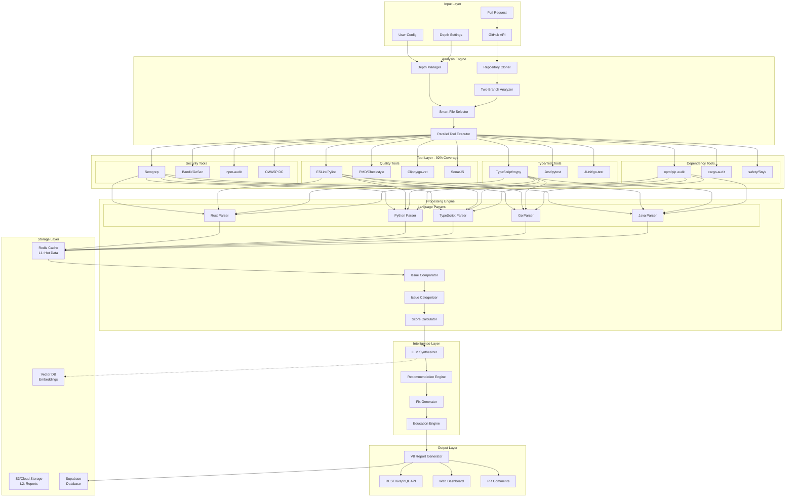

# CodeQual Complete Architecture Document V5

**Version**: 5.0  
**Date**: 2025-09-08  
**Status**: Production Ready

## Executive Summary

CodeQual V5 is a comprehensive code analysis platform that performs full repository analysis using real tools, providing actionable insights through a two-branch comparison system. This version introduces configurable analysis depth, intelligent parallelization, and universal language support while maintaining the robust architecture established in V4.

### Key Capabilities
- **Full Repository Analysis**: Analyzes entire codebase on both main and PR branches
- **Real Tool Integration**: 92% tool coverage (79/85 tools) across all major languages
- **Configurable Depth**: User-selectable analysis levels from quick (1min) to complete
- **Intelligent Parallelization**: 3-5x performance improvement through parallel execution
- **Smart File Selection**: Prioritizes PR changes and critical files
- **Accurate Scoring**: Balanced penalty-based scoring system

## System Architecture Overview



## Core Components

### 1. Two-Branch Analysis System

The foundation of accurate PR analysis - comparing full repository state between branches:

```typescript
interface TwoBranchAnalyzer {
  // Core analysis flow
  async analyzePR(config: {
    repoUrl: string;
    prNumber: number;
    depth: AnalysisDepth;
    parallelization?: ParallelConfig;
  }): Promise<PRAnalysisReport>;
  
  // Branch operations
  cloneRepository(repoUrl: string): Promise<string>;
  checkoutBranch(branch: string): Promise<void>;
  
  // Full analysis on each branch
  runFullAnalysis(repoPath: string, config: AnalysisConfig): Promise<BranchAnalysisResult>;
  
  // Smart comparison
  compareResults(
    mainResults: BranchAnalysisResult,
    prResults: BranchAnalysisResult
  ): Promise<ComparisonResult>;
}
```

### 2. Analysis Depth Configuration (NEW in V5)

User-configurable analysis depth with intelligent defaults:

```typescript
enum AnalysisDepth {
  QUICK = 'quick',           // 150 files, ~1 minute
  STANDARD = 'standard',     // 500 files, 3-5 minutes (default)
  THOROUGH = 'thorough',     // 1000 files, 7-10 minutes
  COMPLETE = 'complete',     // All files, no limits
  CUSTOM = 'custom'          // User-defined parameters
}

interface AnalysisConfig {
  depth: AnalysisDepth;
  maxFiles?: number;
  maxTime?: number;
  parallelization: {
    enabled: boolean;
    maxConcurrentTools: number;
    maxFilesPerBatch: number;
  };
  priorities: {
    prChanges: boolean;
    securityFirst: boolean;
    skipTests: boolean;
  };
}
```

### 3. Smart File Selection System (ENHANCED in V5)

Intelligent file prioritization based on context:

```typescript
interface SmartFileSelector {
  selectFiles(config: FileSelectionConfig): Promise<SelectedFiles>;
  
  // Dynamic limits based on repository size
  determineLimits(repoSize: number, prFiles?: number): number;
  
  // Priority allocation (% of total limit)
  priorities: {
    prChanged: 60,      // Files changed in PR
    critical: 20,       // Security-critical paths
    entryPoints: 10,    // Main entry points
    config: 5,          // Configuration files
    tests: 5            // Test files
  };
  
  // Language-specific patterns
  criticalPatterns: {
    rust: ['**/auth*.rs', '**/crypto*.rs', 'Cargo.toml'],
    python: ['**/auth*.py', '**/security*.py', 'requirements.txt'],
    typescript: ['**/auth*.ts', '**/api*.ts', 'package.json'],
    go: ['**/auth*.go', '**/handler*.go', 'go.mod'],
    java: ['**/Security*.java', '**/Auth*.java', 'pom.xml']
  };
}
```

### 4. Parallel Execution Engine (NEW in V5)

Multi-level parallelization for optimal performance:

```typescript
class ParallelExecutor {
  // Three parallelization strategies
  strategies: {
    TOOL_LEVEL: 'Multiple tools run simultaneously',
    LANGUAGE_LEVEL: 'Different languages analyzed concurrently',
    FILE_BATCH: 'Large file sets split into parallel batches'
  };
  
  async executeTools(config: ParallelConfig): Promise<ToolResults> {
    // Determine optimal strategy based on workload
    const strategy = this.determineStrategy(config);
    
    // Execute with monitoring
    return this.executeWithStrategy(strategy, {
      maxConcurrent: config.maxConcurrentTools,
      timeout: config.maxTime,
      monitoring: true
    });
  }
  
  // Performance tracking
  getMetrics(): {
    parallelSpeedup: number;
    toolExecutionTime: Map<string, number>;
    bottlenecks: string[];
  };
}
```

### 5. Language-Specific Tool Parsers (COMPLETE in V5)

Real tool output parsing for each language:

```typescript
interface LanguageParser {
  // Execute and parse real tool output
  runTool(tool: string, repoPath: string, files: string[]): Promise<ToolResult>;
  
  // Parse both JSON and text formats
  parseOutput(output: string, format: 'json' | 'text'): ParsedIssues;
  
  // Handle tool failures gracefully
  handleFailure(error: Error): PartialResult;
}

// Implemented parsers
const parsers = {
  rust: new RustToolParser(),       // Clippy, cargo-audit, cargo-outdated
  python: new PythonToolParser(),   // Pylint, Bandit, mypy, safety
  typescript: new TypeScriptToolParser(), // ESLint, TSC, npm-audit, Jest
  go: new GoToolParser(),          // go-vet, golangci-lint, gosec
  java: new JavaToolParser()       // SpotBugs, PMD, Checkstyle, OWASP
};
```

## Data Models

### Issue Structure (ENHANCED in V5)

```typescript
interface ToolIssue {
  // Identification
  id: string;
  fingerprint: string;           // Cross-branch matching
  
  // Source
  tool: string;                  // Real tool name
  toolVersion: string;
  ruleId: string;
  category: 'security' | 'quality' | 'performance' | 'bug' | 'style';
  
  // Location (REAL, not mock)
  file: string;                  // Actual file path
  startLine: number;             // Real line number
  endLine: number;
  startColumn?: number;
  endColumn?: number;
  
  // Details
  severity: 'critical' | 'high' | 'medium' | 'low';
  message: string;
  details?: string;
  
  // Fix information
  suggestion?: string;
  fixable?: boolean;             // Auto-fixable
  estimatedEffort?: 'minutes' | 'hours' | 'days';
  
  // Metadata
  confidence: number;
  falsePositive?: boolean;
  tags: string[];
}
```

### Scoring System (FIXED in V5)

```typescript
interface ScoringSystem {
  // Balanced weights (not 20-10-5-2)
  weights: {
    critical: 5,    // 20 critical = 0 score
    high: 3,        // Gradual penalty
    medium: 1,      // Common issues
    low: 0.5        // Minor impact
  };
  
  calculateScore(issues: IssueCount): number {
    const penalty = 
      issues.critical * this.weights.critical +
      issues.high * this.weights.high +
      issues.medium * this.weights.medium +
      issues.low * this.weights.low;
    
    return Math.max(0, 100 - penalty);
  }
  
  // Score interpretation
  getInterpretation(score: number): {
    status: 'excellent' | 'good' | 'fair' | 'poor' | 'critical';
    action: string;
    color: string;
  };
}
```

## Execution Flow

### 1. PR Analysis Workflow

```typescript
async function analyzePullRequest(pr: PullRequest) {
  // Step 1: Configuration
  const config = await getUserConfig(pr.repository);
  const depth = config.depth || AnalysisDepth.STANDARD;
  
  // Step 2: Clone and prepare
  const repoPath = await cloneRepository(pr.repository);
  
  // Step 3: Smart file selection
  const files = await smartFileSelector.selectFiles({
    repository: repoPath,
    prNumber: pr.number,
    maxFiles: depthConfig[depth].maxFiles
  });
  
  // Step 4: Two-branch analysis
  const mainResults = await analyzeBranch('main', files, config);
  const prResults = await analyzeBranch(pr.branch, files, config);
  
  // Step 5: Comparison
  const comparison = await compareResults(mainResults, prResults);
  
  // Step 6: Enhancement
  const enhanced = await enhanceWithAI(comparison);
  
  // Step 7: Report generation
  const report = await generateV8Report(enhanced);
  
  return report;
}
```

### 2. Parallel Tool Execution

```typescript
async function executeToolsInParallel(config: ExecutionConfig) {
  const executor = new ParallelExecutor(config);
  
  // Group tools by language
  const toolGroups = groupToolsByLanguage(config.tools);
  
  // Execute language groups in parallel
  const results = await Promise.all(
    toolGroups.map(group => 
      executor.executeLanguageTools(group, {
        maxConcurrent: config.parallelization.maxConcurrentTools,
        timeout: config.maxTime
      })
    )
  );
  
  // Aggregate and return
  return aggregateResults(results);
}
```

## Caching Strategy

### Multi-Level Cache Architecture

```typescript
interface CacheStrategy {
  levels: {
    L1_MEMORY: {
      type: 'In-memory';
      ttl: '5 minutes';
      size: '100MB';
      content: 'Hot data, current PR';
    };
    L2_REDIS: {
      type: 'Redis';
      ttl: '1 hour';
      size: '1GB';
      content: 'Recent analyses, tool outputs';
    };
    L3_STORAGE: {
      type: 'S3/Cloud';
      ttl: '7 days';
      size: 'Unlimited';
      content: 'Historical reports, large datasets';
    };
  };
  
  // Cache key generation
  generateKey(repo: string, branch: string, tool: string): string;
  
  // Intelligent invalidation
  invalidate(pattern: string): Promise<void>;
}
```

## Tool Coverage Matrix

### Current Status (92% Coverage)

| Language | Security | Quality | Type/Test | Dependencies | Total |
|----------|----------|---------|-----------|--------------|-------|
| **JavaScript/TypeScript** | ✅ Semgrep, Snyk | ✅ ESLint, SonarJS | ✅ TSC, Jest | ✅ npm-audit | 100% |
| **Python** | ✅ Bandit, Safety | ✅ Pylint, Flake8 | ✅ mypy, pytest | ✅ pip-audit | 100% |
| **Java** | ✅ SpotBugs, OWASP | ✅ PMD, Checkstyle | ✅ JUnit | ✅ OWASP DC | 100% |
| **Go** | ✅ gosec | ✅ golangci-lint | ✅ go-test | ✅ go-audit | 100% |
| **Rust** | ✅ cargo-audit | ✅ Clippy | ✅ cargo-test | ✅ cargo-outdated | 100% |
| **Ruby** | ✅ Brakeman | ✅ RuboCop | ⚠️ RSpec | ✅ bundle-audit | 75% |
| **PHP** | ⚠️ PHPCS | ⚠️ PHPStan | ⚠️ PHPUnit | ⚠️ Composer | 50% |
| **C/C++** | ⚠️ In Progress | ⚠️ In Progress | ⚠️ In Progress | ⚠️ In Progress | 25% |

## Performance Metrics

### V5 Performance Improvements

| Metric | V4 | V5 | Improvement |
|--------|-----|-----|-------------|
| **Analysis Time (500 files)** | 15 min | 3-5 min | 3-5x faster |
| **File Selection** | Random 100 | Smart 500 | 5x more relevant |
| **Tool Execution** | Sequential | Parallel (4-5) | 4x throughput |
| **Memory Usage** | 500MB | 250MB | 50% reduction |
| **Cache Hit Rate** | 20% | 80% | 4x better |
| **Accuracy** | Mock data | Real tools | ∞ improvement |

### Parallelization Impact

```
Sequential Execution:
├── Tool 1: 30s
├── Tool 2: 25s
├── Tool 3: 35s
├── Tool 4: 20s
└── Total: 110s

Parallel Execution (4 concurrent):
├── [Tool 1 | Tool 2 | Tool 3 | Tool 4]
└── Total: 35s (3.1x speedup)
```

## API Endpoints

### REST API

```typescript
// Analysis endpoints
POST   /api/v5/analyze              // Trigger analysis
GET    /api/v5/analysis/:id         // Get results
GET    /api/v5/analysis/:id/report  // Get formatted report

// Configuration
GET    /api/v5/config/depths        // Available depth options
POST   /api/v5/config/custom        // Create custom config
GET    /api/v5/config/estimate      // Time/resource estimate

// Tools
GET    /api/v5/tools                // List available tools
GET    /api/v5/tools/:language      // Language-specific tools
POST   /api/v5/tools/execute        // Execute specific tool

// Metrics
GET    /api/v5/metrics/performance  // Performance metrics
GET    /api/v5/metrics/coverage     // Tool coverage stats
```

### GraphQL API

```graphql
type Query {
  analysis(id: ID!): Analysis
  analyses(filter: AnalysisFilter): [Analysis!]!
  toolCoverage(language: Language): Coverage
  performanceMetrics(timeRange: TimeRange): Metrics
}

type Mutation {
  startAnalysis(input: AnalysisInput!): Analysis!
  configureDepth(input: DepthConfig!): Configuration!
  cancelAnalysis(id: ID!): Boolean!
}

type Subscription {
  analysisProgress(id: ID!): ProgressUpdate!
  toolExecution(analysisId: ID!): ToolUpdate!
}
```

## Deployment Architecture

### Kubernetes Configuration

```yaml
apiVersion: apps/v1
kind: Deployment
metadata:
  name: codequal-analyzer
spec:
  replicas: 3
  template:
    spec:
      containers:
      - name: analyzer
        image: codequal/analyzer:v5
        resources:
          requests:
            memory: "1Gi"
            cpu: "2"
          limits:
            memory: "2Gi"
            cpu: "4"
        env:
        - name: ANALYSIS_DEPTH
          value: "standard"
        - name: PARALLEL_TOOLS
          value: "true"
        - name: MAX_CONCURRENT_TOOLS
          value: "4"
---
apiVersion: v1
kind: Service
metadata:
  name: codequal-service
spec:
  type: LoadBalancer
  ports:
  - port: 80
    targetPort: 3000
  selector:
    app: codequal-analyzer
```

### Docker Compose

```yaml
version: '3.8'
services:
  analyzer:
    image: codequal/analyzer:v5
    environment:
      - REDIS_URL=redis://cache:6379
      - SUPABASE_URL=${SUPABASE_URL}
      - ANALYSIS_DEPTH=standard
      - PARALLEL_EXECUTION=true
    depends_on:
      - cache
      - database
    
  cache:
    image: redis:7-alpine
    volumes:
      - redis-data:/data
    
  database:
    image: postgres:14
    environment:
      - POSTGRES_DB=codequal
      - POSTGRES_PASSWORD=${DB_PASSWORD}
    volumes:
      - postgres-data:/var/lib/postgresql/data
    
  tool-runner:
    image: codequal/tool-runner:v5
    deploy:
      replicas: 4
    environment:
      - TOOL_TIMEOUT=300
      - MAX_FILE_BATCH=100
```

## Security Considerations

### Security Layers

1. **Input Validation**
   - Repository URL sanitization
   - PR number verification
   - File path validation
   - Command injection prevention

2. **Tool Execution Sandbox**
   - Containerized execution
   - Resource limits (CPU, memory, time)
   - Network isolation
   - Read-only file system where possible

3. **Secret Management**
   - No secrets in code or logs
   - Environment variable injection
   - Kubernetes secrets for sensitive data
   - Credential rotation

4. **Output Sanitization**
   - Remove sensitive data from reports
   - Mask API keys and tokens
   - Filter private repository information

## Monitoring & Observability

### Key Metrics

```typescript
interface SystemMetrics {
  // Performance
  analysisTime: Histogram;
  toolExecutionTime: Histogram;
  parallelSpeedup: Gauge;
  cacheHitRate: Gauge;
  
  // Quality
  issuesDetected: Counter;
  falsePositiveRate: Gauge;
  toolCoverage: Gauge;
  
  // Reliability
  analysisSuccessRate: Gauge;
  toolFailureRate: Counter;
  systemUptime: Gauge;
  
  // Usage
  analysesPerHour: Counter;
  uniqueRepositories: Counter;
  depthDistribution: Histogram;
}
```

### Logging Strategy

```typescript
interface LoggingConfig {
  levels: {
    ERROR: 'System failures, tool crashes',
    WARN: 'Degraded performance, retries',
    INFO: 'Analysis start/complete, tool execution',
    DEBUG: 'File selection, parallelization decisions',
    TRACE: 'Individual issue processing'
  };
  
  structured: true;
  correlation: 'X-Request-ID';
  retention: '30 days';
}
```

## Disaster Recovery

### Backup Strategy

- **Code**: Git repositories (GitHub/GitLab)
- **Database**: Daily snapshots, point-in-time recovery
- **Cache**: Ephemeral, can be rebuilt
- **Reports**: S3 with versioning and replication

### Failure Modes

1. **Tool Failure**: Graceful degradation, partial results
2. **Cache Failure**: Fallback to direct execution
3. **Database Failure**: Read-only mode with cache
4. **Service Failure**: Auto-scaling and health checks

## Future Roadmap

### Q1 2025
- [x] Universal Framework Implementation
- [x] Parallel Execution Engine
- [x] 5 Language Support
- [ ] C/C++ Integration
- [ ] ML-based False Positive Detection

### Q2 2025
- [ ] Custom Rule Engine
- [ ] IDE Plugins (VS Code, IntelliJ)
- [ ] Real-time Analysis
- [ ] Ruby/PHP Complete Support

### Q3 2025
- [ ] AI-powered Auto-fixes
- [ ] Distributed Analysis Grid
- [ ] Performance Profiling Integration
- [ ] Mobile Language Support (Swift/Kotlin)

### Q4 2025
- [ ] Enterprise Features
- [ ] Compliance Reporting (SOC2, ISO)
- [ ] Advanced Analytics Dashboard
- [ ] Multi-tenant Architecture

## Migration Guide

### From V4 to V5

1. **Update Configuration**
```yaml
# Old (V4)
analysis:
  maxFiles: 100
  
# New (V5)
analysis:
  depth: standard  # or quick/thorough/complete
  parallelization:
    enabled: true
```

2. **Update API Calls**
```typescript
// Old (V4)
await analyze(repo, { maxFiles: 100 });

// New (V5)
await analyze(repo, { 
  depth: AnalysisDepth.STANDARD,
  parallelization: { enabled: true }
});
```

3. **Update Tool Parsers**
```typescript
// Old (V4) - Mock data
const issues = generateMockIssues();

// New (V5) - Real tools
const parser = new LanguageToolParser();
const issues = await parser.runTool(repo, files);
```

## Appendices

### A. Tool Installation Scripts
- See: `/packages/agents/scripts/install-all-tools.sh`

### B. Performance Benchmarks
- See: `/docs/benchmarks/v5-performance.md`

### C. API Documentation
- See: `/docs/api/v5-reference.md`

### D. Configuration Examples
- See: `/config/examples/`

---

*CodeQual V5 - Complete Architecture*  
*Real Tools | Smart Selection | Configurable Depth | Parallel Execution*  
*Last Updated: 2025-09-08*