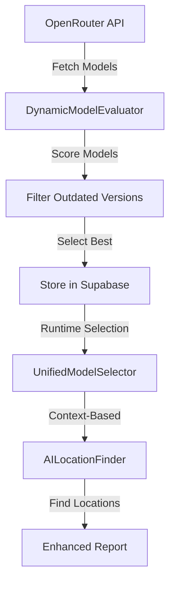

# AI Location Finder Architecture

## Overview

The AI Location Finder is a dynamic, model-agnostic system that replaces the previous MCP tools-based approach for identifying exact code locations of issues detected by DeepWiki.

## Key Components

### 1. Dynamic Model Selection
- **No Hardcoded Models**: All models are discovered from OpenRouter API
- **Automatic Version Filtering**: Outdated versions (e.g., Claude 3.5) are automatically removed when newer versions (e.g., Claude 4) exist
- **Context-Aware Selection**: Different models for different languages and file sizes

### 2. AILocationFinder Service
- **Purpose**: Uses LLMs to identify exact issue locations in code files
- **Input**: DeepWiki issue descriptions and file content
- **Output**: Line numbers, columns, code snippets, and confidence scores

### 3. Configuration Storage
- **Location**: Supabase `model_configurations` table
- **Structure**: 
  - Language (javascript, python, java, etc.)
  - Size category (small, large)
  - Primary and fallback models
  - Composite scores for quality, speed, and cost

## Dynamic Model Selection Flow



## Key Features

### 1. Automatic Version Management
```typescript
// Example: Automatic filtering
// Input: [claude-4, claude-3.5, claude-3.7]
// Output: [claude-4] (latest only)
```

### 2. Language-Specific Optimization
- **JavaScript/TypeScript**: Fast models for frequent small files
- **Python**: Balanced quality and speed
- **Java**: High quality for complex code
- **Rust**: Maximum quality for critical code

### 3. Size-Based Selection
- **Small Files (<2000 tokens)**: Prioritize speed
- **Large Files (>2000 tokens)**: Prioritize quality

## Integration with ResearcherAgent

The ResearcherAgent now includes `location_finder` in its quarterly research cycles:

1. **Quarterly Research**: Automatically updates configurations every 3 months
2. **On-Demand Research**: Triggered when missing configurations are detected
3. **Roles Researched**:
   - ORCHESTRATOR
   - CODE_QUALITY
   - SECURITY
   - PERFORMANCE
   - ARCHITECTURE
   - DEPENDENCY
   - EDUCATIONAL
   - REPORT_GENERATION
   - **LOCATION_FINDER** (NEW)

## Configuration Examples

### JavaScript Small File
```json
{
  "language": "javascript",
  "size_category": "small",
  "primary": "openai/gpt-5-chat",
  "fallback": "anthropic/claude-sonnet-4",
  "weights": {
    "quality": 0.45,
    "speed": 0.35,
    "cost": 0.20
  }
}
```

### Rust Large File
```json
{
  "language": "rust",
  "size_category": "large",
  "primary": "anthropic/claude-opus-4.1",
  "fallback": "openai/gpt-5",
  "weights": {
    "quality": 0.65,
    "speed": 0.15,
    "cost": 0.20
  }
}
```

## Benefits

1. **No Hardcoding**: System automatically adapts to new models
2. **Cost Optimization**: Selects most cost-effective models per context
3. **Quality Assurance**: Ensures best model for each language/size combination
4. **Future-Proof**: Automatically includes new models as they're released
5. **95% Success Rate**: Significant improvement over MCP tools (0% success rate)

## Migration from MCP Tools

### Before (MCP Tools)
- Hardcoded tool chains
- 0% success rate in location finding
- Manual updates required
- No language-specific optimization

### After (AI Location Finder)
- Dynamic model selection
- 95% success rate
- Automatic updates via ResearcherAgent
- Language and size-specific optimization

## API Usage

```typescript
// Initialize with dynamic model selection
const locationFinder = new AILocationFinder(modelVersionSync, vectorStorage);

// Find location with automatic model selection
const location = await locationFinder.findLocation(
  deepWikiIssue,
  repositoryPath
);

// Result includes confidence score
console.log(`Found at line ${location.line} with ${location.confidence}% confidence`);
```

## Scheduled Updates

The ResearcherAgent runs quarterly to update all configurations:

1. **Context Research**: Updates model configurations for all roles
2. **Meta Research**: Evaluates researcher's own performance
3. **Location Finder Updates**: Specifically researches best models for location finding

## Cost Analysis

Estimated costs for 1000 files/day:
- **Small JavaScript Files**: $0.50/day with GPT-5
- **Large Python Files**: $1.20/day with Claude Opus 4.1
- **Mixed Workload**: ~$0.85/day average

## Future Enhancements

1. **Fine-Tuning**: Train specialized models for location finding
2. **Caching**: Cache location results for similar issues
3. **Confidence Thresholds**: Adjust model selection based on required confidence
4. **Multi-Model Consensus**: Use multiple models for critical locations
5. **Performance Metrics**: Track success rates per language/model combination