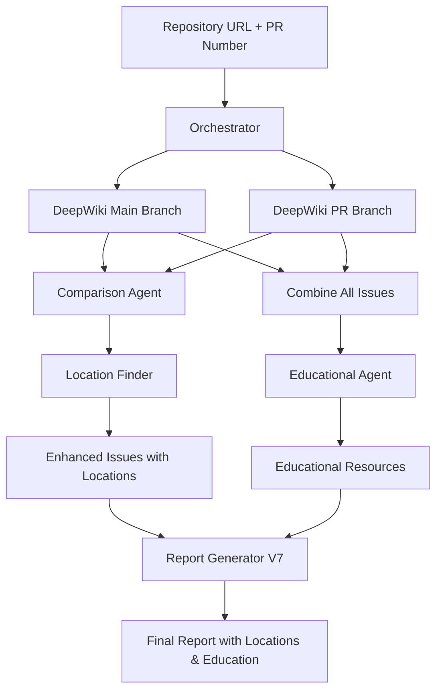

# Architecture Addendum - Enhanced PR Analysis with Location & Education
**Date:** 2025-08-08  
**Status:** Refined Architecture Decision  
**Context:** After real-world testing with DeepWiki integration

## Executive Summary

After extensive testing with real DeepWiki API and PR analysis, we've refined our architecture to keep the existing dual-scan comparison approach while adding two critical enhancements:
1. **Precise location finding** for IDE integration
2. **Educational recommendations** based on found issues

## Key Architecture Decisions

### 1. Maintain Dual-Scan Approach ✅

**Decision:** Keep the current two-scan architecture (main + PR branch)

**Rationale:**
- Users value PR attribution ("you introduced X issues, fixed Y issues")
- Motivational aspect of seeing fixes credited
- CI/CD integration expects PR-specific feedback
- Cost is acceptable for the value provided

**What We're NOT Changing:**
- ❌ NOT moving to single-scan approach
- ❌ NOT removing comparison agent
- ❌ NOT removing Redis (needed for cloned repos)
- ❌ NOT simplifying to just current state

### 2. Add Precise Location Finding 🎯

**New Component:** Location Finder Service

```typescript
interface ILocationFinder {
  findExactLocation(
    issue: Issue,
    repoPath: string
  ): Promise<{
    line: number;
    column: number;
    codeSnippet: string;
  }>;
}
```

**Integration:**
- Uses already cloned repository (cached in Redis)
- Leverages MCP tools (Serena) or direct search
- Enhances issues AFTER comparison
- Enables IDE integration (Cursor, VS Code)

**Benefits:**
- Exact line/column for IDE navigation
- Shows actual problematic code
- No additional API costs
- Uses existing infrastructure

### 3. Educational Agent Integration 📚

**New Component:** Educational Agent

```typescript
interface IEducationalAgent {
  research(issues: Issue[]): Promise<{
    immediatelearning: LearningTopic[];
    recommendedCourses: Course[];
    resources: Resource[];
    certifications: Certification[];
  }>;
}
```

**Key Design Decisions:**
- Gets ALL unique issues from BOTH branches (main + PR)
- Researches educational content based on issue patterns
- NO code generation or auto-fix suggestions (liability avoidance)
- Focuses on teaching concepts, not providing copy-paste solutions

**Educational Sources:**
- Online courses (Udemy, Coursera, Pluralsight)
- Documentation (OWASP, MDN, official docs)
- Video tutorials (YouTube, FreeCodeCamp)
- Certifications (where relevant)

### 4. Updated Data Flow



### 5. Database Strategy Update

**What We Store in Supabase:**
```sql
-- Minimal storage approach
CREATE TABLE analysis_scores (
  id uuid PRIMARY KEY,
  repository_url text,
  pr_number text,
  scan_date timestamp,
  overall_score int,
  security_score int,
  performance_score int,
  code_quality_score int,
  architecture_score int,
  dependencies_score int,
  scan_duration_seconds float
);

CREATE TABLE skill_tracking (
  id uuid PRIMARY KEY,
  user_id text,
  repository_url text,
  scan_date timestamp,
  overall_skill int,
  security_skill int,
  performance_skill int
);
```

**What We DON'T Store:**
- ❌ Individual issues (changes between runs)
- ❌ Issue counts (can vary between scans)
- ❌ Detailed reports (generated on-demand)

**Rationale:**
- Scores reflect overall quality trends
- Avoids complex issue matching
- Reduces storage overhead
- Simplifies trend analysis

### 6. Report Template Updates

**V7 Template Sections (unchanged structure):**
1. Executive Summary
2. Security Analysis
3. Performance Analysis
4. Code Quality Analysis
5. Architecture Analysis
6. Dependencies Analysis
7. **PR Issues (NEW)** - Now with exact locations
8. **Repository Issues (EXISTING)** - Now with exact locations
9. **Educational Insights** - Enhanced with agent research
10. Individual & Team Skills Tracking
11. Business Impact Analysis
12. Action Items & Recommendations

**Key Enhancement:**
```markdown
#### PR-HIGH-001: SQL Injection Vulnerability
**File:** src/api/users.ts:45:12  ← Exact location!
**Impact:** Direct SQL injection risk

**Problematic Code:** ← Now available!
```typescript
// Line 45:
const query = `SELECT * FROM users WHERE id = ${userId}`;
```

**How to Fix:** ← Educational, not prescriptive
- Use parameterized queries
- Validate user inputs
- Consider using an ORM

**Learn More:** ← New educational section
- [OWASP SQL Injection Guide](...)
- [Recommended Course: Secure Database Access](...)
```

## Implementation Priority

### Phase 1: Location Finding (Week 1)
1. Implement location finder service
2. Integrate with cloned repo cache
3. Update report generator to show locations
4. Test with real repositories

### Phase 2: Educational Agent (Week 2)
1. Create educational agent
2. Implement course/resource search
3. Map issues to learning topics
4. Integrate with report generator

### Phase 3: Testing & Refinement (Week 3)
1. End-to-end testing with real PRs
2. Performance optimization
3. User feedback incorporation
4. Documentation updates

## Benefits of This Approach

### For Users:
- ✅ Exact issue locations for IDE integration
- ✅ Educational resources for skill development
- ✅ PR attribution maintained (motivational)
- ✅ Actionable insights without liability

### For Business:
- ✅ Differentiator: Education + Analysis
- ✅ No liability for auto-fixes
- ✅ Higher user value = better retention
- ✅ Positions as learning platform, not just analyzer

### Technical Benefits:
- ✅ Minimal changes to existing architecture
- ✅ Reuses existing infrastructure (Redis, cloned repos)
- ✅ Incremental enhancement, not rewrite
- ✅ Backwards compatible

## Metrics for Success

1. **Location Accuracy:** >95% correct line numbers
2. **Education Relevance:** >80% users find resources helpful
3. **Performance:** <10s additional processing time
4. **User Satisfaction:** Increased from current baseline

## Conclusion

This refined architecture maintains the valuable aspects of our current system (PR comparison, attribution) while addressing critical gaps (precise locations, educational value). The approach minimizes risk, maximizes user value, and positions CodeQual as both an analysis tool and a learning platform.

---

*This addendum supplements the main architecture document and reflects decisions made after real-world testing with DeepWiki integration.*