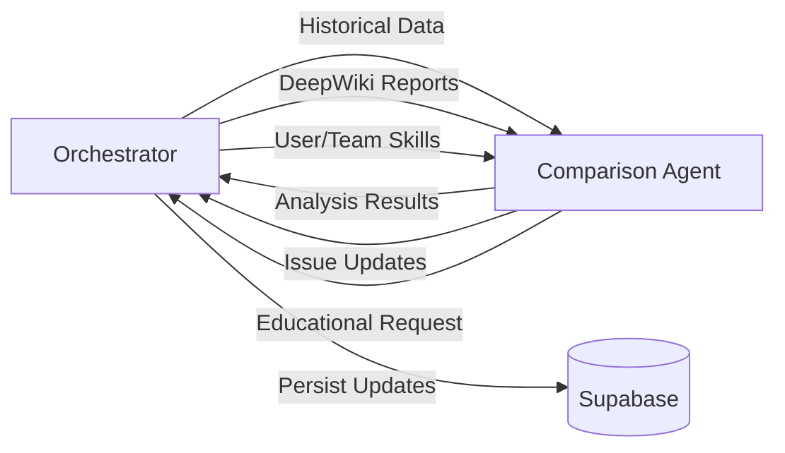

# Comparison Agent Architecture Refactor Summary

**Date**: January 2025  
**Status**: Implementation Complete

## Overview

This document summarizes the architectural changes made to implement proper separation of concerns in the Comparison Agent, ensuring that all external connections and persistence are handled by the Orchestrator.

## Key Changes

### 1. Replaced RepositoryTracker with RepositoryAnalyzer

**Old Architecture (RepositoryTracker)**:
- Direct Supabase connection in Comparison Agent
- Read AND write operations to database
- Agent managing its own persistence

**New Architecture (RepositoryAnalyzer)**:
- Pure analysis functions, no external connections
- Receives historical data from Orchestrator
- Returns issue updates for Orchestrator to persist
- Maintains stateless design

### 2. Updated Data Flow



### 3. Comparison Agent Interface Changes

**Input from Orchestrator**:
```typescript
{
  mainBranchAnalysis: DeepWikiAnalysisResult;      // From Redis cache
  featureBranchAnalysis: DeepWikiAnalysisResult;   // From Redis cache
  historicalIssues: RepositoryIssueHistory[];      // From Supabase
  userProfile: SkillProfile;                       // From Supabase
  teamProfiles: SkillProfile[];                    // From Supabase
  prMetadata: PRMetadata;
  generateReport: boolean;
}
```

**Output to Orchestrator**:
```typescript
{
  insights: Insight[];
  suggestions: Suggestion[];
  metadata: {
    comparisonData: ComparisonAnalysis;
    report?: ComprehensiveReport;
    repositoryAnalysis: {
      newIssues: string[];
      recurringIssues: string[];
      resolvedIssues: string[];
      technicalDebt: TechnicalDebtMetrics;
      issueUpdates: IssueUpdate[];  // For Orchestrator to persist
    };
    educationalRequest: EducationalAgentRequest;
  };
}
```

## Files Changed

### Created:
- `packages/agents/src/comparison/repository-analyzer.ts` - Pure analysis logic
- `packages/agents/test/test-comparison-agent.ts` - Updated test file
- `docs/architecture/comparison-agent-refactor-summary.md` - This document

### Modified:
- `packages/agents/src/comparison/comparison-agent.ts` - Removed external connections
- `packages/agents/src/comparison/report-generator.ts` - Updated to use RepositoryAnalysis
- `docs/architecture/data-flow-architecture.md` - Updated to reflect new architecture

### Deleted:
- `packages/agents/src/comparison/repository-tracker.ts` - Replaced by analyzer
- `packages/agents/test/test-repository-tracker.ts` - Renamed and updated
- `docs/repository-tracker-integration.md` - Outdated documentation

## Benefits of New Architecture

1. **Clean Separation of Concerns**
   - Agents focus on analysis only
   - Orchestrator manages all I/O operations
   - Clear boundaries between components

2. **Improved Testability**
   - Agents can be tested with mock data
   - No need for database connections in tests
   - Predictable inputs and outputs

3. **Better Scalability**
   - Stateless agents can be scaled horizontally
   - No connection pool management in agents
   - Centralized credential management

4. **Simplified Error Handling**
   - All database errors handled in one place
   - Agents always receive valid data
   - Graceful degradation when data unavailable

## Orchestrator Responsibilities

The Orchestrator now handles:

1. **Data Loading**:
   - Load historical issues from Supabase
   - Retrieve cached DeepWiki reports from Redis
   - Fetch user/team skill profiles

2. **Agent Coordination**:
   - Send complete data to Comparison Agent
   - Forward educational requests to Educational Agent
   - Merge results for Reporter Agent

3. **Persistence**:
   - Update repository issues based on agent analysis
   - Store skill updates for users
   - Save trend data for reporting
   - Store final reports

## Migration Impact

### For Developers:
- Comparison Agent constructor no longer needs Supabase credentials
- All data must be provided in the analyze() call
- Issue updates returned but not persisted by agent

### For Operations:
- Only Orchestrator needs database credentials
- Simplified deployment configuration
- Reduced connection overhead

## Testing

The new architecture is easier to test:

```typescript
// No database setup required
const agent = new ComparisonAgent();

// All data provided as input
const result = await agent.analyze({
  mainBranchAnalysis: mockMainAnalysis,
  featureBranchAnalysis: mockFeatureAnalysis,
  historicalIssues: mockHistory,
  userProfile: mockProfile,
  generateReport: true
});

// Verify analysis results
expect(result.metadata.repositoryAnalysis.recurringIssues).toHaveLength(1);
```

## Next Steps

1. **Update Orchestrator** to implement new data flow
2. **Migrate other agents** to follow same pattern
3. **Remove deprecated code** from old agent implementations
4. **Update deployment configs** to remove agent credentials

## Conclusion

This refactor successfully implements the correct separation of concerns where:
- Agents are pure analyzers with no side effects
- Orchestrator manages all external connections
- Data flows cleanly through the system
- Each component has a single, clear responsibility