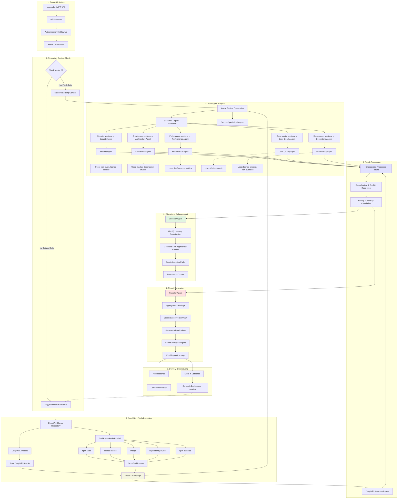

# CodeQual Data Flow Architecture

**Last Updated: December 2024**  
**Status: Official Architecture Document**

## Overview

This document describes the complete data flow for CodeQual's PR analysis system, from initial request through final report delivery. This serves as the single source of truth for understanding how data moves through the system.

## Complete Data Flow Diagram



## Detailed Flow Descriptions

### 1. Request Initiation (Steps A-D)

**Data Structure:**
```typescript
interface PRAnalysisRequest {
  repositoryUrl: string;
  prNumber: number;
  analysisMode: 'quick' | 'comprehensive' | 'deep';
  githubToken?: string;
  authenticatedUser: AuthenticatedUser;
}
```

**Flow:**
1. User submits PR URL through UI or API
2. API Gateway validates request format
3. Authentication middleware verifies user permissions
4. Result Orchestrator receives validated request

### 2. Repository Context Check (Steps E-G)

**Vector DB Query:**
```typescript
interface RepositoryContextQuery {
  repositoryUrl: string;
  contentTypes: ['deepwiki_analysis', 'tool_result'];
  freshnessCriteria: {
    maxAge: number; // hours
    requiredTools?: string[];
  };
}
```

**Decision Logic:**
- **Fresh Data**: Last analysis < 24 hours old
- **Stale Data**: Last analysis 24-168 hours old (may still use)
- **No Data/Outdated**: No analysis or > 168 hours old

### 3. DeepWiki + Tools Execution (Steps H-M)

**Execution Strategy:**
```yaml
DeepWiki Pod Execution:
  1. Clone repository once
  2. Run DeepWiki analysis (parallel with tools)
  3. Execute tools using cloned repo:
     - npm-audit: Security vulnerabilities
     - license-checker: License compliance
     - madge: Circular dependencies
     - dependency-cruiser: Dependency rules
     - npm-outdated: Version currency
  4. Store all results atomically
```

**Storage Format:**
```typescript
interface VectorDBStorage {
  repository_id: string;
  chunks: {
    content: string;
    embedding: number[];
    metadata: {
      content_type: 'deepwiki_analysis' | 'tool_result';
      tool_name?: string;
      agent_role?: string;
      is_latest: boolean;
      created_at: Date;
    };
  }[];
}
```

### 4. Multi-Agent Analysis (Steps N-O5)

**Agent-Tool Mapping:**
```typescript
const AGENT_TOOL_MAPPING = {
  security: ['npm-audit', 'license-checker'],
  architecture: ['madge', 'dependency-cruiser'],
  performance: [], // No automated tools yet
  codeQuality: [], // No automated tools yet
  dependency: ['license-checker', 'npm-outdated']
};
```

**DeepWiki Report Distribution:**
```typescript
interface DeepWikiReportSections {
  summary: string;              // Goes to Orchestrator
  security: string;             // Goes to Security Agent
  architecture: string;         // Goes to Architecture Agent
  performance: string;          // Goes to Performance Agent
  codeQuality: string;          // Goes to Code Quality Agent
  dependencies: string;         // Goes to Dependency Agent
}

// Each agent receives relevant sections
const agentContext = {
  prDiff: string,
  changedFiles: string[],
  deepWikiSection: string,      // Agent-specific section from DeepWiki
  toolResults: ToolResult[],    // Filtered by agent role
  crossAgentInsights?: any      // From MCP coordination
};
```

**Context Assembly:**
```typescript
interface AgentContext {
  prDiff: string;
  changedFiles: string[];
  repositoryAnalysis: string;   // Full DeepWiki report
  agentSpecificSection: string; // Relevant DeepWiki section
  toolResults: ToolResult[];    // Filtered by agent role
  crossAgentInsights?: any;     // From MCP coordination
}
```

### 5. Result Processing (Steps P-R)

**Processing Pipeline:**
1. **Collection**: Gather all agent results
2. **DeepWiki Summary Integration**: Incorporate overall repository insights
3. **Deduplication**: Remove duplicate findings (65% similarity threshold)
4. **Conflict Resolution**: Resolve contradictory findings
5. **Prioritization**: Sort by severity and confidence
6. **Categorization**: Group by type and impact

**Orchestrator Processing:**
```typescript
interface OrchestratorProcessing {
  agentResults: Map<string, AgentResult>;
  deepWikiSummary: {
    overallScore: number;
    keyInsights: string[];
    recommendations: string[];
    technicalDebt: number;
  };
  processedOutput: {
    findings: Finding[];
    summary: string;
    metrics: AnalysisMetrics;
  };
}
```

### 6. Educational Enhancement (Steps S-T)

**Educational Flow:**
```typescript
interface EducationalFlow {
  input: {
    findings: Finding[];
    userSkillLevel: SkillLevel;
    repositoryContext: any;
  };
  processing: {
    identifyLearningOpportunities(): LearningOpportunity[];
    generateContent(): EducationalContent[];
    adaptToSkillLevel(): AdaptedContent[];
    createLearningPaths(): LearningPath[];
  };
  output: {
    educationalContent: EducationalContent[];
    recommendedResources: Resource[];
    interactiveExamples: Example[];
  };
}
```

### 7. Report Generation (Steps U-V)

**Report Formats:**
```typescript
interface ReportFormats {
  full: {
    executiveSummary: string;
    detailedFindings: Finding[];
    educationalContent: EducationalContent[];
    visualizations: Visualization[];
    recommendations: string[];
  };
  summary: {
    keyMetrics: Metrics;
    topFindings: Finding[];
    actionItems: string[];
  };
  prComment: {
    markdown: string;
    severity: 'info' | 'warning' | 'error';
  };
  dashboard: {
    widgets: Widget[];
    charts: Chart[];
    metrics: Metrics;
  };
}
```

### 8. Delivery & Scheduling (Steps W-Z)

**Delivery Endpoints:**
- `GET /api/reports/:id` - Full report
- `GET /api/reports/:id/summary` - Summary view
- `GET /api/reports/:id/pr-comment` - GitHub PR comment
- `GET /api/reports/:id/dashboard` - Dashboard data
- `GET /api/analysis/:id/stream` - Real-time updates

**Scheduling Logic:**
```typescript
interface SchedulingDecision {
  determineSchedule(metrics: RepositoryMetrics): Schedule {
    if (metrics.criticalFindings > 0) {
      return { frequency: 'every-6-hours', priority: 'critical' };
    }
    if (metrics.commitsPerWeek > 20) {
      return { frequency: 'daily', priority: 'high' };
    }
    if (metrics.commitsPerWeek > 5) {
      return { frequency: 'weekly', priority: 'medium' };
    }
    return { frequency: 'monthly', priority: 'low' };
  }
}
```

## Data Storage Patterns

### Vector Database Schema

```sql
-- Main storage for all analysis data
CREATE TABLE analysis_chunks (
  id UUID PRIMARY KEY,
  repository_id UUID REFERENCES repositories(id),
  content TEXT NOT NULL,
  embedding VECTOR(1536),
  metadata JSONB NOT NULL,
  created_at TIMESTAMP DEFAULT NOW()
);

-- Metadata structure
{
  "content_type": "deepwiki_analysis" | "tool_result",
  "tool_name": "npm-audit" | "license-checker" | etc,
  "agent_role": "security" | "architecture" | etc,
  "is_latest": true | false,
  "score": 0-100,
  "severity": "critical" | "high" | "medium" | "low"
}
```

### Latest-Only Storage Strategy

**Key Principle**: Each new analysis replaces the previous one
```sql
-- Before storing new results
DELETE FROM analysis_chunks 
WHERE repository_id = $1 
  AND metadata->>'content_type' = $2;

-- Then insert new results
INSERT INTO analysis_chunks (...) VALUES (...);
```

## Performance Characteristics

### Timing Expectations

| Operation | Expected Time | Notes |
|-----------|--------------|-------|
| Vector DB Check | < 100ms | Index on repository_id |
| DeepWiki Analysis | 30-60s | Depends on repo size |
| Tool Execution | 5-30s | Parallel execution |
| Agent Analysis | 10-30s each | Parallel with MCP |
| Result Processing | < 5s | In-memory processing |
| Report Generation | 5-10s | Template rendering |
| **Total (New Repo)** | **2-5 minutes** | All operations |
| **Total (Cached)** | **30-60 seconds** | Skip DeepWiki/Tools |

### Optimization Points

1. **Parallel Execution**: Tools and agents run concurrently
2. **Smart Caching**: Reuse results within freshness window
3. **Incremental Updates**: Only analyze changed files when possible
4. **Resource Limits**: Prevent runaway analysis on huge repos

## Error Handling & Recovery

### Failure Modes

1. **DeepWiki Failure**: Fall back to PR-only analysis
2. **Tool Failure**: Continue with other tools, note in report
3. **Agent Failure**: Use fallback models, reduce confidence
4. **Vector DB Failure**: Complete analysis without historical context

### Recovery Strategies

```typescript
interface ErrorRecovery {
  deepWikiFailure: () => UsePRContextOnly;
  toolFailure: (tool: string) => ContinueWithoutTool;
  agentFailure: (agent: string) => UseFallbackModel;
  vectorDBFailure: () => ProceedWithoutContext;
}
```

## Security Considerations

1. **Authentication**: Every request requires valid user token
2. **Authorization**: Repository access checked before analysis
3. **Data Isolation**: User data segregated in Vector DB
4. **Token Security**: GitHub tokens encrypted in transit/rest
5. **Rate Limiting**: Prevent resource exhaustion

## Monitoring & Observability

### Key Metrics

- Analysis completion rate
- Average processing time by stage
- Tool success/failure rates
- Agent performance metrics
- Vector DB query performance
- Cache hit rates

### Logging Points

1. Request received
2. Vector DB query result
3. DeepWiki trigger decision
4. Tool execution status
5. Agent analysis completion
6. Report generation success
7. Delivery confirmation

## Scheduling Strategies

### Option 1: On-Demand Regeneration (Current Approach)

**How it works:**
- User requests PR analysis
- System checks Vector DB for existing data
- If data is stale (>24 hours), regenerate immediately
- User waits for fresh analysis

**Pros:**
- Always get the most current data when needed
- No wasted computation on unused repositories
- Simple to implement and understand

**Cons:**
- User experiences delay during regeneration (2-5 minutes)
- Peak load during business hours
- Inconsistent user experience

### Option 2: Proactive Background Scheduling (Proposed)

**How it works:**
- After first analysis, schedule background updates
- Run updates during off-peak hours (2-6 AM)
- When user requests analysis, data is always fresh
- Adjust schedule based on repository activity

**Pros:**
- Instant results for users (data pre-computed)
- Consistent fast user experience
- Better resource utilization (off-peak processing)
- Can batch similar repositories for efficiency

**Cons:**
- More complex implementation
- Potential waste (analyzing inactive repos)
- Requires scheduling infrastructure
- Higher overall compute costs

### Option 3: Hybrid Approach (Recommended)

**How it works:**
```typescript
interface HybridSchedulingStrategy {
  // Active repositories: Proactive scheduling
  activeRepos: {
    criteria: 'commits > 5/week OR open PRs > 3',
    schedule: 'nightly at 2 AM',
    benefit: 'Always fresh data for active development'
  },
  
  // Inactive repositories: On-demand only
  inactiveRepos: {
    criteria: 'commits < 5/week AND open PRs < 3',
    schedule: 'on-demand only',
    benefit: 'No wasted computation'
  },
  
  // Critical repositories: Aggressive scheduling
  criticalRepos: {
    criteria: 'critical findings > 0 OR production flag',
    schedule: 'every 6 hours',
    benefit: 'Rapid detection of new issues'
  }
}
```

**Implementation:**
```typescript
class SmartScheduler {
  async evaluateSchedulingStrategy(repo: Repository): Promise<ScheduleType> {
    const activity = await this.getRepositoryActivity(repo);
    const lastAnalysis = await this.getLastAnalysis(repo);
    
    // Critical issues: aggressive scheduling
    if (lastAnalysis.criticalFindings > 0) {
      return {
        type: 'proactive',
        frequency: 'every-6-hours',
        reason: 'Critical security issues require constant monitoring'
      };
    }
    
    // Active development: nightly updates
    if (activity.weeklyCommits > 5 || activity.openPRs > 3) {
      return {
        type: 'proactive',
        frequency: 'nightly',
        time: '02:00',
        reason: 'Active repository benefits from fresh analysis'
      };
    }
    
    // Stable repositories: weekly updates
    if (activity.monthlyCommits > 5) {
      return {
        type: 'proactive',
        frequency: 'weekly',
        day: 'sunday',
        time: '03:00',
        reason: 'Moderate activity warrants weekly checks'
      };
    }
    
    // Inactive: on-demand only
    return {
      type: 'on-demand',
      reason: 'Low activity does not justify proactive scheduling'
    };
  }
}
```

### Performance Impact Comparison

| Metric | On-Demand | Proactive | Hybrid |
|--------|-----------|-----------|--------|
| User Wait Time | 2-5 min (if stale) | <10 sec | <10 sec (active) / 2-5 min (inactive) |
| Server Peak Load | High (business hours) | Low (night) | Distributed |
| Compute Cost | Low | High | Medium |
| User Experience | Inconsistent | Excellent | Good |
| Implementation | Simple | Complex | Moderate |

### Recommendation

**Go with the Hybrid Approach** because:

1. **Best user experience for active repos** - Developers working on active projects get instant results
2. **Cost-effective** - No wasted computation on dormant repositories
3. **Scalable** - Can adjust thresholds based on system load
4. **Flexible** - Users can override scheduling preferences
5. **Gradual rollout** - Start with on-demand, gradually add proactive scheduling

**Implementation Priority:**
1. Start with on-demand (current state) ✅
2. Add manual scheduling for specific repos
3. Implement activity detection
4. Roll out automatic hybrid scheduling
5. Monitor and adjust thresholds

## Future Enhancements

1. **Incremental Analysis**: Only analyze changed code
2. **Cross-Repository Learning**: Identify patterns across repos
3. **Real-time Collaboration**: Multiple users viewing same analysis
4. **AI-Powered Scheduling**: ML-based schedule optimization
5. **Custom Tool Integration**: User-defined analysis tools

---

**Note**: This document represents the current implementation as of December 2024. The Educator and Reporter agents are planned but not yet implemented. For testing without these components, the flow proceeds directly from Result Processing to API Response.
