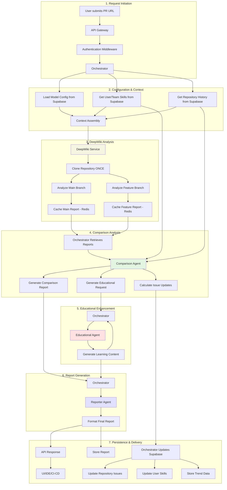

# CodeQual Data Flow Architecture

**Last Updated: January 2025**  
**Status: Official Architecture Document**

## Overview

This document describes the complete data flow for CodeQual's PR analysis system, from initial request through final report delivery. The architecture now features a simplified agent structure with the Comparison Agent replacing multiple specialized agents.

## Complete Data Flow Diagram



## Detailed Flow Descriptions

### 1. Request Initiation

**Data Structure:**
```typescript
interface PRAnalysisRequest {
  repositoryUrl: string;
  prNumber: number;
  prMetadata: {
    id: string;
    title: string;
    author: string;
  };
  userId: string;
  teamId?: string;
}
```

**Flow:**
1. User submits PR URL through UI, API, or CI/CD
2. API Gateway validates request format
3. Authentication middleware verifies user permissions
4. Orchestrator receives validated request

### 2. Configuration & Context Loading

**Orchestrator loads from Supabase:**
```typescript
interface OrchestratorContext {
  // Model configuration based on repo size/complexity
  modelConfig: {
    model: string;
    version: string;
    costLimit: number;
  };
  
  // User and team skill profiles
  userProfile: SkillProfile;
  teamProfiles: SkillProfile[];
  
  // Historical repository issues
  repositoryHistory: RepositoryIssueHistory[];
}
```

### 3. DeepWiki Analysis Phase

**Execution Strategy:**
```yaml
DeepWiki Service:
  1. Receive configuration from Orchestrator
  2. Clone repository ONCE
  3. Analyze main branch → Generate comprehensive report
  4. Analyze feature branch → Generate comprehensive report
  5. Store both reports in Redis cache (30min TTL)

Cache Keys:
  - main: "deepwiki:main:{repoId}:{commitHash}"
  - feature: "deepwiki:feature:{prId}:{commitHash}"
```

**DeepWiki Report Structure:**
```typescript
interface DeepWikiAnalysisResult {
  issues: Issue[];           // All found issues
  scores: {
    overall: number;
    security: number;
    performance: number;
    maintainability: number;
    testing: number;
  };
  recommendations: Recommendation[];
  metadata: {
    patterns: string[];      // Architectural patterns detected
    analysisTime: number;
    modelUsed: string;
  };
}
```

### 4. Comparison Analysis

**Comparison Agent Input (from Orchestrator):**
```typescript
interface ComparisonAgentInput {
  // From Redis cache via Orchestrator
  mainBranchAnalysis: DeepWikiAnalysisResult;
  featureBranchAnalysis: DeepWikiAnalysisResult;
  
  // From Supabase via Orchestrator
  historicalIssues: RepositoryIssueHistory[];
  userProfile: SkillProfile;
  teamProfiles: SkillProfile[];
  
  // Metadata
  prMetadata: PRMetadata;
  generateReport: boolean;
}
```

**Comparison Agent Output:**
```typescript
interface ComparisonAgentOutput {
  insights: Insight[];
  suggestions: Suggestion[];
  metadata: {
    comparisonData: ComparisonAnalysis;
    report?: ComprehensiveReport;
    
    // Repository analysis (NOT persisted by agent)
    repositoryAnalysis: {
      newIssues: string[];
      recurringIssues: string[];
      resolvedIssues: string[];
      technicalDebt: TechnicalDebtMetrics;
      issueUpdates: IssueUpdate[]; // For Orchestrator to persist
    };
    
    // Educational request for next step
    educationalRequest: EducationalAgentRequest;
  };
}
```

### 5. Educational Enhancement

**Educational Agent Input (from Orchestrator):**
```typescript
interface EducationalAgentInput {
  request: EducationalAgentRequest; // From Comparison Agent
  userProfile: SkillProfile;
  preferredFormats: string[];
}
```

**Educational Agent Output:**
```typescript
interface EducationalContent {
  modules: LearningModule[];
  resources: Resource[];
  practiceExercises: Exercise[];
  estimatedTime: string;
}
```

### 6. Report Generation

**Reporter Agent Input (from Orchestrator):**
```typescript
interface ReporterAgentInput {
  comparisonReport: ComprehensiveReport;
  educationalContent: EducationalContent;
  targetFormat: 'markdown' | 'json' | 'github' | 'gitlab' | 'ide';
  includeEducational: boolean;
}
```

### 7. Persistence & Delivery

**Orchestrator Persistence Responsibilities:**
```typescript
class Orchestrator {
  async persistAnalysisResults(result: ComparisonAgentOutput) {
    // 1. Update repository issues in Supabase
    const { issueUpdates } = result.metadata.repositoryAnalysis;
    await this.updateRepositoryIssues(issueUpdates);
    
    // 2. Update user skills
    if (result.metadata.skillsUpdate) {
      await this.updateUserSkills(userId, result.metadata.skillsUpdate);
    }
    
    // 3. Store trend data
    await this.storeTrendData(repositoryUrl, result.metadata);
    
    // 4. Store final report
    await this.storeReport(reportId, finalReport);
  }
}
```

## Key Architecture Principles

### 1. Separation of Concerns

- **Orchestrator**: Manages flow, external connections, persistence
- **DeepWiki**: Analyzes repository, generates comprehensive reports
- **Comparison Agent**: Pure analysis, no external connections
- **Educational Agent**: Generates learning content
- **Reporter Agent**: Formats final output

### 2. Data Flow Rules

1. **All external connections through Orchestrator**
   - Supabase access
   - Redis cache access
   - Model API access

2. **Agents are stateless analyzers**
   - Receive data, return analysis
   - No direct database connections
   - No side effects

3. **Single repository clone**
   - DeepWiki clones once
   - Analyzes both branches
   - Results cached for reuse

### 3. Caching Strategy

```yaml
Redis Cache:
  - DeepWiki reports: 30 minute TTL
  - Key pattern: "deepwiki:{branch}:{repoId}:{commitHash}"
  - Retrieval target: <50ms

Supabase Storage:
  - Repository issues: Permanent history
  - User skills: Current state + history
  - Model configurations: Cached locally
  - Reports: Permanent storage
```

## Data Models

### Repository Issue Tracking

```typescript
interface RepositoryIssueHistory {
  repositoryUrl: string;
  issueId: string;
  firstSeen: Date;
  lastSeen: Date;
  occurrences: number;
  severity: 'critical' | 'high' | 'medium' | 'low';
  category: string;
  status: 'active' | 'resolved' | 'recurring';
}

interface IssueUpdate {
  issueId: string;
  action: 'create' | 'update' | 'resolve';
  data: any;
}
```

### Skill Tracking

```typescript
interface SkillProfile {
  userId: string;
  skills: {
    security: SkillLevel;
    performance: SkillLevel;
    codeQuality: SkillLevel;
    architecture: SkillLevel;
    testing: SkillLevel;
    debugging: SkillLevel;
  };
  achievements: Achievement[];
  learningProgress: LearningProgress;
}

interface SkillLevel {
  current: number; // 0-100
  trend: 'improving' | 'stable' | 'declining';
  lastUpdated: Date;
  issuesResolved: number;
  issuesIntroduced: number;
  experiencePoints: number;
}
```

## Performance Characteristics

### Timing Expectations

| Operation | Expected Time | Notes |
|-----------|--------------|-------|
| Supabase Context Load | < 200ms | Parallel queries |
| DeepWiki Analysis | 30-60s | Both branches |
| Redis Cache Store/Retrieve | < 50ms | Local Redis |
| Comparison Analysis | 5-10s | In-memory processing |
| Educational Generation | 10-15s | LLM calls |
| Report Generation | 2-5s | Template rendering |
| **Total (New Analysis)** | **60-90 seconds** | All operations |
| **Total (Cached)** | **20-30 seconds** | Skip DeepWiki |

### Optimization Points

1. **Parallel Operations**
   - Load context while DeepWiki analyzes
   - Generate educational content during report formatting

2. **Smart Caching**
   - 30-minute Redis cache for DeepWiki reports
   - Local model configuration cache
   - Reuse analysis within same PR

3. **Efficient Data Transfer**
   - Only send relevant sections to agents
   - Compress large reports

## Error Handling & Recovery

### Failure Modes

```typescript
interface ErrorRecovery {
  deepWikiFailure: {
    action: 'Use basic PR diff analysis',
    confidence: 'reduced',
    notification: 'User warned of limited analysis'
  };
  
  cacheFailure: {
    action: 'Regenerate analysis',
    impact: 'Slower response time',
    fallback: 'Direct DeepWiki call'
  };
  
  supabaseFailure: {
    action: 'Continue without history',
    impact: 'No trend analysis',
    cache: 'Use local fallback'
  };
  
  agentFailure: {
    action: 'Use fallback model',
    retry: 'With reduced context',
    notification: 'Degraded analysis warning'
  };
}
```

## Security Considerations

1. **Authentication**: OAuth/JWT for all requests
2. **Authorization**: Repository access verified
3. **Data Isolation**: User data segregated
4. **Credential Management**: 
   - Orchestrator holds all credentials
   - Agents receive only analyzed data
5. **Rate Limiting**: Per-user and per-repository

## Migration Notes

### Deprecated Components

1. **Specialized Agents** (replaced by Comparison Agent):
   - Security Agent
   - Architecture Agent
   - Performance Agent
   - Code Quality Agent
   - Dependency Agent

2. **Direct Agent Connections**:
   - Agents no longer connect to databases
   - All persistence through Orchestrator

3. **Vector DB for Reports**:
   - Reports now in Redis cache
   - Vector DB only for semantic search

### Migration Steps

1. **Phase 1**: Implement Comparison Agent ✅
2. **Phase 2**: Update Orchestrator for new flow
3. **Phase 3**: Migrate model configs to Supabase
4. **Phase 4**: Remove deprecated agents
5. **Phase 5**: Clean Vector DB of non-semantic data

## Future Enhancements

1. **Incremental Analysis**: Only analyze changed files
2. **Real-time Collaboration**: WebSocket updates
3. **Advanced Caching**: Predictive cache warming
4. **Custom Tool Integration**: User-defined analyzers
5. **ML-Based Scheduling**: Smart analysis triggers

---

**Note**: This document reflects the architecture as of January 2025. The system has been simplified from multiple specialized agents to a single Comparison Agent that provides comprehensive analysis. All external connections are managed by the Orchestrator to maintain clean separation of concerns.