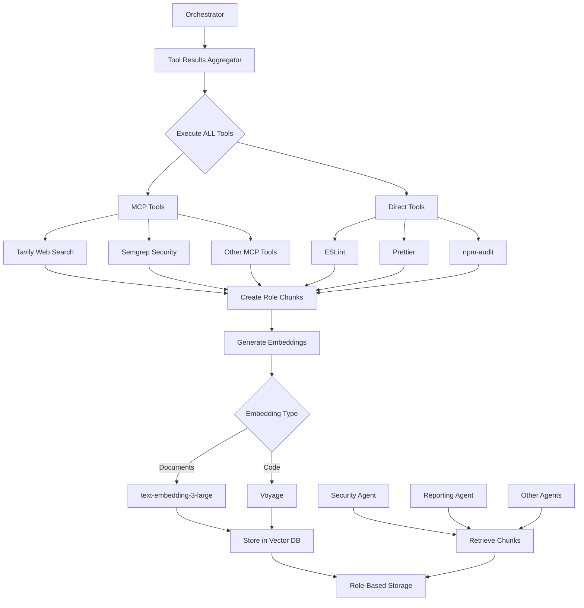

# DeepWiki Approach Applied to All Tools

*Created: January 28, 2025*

## Overview

We're extending the DeepWiki pre-computation approach to ALL tools (both MCP and Direct), not just MCP tools. This provides consistent performance benefits and cost optimization across the entire toolchain.

## Key Architectural Decisions

### 1. Universal Pre-computation
- **ALL tools** run once during initial analysis
- Results stored in Vector DB with role-based chunking
- No tools execute during agent analysis phase
- Agents retrieve pre-computed, role-specific contexts

### 2. Role-Based Chunking Strategy
```
tool-context:{repository}:pr-{number}:{role}:chunk-{index}
```

Benefits:
- Agents only retrieve relevant chunks
- Smaller payload sizes
- Faster retrieval
- Better embedding accuracy

### 3. Dual Embedding Models
- **Documents**: OpenAI `text-embedding-3-large`
  - For findings, summaries, documentation
  - Tavily search results
  - Educational content
- **Code**: `Voyage` embeddings
  - For code snippets
  - Technical analysis
  - Semgrep/ESLint findings

## Implementation Components

### Tool Results Aggregator (`tool-results-aggregator.ts`)
```typescript
class ToolResultsAggregator {
  // Executes ALL tools (MCP + Direct)
  aggregateAllToolResults(context: AnalysisContext)
  
  // Creates role-specific chunks with embeddings
  createRoleChunk(toolId, role, result)
  
  // Stores chunks in Vector DB
  storeRoleContext(context: RoleBasedToolContext)
  
  // Semantic retrieval for agents
  getToolContextForAgent(repo, pr, role, query?)
}
```

### Reporting Agent Enhancement
The Reporting agent now uses Tavily to:
1. **Organize** web search results into presentable sections
2. **Categorize** findings by importance and relevance
3. **Structure** external resources for easy consumption
4. **Create** visual data representations

Example sections:
- Executive Summary (with metrics)
- Key Findings (severity-sorted)
- Technical Details (file-grouped)
- External Resources (relevance-ranked)
- Metrics Dashboard (aggregated)

## Data Flow



## Chunking Examples

### Security Agent Chunks
```typescript
// Chunk 1: Semgrep findings
{
  toolId: 'semgrep-mcp',
  agentRole: 'security',
  chunk: {
    findings: [/* security vulnerabilities */],
    summary: "Found 3 SQL injection vulnerabilities..."
  },
  embedding: [/* voyage embedding */]
}

// Chunk 2: Tavily CVE searches
{
  toolId: 'tavily-mcp',
  agentRole: 'security',
  chunk: {
    findings: [/* CVE-2024-xxx findings */],
    summary: "Latest CVE database shows..."
  },
  embedding: [/* text-3-large embedding */]
}
```

### Reporting Agent Chunks
```typescript
// Organized for presentation
{
  toolId: 'tavily-mcp',
  agentRole: 'reporting',
  chunk: {
    findings: [/* categorized by presentation needs */],
    summary: "Executive summary data: 15 critical findings..."
  },
  embedding: [/* text-3-large embedding */]
}
```

## Benefits

### 1. Performance
- **50-100x faster** agent execution (no tool execution)
- **Parallel processing** of all tools
- **Semantic search** for relevant chunks

### 2. Cost Optimization
- **Single execution** per tool
- **83% reduction** in API calls (Tavily, etc.)
- **Shared results** across agents

### 3. Consistency
- **Identical data** for all agents
- **Timestamped** results
- **Reproducible** analyses

### 4. Scalability
- **Chunk-based** storage scales linearly
- **Role-specific** retrieval reduces load
- **Embedding cache** improves performance

## Configuration

```typescript
// Environment variables
OPENAI_API_KEY=sk-xxx              // For text-embedding-3-large
VOYAGE_API_KEY=voy-xxx             // For code embeddings
ENABLE_TOOL_AGGREGATION=true       // Enable DeepWiki approach
CHUNK_SIZE_LIMIT=1000              // Max findings per chunk
EMBEDDING_CACHE_TTL=3600           // 1 hour cache
```

## Future Enhancements

1. **Smart Chunking**
   - Dynamic chunk sizes based on content
   - Cross-role chunk sharing for common findings
   
2. **Embedding Optimization**
   - Batch embedding generation
   - Compressed embeddings for storage
   
3. **Incremental Updates**
   - Only re-run changed tools
   - Merge with existing chunks

## Conclusion

By applying the DeepWiki approach to ALL tools, we achieve:
- Consistent performance across the platform
- Significant cost savings on API calls
- Better organization of results for agents
- Scalable architecture for future tools

The Reporting agent particularly benefits from Tavily integration, transforming raw web search data into professionally organized, presentable report sections.