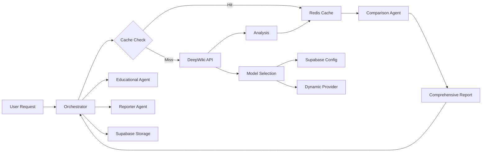

# Integrated Services Architecture

## Overview

This document describes the integrated architecture of CodeQual's analysis system, including the new Comparison Agent, Redis caching, and dynamic model selection.

## Key Components

### 1. Redis Cache Layer
- **Purpose**: High-performance caching for DeepWiki reports
- **TTL**: 30 minutes per report
- **Location**: DigitalOcean Droplet (165.232.147.189:6379)
- **Performance**: <50ms retrieval time

### 2. Model Configuration (Supabase)
- **Purpose**: Dynamic model selection based on repository context
- **Storage**: Supabase `model_configurations` table
- **Features**:
  - Language-specific model selection
  - Size-based optimization
  - 3-6 month model recency requirement
  - Quarterly updates by Reporter agent

### 3. Comparison Agent
- **Purpose**: Unified analysis replacing 5 specialized agents
- **Capabilities**:
  - PR impact analysis
  - Repository health tracking
  - Skill assessment and gamification
  - Educational content preparation
  - Comprehensive report generation

## Data Flow



## Model Selection Process

1. **Context Analysis**
   - Repository language
   - Repository size (small/medium/large)
   - Analysis mode (deepwiki/researcher/comparison)

2. **Configuration Sources**
   - Primary: Supabase stored configurations
   - Secondary: Dynamic model providers (OpenAI, Anthropic, Google)
   - Fallback: Default configurations

3. **Selection Criteria**
   - Model recency (3-6 months)
   - Role-based weights:
     - DeepWiki: Quality 50%, Speed 30%, Cost 20%
     - Researcher: Quality 60%, Speed 10%, Cost 30%
     - Comparison: Quality 40%, Speed 40%, Cost 20%

## Integration Points

### DeepWiki Client
```typescript
const deepWikiClient = new DeepWikiClient(
  DEEPWIKI_API_URL,
  logger,
  modelSelector // Dynamic model selection
);
```

### Cache Service
```typescript
const cacheService = new RedisCacheService({
  url: REDIS_URL,
  ttl: 30 * 60 * 1000 // 30 minutes
});
```

### Model Configuration Store
```typescript
const modelConfigStore = new ModelConfigStore(
  logger,
  SUPABASE_URL,
  SUPABASE_KEY
);
```

## Security Considerations

1. **Redis Security**
   - Firewall rules restrict access to application servers
   - No authentication (internal network only)
   - Regular security updates

2. **Supabase Access**
   - Service role key for server-side operations
   - Row-level security for user data
   - Encrypted connections

3. **API Keys**
   - Environment variables for all API keys
   - No hardcoded credentials
   - Regular key rotation

## Performance Metrics

- **Cache Hit Rate**: Target >80%
- **Cache Retrieval**: <50ms
- **Model Selection**: <100ms
- **Total Analysis Time**: <60s for medium repositories

## Monitoring and Maintenance

1. **Redis Monitoring**
   - Memory usage alerts at 80%
   - Connection pool monitoring
   - TTL enforcement

2. **Model Configuration Updates**
   - Quarterly review by Reporter agent
   - Automatic validation of new models
   - Performance tracking per model

3. **Error Handling**
   - Graceful fallbacks for all services
   - Comprehensive logging
   - Alert system for critical failures

## Future Enhancements

1. **Planned Migrations**
   - Move all model configurations from Vector DB to Supabase
   - Clean Vector DB of non-semantic data
   - Implement Researcher agent for automatic model discovery

2. **Feature Additions**
   - DeepWiki chat interface
   - Real-time analysis updates
   - Multi-region cache deployment

## Example Usage

```typescript
// Complete flow example
const orchestrator = new Orchestrator();

// 1. Check cache
const cachedReport = await cacheService.getReport(repoUrl, branch);

if (!cachedReport) {
  // 2. Get model configuration
  const modelConfig = await modelConfigStore.getModelConfig(
    'typescript',
    'medium'
  );
  
  // 3. Run DeepWiki analysis
  const analysis = await deepWikiClient.analyze(repoUrl, {
    modelConfig,
    branch
  });
  
  // 4. Cache results
  await cacheService.setReport(repoUrl, branch, analysis);
}

// 5. Run Comparison Agent
const comparison = await comparisonAgent.analyze({
  mainBranchAnalysis: mainReport,
  featureBranchAnalysis: featureReport,
  historicalIssues: await supabase.getHistoricalIssues(repoUrl)
});

// 6. Prepare for next agents
const educationalRequest = comparison.educationalRequest;
const reportData = comparison.comprehensiveReport;
```

## Configuration Examples

### Model Configuration (Supabase)
```json
{
  "language": "typescript",
  "size_category": "medium",
  "provider": "anthropic",
  "model": "claude-4-opus",
  "test_results": {
    "status": "tested",
    "avgResponseTime": 45.3,
    "qualityScore": 9.2
  }
}
```

### Dynamic Provider Response
```json
{
  "provider": "openai",
  "model": "gpt-5",
  "releaseDate": "2025-06-01",
  "capabilities": {
    "codeQuality": 9.7,
    "speed": 8.0,
    "contextWindow": 256000
  },
  "pricing": {
    "input": 15.00,
    "output": 45.00
  }
}
```

## Troubleshooting

### Common Issues

1. **Cache Connection Failed**
   - Check Redis server status
   - Verify firewall rules
   - Test with redis-cli

2. **Model Not Found**
   - Check Supabase connection
   - Verify language/size mapping
   - Review fallback configuration

3. **Slow Analysis**
   - Monitor cache hit rate
   - Check model performance metrics
   - Review repository size thresholds

## Related Documentation

- [Data Flow Architecture](./data-flow-architecture.md)
- [Redis Setup Guide](../deployment/redis-setup-guide.md)
- [Model Selection Guide](../guides/model-selection.md)
- [Comparison Agent Design](../design/comparison-agent.md)