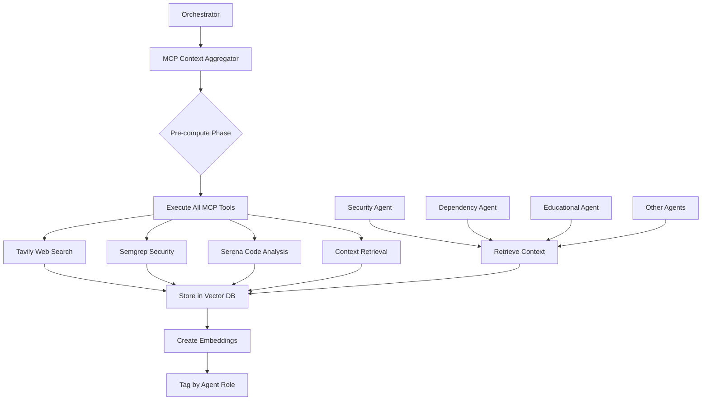

# MCP Vector DB Integration Strategy
*Created: January 28, 2025*

## Overview

This document outlines the integration strategy for MCP tools (including Tavily) with Vector DB, following a similar approach to DeepWiki integration. This strategy optimizes API usage, reduces costs, and provides consistent context to all agents.

## Architecture Flow



## Key Benefits

### 1. **Cost Optimization**
- Single execution of expensive APIs (Tavily, etc.)
- Shared results across all agents
- Cached for future analyses
- Track API usage centrally

### 2. **Performance**
- No waiting for external APIs during agent execution
- Parallel MCP tool execution
- Fast vector similarity search
- Pre-computed embeddings

### 3. **Consistency**
- All agents see the same MCP results
- Timestamped data
- Audit trail of searches
- Reproducible analyses

## Implementation Components

### MCP Context Aggregator (`mcp-context-aggregator.ts`)
- Executes all MCP tools during initial analysis
- Stores results in Vector DB with embeddings
- Tags results by agent role
- Tracks Tavily search usage

### Agent Integration
- Agents retrieve pre-computed MCP context
- No direct API calls needed
- Enhanced with relevant web search results
- Combined with DeepWiki insights

## Tavily Integration by Agent Role

### Security Agent
- **Searches**: CVE vulnerabilities, security patches, exploits
- **Value**: Real-time threat intelligence beyond static databases

### Dependency Agent  
- **Searches**: Package alternatives, maintenance status, migrations
- **Value**: Current ecosystem health insights

### Educational Agent
- **Searches**: Tutorials, best practices, learning paths
- **Value**: Up-to-date educational resources

### Code Quality Agent
- **Searches**: Style guides, design patterns, refactoring strategies
- **Value**: Current community standards

### Performance Agent
- **Searches**: Optimization techniques, benchmarks, memory patterns
- **Value**: Latest performance strategies

### Architecture Agent
- **Searches**: Architectural patterns, scaling strategies, migrations
- **Value**: Modern architecture insights

## Storage Schema

```typescript
interface MCPVectorDBSchema {
  // Key format: mcp-context:{repo}:pr-{number}:{role}
  key: string;
  
  // Stored data
  data: {
    role: AgentRole;
    contextData: MCPContextData[];
    findingsText: string; // For embedding
    timestamp: Date;
  };
  
  // Metadata
  metadata: {
    tavilySearches: {
      total: number;
      byRole: Record<AgentRole, number>;
      queries: string[];
    };
    tools: string[];
    executionTime: number;
  };
}
```

## Cost Tracking

### Tavily Usage Monitoring
```typescript
// Track searches per analysis
{
  repository: "user/repo",
  prNumber: 123,
  tavilySearches: {
    total: 18,
    byRole: {
      security: 6,
      dependency: 4,
      educational: 3,
      codeQuality: 2,
      performance: 2,
      architecture: 1
    },
    estimatedCost: 0.018 // $0.001 per search
  }
}
```

## Integration with Existing Flow

1. **Orchestrator** initiates analysis
2. **MCP Context Aggregator** runs all tools (including Tavily)
3. Results stored in **Vector DB** with embeddings
4. **Agents** retrieve relevant context during analysis
5. No additional API calls needed

## Future Enhancements

### 1. Smart Caching
- Reuse searches for similar packages
- Time-based cache invalidation
- Cross-repository pattern sharing

### 2. Cost Optimization
- Budget limits per analysis
- Prioritized searches by importance
- Batch similar queries

### 3. Enhanced Retrieval
- Semantic search across findings
- Cross-reference with DeepWiki
- Pattern recognition

## Configuration

```typescript
// Environment variables
TAVILY_API_KEY=tvly-dev-xxx
TAVILY_BUDGET_PER_PR=50  // Max searches per PR
TAVILY_CACHE_TTL=86400   // 24 hours

// Feature flags
ENABLE_MCP_AGGREGATION=true
ENABLE_TAVILY_CACHE=true
ENABLE_CROSS_REPO_PATTERNS=false
```

## Monitoring & Metrics

- Total API calls per day/week/month
- Cost per repository analysis
- Cache hit rates
- Most common search patterns
- Agent usage distribution

## Conclusion

This Vector DB integration approach for MCP tools provides a scalable, cost-effective solution that enhances agent capabilities while maintaining control over external API usage. The pre-computation model ensures consistent, fast access to enriched context for all agents.