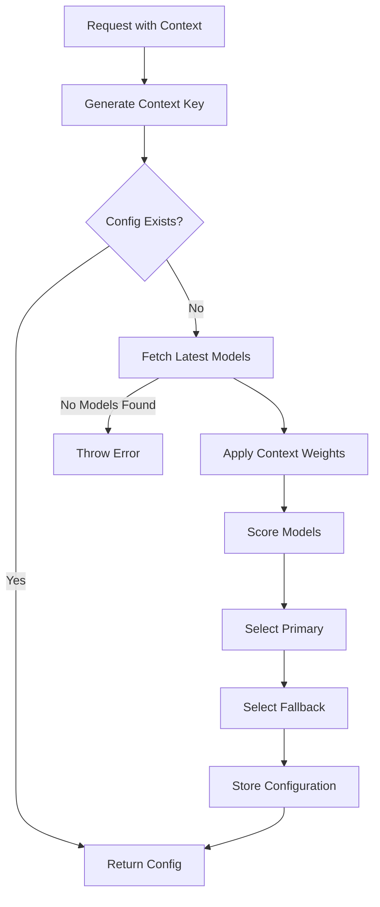

# Model Selection Architecture

**Last Updated**: August 13, 2025

## Overview

CodeQual uses a **fully dynamic model selection system** with zero hardcoded models. All model selections are made in real-time based on:
- Current availability in OpenRouter
- Model recency (only models from last 3-6 months)
- Context-specific requirements (role, language, repository size)
- Dynamic weight calculations

## Core Principles

### 1. No Hardcoded Models
- **Zero hardcoded model names or versions**
- **No fallback lists** - throw errors if models unavailable
- **Provider agnostic** - works with any provider
- **Future-proof** - automatically adapts to new models

### 2. Dynamic Discovery
- Models fetched from OpenRouter API in real-time
- Date filtering ensures only recent models (3-6 months)
- Automatic detection of latest versions (GPT-5, Claude 4.1, Gemini 2.5, etc.)
- Web search integration for discovering newest releases

### 3. Context-Aware Selection
- **273 unique configurations** covering:
  - 12 roles (deepwiki, security, educator, etc.)
  - 10 programming languages
  - 3 repository sizes (small, medium, large)
  - Universal roles (orchestrator, researcher, educator) with single configs

## Architecture Components

### 1. Dynamic Model Fetcher (`dynamic-model-fetcher.ts`)
```typescript
// Fetches and evaluates models in real-time
export async function fetchLatestModels(logger?: Logger): Promise<ModelInfo[]>
export async function selectModelsForContext(weights, requirements): Promise<{primary, fallback}>
```

**Key Features**:
- Fetches models from OpenRouter API
- Filters by date (last 6 months only)
- Calculates quality/speed/cost scores dynamically
- No hardcoded model lists

### 2. Context Weights Configuration (`context-weights-config.ts`)
```typescript
// Uses existing DYNAMIC_ROLE_WEIGHTS
export function getContextWeights(role, language?, size?): ContextWeights
export function generateAllContexts(): ContextConfig[] // Returns 273 configs
```

**Weight Adjustments**:
- Base weights from `DYNAMIC_ROLE_WEIGHTS`
- Language adjustments (e.g., Rust/C++ get +15% quality)
- Size adjustments (large repos get +15% quality, small get +30% speed)
- Multiplier-based to avoid negative values

### 3. Production Researcher Service (`production-researcher-service.ts`)
```typescript
private async searchWebForLatestModels(): Promise<string[]>
// Performs web searches to discover latest models
// Uses dynamic date filtering (no hardcoded dates)
// Validates models are within 3-6 month window
```

### 4. Supabase Model Store (`supabase-model-store.ts`)
```typescript
// Stores and retrieves model configurations
export interface SupabaseModelConfig {
  role: string;
  language: string;
  size_category: 'small' | 'medium' | 'large';
  primary_provider: string;
  primary_model: string;
  fallback_provider: string;
  fallback_model: string;
  weights: ContextWeights;
  reasoning: string[];
}
```

## Model Selection Flow



## Configuration Distribution

### Total: 273 Configurations

**Universal Roles** (3 configs total):
- orchestrator: 1 config
- researcher: 1 config  
- educator: 1 config

**Context-Aware Roles** (270 configs = 9 roles × 10 languages × 3 sizes):
- deepwiki
- comparator
- location_finder
- security
- performance
- architecture
- code_quality
- testing
- documentation

## Model Scoring Algorithm

```typescript
// Quality Score Calculation
score = baseScore
  + providerBonus (Anthropic/OpenAI: +1.5, Google: +1.2)
  + tierBonus (Opus/Ultra: +2.5, Pro/Large: +1.0)
  + versionBonus (v5: +1.0, v4: +0.5)
  + contextBonus (1M+: +1.0, 400K+: +0.7)
  - sizePenalty (Mini: -1.5, Nano: -2.0)

// Speed Score Calculation  
score = baseScore
  + speedBonus (Flash: +3.0, Turbo: +1.0)
  - sizePenalty (405B: -1.5, Ultra: -2.0)
  + costProxy (< $0.0001: +2.0)

// Final Weighted Score
finalScore = (quality/10 * weights.quality)
  + (speed/10 * weights.speed)
  + (costScore * weights.cost)
  + (freshnessScore * weights.freshness)
  + (contextScore * weights.contextWindow)
```

## Database Schema

```sql
CREATE TABLE model_configurations (
  id UUID PRIMARY KEY,
  role TEXT NOT NULL,
  language TEXT NOT NULL,
  size_category TEXT NOT NULL,
  primary_provider TEXT NOT NULL,
  primary_model TEXT NOT NULL,
  fallback_provider TEXT NOT NULL,
  fallback_model TEXT NOT NULL,
  weights JSONB NOT NULL,
  min_requirements JSONB,
  reasoning TEXT[],
  last_updated TIMESTAMP,
  UNIQUE(role, language, size_category)
);
```

## Current Model Availability (August 2025)

**Discovered from OpenRouter** (161 models in last 6 months):
- **GPT-5 Family**: gpt-5, gpt-5-chat, gpt-5-mini, gpt-5-nano
- **Claude 4 Family**: claude-opus-4.1, claude-opus-4, claude-sonnet-4
- **Gemini 2.5**: gemini-2.5-pro and variants
- **Llama 4**: llama-4-scout
- **Others**: Mistral, DeepSeek, Qwen, etc.

## Benefits

1. **Future-Proof**: Automatically adapts to new models
2. **Cost-Optimized**: Selects most economical model meeting requirements
3. **Quality-Assured**: Only uses models from last 3-6 months
4. **Context-Aware**: Different models for different scenarios
5. **No Maintenance**: No need to update hardcoded lists
6. **Resilient**: Fallback models from different providers

## Migration from Legacy System

**Before** (Hardcoded):
```typescript
const models = {
  'gpt-4o-2024-11-20': { ... },
  'claude-3-sonnet': { ... }
}
```

**After** (Dynamic):
```typescript
const models = await fetchLatestModels();
// Returns current models from OpenRouter
```

## Error Handling

When models are unavailable:
```typescript
throw new Error(
  `No models found within the last 3-6 months. ` +
  `Date range: ${sixMonthsAgo} to ${currentDate}. ` +
  `Please check OpenRouter API or update search patterns.`
);
```

No silent fallbacks - explicit errors for debugging.

## Testing

```bash
# Test dynamic model fetching
npm run test:model-fetcher

# Verify all 273 configurations
npm run verify:model-configs

# Check current model availability
npm run check:openrouter-models
```

## Future Enhancements

1. **Caching**: Add 1-hour cache for model list
2. **Metrics**: Track model selection patterns
3. **A/B Testing**: Compare model performance
4. **Cost Tracking**: Monitor spending per model
5. **Auto-Refresh**: Background updates of model list