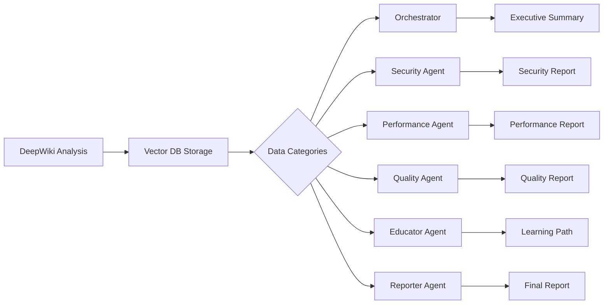

# Report Data Categorization for Agent Chain

This document defines all data categories in the DeepWiki analysis report and which agents consume each section. This ensures complete data flow through the analysis pipeline.

## 1. PR Approval Decision
**Consumers:** Orchestrator, Reporter
**Data Elements:**
- `approval_status`: APPROVED | REJECTED | CONDITIONAL APPROVAL
- `approval_icon`: ✅ | ❌ | ⚠️
- `blocking_issues[]`: Critical and high severity issues
- `positive_findings[]`: Good practices identified

## 2. Executive Summary
**Consumers:** Orchestrator, Reporter, Educator
**Data Elements:**
- `overall_score`: 0-100
- `overall_grade`: A-F
- `total_issues`: Count
- `risk_level`: LOW | MEDIUM | HIGH
- `trend`: Improvement from last scan
- `key_metrics`: Issues by severity, remediation time

## 3. Security Analysis
**Consumers:** Security Agent, Orchestrator
**Data Elements:**
- `security_score`: 0-100
- `security_grade`: A-F
- `critical_findings[]`: CWE references, locations, impacts
- `vulnerabilities[]`: Type, severity, remediation
- `security_recommendations[]`: Immediate actions

## 4. Performance Analysis
**Consumers:** Performance Agent, Orchestrator
**Data Elements:**
- `performance_score`: 0-100
- `performance_grade`: A-F
- `bottlenecks[]`: Database, API, frontend issues
- `performance_metrics`: Load time, bundle size, query count
- `optimization_opportunities[]`: Caching, indexing, code splitting

## 5. Code Quality Analysis
**Consumers:** Quality Agent, Educator
**Data Elements:**
- `maintainability_score`: 0-100
- `code_quality_grade`: A-F
- `complexity_issues[]`: Cyclomatic complexity, duplication
- `code_metrics`: Coverage, tech debt, maintainability index
- `refactoring_suggestions[]`: Patterns, abstractions

## 6. Testing Analysis
**Consumers:** Quality Agent, Educator
**Data Elements:**
- `test_coverage`: Overall, line, branch, function
- `testing_gaps[]`: Missing unit, integration, E2E tests
- `test_recommendations[]`: Priority areas for testing

## 7. Dependencies Analysis
**Consumers:** Dependency Agent, Orchestrator
**Data Elements:**
- `vulnerable_dependencies[]`: Package, version, fix
- `outdated_packages[]`: Current vs latest
- `license_issues[]`: GPL, unlicensed packages
- `update_commands[]`: npm/yarn commands

## 8. Architecture Analysis
**Consumers:** Architect Agent, Orchestrator
**Data Elements:**
- `architecture_issues[]`: Monolithic, coupling, patterns
- `architecture_metrics`: Component coupling, cohesion
- `modernization_recommendations[]`: Microservices, layers

## 9. Educational Resources
**Consumers:** Educator Agent
**Data Elements:**
- `skill_gaps[]`: Identified knowledge gaps
- `learning_modules[]`: Title, duration, level, topics
- `personalized_path[]`: Ordered learning sequence
- `team_skill_matrix`: Developer skill levels

## 10. Prioritized Recommendations
**Consumers:** Orchestrator, Reporter
**Data Elements:**
- `immediate_actions[]`: Week 1 critical fixes
- `short_term_actions[]`: Week 2-3 improvements
- `medium_term_actions[]`: Month 1-2 enhancements
- `long_term_actions[]`: Quarter roadmap

## 11. Team Development Actions
**Consumers:** Educator, Manager Agent
**Data Elements:**
- `team_workshops[]`: Security, performance, testing
- `process_improvements[]`: Code review, CI/CD
- `team_events[]`: Hackathons, sprints
- `training_budget`: Estimated hours/cost

## 12. Success Metrics
**Consumers:** Manager Agent, Reporter
**Data Elements:**
- `technical_metrics[]`: Coverage, performance, security targets
- `business_metrics[]`: Downtime risk, breach probability
- `productivity_metrics[]`: Developer efficiency gains
- `roi_calculations[]`: Cost savings, prevention value

## 13. Business Impact
**Consumers:** Manager Agent, Executive Reporter
**Data Elements:**
- `risk_assessment`: Current vs target state
- `financial_impact`: Potential losses prevented
- `user_impact`: Performance, reliability effects
- `competitive_advantage`: Market positioning

## 14. Action Plan Timeline
**Consumers:** Orchestrator, Project Manager
**Data Elements:**
- `week_1_tasks[]`: Critical security fixes
- `week_2_tasks[]`: Performance optimization
- `week_3_4_tasks[]`: Quality improvements
- `quarterly_roadmap[]`: Long-term initiatives

## 15. Investment & ROI
**Consumers:** Executive Reporter, Manager Agent
**Data Elements:**
- `required_resources`: Developers × weeks
- `estimated_cost`: Development hours × rate
- `expected_savings`: Security, performance, productivity
- `payback_period`: Months to ROI

## Data Flow Chain



## Vector DB Storage Schema

```typescript
interface AnalysisReport {
  // Metadata
  analysis_id: string;
  repository_url: string;
  pr_number: number;
  timestamp: Date;
  
  // Categorized Data
  approval_decision: ApprovalData;
  executive_summary: SummaryData;
  security_analysis: SecurityData;
  performance_analysis: PerformanceData;
  code_quality_analysis: QualityData;
  testing_analysis: TestingData;
  dependencies_analysis: DependencyData;
  architecture_analysis: ArchitectureData;
  educational_resources: EducationData;
  recommendations: RecommendationData;
  team_development: TeamData;
  success_metrics: MetricsData;
  business_impact: BusinessData;
  action_plan: ActionPlanData;
  investment_roi: InvestmentData;
}
```

## Usage by Agents

### Orchestrator Agent
Consumes: Executive Summary, Recommendations, Action Plan
Produces: Coordination signals, priority decisions

### Security Agent  
Consumes: Security Analysis
Produces: Security-focused report, vulnerability fixes

### Dependency Agent
Consumes: Dependencies Analysis
Produces: Dependency audit report, update recommendations

### Performance Agent
Consumes: Performance Analysis, Metrics
Produces: Performance optimization plan

### Quality Agent
Consumes: Code Quality, Testing Analysis
Produces: Refactoring plan, test strategies

### Educator Agent
Consumes: Educational Resources, Skill Gaps, Team Development
Produces: Personalized learning paths, workshop plans

### Reporter Agent
Consumes: All categories
Produces: Final formatted reports for different audiences

## Validation Checklist

- [ ] All 15 data categories are populated
- [ ] Each category has defined consumers
- [ ] No data is orphaned (unused by any agent)
- [ ] All agents have required input data
- [ ] Vector DB schema matches categories
- [ ] Data flow is unidirectional
- [ ] No circular dependencies