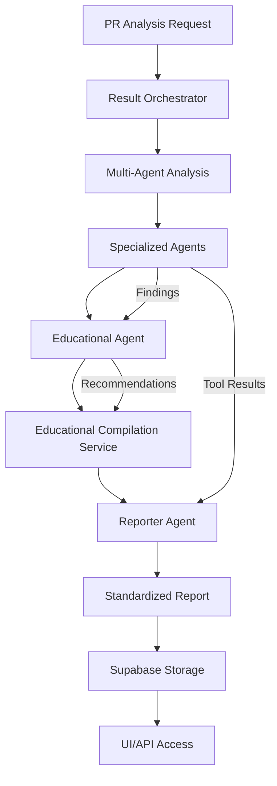

# CodeQual Data Flow and Report Structure Documentation

## Overview

This document describes the complete data flow from PR analysis through to UI presentation via standardized reports stored in Supabase.

## Data Flow Architecture



## Complete Data Flow Steps

### 1. PR Analysis Initiation
- User or webhook triggers analysis via `/api/analyze-pr`
- Request includes: repository URL, PR number, analysis mode, authentication

### 2. Result Orchestrator Processing
- Extracts PR context (diff, files, changes)
- Checks Vector DB for existing repository analysis
- Triggers DeepWiki if needed
- Coordinates multi-agent analysis

### 3. Multi-Agent Analysis
- Specialized agents analyze different aspects:
  - Security Agent
  - Architecture Agent
  - Performance Agent
  - Code Quality Agent
  - Dependency Agent
- Each agent receives tool results and DeepWiki context

### 4. Educational Processing
- Educational Agent processes findings
- Generates learning paths based on issues
- Creates skill gap analysis
- Produces educational content

### 5. Educational Compilation
- Compilation Service structures educational data
- Maps recommendations to learning content
- Prepares data for Reporter Agent

### 6. Report Generation (Reporter Agent)
- Receives all analysis data:
  - Technical findings from specialized agents
  - Compiled educational data
  - Recommendation module
- Generates `StandardReport` structure
- Creates multiple export formats
- Prepares visualizations

### 7. Supabase Storage
- StandardReport stored in `analysis_reports` table
- Includes complete report data as JSONB
- Quick access fields for filtering/sorting
- Row Level Security for access control

### 8. UI/API Access
- REST API endpoints for report retrieval
- Real-time updates via Supabase subscriptions
- Multiple export formats available
- Dashboard visualization support

## StandardReport Structure

### Top-Level Structure
```typescript
StandardReport {
  id: string                    // Unique report identifier
  repositoryUrl: string         // Repository being analyzed
  prNumber: number              // Pull request number
  timestamp: Date               // Report generation time
  
  overview: Overview            // High-level summary
  modules: ReportModules        // Detailed content modules
  visualizations: Visualizations // Chart/graph data
  exports: ExportFormats        // Pre-formatted exports
  metadata: Metadata            // Analysis metadata
}
```

### Overview Section
Provides quick summary for dashboards and listings:
```typescript
Overview {
  executiveSummary: string      // Brief summary
  analysisScore: number         // 0-100 quality score
  riskLevel: 'low' | 'medium' | 'high' | 'critical'
  totalFindings: number
  totalRecommendations: number
  learningPathAvailable: boolean
  estimatedRemediationTime: string // "2 weeks"
}
```

### Report Modules
Organized content for UI tabs/sections:

#### Findings Module
```typescript
FindingsModule {
  summary: string
  categories: {
    security: FindingCategory
    architecture: FindingCategory
    performance: FindingCategory
    codeQuality: FindingCategory
    dependencies: FindingCategory
  }
  criticalFindings: Finding[]
  totalCount: number
}

Finding {
  id: string
  title: string
  description: string
  severity: 'low' | 'medium' | 'high' | 'critical'
  category: string
  file?: string
  line?: number
  codeSnippet?: string
  recommendation: string
  toolSource?: string           // Which tool found this
  confidence: number
  tags: string[]
}
```

#### Recommendations Module
```typescript
RecommendationsModule {
  summary: string
  totalRecommendations: number
  categories: RecommendationCategory[]
  priorityMatrix: {
    critical: Recommendation[]
    high: Recommendation[]
    medium: Recommendation[]
    low: Recommendation[]
  }
  implementationPlan: ImplementationPlan
}

Recommendation {
  id: string
  title: string
  description: string
  rationale: string
  priority: {
    level: string
    score: number
    justification: string
  }
  implementation: {
    steps: string[]
    estimatedTime: string
    difficulty: string
    requiredSkills: string[]
  }
  relatedFindings: string[]     // Finding IDs
  educationalResources: string[] // Resource IDs
}
```

#### Educational Module
```typescript
EducationalModule {
  summary: string
  learningPath: LearningPath
  content: {
    explanations: EducationalItem[]
    tutorials: EducationalItem[]
    bestPractices: EducationalItem[]
    resources: EducationalItem[]
  }
  skillGaps: SkillGap[]
  certifications: Certification[]
}

LearningPath {
  id: string
  title: string
  description: string
  difficulty: string
  estimatedTime: string
  steps: LearningStep[]
}
```

#### Metrics Module
```typescript
MetricsModule {
  summary: string
  scores: {
    overall: MetricScore
    security: MetricScore
    maintainability: MetricScore
    performance: MetricScore
    reliability: MetricScore
  }
  trends: TrendData[]
  benchmarks: Benchmark[]
  improvements: Improvement[]
}
```

#### Insights Module
```typescript
InsightsModule {
  summary: string
  keyInsights: Insight[]
  patterns: Pattern[]
  predictions: Prediction[]
  contextualAdvice: ContextualAdvice[]
}
```

### Visualizations
Pre-computed data for charts/graphs:
```typescript
Visualizations {
  severityDistribution: ChartData  // Pie chart
  categoryBreakdown: ChartData     // Bar chart
  learningPathProgress: ChartData  // Radar chart
  trendAnalysis?: ChartData        // Line chart
  dependencyGraph?: GraphData      // Network graph
}
```

### Export Formats
Pre-formatted for different channels:
```typescript
ExportFormats {
  prComment: string         // GitHub/GitLab PR comment
  emailFormat: string       // Email-friendly HTML/text
  slackFormat: string       // Slack message blocks
  markdownReport: string    // Full markdown report
  jsonReport: string        // Complete JSON export
}
```

## Database Schema

### analysis_reports Table
```sql
CREATE TABLE analysis_reports (
  -- Identification
  id TEXT PRIMARY KEY,
  repository_url TEXT NOT NULL,
  pr_number INTEGER NOT NULL,
  
  -- User/Org tracking
  user_id UUID NOT NULL,
  organization_id UUID,
  
  -- Report data
  report_data JSONB NOT NULL,      -- Complete StandardReport
  overview JSONB NOT NULL,         -- Quick access
  
  -- Metrics for filtering
  analysis_score INTEGER,
  risk_level risk_level,
  total_findings INTEGER,
  total_recommendations INTEGER,
  
  -- Metadata
  analysis_mode TEXT,
  agents_used TEXT[],
  tools_executed TEXT[],
  processing_time INTEGER,
  
  -- Timestamps
  created_at TIMESTAMPTZ,
  updated_at TIMESTAMPTZ
);
```

## API Endpoints

### Report Retrieval
```
GET /api/reports/:reportId
  - Retrieve specific report by ID
  - Returns complete StandardReport

GET /api/reports/repository/:repoUrl/pr/:prNumber
  - Get latest report for repository/PR
  - Returns most recent StandardReport

GET /api/reports
  - List user's reports with pagination
  - Supports filtering by risk level, score
  - Returns report summaries

GET /api/reports/statistics
  - User's analysis statistics
  - Total reports, findings, trends
```

### Report Export
```
GET /api/reports/:reportId/export/:format
  - Export report in specific format
  - Formats: markdown, json, email, slack
```

## UI Integration Guidelines

### 1. Dashboard View
Use the overview section for quick stats:
```typescript
// Fetch report summaries
const response = await fetch('/api/reports?limit=10');
const { reports } = await response.json();

// Display overview cards
reports.forEach(report => {
  displayCard({
    score: report.analysis_score,
    risk: report.risk_level,
    findings: report.total_findings
  });
});
```

### 2. Detailed Report View
Render modules as tabs/sections:
```typescript
// Fetch full report
const response = await fetch(`/api/reports/${reportId}`);
const { report } = await response.json();

// Render each module
renderFindingsTab(report.modules.findings);
renderRecommendationsTab(report.modules.recommendations);
renderEducationalTab(report.modules.educational);
renderMetricsTab(report.modules.metrics);
renderInsightsTab(report.modules.insights);
```

### 3. Visualizations
Use the pre-computed data:
```typescript
// Render severity pie chart
renderPieChart(report.visualizations.severityDistribution);

// Render category bar chart
renderBarChart(report.visualizations.categoryBreakdown);

// Render skill gap radar
renderRadarChart(report.visualizations.learningPathProgress);
```

### 4. Export Actions
Provide export options:
```typescript
// Export as markdown
const mdExport = await fetch(`/api/reports/${reportId}/export/markdown`);
downloadFile(await mdExport.text(), 'report.md');

// Share to Slack
const slackExport = await fetch(`/api/reports/${reportId}/export/slack`);
const { content } = await slackExport.json();
postToSlack(content);
```

## Best Practices

### 1. Performance
- Use report summaries for listings
- Lazy load full reports when needed
- Cache reports client-side
- Use Supabase realtime for updates

### 2. Security
- All access via authenticated API
- RLS policies enforce access control
- Sensitive data filtered server-side
- Export formats sanitized

### 3. User Experience
- Show loading states during analysis
- Progressive disclosure of details
- Responsive design for all modules
- Keyboard navigation support

### 4. Data Consistency
- Single source of truth (Supabase)
- Immutable reports once generated
- Version tracking in metadata
- Audit trail maintained

## Migration and Deployment

### 1. Database Migration
```bash
# Run the migration script
./scripts/deploy-analysis-reports-migration.sh
```

### 2. Environment Variables
Required for report storage:
```env
NEXT_PUBLIC_SUPABASE_URL=your-supabase-url
SUPABASE_SERVICE_ROLE_KEY=your-service-key
```

### 3. Testing
- Generate test report via PR analysis
- Verify storage in Supabase
- Test retrieval via API
- Validate UI rendering

## Future Enhancements

### 1. Report Comparison
- Compare reports across time
- Track improvement trends
- Identify regression patterns

### 2. Team Analytics
- Aggregate team statistics
- Organization-wide dashboards
- Custom report templates

### 3. Advanced Visualizations
- Interactive dependency graphs
- Code complexity heatmaps
- Learning progress tracking

### 4. Integration Extensions
- IDE plugin report viewing
- CI/CD report embedding
- Third-party tool exports

## Conclusion

The standardized report structure provides a consistent, comprehensive format for all CodeQual analyses. By storing complete reports in Supabase with proper access controls, we enable rich UI experiences while maintaining security and performance.

The modular design allows frontends to render reports flexibly while the pre-computed exports support various communication channels. This architecture scales from individual developer use to enterprise-wide deployment.
