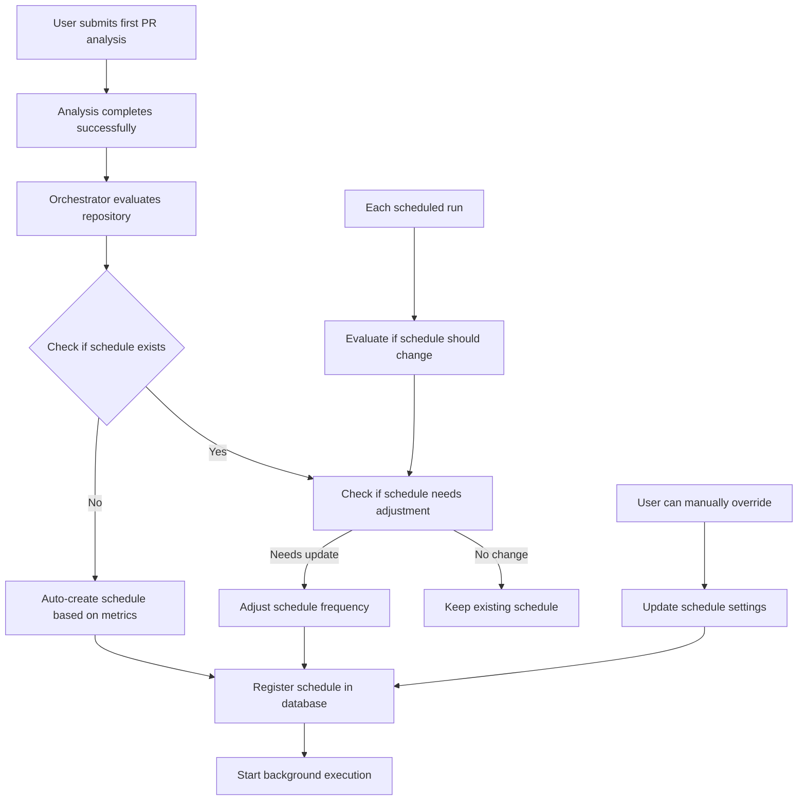
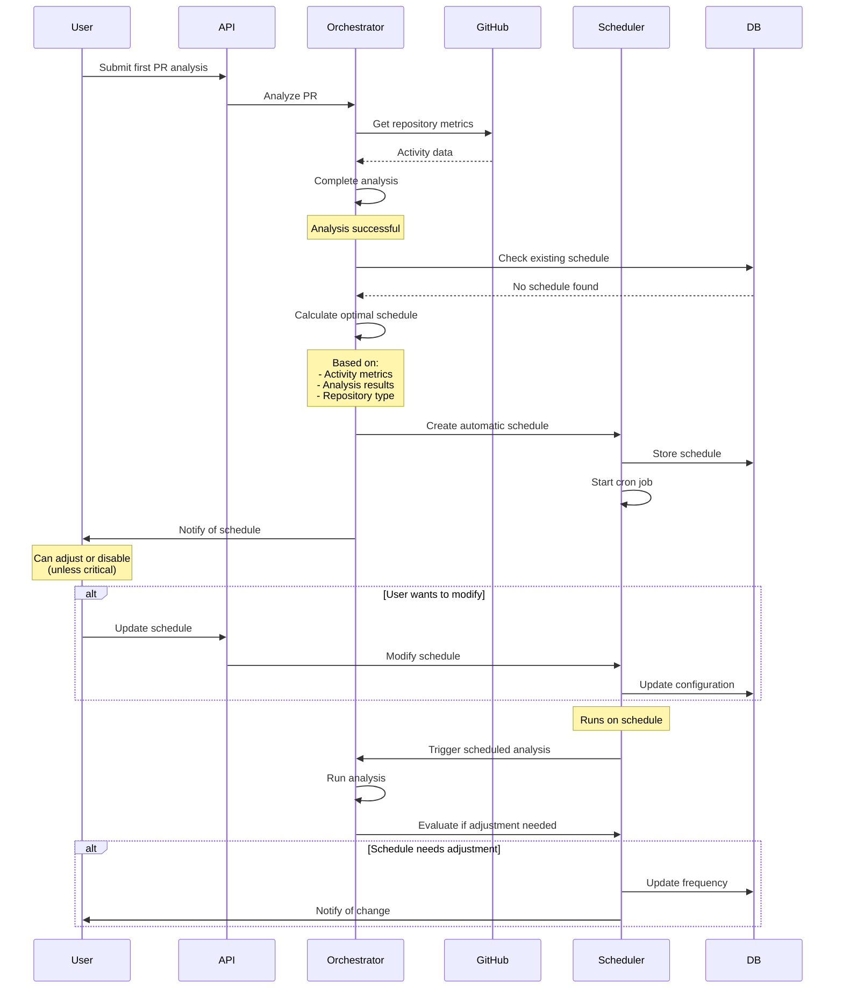

# CodeQual Scheduling Strategy & Implementation

## When and How Scheduling Happens

### Overview

Scheduling should be **automatically initiated** after the first successful analysis, with options for manual configuration. Here's the complete flow:



## Detailed Implementation Strategy

### 1. Automatic Scheduling Initiation (Recommended)

**When:** After first successful PR analysis completes
**Where:** In the ResultOrchestrator, after analysis completion
**How:** Automatically based on repository metrics

```typescript
// In ResultOrchestrator.analyzePR() method
async analyzePR(request: PRAnalysisRequest): Promise<AnalysisResult> {
  // ... existing analysis code ...
  
  // After successful analysis
  if (analysisResult.status === 'complete') {
    // Check if this is the first analysis for this repository
    const existingSchedule = await this.schedulingService.getSchedule(
      request.repositoryUrl
    );
    
    if (!existingSchedule) {
      // First analysis - create automatic schedule
      await this.initializeAutomaticSchedule(
        request.repositoryUrl,
        analysisResult
      );
    } else {
      // Existing schedule - check if adjustment needed
      await this.evaluateScheduleAdjustment(
        request.repositoryUrl,
        analysisResult,
        existingSchedule
      );
    }
  }
  
  return analysisResult;
}

private async initializeAutomaticSchedule(
  repositoryUrl: string,
  analysisResult: AnalysisResult
): Promise<void> {
  // 1. Gather repository metadata
  const repoMetrics = await this.gatherRepositoryMetrics(repositoryUrl);
  
  // 2. Determine optimal schedule
  const schedule = this.calculateOptimalSchedule({
    analysisResult,
    repoMetrics,
    isFirstAnalysis: true
  });
  
  // 3. Create schedule
  await this.schedulingService.createSchedule({
    repositoryUrl,
    schedule,
    source: 'automatic',
    reason: schedule.reason
  });
  
  // 4. Notify user (optional)
  await this.notifyUserOfSchedule(repositoryUrl, schedule);
}
```

### 2. Repository Metrics Collection

**What metrics to collect:**

```typescript
interface RepositoryMetrics {
  // From GitHub/GitLab API
  activityMetrics: {
    commitsLastWeek: number;
    commitsLastMonth: number;
    activeDevelopers: number;
    openPullRequests: number;
    mergeFrequency: number; // PRs merged per week
    lastCommitDate: Date;
    isArchived: boolean;
  };
  
  // From analysis results
  qualityMetrics: {
    criticalFindings: number;
    totalFindings: number;
    securityScore: number;
    technicalDebtScore: number;
    dependencyRisk: number;
  };
  
  // From repository metadata
  repositoryInfo: {
    size: 'small' | 'medium' | 'large';
    language: string;
    framework: string;
    isProductionRepo: boolean;
    hasCI: boolean;
  };
}

// Gather metrics from multiple sources
async function gatherRepositoryMetrics(
  repositoryUrl: string
): Promise<RepositoryMetrics> {
  const [githubData, analysisHistory, repoConfig] = await Promise.all([
    this.githubService.getRepositoryActivity(repositoryUrl),
    this.database.getAnalysisHistory(repositoryUrl),
    this.configService.getRepositoryConfig(repositoryUrl)
  ]);
  
  return {
    activityMetrics: extractActivityMetrics(githubData),
    qualityMetrics: extractQualityMetrics(analysisHistory),
    repositoryInfo: extractRepositoryInfo(repoConfig)
  };
}
```

### 3. Scheduling Decision Logic

**Automatic schedule calculation:**

```typescript
function calculateOptimalSchedule(context: {
  analysisResult: AnalysisResult;
  repoMetrics: RepositoryMetrics;
  isFirstAnalysis: boolean;
}): ScheduleConfig {
  const { analysisResult, repoMetrics } = context;
  
  // Priority 1: Critical security issues
  if (analysisResult.metrics.severity.critical > 0) {
    return {
      frequency: 'every-6-hours',
      cron: '0 */6 * * *',
      priority: 'critical',
      reason: `${analysisResult.metrics.severity.critical} critical security issues require immediate monitoring`,
      canBeDisabled: false // User cannot disable critical monitoring
    };
  }
  
  // Priority 2: Production repositories
  if (repoMetrics.repositoryInfo.isProductionRepo) {
    return {
      frequency: 'daily',
      cron: '0 2 * * *',
      priority: 'high',
      reason: 'Production repository requires daily security and quality checks',
      canBeDisabled: true
    };
  }
  
  // Priority 3: Activity-based scheduling
  const activityScore = calculateActivityScore(repoMetrics.activityMetrics);
  
  if (activityScore > 80) {
    return {
      frequency: 'daily',
      cron: '0 3 * * *',
      priority: 'high',
      reason: 'High development activity (80+ score) benefits from daily analysis'
    };
  } else if (activityScore > 40) {
    return {
      frequency: 'weekly',
      cron: '0 3 * * 1', // Monday 3 AM
      priority: 'medium',
      reason: 'Moderate activity (40-80 score) warrants weekly checks'
    };
  } else if (activityScore > 10) {
    return {
      frequency: 'monthly',
      cron: '0 3 1 * *', // 1st of month
      priority: 'low',
      reason: 'Low activity (10-40 score) suggests monthly reviews'
    };
  }
  
  // Default: On-demand only
  return {
    frequency: 'on-demand',
    priority: 'minimal',
    reason: 'Minimal activity detected - analysis on demand only',
    suggestArchive: repoMetrics.activityMetrics.lastCommitDate < 
                    new Date(Date.now() - 180 * 24 * 60 * 60 * 1000) // 6 months
  };
}

function calculateActivityScore(metrics: ActivityMetrics): number {
  return (
    metrics.commitsLastWeek * 4 +        // Recent commits weighted heavily
    metrics.commitsLastMonth * 1 +       // Monthly commits
    metrics.activeDevelopers * 10 +      // Active developers very important
    metrics.openPullRequests * 5 +       // Open PRs indicate activity
    metrics.mergeFrequency * 3           // Merge frequency
  );
}
```

### 4. User Notification & Control

**After automatic scheduling:**

```typescript
interface ScheduleNotification {
  type: 'email' | 'in-app' | 'pr-comment';
  content: {
    subject: string;
    body: string;
    actions: UserAction[];
  };
}

async function notifyUserOfSchedule(
  repositoryUrl: string,
  schedule: ScheduleConfig
): Promise<void> {
  const notification: ScheduleNotification = {
    type: 'in-app',
    content: {
      subject: `Automatic analysis schedule created for ${repositoryUrl}`,
      body: `
        Based on your repository's activity and the analysis results, 
        we've set up ${schedule.frequency} automatic analysis.
        
        Reason: ${schedule.reason}
        
        This ensures you're always aware of security issues and code quality.
      `,
      actions: [
        {
          label: 'Adjust Schedule',
          url: `/settings/repositories/${encodeURIComponent(repositoryUrl)}/schedule`
        },
        {
          label: 'Disable Automatic Analysis',
          url: `/api/schedules/${encodeURIComponent(repositoryUrl)}/disable`,
          requireConfirmation: true,
          disabled: !schedule.canBeDisabled
        }
      ]
    }
  };
  
  await this.notificationService.send(notification);
}
```

### 5. Manual Override Options

**User interface for schedule management:**

```typescript
// API endpoints for user control
router.get('/repositories/:repoUrl/schedule', async (req, res) => {
  const schedule = await schedulingService.getSchedule(req.params.repoUrl);
  const suggestions = await schedulingService.getScheduleSuggestions(
    req.params.repoUrl
  );
  
  res.json({
    current: schedule,
    suggestions,
    canModify: schedule?.canBeDisabled !== false
  });
});

router.put('/repositories/:repoUrl/schedule', async (req, res) => {
  const { frequency, enabledTools, notifications } = req.body;
  
  // Validate user can modify (not critical schedule)
  const current = await schedulingService.getSchedule(req.params.repoUrl);
  if (current && !current.canBeDisabled && frequency === 'disabled') {
    return res.status(400).json({
      error: 'Cannot disable monitoring for repositories with critical issues'
    });
  }
  
  const updated = await schedulingService.updateSchedule(req.params.repoUrl, {
    frequency,
    enabledTools,
    notifications,
    source: 'manual',
    modifiedBy: req.user.id
  });
  
  res.json(updated);
});
```

### 6. Progressive Schedule Adjustment

**Each scheduled run evaluates if frequency should change:**

```typescript
async function runScheduledAnalysis(repositoryUrl: string): Promise<void> {
  // 1. Run analysis
  const result = await this.runAnalysis(repositoryUrl);
  
  // 2. Compare with previous results
  const comparison = await this.compareWithPrevious(repositoryUrl, result);
  
  // 3. Adjust schedule if needed
  if (comparison.shouldAdjustSchedule) {
    const newSchedule = this.recalculateSchedule(repositoryUrl, result, comparison);
    
    // Notify user of change
    if (newSchedule.frequency !== comparison.currentFrequency) {
      await this.notifyScheduleChange(repositoryUrl, {
        from: comparison.currentFrequency,
        to: newSchedule.frequency,
        reason: comparison.adjustmentReason
      });
    }
    
    await this.schedulingService.updateSchedule(repositoryUrl, newSchedule);
  }
}

interface ScheduleAdjustmentRules {
  // Increase frequency if:
  increaseIf: [
    { condition: 'newCriticalFindings > 0', action: 'every-6-hours' },
    { condition: 'findingsIncreased > 50%', action: 'increaseOneLevel' },
    { condition: 'securityScoreDropped > 20', action: 'increaseOneLevel' }
  ],
  
  // Decrease frequency if:
  decreaseIf: [
    { condition: 'noFindingsFor > 3 runs', action: 'decreaseOneLevel' },
    { condition: 'allFindingsResolved', action: 'decreaseOneLevel' },
    { condition: 'inactiveFor > 30 days', action: 'on-demand' }
  ]
}
```

## Complete Scheduling Flow



## Best Practices

1. **Start Conservative**: Begin with less frequent schedules and increase based on findings
2. **Respect User Preferences**: Always allow manual override (except critical security)
3. **Smart Defaults**: Use repository characteristics to set intelligent defaults
4. **Progressive Adjustment**: Continuously optimize based on results
5. **Clear Communication**: Always explain why a schedule was chosen
6. **Resource Awareness**: Consider API limits and compute costs

## Implementation Status

✅ **IMPLEMENTED (June 15, 2025)**

The scheduling system has been fully implemented with all planned features:

- **Core Service**: `RepositorySchedulerService` in `/packages/core/src/services/scheduling/`
- **API Integration**: Complete REST API in `/apps/api/src/routes/schedules.ts`
- **Database Schema**: Migration deployed with `repository_schedules` and `schedule_runs` tables
- **Result Orchestrator Integration**: Automatic scheduling after PR analysis
- **Cron Job Management**: Using node-cron for reliable execution
- **Tool Selection Logic**: Different tool sets for different frequencies
- **Progressive Adjustment**: Schedule escalation/de-escalation based on findings

### Key Implementation Details

**Activity Score Formula**:
```typescript
score = commitsLastWeek * 4 + commitsLastMonth * 1 + 
        activeDevelopers * 10 + openPullRequests * 5 + 
        mergeFrequency * 3
```

**Tool Selection**:
- Critical (every-6-hours): `['npm-audit', 'license-checker']`
- Daily: `['npm-audit', 'license-checker', 'madge']`
- Weekly/Monthly: All available tools

**Safety Constraints**:
- Schedules with critical findings cannot be disabled
- Manual overrides are logged and tracked
- Failed runs are automatically retried

## Summary

The scheduling system is:
- ✅ **Automatically initiated** after first analysis
- ✅ **Based on objective metrics** (activity, findings, repo type)
- ✅ **User configurable** (with safety constraints)
- ✅ **Self-adjusting** based on ongoing results
- ✅ **Transparent** in its reasoning

This implementation provides the optimal balance of automation, user control, and system efficiency.
