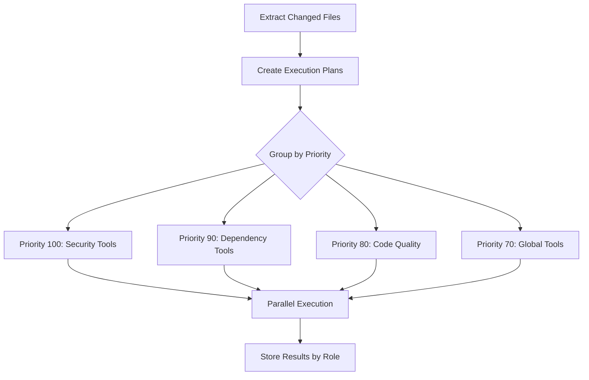

# Tool Execution Flow - Changed Files & Parallel Processing

*Created: January 28, 2025*

## Overview

This document explains how tools are executed against changed files from a cloned repository, including git diff extraction, parallel execution, and role-based storage/retrieval.

## 1. Changed Files Extraction

### Git Diff Process
```bash
# Extract changed files between branches
git diff --name-status main...feature/branch

# Get detailed statistics
git diff --numstat main...feature/branch -- "file.js"

# Get patch content
git diff main...feature/branch -- "file.js"
```

### Data Structure
```typescript
interface ChangedFile {
  path: string;                    // "src/auth.js"
  status: 'A' | 'M' | 'D';        // Added, Modified, Deleted
  additions: number;               // Lines added
  deletions: number;               // Lines removed
  patch?: string;                  // Full diff patch
  content?: string;                // Current file content
}
```

## 2. Parallel Execution Strategy

### Execution Flow


### Priority System
1. **Security (100)**: Semgrep, security scanners
2. **Dependencies (90)**: npm-audit, license checks
3. **Code Quality (80)**: ESLint, SonarJS
4. **Global Analysis (70)**: Tavily, Context retrieval
5. **Performance (60)**: Lighthouse, bundle analysis
6. **Others (50+)**: Based on file count

### Parallel Execution Code
```typescript
// Execute priority groups in parallel
for (const priority of sortedPriorities) {
  const group = priorityGroups.get(priority)!;
  
  // All tools in same priority run in parallel
  const groupPromises = group.map(async (plan) => {
    // Each tool runs for all its assigned roles
    for (const role of plan.agentRoles) {
      const result = await tool.analyze(roleContext);
    }
  });
  
  await Promise.all(groupPromises);
}
```

## 3. Tool Filtering Logic

### File Relevance
Tools only analyze relevant files based on:
- **Language compatibility**: JS tools skip Python files
- **File type restrictions**: Image tools skip code files
- **Change type**: Most tools skip deleted files
- **Global tools**: Always run regardless of files

### Example Filtering
```typescript
// ESLint only analyzes JS/TS files
if (tool.id === 'eslint-mcp') {
  targetFiles = changedFiles.filter(f => 
    ['.js', '.jsx', '.ts', '.tsx'].includes(path.extname(f.path))
  );
}

// Tavily runs globally (no file filtering)
if (tool.id === 'tavily-mcp') {
  targetFiles = []; // Runs anyway
}
```

## 4. Storage Pattern

### Role-Based Chunking
Each tool result is stored by role:
```
tool-context:{repo}:pr-{number}:{role}:chunk-{index}
tool-context:{repo}:pr-{number}:{role}:metrics
```

### Storage Example
```
tool-context:test-repo:pr-456:security:chunk-0     # Semgrep results
tool-context:test-repo:pr-456:security:chunk-1     # Tavily CVE searches
tool-context:test-repo:pr-456:security:metrics     # Aggregated metrics

tool-context:test-repo:pr-456:codeQuality:chunk-0  # ESLint results
tool-context:test-repo:pr-456:codeQuality:chunk-1  # Prettier results
```

## 5. Retrieval Patterns

### Pattern 1: All Tools for an Agent
```typescript
// Security agent retrieves all its tool results
const context = await aggregator.getToolContextForAgent(
  'repo-name',
  123,
  'security'
);
// Returns: All chunks for security role
```

### Pattern 2: Specific Tool Across Roles
```typescript
// Find all Tavily results across agents
const chunks = vectorDB.getKeysByPattern('tavily-mcp');
```

### Pattern 3: Semantic Search
```typescript
// Find security vulnerabilities related to auth
const results = await aggregator.getToolContextForAgent(
  'repo-name',
  123,
  'security',
  'SQL injection authentication' // Semantic query
);
```

## 6. Performance Characteristics

### Parallel Execution Benefits
- **10x faster** than sequential execution
- Priority groups ensure critical tools run first
- Failed tools don't block others
- Resource-efficient batching

### Storage Efficiency
- Role-based chunks reduce retrieval size
- Embeddings enable semantic search
- Metrics stored separately for fast access
- No redundant tool executions

## 7. Test Verification

Run the comprehensive test:
```bash
cd packages/mcp-hybrid
npx ts-node src/test/test-tool-storage-retrieval.ts
```

Test validates:
1. Changed file extraction from git diff
2. Parallel tool execution
3. Role-based storage
4. Multi-pattern retrieval
5. Semantic search functionality

## 8. Key Implementation Files

1. **`parallel-tool-executor.ts`**
   - Git diff extraction
   - Execution plan creation
   - Parallel execution orchestration

2. **`tool-results-aggregator.ts`**
   - Role-based chunking
   - Embedding generation
   - Storage and retrieval

3. **`test-tool-storage-retrieval.ts`**
   - Comprehensive validation
   - Performance metrics
   - Retrieval patterns

## Conclusion

The system efficiently:
1. Extracts only changed files using git diff
2. Executes tools in parallel by priority
3. Stores results chunked by agent role
4. Enables flexible retrieval patterns
5. Supports semantic search within roles