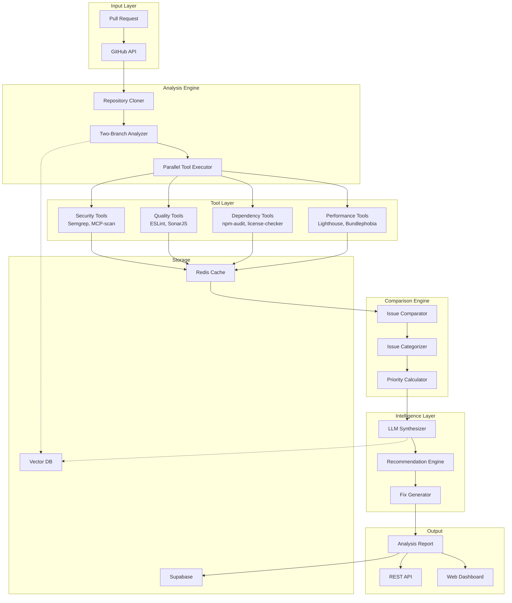

# CodeQual Architecture v4: Two-Branch Full Repository Analysis

*Version: 4.0*  
*Date: January 28, 2025*  
*Status: Active Implementation*

## Executive Summary

This document describes the corrected architecture for CodeQual, replacing the failed DeepWiki-dependent approach with a robust two-branch analysis system that leverages our existing MCP tools infrastructure to provide real, actionable code analysis results.

## Core Problem Statement

### What Failed
- **DeepWiki Integration**: Returns hallucinated responses instead of real analysis
- **Diff-Only Analysis**: Tools run on changed files only, missing critical context
- **No Baseline Comparison**: Cannot determine what's new, fixed, or pre-existing

### The Solution
- **Full Repository Analysis**: Analyze entire codebase on both branches
- **Real Tool Results**: Use actual findings from Semgrep, ESLint, npm-audit, etc.
- **Smart Comparison**: Identify new, fixed, and unchanged issues accurately
- **LLM Enhancement**: Use AI for synthesis and recommendations, not raw analysis

## Architecture Overview



## Component Architecture

### 1. Two-Branch Analyzer

```typescript
interface TwoBranchAnalyzer {
  // Core analysis flow
  analyzePR(repoUrl: string, prNumber: number): Promise<PRAnalysisReport>;
  
  // Branch operations
  cloneRepository(repoUrl: string): Promise<string>;
  checkoutBranch(branch: string): Promise<void>;
  
  // Tool execution
  runFullAnalysis(repoPath: string): Promise<BranchAnalysisResult>;
  
  // Comparison
  compareResults(
    mainResults: BranchAnalysisResult,
    prResults: BranchAnalysisResult
  ): Promise<ComparisonResult>;
}
```

### 2. Issue Identification System

```typescript
interface IssueIdentification {
  // Issue matching across branches
  fingerprint(issue: ToolIssue): string;
  findMatches(issue: ToolIssue, candidates: ToolIssue[]): ToolIssue[];
  
  // Categorization
  categorizeIssue(issue: ToolIssue, context: AnalysisContext): IssueCategory;
  
  // Impact assessment
  calculateImpact(issue: ToolIssue, prContext: PRContext): ImpactLevel;
}
```

### 3. Tool Execution Strategy

```typescript
interface ToolExecutionStrategy {
  // Parallel execution with priority
  executeTools(config: {
    repoPath: string;
    branch: string;
    tools: ToolConfig[];
    agents: AgentRole[];
  }): Promise<ToolResults>;
  
  // Result aggregation
  aggregateResults(results: Map<string, ToolOutput>): AggregatedResults;
  
  // Caching strategy
  cacheKey(repoUrl: string, branch: string, tool: string): string;
  getCached(key: string): Promise<ToolOutput | null>;
  setCached(key: string, result: ToolOutput, ttl?: number): Promise<void>;
}
```

## Data Models

### Issue Structure

```typescript
interface ToolIssue {
  // Identification
  id: string;                    // Unique ID
  fingerprint: string;           // Cross-branch matching key
  
  // Source
  tool: string;                  // 'semgrep-mcp'
  toolVersion: string;           // '1.2.3'
  ruleId: string;               // 'security/sql-injection'
  category: IssueCategory;       // 'security' | 'quality' | 'performance'
  
  // Location
  file: string;                  // 'src/auth/login.js'
  startLine: number;             // 142
  endLine: number;               // 145
  startColumn?: number;          // 15
  endColumn?: number;            // 42
  
  // Details
  severity: 'critical' | 'high' | 'medium' | 'low' | 'info';
  message: string;               // Human-readable description
  details?: string;              // Extended explanation
  
  // Code context
  codeSnippet?: string;          // Affected code
  suggestion?: string;           // How to fix
  documentation?: string;        // Link to docs
  
  // Metadata
  confidence: number;            // 0-1 confidence score
  falsePositive?: boolean;      // ML-detected false positive
  tags: string[];                // Additional categorization
}
```

### Comparison Result Structure

```typescript
interface ComparisonResult {
  // Issue categorization
  newIssues: EnhancedIssue[];        // Introduced in PR
  fixedIssues: EnhancedIssue[];      // Resolved in PR
  unchangedIssues: EnhancedIssue[];  // Pre-existing
  
  // Metrics
  metrics: {
    totalIssues: number;
    criticalCount: number;
    highCount: number;
    mediumCount: number;
    lowCount: number;
    
    byCategory: Record<IssueCategory, number>;
    byTool: Record<string, number>;
    
    codeQualityScore: number;      // 0-100
    securityScore: number;         // 0-100
    performanceScore: number;      // 0-100
    overallScore: number;          // 0-100
  };
  
  // Trends
  trends: {
    improvement: number;            // Positive = getting better
    velocity: number;              // Issues fixed per commit
    riskLevel: 'low' | 'medium' | 'high' | 'critical';
  };
}

interface EnhancedIssue extends ToolIssue {
  // Comparison metadata
  status: 'new' | 'fixed' | 'unchanged';
  
  // For new issues
  impact?: 'breaking' | 'degrading' | 'minor';
  introducedBy?: CommitInfo;
  requiresAction?: boolean;
  blocksPR?: boolean;
  
  // For fixed issues
  fixedBy?: CommitInfo;
  fixQuality?: 'complete' | 'partial' | 'workaround';
  credit?: number;
  
  // For unchanged issues
  age?: string;                  // How long present
  occurrences?: number;          // Times seen
  previousAttempts?: FixAttempt[];
  
  // AI enhancements
  recommendation?: string;        // AI-generated fix
  explanation?: string;          // Why this matters
  priority?: number;             // 1-10 priority score
  estimatedEffort?: 'minutes' | 'hours' | 'days';
}
```

## Execution Flow

### 1. PR Analysis Trigger

```typescript
async function handlePRAnalysis(webhook: GitHubWebhook) {
  // 1. Extract PR information
  const { repository, pull_request } = webhook;
  const repoUrl = repository.html_url;
  const prNumber = pull_request.number;
  
  // 2. Check cache for recent analysis
  const cached = await cache.get(`analysis:${repoUrl}:${prNumber}`);
  if (cached && !isStale(cached)) {
    return cached;
  }
  
  // 3. Trigger two-branch analysis
  const analyzer = new TwoBranchAnalyzer();
  const report = await analyzer.analyzePR(repoUrl, prNumber);
  
  // 4. Store and return results
  await cache.set(`analysis:${repoUrl}:${prNumber}`, report);
  await database.saveAnalysis(report);
  
  return report;
}
```

### 2. Two-Branch Analysis Process

```typescript
class TwoBranchAnalyzer {
  async analyzePR(repoUrl: string, prNumber: number): Promise<PRAnalysisReport> {
    // 1. Clone repository
    const repoPath = await this.cloneRepository(repoUrl);
    
    // 2. Get PR information
    const prInfo = await github.getPR(repoUrl, prNumber);
    const baseBranch = prInfo.base.ref;  // usually 'main'
    const prBranch = prInfo.head.ref;
    
    // 3. Analyze base branch
    await git.checkout(baseBranch);
    const baseResults = await this.runFullAnalysis(repoPath);
    
    // 4. Analyze PR branch
    await git.fetch(`pull/${prNumber}/head:pr-${prNumber}`);
    await git.checkout(`pr-${prNumber}`);
    const prResults = await this.runFullAnalysis(repoPath);
    
    // 5. Compare results
    const comparison = await this.compareResults(baseResults, prResults);
    
    // 6. Enhance with AI
    const enhanced = await this.enhanceWithAI(comparison, prInfo);
    
    // 7. Generate report
    return this.generateReport(enhanced, prInfo);
  }
  
  private async runFullAnalysis(repoPath: string): Promise<BranchAnalysisResult> {
    const executor = new ParallelToolExecutor();
    
    // Get all files in repository
    const files = await this.getAllFiles(repoPath);
    
    // Create execution plans for all tools
    const plans = executor.createExecutionPlans(files, this.enabledTools);
    
    // Execute in parallel by priority
    const results = await executor.executeToolsInParallel(plans);
    
    // Aggregate and return
    return this.aggregateResults(results);
  }
}
```

### 3. Issue Comparison Logic

```typescript
class IssueComparator {
  compare(
    baseIssues: ToolIssue[],
    prIssues: ToolIssue[]
  ): ComparisonResult {
    const result = {
      newIssues: [],
      fixedIssues: [],
      unchangedIssues: []
    };
    
    // Create fingerprint maps for O(1) lookup
    const baseMap = new Map(
      baseIssues.map(i => [this.fingerprint(i), i])
    );
    const prMap = new Map(
      prIssues.map(i => [this.fingerprint(i), i])
    );
    
    // Find NEW issues (in PR but not in base)
    for (const [fingerprint, issue] of prMap) {
      if (!baseMap.has(fingerprint)) {
        result.newIssues.push(this.enhanceNewIssue(issue));
      }
    }
    
    // Find FIXED issues (in base but not in PR)
    for (const [fingerprint, issue] of baseMap) {
      if (!prMap.has(fingerprint)) {
        result.fixedIssues.push(this.enhanceFixedIssue(issue));
      }
    }
    
    // Find UNCHANGED issues (in both)
    for (const [fingerprint, issue] of prMap) {
      if (baseMap.has(fingerprint)) {
        const baseIssue = baseMap.get(fingerprint);
        result.unchangedIssues.push(
          this.enhanceUnchangedIssue(issue, baseIssue)
        );
      }
    }
    
    return result;
  }
  
  private fingerprint(issue: ToolIssue): string {
    // Create stable fingerprint for cross-branch matching
    // Tolerates small line number changes
    const lineRange = Math.floor(issue.startLine / 5) * 5;
    
    return crypto
      .createHash('sha256')
      .update(`${issue.tool}:${issue.ruleId}:${issue.file}:${lineRange}`)
      .digest('hex');
  }
}
```

## Tool Integration

### Enabled Tools by Category

```typescript
const TOOL_REGISTRY = {
  security: {
    primary: ['semgrep-mcp', 'mcp-scan'],
    secondary: ['sonarqube'],
    optional: ['snyk', 'trivy']
  },
  
  codeQuality: {
    primary: ['eslint-direct', 'sonarjs-direct'],
    secondary: ['jscpd-direct', 'prettier-direct'],
    optional: ['complexity-report']
  },
  
  dependencies: {
    primary: ['npm-audit-direct'],
    secondary: ['license-checker-direct', 'dependency-cruiser-direct'],
    optional: ['npm-outdated-direct']
  },
  
  performance: {
    primary: ['lighthouse-direct'],
    secondary: ['bundlephobia-direct'],
    optional: ['webpack-bundle-analyzer']
  },
  
  architecture: {
    primary: ['madge-direct'],
    secondary: ['dependency-cruiser-direct'],
    optional: ['arkit']
  }
};
```

### Tool Execution Priority

```typescript
const TOOL_PRIORITY = {
  100: ['semgrep-mcp', 'mcp-scan'],           // Security first
  90: ['npm-audit-direct'],                    // Dependencies
  80: ['eslint-direct', 'sonarjs-direct'],    // Code quality
  70: ['lighthouse-direct'],                   // Performance
  60: ['madge-direct'],                        // Architecture
  50: ['tavily-mcp', 'serena-mcp']           // Context gathering
};
```

## Caching Strategy

### Multi-Level Cache

```typescript
class CacheManager {
  // L1: In-memory cache (fastest, smallest)
  private memoryCache = new Map<string, CachedResult>();
  
  // L2: Redis cache (fast, medium)
  private redisCache = new Redis(process.env.REDIS_URL);
  
  // L3: Vector DB (slower, largest, semantic search)
  private vectorDB = new VectorDB(process.env.VECTOR_DB_URL);
  
  async get(key: string): Promise<CachedResult | null> {
    // Check L1
    if (this.memoryCache.has(key)) {
      return this.memoryCache.get(key);
    }
    
    // Check L2
    const redisResult = await this.redisCache.get(key);
    if (redisResult) {
      this.memoryCache.set(key, redisResult); // Promote to L1
      return redisResult;
    }
    
    // Check L3
    const vectorResult = await this.vectorDB.get(key);
    if (vectorResult) {
      await this.redisCache.set(key, vectorResult); // Promote to L2
      this.memoryCache.set(key, vectorResult);      // Promote to L1
      return vectorResult;
    }
    
    return null;
  }
}
```

### Cache Keys

```typescript
// Repository analysis cache (24 hours)
`repo:${repoUrl}:${branch}:${commitHash}:${tool}`

// PR analysis cache (1 hour)
`pr:${repoUrl}:${prNumber}:${commitHash}`

// Tool results cache (7 days)
`tool:${tool}:${repoUrl}:${fileHash}`

// Comparison cache (1 hour)
`compare:${repoUrl}:${baseBranch}:${prBranch}`
```

## Performance Optimizations

### 1. Incremental Analysis

```typescript
class IncrementalAnalyzer {
  async analyzeIncremental(
    repoUrl: string,
    baseBranch: string,
    prBranch: string
  ) {
    // Get changed files
    const changedFiles = await git.diff(baseBranch, prBranch);
    
    // For unchanged files, use cached results
    const cachedResults = await this.getCachedResults(
      repoUrl,
      baseBranch,
      unchangedFiles
    );
    
    // Only run tools on changed files and their dependencies
    const filesToAnalyze = await this.getImpactedFiles(changedFiles);
    const newResults = await this.runTools(filesToAnalyze);
    
    // Merge results
    return { ...cachedResults, ...newResults };
  }
}
```

### 2. Smart Tool Selection

```typescript
class SmartToolSelector {
  selectTools(files: string[], prContext: PRContext): string[] {
    const tools = new Set<string>();
    
    // Language detection
    const languages = this.detectLanguages(files);
    
    // Add language-specific tools
    for (const lang of languages) {
      tools.add(...this.getToolsForLanguage(lang));
    }
    
    // Add tools based on PR context
    if (prContext.labels.includes('security')) {
      tools.add('semgrep-mcp', 'mcp-scan');
    }
    
    if (prContext.touchesPackageJson) {
      tools.add('npm-audit-direct');
    }
    
    return Array.from(tools);
  }
}
```

## AI Enhancement Layer

### LLM Integration

```typescript
class AIEnhancer {
  async enhance(comparison: ComparisonResult): Promise<EnhancedResult> {
    // 1. Pattern recognition
    const patterns = await this.identifyPatterns(comparison);
    
    // 2. Generate fixes for new issues
    for (const issue of comparison.newIssues) {
      issue.recommendation = await this.generateFix(issue);
      issue.explanation = await this.explainImpact(issue);
    }
    
    // 3. Prioritize all issues
    const priorities = await this.prioritizeIssues([
      ...comparison.newIssues,
      ...comparison.unchangedIssues
    ]);
    
    // 4. Generate executive summary
    const summary = await this.generateSummary(comparison, patterns);
    
    return {
      ...comparison,
      patterns,
      priorities,
      summary
    };
  }
}
```

## Migration Path

### Phase 1: Core Implementation (Week 1)
- Implement TwoBranchAnalyzer
- Add IssueComparator
- Test with 3 core tools (Semgrep, ESLint, npm-audit)

### Phase 2: Tool Integration (Week 2)
- Add remaining tools
- Implement caching
- Add incremental analysis

### Phase 3: Intelligence Layer (Week 3)
- Add LLM synthesis
- Implement fix generation
- Add priority scoring

### Phase 4: Production (Week 4)
- Deploy to Kubernetes
- Add monitoring
- Enable auto-scaling

## Success Metrics

### Technical Metrics
- Analysis time < 5 minutes for medium repos
- Cache hit rate > 80%
- False positive rate < 5%
- Tool execution success rate > 95%

### Business Metrics
- Issue detection accuracy > 90%
- Customer satisfaction score > 4.5/5
- Time to value < 1 minute
- Cost per analysis < $0.50

## Risk Mitigation

### Technical Risks
1. **Large repository timeout**
   - Mitigation: Incremental analysis, aggressive caching
   
2. **Tool failures**
   - Mitigation: Graceful degradation, fallback tools
   
3. **False positives**
   - Mitigation: ML filtering, confidence scores

### Business Risks
1. **Slow adoption**
   - Mitigation: Free tier, easy integration
   
2. **Competition**
   - Mitigation: Unique AI insights, better UX
   
3. **Cost overrun**
   - Mitigation: Efficient caching, tool selection

## Conclusion

This architecture solves the core problems by:
1. **Analyzing full repositories** instead of just diffs
2. **Using real tool results** instead of hallucinated responses
3. **Comparing branches** to identify what actually changed
4. **Enhancing with AI** for insights, not raw analysis

The system leverages 90% of existing infrastructure while fixing the fundamental flaw in the previous approach.