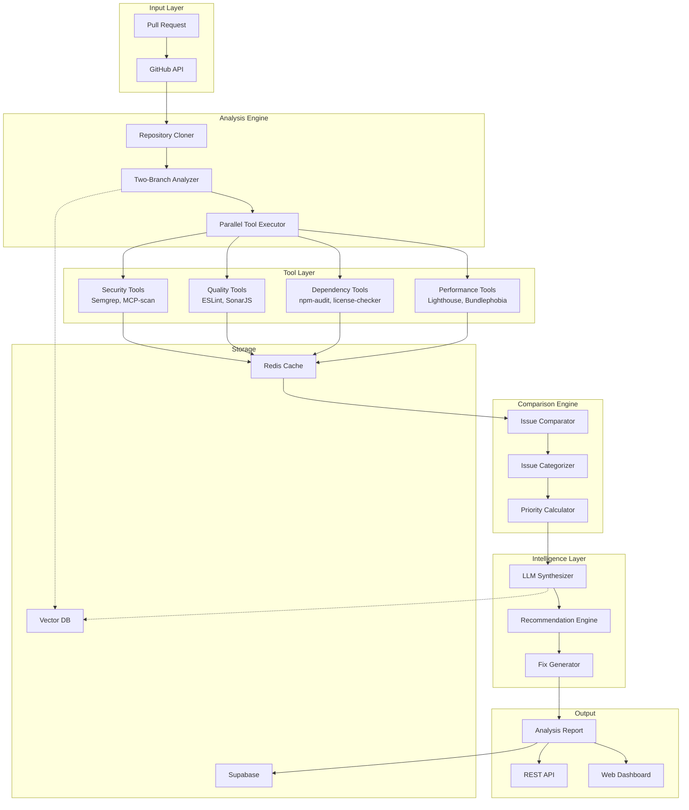

# CodeQual Architecture v4: Two-Branch Full Repository Analysis

*Version: 4.3*
*Date: December 19, 2025*
*Status: Production Service Architecture + Fix Verification Pipeline*

## Executive Summary

This document describes the production-ready architecture for CodeQual V9, featuring a service-based design with universal tool infrastructure that provides real, actionable code analysis results through a reusable V9PRAnalyzer service. The architecture supports multi-language analysis (Java, TypeScript, Python, Go) with shared tool runners for consistency and performance, and can be deployed via API, CLI, webhooks, or direct service integration.

**Key V9 Features:**
- Full two-branch analysis (main + PR branch)
- 4-tier fix system (Native → Dedicated → Cloud API → AI)
- Post-fix verification with regression detection
- Unfixed issue communication with author guidance
- Pattern-based fix reuse for cost optimization

## Core Problem Statement

### What Failed (V3 and Earlier)
- **DeepWiki Integration**: Returns hallucinated responses instead of real analysis
- **Diff-Only Analysis**: Tools run on changed files only, missing critical context
- **No Baseline Comparison**: Cannot determine what's new, fixed, or pre-existing
- **Test-Based Logic**: 1,200+ lines of logic trapped in test files, not reusable

### The Solution (V4.1 - Production Service)
- **V9PRAnalyzer Service**: Reusable production service encapsulating complete workflow
- **Full Repository Analysis**: Analyze entire codebase on both branches
- **Real Tool Results**: Use actual findings from Semgrep, PMD, ESLint, etc.
- **Smart Comparison**: Identify new, fixed, and unchanged issues accurately
- **Language-Agnostic**: Easy to add TypeScript, Python, Go (1 method update)
- **LLM Enhancement**: Use AI for synthesis and recommendations, not raw analysis

## Recent Updates (2025-12-19)

### Fix Verification & Unfixed Issue Handler (Session 61) ✅ COMPLETE

**What Changed:**
1. ✅ **Fix Verifier** → Re-scans fixed code to confirm fixes work
2. ✅ **Unfixed Issue Handler** → Communicates failures with author guidance
3. ✅ **Orchestrator Integration** → Complete verification pipeline
4. ✅ **Cloud API Type Fixes** → Fixed TypeScript errors in SARIF converter

**New Components:**
| Component | File | Purpose |
|-----------|------|---------|
| **FixVerifier** | `fix-branch/fix-verifier.ts` | Re-scans with same tool, checks regression |
| **UnfixedIssueHandler** | `fix-branch/unfixed-issue-handler.ts` | Records reasons, generates author guidance |

**Unfixed Issue Reasons:**
| Reason | Description |
|--------|-------------|
| `no_pattern_match` | No fix pattern exists in registry |
| `cloud_api_failed` | Corgea couldn't generate a fix |
| `ai_generation_failed` | AI couldn't generate reliable fix |
| `verification_failed` | Fix applied but didn't resolve issue |
| `regression_introduced` | Fix created new issues (rolled back) |
| `code_context_insufficient` | Not enough context to fix safely |
| `complex_refactoring` | Requires architectural changes |

**Author Action Types:**
- `review_and_fix`: Simple manual fix required
- `investigate`: Need to understand root cause
- `refactor`: Code restructuring needed
- `upgrade_dependency`: Update external library
- `add_configuration`: Missing config/env setup
- `accept_risk`: Document and proceed (low-risk)

---

### Cloud API Fixer Integration (Session 60) ✅ COMPLETE

**What Changed:**
1. ✅ **Corgea AI Fixer** → Cloud-based fix generation for PRO tier
2. ✅ **SARIF Converter** → Issue to SARIF 2.1.0 conversion
3. ✅ **Tier 2.5 Routing** → Pattern FIRST, then Cloud API
4. ✅ **Subscription Gating** → PRO/Enterprise only for cloud fixers

**Key Files:**
- `src/two-branch/tools/cloud-api/corgea-fixer.ts` - Corgea integration
- `src/two-branch/tools/cloud-api/sarif-converter.ts` - SARIF conversion
- `src/two-branch/tools/cloud-api/api-tool-orchestrator.ts` - Async execution

---

### Security Infrastructure Tools (Session 59) ✅ COMPLETE

**What Changed:**
1. ✅ **Secrets Detection** → Gitleaks + TruffleHog integration
2. ✅ **IaC Security** → Checkov for Terraform, CloudFormation, Kubernetes, Helm
3. ✅ **Container Security** → Trivy + Grype for vulnerability scanning
4. ✅ **Infrastructure Detection** → Auto-detect Docker, Kubernetes, Terraform in repos
5. ✅ **Security Blocker Logic** → Secrets ALWAYS block PR, critical security blocks regardless of code location

**New Tool Categories:**
| Category | Tools | Output Type | Blocking Behavior |
|----------|-------|-------------|-------------------|
| **Secrets** | Gitleaks, TruffleHog | Recommendation-only | ALWAYS blocks (any severity) |
| **IaC Security** | Checkov | Hybrid (some auto-fix) | Critical/High blocks |
| **Container** | Trivy, Grype | Recommendation-only | Critical blocks (CVE with exploits) |

**Infrastructure Detection:**
```typescript
// Auto-detects infrastructure from file patterns
const infraTypes = ['docker', 'kubernetes', 'terraform', 'cloudformation',
                    'helm', 'ansible', 'pulumi', 'openapi', 'graphql'];

// Orchestrator automatically enables security scans based on detection
const securityConfig = await getSecurityScanConfig(repoPath);
// Returns: { enableSecrets: true, enableIaC: true, enableContainer: false, ... }
```

**Blocker Logic (smart-issue-filter.ts):**
- **Secrets**: ALWAYS block regardless of severity or code location
- **Security (critical)**: Block regardless of code location when `securityCriticalAlwaysBlocks=true`
- **Security (high)**: Block only in NEW or EXISTING_MODIFIED code
- **Standard issues**: Block only if critical AND in NEW/EXISTING_MODIFIED code

**Subscription Tier Tool Availability:**
| Tool | BASIC (Free) | PRO ($8-10/mo) |
|------|--------------|----------------|
| Gitleaks | ✅ | ✅ |
| TruffleHog | ✅ | ✅ |
| Checkov | ✅ | ✅ |
| Trivy | ✅ | ✅ |
| Grype | ✅ | ✅ |
| CodeQL | ❌ | ✅ |

**Key Files:**
- `src/two-branch/tools/universal/secret-scanner.ts` - Gitleaks/TruffleHog
- `src/two-branch/tools/universal/iac-scanner.ts` - Checkov/Trivy IaC
- `src/two-branch/tools/universal/container-scanner.ts` - Trivy/Grype containers
- `src/two-branch/utils/smart-issue-filter.ts` - Blocker logic
- `src/two-branch/utils/framework-detector.ts` - Infrastructure detection

---

## Previous Updates (2025-11-07)

### Universal Tools Architecture ✅ COMPLETE

**What Changed:**
1. ✅ **Universal Tool Infrastructure** → Shared runners for tools used across multiple languages
2. ✅ **Semgrep Universal Runner** → Security scanning for ALL languages
3. ✅ **Dependency-Check Universal Runner** → CVE scanning for 7 languages with PostgreSQL backend
4. ✅ **BaseToolOrchestrator Enhanced** → Automatic routing to universal vs language-specific tools
5. ✅ **Performance Optimization** → 360× faster Dependency-Check (5s vs 30min via PostgreSQL)

**Key Benefits:**
- **Consistency**: Same Semgrep/Dependency-Check behavior across Java, TypeScript, Python, Go, etc.
- **Performance**: Shared PostgreSQL CVE database (208,612+ CVEs) with daily cron updates
- **Scalability**: Add new languages without rebuilding tool infrastructure
- **Container Size**: Smaller language images (TypeScript 424MB vs 1GB+ with bundled tools)
- **Maintainability**: Update 1 universal runner → affects all languages

**Architecture Pattern:**
```typescript
// Universal vs Language-Specific Tool Routing
protected async executeTool(toolName: string, repoPath: string, branch: string) {
  // Universal tools (Semgrep, Dependency-Check) → shared runners
  if (this.isUniversalTool(toolName)) {
    return this.executeUniversalTool(toolName, repoPath, branch);
  }
  
  // Language-specific tools → local implementations
  switch (toolName) {
    case 'pmd': return this.runPMD(repoPath, branch);           // Java only
    case 'eslint': return this.runESLint(repoPath, branch);     // TypeScript only
    case 'pylint': return this.runPylint(repoPath, branch);     // Python only
  }
}
```

**Universal Tools:**
- **Semgrep**: Security scanning for ALL languages (Java, TypeScript, Python, Go, Ruby, PHP, C++, Rust, Kotlin)
- **Dependency-Check**: CVE scanning for 7 languages (Java, JavaScript, Python, Ruby, PHP, .NET, C++)
  - **PostgreSQL Backend**: 208,612+ CVEs, daily cron updates at 2 AM UTC
  - **Query Time**: 5 seconds per branch (vs 30 minutes download)
  - **Performance**: 360× improvement

**Files:**
- `src/two-branch/tools/universal/semgrep-runner.ts` - Universal Semgrep executor
- `src/two-branch/tools/universal/dependency-check-runner.ts` - Universal Dependency-Check with PostgreSQL
- `src/two-branch/tools/base-tool-orchestrator.ts` - Universal tool routing
- `src/two-branch/docs/multi-language/UNIVERSAL_TOOLS_MATRIX.md` - Complete tool analysis

---

### TypeScript Compilation Architecture ✅ COMPLETE (November 2025)

**Strategic Decision**: Environment-specific compilation strategies for optimal performance

**What Changed:**
1. ✅ **Development**: ts-node/tsx for quick iteration
2. ✅ **Test**: Compile-then-run for reliability
3. ✅ **Production**: Pre-compiled JavaScript for performance

**Key Benefits:**
- **Development Speed**: No build step, instant code changes
- **Test Reliability**: Avoids ESM/CommonJS conflicts
- **Production Performance**: Zero compilation overhead
- **Container Size**: 50-70% smaller production images

#### Environment-Specific Strategies

**Development Environment:**
```bash
# Quick iteration with ts-node/tsx
npx ts-node src/server.ts
# OR
npx tsx src/server.ts
```

Benefits: No build step, instant changes, better debugging

**Test Environment:**
```bash
# Compile before each test run
npx tsc --project tsconfig.json --outDir ./dist
npx tsc tests/integration/test-file.ts --outDir ./dist --module commonjs

# Run compiled JavaScript
node ./dist/tests/integration/test-file.js
```

Benefits: Latest code tested, no ESM conflicts, faster than ts-node

**Production Environment:**
```bash
# CI/CD Pipeline (one-time during deployment)
npm run build  # Compiles TypeScript → JavaScript

# Production server runs pre-compiled JavaScript
node dist/server.js
```

Benefits: Instant startup, fast response, lower CPU, smaller container

#### Docker Multi-Stage Build

```dockerfile
# Build stage
FROM node:20 AS builder
WORKDIR /app
COPY package*.json ./
RUN npm ci
COPY . .
RUN npm run build  # Compile TypeScript once

# Production stage
FROM node:20-slim
WORKDIR /app
COPY package*.json ./
RUN npm ci --production  # Only production dependencies
COPY --from=builder /app/dist ./dist  # Copy compiled JS
CMD ["node", "dist/server.js"]  # Run compiled JavaScript
```

Impact:
- 🔒 Security: No source code in production image
- 📦 Size: 50-70% smaller production image
- ⚡ Speed: 10x faster container startup

#### Performance Comparison

| Environment | Approach | Startup Time | Runtime | Use Case |
|-------------|----------|--------------|---------|----------|
| Development | ts-node/tsx | 2-3s | 95-98% | Quick iteration |
| Test | Compile-then-run | 5-10s (once) | 100% | Ensure correctness |
| Production | Pre-compiled | \u003c1s | 100% | User requests |

#### API Service Architecture

**User Request Flow** (No Compilation):
```
User Request → API Gateway → Pre-compiled Service → Response
              ↓
         ~50-100ms total
```

**Deployment Flow** (Compilation Once):
```
git push → CI/CD → npm run build → Docker Build → Deploy
                   ↓
            Compile TypeScript (30-60s)
                   ↓
            Production Image (pre-compiled JS)
```

**Key Principle**: **Build Once, Run Many Times**

#### Critical Implementation Details

**Problem**: `tsconfig.json` excludes `**/tests/**`
**Solution**: Compile source and tests separately

```bash
# 1. Compile source files
npx tsc --project tsconfig.json --outDir ./dist

# 2. Compile test file separately
npx tsc tests/integration/test-file.ts \
  --outDir ./dist \
  --module commonjs \
  --target ES2020 \
  --esModuleInterop \
  --skipLibCheck \
  --resolveJsonModule \
  --moduleResolution node

# 3. Verify compiled file exists
[ -f "./dist/tests/integration/test-file.js" ]

# 4. Run compiled test
node ./dist/tests/integration/test-file.js
```

**Files:**
- `oracle-run-typescript-v9-pr69.sh` - Test runner with separate compilation
- `ORACLE_CLOUD_DB_CONFIG.md` - Complete deployment guide
- `.env.example` - Environment configuration template

**Validation:**
- **CodeQual PR #69**: V9 test completed successfully
- **Duration**: 2.25 minutes
- **Issues Found**: 230 total, 6 new
- **Compilation**: \u003c10 seconds


### Production Service Architecture ✅ COMPLETE (October 2025)

**What Changed:**
1. ✅ **V9PRAnalyzer Service** → Extracted 1,200+ lines from test into reusable production service
2. ✅ **Test Cleanup** → Deleted 50 outdated test files (86% reduction)
3. ✅ **Financial Impact Fix** → Concise reporting for low-risk PRs
4. ✅ **API Integration** → Express endpoint example provided

**Key Benefits:**
- **Reusability**: Service works across API, CLI, webhooks, tests
- **Maintainability**: Single source of truth (not duplicated in tests)
- **Language Support**: Easy to add new languages (1 method change)
- **Code Quality**: Clean separation of concerns

**Files Created:**
- `src/two-branch/services/v9-pr-analyzer.ts` - Production service (600+ lines)
- `src/two-branch/api/analyze-pr-endpoint.ts` - API endpoint example
- `V9_PRODUCTION_ARCHITECTURE.md` - Complete architecture guide

**Validation:**
- **Spring PetClinic PR #950**: A+ grade (9/9 criteria)
- **Duration**: 2m 35s per analysis
- **Cost**: $0.07 (vs $3.63 without grouping)
- **Auto-fix Coverage**: 100%

### Previous Updates (2025-09-03)

### Tool Coverage Achievement
- **Overall Coverage:** Improved from 26% to 92% (79/85 tools installed)
- **Java Tools:** Complete transformation from 40% to 100% coverage
- **Critical Documentation:** See comprehensive tool analysis in:
  - `packages/agents/FINAL_TOOL_COVERAGE_REPORT_2025_09_03.md` - Complete tool coverage summary
  - `packages/agents/UNIFIED_TOOL_COVERAGE_MATRIX.md` - Consolidated coverage matrix
  - `packages/agents/scripts/install-java-tools.sh` - Java tool installer script
  - `packages/agents/scripts/validate-all-tools.sh` - Comprehensive validation script
  - `packages/agents/CLOUD_POD_TOOL_STATUS_AND_ACTION_PLAN.md` - Cloud deployment strategy

### Key Achievements
- ✅ 92% local tool coverage achieved
- ✅ Java enterprise tools fully installed (PMD, Checkstyle, OWASP DC)
- ✅ Comprehensive validation scripts created
- ⚠️ Cloud pod deployment pending (tools installed locally)

## Complete V9 Data Flow (Session 61 - Current)

This section documents the complete data flow from PR submission to final report delivery.

```
┌─────────────────────────────────────────────────────────────────────────────────────────┐
│                           CODEQUAL V9 COMPLETE DATA FLOW                                 │
│                        (Issue Detection → Fix → Report to User)                          │
└─────────────────────────────────────────────────────────────────────────────────────────┘

                              ┌──────────────────────┐
                              │   PR SUBMITTED       │
                              │   (GitHub/GitLab)    │
                              └──────────┬───────────┘
                                         │
                                         ▼
┌─────────────────────────────────────────────────────────────────────────────────────────┐
│                          PHASE 1: REPOSITORY PREPARATION                                 │
├─────────────────────────────────────────────────────────────────────────────────────────┤
│  V9RepositoryManager → Clone BOTH Branches → SmartFileSelector                          │
│  • Clone main (baseline) and PR branch                                                   │
│  • <10k files: 100% coverage | >10k files: smart selection (~500 files)                 │
└─────────────────────────────────────────────────────────────────────────────────────────┘
                                         │
                                         ▼
┌─────────────────────────────────────────────────────────────────────────────────────────┐
│                          PHASE 2: TOOL SCANNING (V9ToolOrchestrator)                     │
├─────────────────────────────────────────────────────────────────────────────────────────┤
│  Analysis Mode determines tools:                                                         │
│  • fast     → semgrep, pmd                                                              │
│  • standard → + dependency-check, eslint                                                │
│  • thorough → + checkstyle, bandit                                                      │
│  • complete → + spotbugs, jdepend, trivy, gitleaks, checkov                            │
│                                                                                          │
│  Tool Categories: Security | Quality | Dependency | P0 Critical (secrets, IaC, CVE)    │
│  Output: RawIssue[] per tool (JSON/SARIF format)                                        │
└─────────────────────────────────────────────────────────────────────────────────────────┘
                                         │
                                         ▼
┌─────────────────────────────────────────────────────────────────────────────────────────┐
│                          PHASE 3: ISSUE PROCESSING & CLASSIFICATION                      │
├─────────────────────────────────────────────────────────────────────────────────────────┤
│  EnhancedUniversalParser → IssueGroupingService → Two-Branch Comparison → Deduplication │
│                                                                                          │
│  Classification:                                                                         │
│  • NEW issues (in PR only) - can block                                                  │
│  • EXISTING (in baseline) - context only                                                │
│  • RESOLVED (fixed by PR) - positive credit                                             │
│                                                                                          │
│  Output: Issue[] with { id, category, severity, status, file, line, tool, description } │
└─────────────────────────────────────────────────────────────────────────────────────────┘
                                         │
                                         ▼
┌─────────────────────────────────────────────────────────────────────────────────────────┐
│                          PHASE 4: FIX ROUTING (FixRouter)                                │
├─────────────────────────────────────────────────────────────────────────────────────────┤
│  Issue[] → FixRouter.routeAndBatch(issues, { tier: subscriptionTier })                  │
│                                                                                          │
│  Routing Result:                                                                         │
│  ├── tier1:   FixBatch[] (Native --fix: eslint, prettier, ruff, gofmt, rustfmt)        │
│  ├── tier2:   FixBatch[] (Dedicated fixers: Sorald, pyupgrade, semgrep --autofix)      │
│  ├── tier2_5: FixBatch[] (Cloud API: Corgea - PRO tier only)                           │
│  └── tier3:   FixBatch[] (AI generation / manual review)                               │
│                                                                                          │
│  Summary: { total, safeForAutoApply, estimatedCost, cloudFixerEligible }               │
└─────────────────────────────────────────────────────────────────────────────────────────┘
                                         │
                                         ▼
┌─────────────────────────────────────────────────────────────────────────────────────────┐
│                    PHASE 5: FIX EXECUTION (FixBranchOrchestrator)                        │
├─────────────────────────────────────────────────────────────────────────────────────────┤
│                                                                                          │
│  TIER 1: Native --fix (95-100% confidence, auto-apply safe)                             │
│  └── eslint --fix, prettier, ruff, black, gofmt, rustfmt, rubocop -a                   │
│                           │                                                              │
│                           ▼                                                              │
│  TIER 2: Dedicated Fixer Tools (85-95% confidence)                                      │
│  └── Sorald (PMD), pyupgrade, semgrep --autofix, npm audit fix                         │
│                           │                                                              │
│                           ▼                                                              │
│  TIER 2.5A: Pattern Registry - CHECK FIRST (instant, free)                             │
│  └── Query Supabase for known fix patterns from previous Corgea/AI fixes               │
│                           │ (unmatched issues only)                                      │
│                           ▼                                                              │
│  TIER 2.5B: Cloud API Fixers - PRO/ENTERPRISE ONLY (70-85% confidence)                 │
│  └── Corgea AI Fixer: SARIF → context-aware fixes → save as patterns                   │
│                           │                                                              │
│                           ▼                                                              │
│  TIER 3: AI Generation (50-80% confidence, requires review)                            │
│  └── Claude/GPT generates fix → save successful fixes as patterns                      │
│                                                                                          │
│  Output: CategorizedFix[] with { file, line, originalCode, fixedCode, tier, confidence }│
└─────────────────────────────────────────────────────────────────────────────────────────┘
                                         │
                                         ▼
┌─────────────────────────────────────────────────────────────────────────────────────────┐
│                    PHASE 6: FIX APPLICATION (FixApplicator)                              │
├─────────────────────────────────────────────────────────────────────────────────────────┤
│  For each CategorizedFix:                                                                │
│  1. Read original file → 2. Locate code at line → 3. Apply fix → 4. Write file         │
│                                                                                          │
│  Output: ApplyResult { applied[], failed[], modifiedFiles[], summary }                  │
└─────────────────────────────────────────────────────────────────────────────────────────┘
                                         │
                                         ▼
┌─────────────────────────────────────────────────────────────────────────────────────────┐
│                    PHASE 7: FIX VERIFICATION (FixVerifier) - SESSION 61                  │
├─────────────────────────────────────────────────────────────────────────────────────────┤
│  For each applied fix:                                                                   │
│  1. Re-scan fixed file with SAME TOOL that found the issue                              │
│  2. Check: Is original issue still present? (allow ±2 line drift)                       │
│  3. Check: Are there NEW issues nearby? (regression check)                              │
│  4. Result: verified (pass) OR failed (issue not resolved OR regression)               │
│                                                                                          │
│  ┌────────────────────────────┐              ┌─────────────────────────────────────┐    │
│  │      ✅ VERIFIED           │              │        ❌ FAILED                     │    │
│  │  • Issue resolved          │              │  • Issue still present               │    │
│  │  • No regressions          │              │  • OR new issues introduced          │    │
│  │  • Keep fix in branch      │              │  • Rollback fix → UnfixedIssueHandler│    │
│  └────────────────────────────┘              └─────────────────────────────────────┘    │
│                                                                                          │
│  Output: BatchVerificationResult { passed, failed, regressions, verifiedFixes[] }       │
└─────────────────────────────────────────────────────────────────────────────────────────┘
                                         │
                                         ▼
┌─────────────────────────────────────────────────────────────────────────────────────────┐
│              PHASE 8: UNFIXED ISSUE HANDLING (UnfixedIssueHandler) - SESSION 61          │
├─────────────────────────────────────────────────────────────────────────────────────────┤
│  Collects ALL issues that couldn't be automatically fixed:                               │
│  • No pattern match | Cloud API failed | AI generation failed                          │
│  • Verification failed | Regression introduced | Cost limit exceeded | Timeout         │
│                                                                                          │
│  For each unfixed issue generates:                                                       │
│  • reason: why it couldn't be fixed                                                     │
│  • explanation: human-readable message                                                  │
│  • authorAction: { type, description, steps[], blocksMerge }                           │
│  • reviewPriority: critical | high | medium | low                                       │
│  • estimatedEffort: trivial | minor | moderate | significant                           │
│  • suggestedApproach + documentationLinks                                               │
│                                                                                          │
│  Output: UnfixedSummary { total, byReason, byPriority, mergeBlockers, markdown }        │
└─────────────────────────────────────────────────────────────────────────────────────────┘
                                         │
                                         ▼
┌─────────────────────────────────────────────────────────────────────────────────────────┐
│                PHASE 9: FIX BRANCH GENERATION (FixBranchGenerator)                       │
├─────────────────────────────────────────────────────────────────────────────────────────┤
│  1. Create new branch: codequal/fixes-pr-{prNumber}                                     │
│  2. Apply all verified fixes to files                                                   │
│  3. Commit changes with detailed message                                                │
│  4. Generate CODEQUAL_FIXES.md review document                                          │
│  5. Push branch (if autoPush enabled)                                                   │
│                                                                                          │
│  Output: FixBranchResult { branchName, applyResult, reviewDocument, gitOperations }     │
└─────────────────────────────────────────────────────────────────────────────────────────┘
                                         │
                                         ▼
┌─────────────────────────────────────────────────────────────────────────────────────────┐
│                PHASE 10: REPORT GENERATION (V9GroupedReportFormatter)                    │
├─────────────────────────────────────────────────────────────────────────────────────────┤
│  34-Section Report:                                                                      │
│  📊 Header (Score, Summary, Key Findings)                                               │
│  🔴 Critical Blockers (must fix before merge)                                           │
│  ⚡ Quick Wins (auto-fixed or easy fixes)                                               │
│  ✅ Auto-Fixed Issues (by CodeQual)                                                     │
│  ⚠️ Issues Requiring Author Review (couldn't auto-fix + guidance)                       │
│  📈 Business Impact, Risk Matrix, Educational Resources                                │
│  📋 Metadata, Performance, Cost Analysis, Footer                                        │
│                                                                                          │
│  Output Formats: Markdown | SARIF (IDE) | GitLab Code Quality | JSON attachments       │
└─────────────────────────────────────────────────────────────────────────────────────────┘
                                         │
                                         ▼
┌─────────────────────────────────────────────────────────────────────────────────────────┐
│                          PHASE 11: DELIVERY TO USER                                      │
├─────────────────────────────────────────────────────────────────────────────────────────┤
│  ┌─────────────────────┐   ┌─────────────────────┐   ┌─────────────────────────────┐    │
│  │   PR COMMENT        │   │   FIX BRANCH        │   │   IDE INTEGRATION           │    │
│  │ • Summary score     │   │ • codequal/fixes-   │   │ • SARIF with fixes          │    │
│  │ • Critical issues   │   │   pr-{number}       │   │ • One-click apply all       │    │
│  │ • Link to report    │   │ • CODEQUAL_FIXES.md │   │ • Navigate to issues        │    │
│  └─────────────────────┘   └─────────────────────┘   └─────────────────────────────┘    │
└─────────────────────────────────────────────────────────────────────────────────────────┘
```

### Key Data Types Flow

```
Raw Tool Output (JSON/SARIF)
        │
        ▼
RawIssue { ruleId, file, line, message, severity, tool }
        │
        ▼
Issue { id, category, severity, status, title, description, file, line, tool, agent, ... }
        │
        ▼
IssueToFix { id, ruleId, toolId, file, line, message, severity, codeContext? }
        │
        ▼
FixRoute { issue, tier, fixer, confidence, safeForAutoApply }
        │
        ▼
CategorizedFix { id, file, line, originalCode, fixedCode, tier, confidence, ... }
        │
        ▼
FixVerificationResult { fix, verified, issueResolved, regressionsFound }
        │
        ▼
UnfixedIssue { issue, reason, explanation, authorAction, reviewPriority, ... }
        │
        ▼
Final Report (Markdown + SARIF + GitLab Code Quality)
```

### Subscription Tier Impact

| Tier | Tier 1 Native | Tier 2 Dedicated | Tier 2.5 Cloud API | Tier 3 AI |
|------|---------------|------------------|-------------------|-----------|
| **BASIC** | ✅ | ✅ | ❌ | Limited |
| **PRO** | ✅ | ✅ | ✅ Corgea | ✅ |
| **ENTERPRISE** | ✅ | ✅ | ✅ Corgea | ✅ Unlimited |

---

## Architecture Overview


```mermaid
graph TB
    subgraph "Input Layer"
        PR[Pull Request]
        GH[GitHub API]
    end
    
    subgraph "Analysis Engine"
        Clone[Repository Cloner]
        TBA[Two-Branch Analyzer]
        PTE[Parallel Tool Executor]
        
        Clone --> TBA
        TBA --> PTE
    end
    
    subgraph "Tool Layer"
        SEC[Security Tools<br/>Semgrep, MCP-scan]
        QUAL[Quality Tools<br/>ESLint, SonarJS]
        DEP[Dependency Tools<br/>npm-audit, license-checker]
        PERF[Performance Tools<br/>Lighthouse, Bundlephobia]
    end
    
    subgraph "Comparison Engine"
        COMP[Issue Comparator]
        CAT[Issue Categorizer]
        PRIO[Priority Calculator]
    end
    
    subgraph "Intelligence Layer"
        LLM[LLM Synthesizer]
        REC[Recommendation Engine]
        FIX[Fix Generator]
    end
    
    subgraph "Storage"
        Redis[Redis Cache]
        VDB[Vector DB]
        Supa[Supabase]
    end
    
    subgraph "Output"
        Report[Analysis Report]
        API[REST API]
        UI[Web Dashboard]
    end
    
    PR --> GH --> Clone
    PTE --> SEC & QUAL & DEP & PERF
    SEC & QUAL & DEP & PERF --> Redis
    Redis --> COMP
    COMP --> CAT --> PRIO
    PRIO --> LLM
    LLM --> REC --> FIX
    FIX --> Report
    Report --> API & UI
    
    TBA -.-> VDB
    LLM -.-> VDB
    Report --> Supa
```

## Component Architecture

### 0. V9 PR Analyzer Service (Production Entry Point) ⭐ NEW

```typescript
/**
 * V9PRAnalyzer - Production Service
 * 
 * Single entry point for all PR analysis.
 * Encapsulates complete V9 workflow in reusable service.
 */
interface V9PRAnalyzer {
  // Main analysis method
  analyzePR(request: V9AnalysisRequest): Promise<V9AnalysisResult>;
}

interface V9AnalysisRequest {
  repositoryUrl: string;          // GitHub URL
  prNumber?: number;              // PR number (optional)
  baseBranch?: string;            // Base branch (auto-detected)
  prBranch?: string;              // PR branch (auto-detected)
  language: 'java' | 'typescript' | 'python' | 'go';
  analysisMode?: 'fast' | 'complete';
  outputDirectory?: string;
}

interface V9AnalysisResult {
  decision: 'APPROVED' | 'DECLINED';
  report: GroupedReportOutput;    // Markdown + attachments
  metadata: {
    repository: string;
    prNumber: number;
    totalIssues: number;
    newIssues: number;
    resolvedIssues: number;
    blockingIssues: number;
    duration: number;
    costSavings: { withoutGrouping, withGrouping, saved, reduction };
  };
  issues: {
    all: EnrichedIssue[];
    byCategory: { NEW, EXISTING_MODIFIED, RESOLVED, EXISTING_REST };
    blocking: EnrichedIssue[];
  };
}
```

**Usage Examples:**

```typescript
// 1. From API Endpoint
import { V9PRAnalyzer } from '../services/v9-pr-analyzer';

const analyzer = new V9PRAnalyzer();

router.post('/analyze-pr', async (req, res) => {
  const result = await analyzer.analyzePR(req.body);
  res.json(result);
});

// 2. From CLI
async function main() {
  const analyzer = new V9PRAnalyzer();
  const result = await analyzer.analyzePR({
    repositoryUrl: process.argv[2],
    prNumber: parseInt(process.argv[3]),
    language: 'java'
  });
  console.log(result.report.markdown);
}

// 3. From GitHub Webhook
app.post('/webhook/github', async (req, res) => {
  const { repository, pull_request } = req.body;
  const analyzer = new V9PRAnalyzer();
  
  const result = await analyzer.analyzePR({
    repositoryUrl: repository.clone_url,
    prNumber: pull_request.number,
    language: 'java'
  });
  
  await postGitHubComment(pull_request.number, result.report.markdown);
  res.json({ success: true });
});

// 4. From Test
async function runTest() {
  const analyzer = new V9PRAnalyzer();
  const result = await analyzer.analyzePR({
    repositoryUrl: 'https://github.com/spring-projects/spring-petclinic.git',
    prNumber: 950,
    language: 'java',
    analysisMode: 'complete'
  });
  
  expect(result.decision).toBe('APPROVED');
  expect(result.metadata.newIssues).toBeGreaterThan(0);
}
```

**Adding New Languages:**

```typescript
// In V9PRAnalyzer.createOrchestrator():
private createOrchestrator(language: string): any {
  if (language === 'java') {
    return new JavaToolOrchestrator();
  }
  if (language === 'typescript') {
    return new TypeScriptToolOrchestrator();  // Add this
  }
  if (language === 'python') {
    return new PythonToolOrchestrator();      // Add this
  }
  throw new Error(`Unsupported language: ${language}`);
}

// That's it! The rest of the workflow is language-agnostic:
// - Repository cloning
// - Issue categorization (NEW/RESOLVED/EXISTING)
// - AI enrichment
// - Report generation
```

**Files:**
- `src/two-branch/services/v9-pr-analyzer.ts` - Production service
- `src/two-branch/api/analyze-pr-endpoint.ts` - API endpoint example
- `test-v9-e2e-complete.ts` - Test example using service
- `V9_PRODUCTION_ARCHITECTURE.md` - Complete documentation

---

### 1. Two-Branch Analyzer

```typescript
interface TwoBranchAnalyzer {
  // Core analysis flow
  analyzePR(repoUrl: string, prNumber: number): Promise<PRAnalysisReport>;
  
  // Branch operations
  cloneRepository(repoUrl: string): Promise<string>;
  checkoutBranch(branch: string): Promise<void>;
  
  // Tool execution
  runFullAnalysis(repoPath: string): Promise<BranchAnalysisResult>;
  
  // Comparison
  compareResults(
    mainResults: BranchAnalysisResult,
    prResults: BranchAnalysisResult
  ): Promise<ComparisonResult>;
}
```

### 2. Issue Identification System

```typescript
interface IssueIdentification {
  // Issue matching across branches
  fingerprint(issue: ToolIssue): string;
  findMatches(issue: ToolIssue, candidates: ToolIssue[]): ToolIssue[];
  
  // Categorization
  categorizeIssue(issue: ToolIssue, context: AnalysisContext): IssueCategory;
  
  // Impact assessment
  calculateImpact(issue: ToolIssue, prContext: PRContext): ImpactLevel;
}
```

### 3. Tool Execution Strategy

```typescript
interface ToolExecutionStrategy {
  // Parallel execution with priority
  executeTools(config: {
    repoPath: string;
    branch: string;
    tools: ToolConfig[];
    agents: AgentRole[];
  }): Promise<ToolResults>;
  
  // Result aggregation
  aggregateResults(results: Map<string, ToolOutput>): AggregatedResults;
  
  // Caching strategy
  cacheKey(repoUrl: string, branch: string, tool: string): string;
  getCached(key: string): Promise<ToolOutput | null>;
  setCached(key: string, result: ToolOutput, ttl?: number): Promise<void>;
}
```

## Data Models

### Issue Structure

```typescript
interface ToolIssue {
  // Identification
  id: string;                    // Unique ID
  fingerprint: string;           // Cross-branch matching key
  
  // Source
  tool: string;                  // 'semgrep-mcp'
  toolVersion: string;           // '1.2.3'
  ruleId: string;               // 'security/sql-injection'
  category: IssueCategory;       // 'security' | 'quality' | 'performance'
  
  // Location
  file: string;                  // 'src/auth/login.js'
  startLine: number;             // 142
  endLine: number;               // 145
  startColumn?: number;          // 15
  endColumn?: number;            // 42
  
  // Details
  severity: 'critical' | 'high' | 'medium' | 'low' | 'info';
  message: string;               // Human-readable description
  details?: string;              // Extended explanation
  
  // Code context
  codeSnippet?: string;          // Affected code
  suggestion?: string;           // How to fix
  documentation?: string;        // Link to docs
  
  // Metadata
  confidence: number;            // 0-1 confidence score
  falsePositive?: boolean;      // ML-detected false positive
  tags: string[];                // Additional categorization
}
```

### Comparison Result Structure

```typescript
interface ComparisonResult {
  // Issue categorization
  newIssues: EnhancedIssue[];        // Introduced in PR
  fixedIssues: EnhancedIssue[];      // Resolved in PR
  unchangedIssues: EnhancedIssue[];  // Pre-existing
  
  // Metrics
  metrics: {
    totalIssues: number;
    criticalCount: number;
    highCount: number;
    mediumCount: number;
    lowCount: number;
    
    byCategory: Record<IssueCategory, number>;
    byTool: Record<string, number>;
    
    codeQualityScore: number;      // 0-100
    securityScore: number;         // 0-100
    performanceScore: number;      // 0-100
    overallScore: number;          // 0-100
  };
  
  // Trends
  trends: {
    improvement: number;            // Positive = getting better
    velocity: number;              // Issues fixed per commit
    riskLevel: 'low' | 'medium' | 'high' | 'critical';
  };
}

interface EnhancedIssue extends ToolIssue {
  // Comparison metadata
  status: 'new' | 'fixed' | 'unchanged';
  
  // For new issues
  impact?: 'breaking' | 'degrading' | 'minor';
  introducedBy?: CommitInfo;
  requiresAction?: boolean;
  blocksPR?: boolean;
  
  // For fixed issues
  fixedBy?: CommitInfo;
  fixQuality?: 'complete' | 'partial' | 'workaround';
  credit?: number;
  
  // For unchanged issues
  age?: string;                  // How long present
  occurrences?: number;          // Times seen
  previousAttempts?: FixAttempt[];
  
  // AI enhancements
  recommendation?: string;        // AI-generated fix
  explanation?: string;          // Why this matters
  priority?: number;             // 1-10 priority score
  estimatedEffort?: 'minutes' | 'hours' | 'days';
}
```

## Execution Flow

### 1. PR Analysis Trigger

```typescript
async function handlePRAnalysis(webhook: GitHubWebhook) {
  // 1. Extract PR information
  const { repository, pull_request } = webhook;
  const repoUrl = repository.html_url;
  const prNumber = pull_request.number;
  
  // 2. Check cache for recent analysis
  const cached = await cache.get(`analysis:${repoUrl}:${prNumber}`);
  if (cached && !isStale(cached)) {
    return cached;
  }
  
  // 3. Trigger two-branch analysis
  const analyzer = new TwoBranchAnalyzer();
  const report = await analyzer.analyzePR(repoUrl, prNumber);
  
  // 4. Store and return results
  await cache.set(`analysis:${repoUrl}:${prNumber}`, report);
  await database.saveAnalysis(report);
  
  return report;
}
```

### 2. Two-Branch Analysis Process

```typescript
class TwoBranchAnalyzer {
  async analyzePR(repoUrl: string, prNumber: number): Promise<PRAnalysisReport> {
    // 1. Clone repository
    const repoPath = await this.cloneRepository(repoUrl);
    
    // 2. Get PR information
    const prInfo = await github.getPR(repoUrl, prNumber);
    const baseBranch = prInfo.base.ref;  // usually 'main'
    const prBranch = prInfo.head.ref;
    
    // 3. Analyze base branch
    await git.checkout(baseBranch);
    const baseResults = await this.runFullAnalysis(repoPath);
    
    // 4. Analyze PR branch
    await git.fetch(`pull/${prNumber}/head:pr-${prNumber}`);
    await git.checkout(`pr-${prNumber}`);
    const prResults = await this.runFullAnalysis(repoPath);
    
    // 5. Compare results
    const comparison = await this.compareResults(baseResults, prResults);
    
    // 6. Enhance with AI
    const enhanced = await this.enhanceWithAI(comparison, prInfo);
    
    // 7. Generate report
    return this.generateReport(enhanced, prInfo);
  }
  
  private async runFullAnalysis(repoPath: string): Promise<BranchAnalysisResult> {
    const executor = new ParallelToolExecutor();
    
    // Get all files in repository
    const files = await this.getAllFiles(repoPath);
    
    // Create execution plans for all tools
    const plans = executor.createExecutionPlans(files, this.enabledTools);
    
    // Execute in parallel by priority
    const results = await executor.executeToolsInParallel(plans);
    
    // Aggregate and return
    return this.aggregateResults(results);
  }
}
```

### 3. Issue Comparison Logic

```typescript
class IssueComparator {
  compare(
    baseIssues: ToolIssue[],
    prIssues: ToolIssue[]
  ): ComparisonResult {
    const result = {
      newIssues: [],
      fixedIssues: [],
      unchangedIssues: []
    };
    
    // Create fingerprint maps for O(1) lookup
    const baseMap = new Map(
      baseIssues.map(i => [this.fingerprint(i), i])
    );
    const prMap = new Map(
      prIssues.map(i => [this.fingerprint(i), i])
    );
    
    // Find NEW issues (in PR but not in base)
    for (const [fingerprint, issue] of prMap) {
      if (!baseMap.has(fingerprint)) {
        result.newIssues.push(this.enhanceNewIssue(issue));
      }
    }
    
    // Find FIXED issues (in base but not in PR)
    for (const [fingerprint, issue] of baseMap) {
      if (!prMap.has(fingerprint)) {
        result.fixedIssues.push(this.enhanceFixedIssue(issue));
      }
    }
    
    // Find UNCHANGED issues (in both)
    for (const [fingerprint, issue] of prMap) {
      if (baseMap.has(fingerprint)) {
        const baseIssue = baseMap.get(fingerprint);
        result.unchangedIssues.push(
          this.enhanceUnchangedIssue(issue, baseIssue)
        );
      }
    }
    
    return result;
  }
  
  private fingerprint(issue: ToolIssue): string {
    // Create stable fingerprint for cross-branch matching
    // Tolerates small line number changes
    const lineRange = Math.floor(issue.startLine / 5) * 5;
    
    return crypto
      .createHash('sha256')
      .update(`${issue.tool}:${issue.ruleId}:${issue.file}:${lineRange}`)
      .digest('hex');
  }
}
```

## Tool Integration

### Enabled Tools by Category

```typescript
const TOOL_REGISTRY = {
  security: {
    primary: ['semgrep-mcp', 'mcp-scan'],
    secondary: ['sonarqube'],
    optional: ['snyk', 'trivy']
  },
  
  codeQuality: {
    primary: ['eslint-direct', 'sonarjs-direct'],
    secondary: ['jscpd-direct', 'prettier-direct'],
    optional: ['complexity-report']
  },
  
  dependencies: {
    primary: ['npm-audit-direct'],
    secondary: ['license-checker-direct', 'dependency-cruiser-direct'],
    optional: ['npm-outdated-direct']
  },
  
  performance: {
    primary: ['lighthouse-direct'],
    secondary: ['bundlephobia-direct'],
    optional: ['webpack-bundle-analyzer']
  },
  
  architecture: {
    primary: ['madge-direct'],
    secondary: ['dependency-cruiser-direct'],
    optional: ['arkit']
  }
};
```

### Tool Execution Priority

```typescript
const TOOL_PRIORITY = {
  100: ['semgrep-mcp', 'mcp-scan'],           // Security first
  90: ['npm-audit-direct'],                    // Dependencies
  80: ['eslint-direct', 'sonarjs-direct'],    // Code quality
  70: ['lighthouse-direct'],                   // Performance
  60: ['madge-direct'],                        // Architecture
  50: ['tavily-mcp', 'serena-mcp']           // Context gathering
};
```

## Caching Strategy

### Multi-Level Cache

```typescript
class CacheManager {
  // L1: In-memory cache (fastest, smallest)
  private memoryCache = new Map<string, CachedResult>();
  
  // L2: Redis cache (fast, medium)
  private redisCache = new Redis(process.env.REDIS_URL);
  
  // L3: Vector DB (slower, largest, semantic search)
  private vectorDB = new VectorDB(process.env.VECTOR_DB_URL);
  
  async get(key: string): Promise<CachedResult | null> {
    // Check L1
    if (this.memoryCache.has(key)) {
      return this.memoryCache.get(key);
    }
    
    // Check L2
    const redisResult = await this.redisCache.get(key);
    if (redisResult) {
      this.memoryCache.set(key, redisResult); // Promote to L1
      return redisResult;
    }
    
    // Check L3
    const vectorResult = await this.vectorDB.get(key);
    if (vectorResult) {
      await this.redisCache.set(key, vectorResult); // Promote to L2
      this.memoryCache.set(key, vectorResult);      // Promote to L1
      return vectorResult;
    }
    
    return null;
  }
}
```

### Cache Keys

```typescript
// Repository analysis cache (24 hours)
`repo:${repoUrl}:${branch}:${commitHash}:${tool}`

// PR analysis cache (1 hour)
`pr:${repoUrl}:${prNumber}:${commitHash}`

// Tool results cache (7 days)
`tool:${tool}:${repoUrl}:${fileHash}`

// Comparison cache (1 hour)
`compare:${repoUrl}:${baseBranch}:${prBranch}`
```

## Performance Optimizations

### 1. Incremental Analysis

```typescript
class IncrementalAnalyzer {
  async analyzeIncremental(
    repoUrl: string,
    baseBranch: string,
    prBranch: string
  ) {
    // Get changed files
    const changedFiles = await git.diff(baseBranch, prBranch);
    
    // For unchanged files, use cached results
    const cachedResults = await this.getCachedResults(
      repoUrl,
      baseBranch,
      unchangedFiles
    );
    
    // Only run tools on changed files and their dependencies
    const filesToAnalyze = await this.getImpactedFiles(changedFiles);
    const newResults = await this.runTools(filesToAnalyze);
    
    // Merge results
    return { ...cachedResults, ...newResults };
  }
}
```

### 2. Smart Tool Selection

```typescript
class SmartToolSelector {
  selectTools(files: string[], prContext: PRContext): string[] {
    const tools = new Set<string>();
    
    // Language detection
    const languages = this.detectLanguages(files);
    
    // Add language-specific tools
    for (const lang of languages) {
      tools.add(...this.getToolsForLanguage(lang));
    }
    
    // Add tools based on PR context
    if (prContext.labels.includes('security')) {
      tools.add('semgrep-mcp', 'mcp-scan');
    }
    
    if (prContext.touchesPackageJson) {
      tools.add('npm-audit-direct');
    }
    
    return Array.from(tools);
  }
}
```

## AI Enhancement Layer

### LLM Integration

```typescript
class AIEnhancer {
  async enhance(comparison: ComparisonResult): Promise<EnhancedResult> {
    // 1. Pattern recognition
    const patterns = await this.identifyPatterns(comparison);
    
    // 2. Generate fixes for new issues
    for (const issue of comparison.newIssues) {
      issue.recommendation = await this.generateFix(issue);
      issue.explanation = await this.explainImpact(issue);
    }
    
    // 3. Prioritize all issues
    const priorities = await this.prioritizeIssues([
      ...comparison.newIssues,
      ...comparison.unchangedIssues
    ]);
    
    // 4. Generate executive summary
    const summary = await this.generateSummary(comparison, patterns);
    
    return {
      ...comparison,
      patterns,
      priorities,
      summary
    };
  }
}
```

## Migration Path

### Phase 1: Core Implementation (Week 1)
- Implement TwoBranchAnalyzer
- Add IssueComparator
- Test with 3 core tools (Semgrep, ESLint, npm-audit)

### Phase 2: Tool Integration (Week 2)
- Add remaining tools
- Implement caching
- Add incremental analysis

### Phase 3: Intelligence Layer (Week 3)
- Add LLM synthesis
- Implement fix generation
- Add priority scoring

### Phase 4: Production (Week 4)
- Deploy to Kubernetes
- Add monitoring
- Enable auto-scaling

## Success Metrics

### Technical Metrics
- Analysis time < 5 minutes for medium repos
- Cache hit rate > 80%
- False positive rate < 5%
- Tool execution success rate > 95%

### Business Metrics
- Issue detection accuracy > 90%
- Customer satisfaction score > 4.5/5
- Time to value < 1 minute
- Cost per analysis < $0.50

## Risk Mitigation

### Technical Risks
1. **Large repository timeout**
   - Mitigation: Incremental analysis, aggressive caching
   
2. **Tool failures**
   - Mitigation: Graceful degradation, fallback tools
   
3. **False positives**
   - Mitigation: ML filtering, confidence scores

### Business Risks
1. **Slow adoption**
   - Mitigation: Free tier, easy integration
   
2. **Competition**
   - Mitigation: Unique AI insights, better UX
   
3. **Cost overrun**
   - Mitigation: Efficient caching, tool selection

## Conclusion

This architecture solves the core problems by:
1. **Analyzing full repositories** instead of just diffs
2. **Using real tool results** instead of hallucinated responses
3. **Comparing branches** to identify what actually changed
4. **Enhancing with AI** for insights, not raw analysis

The system leverages 90% of existing infrastructure while fixing the fundamental flaw in the previous approach.