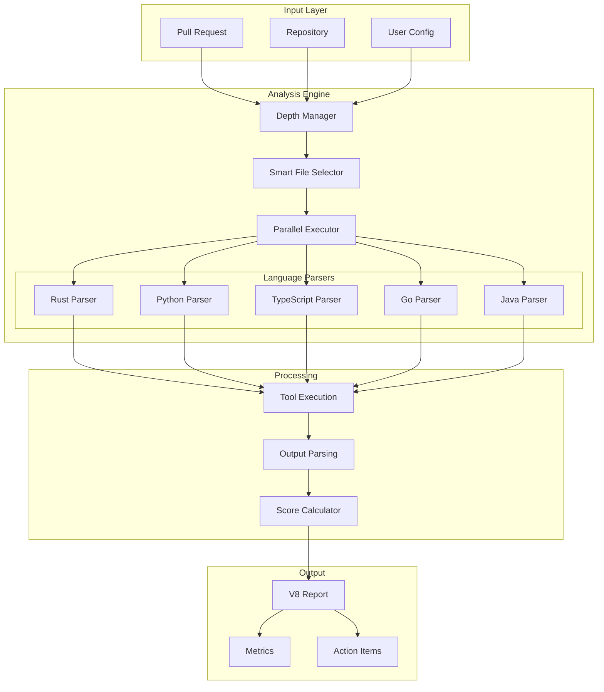
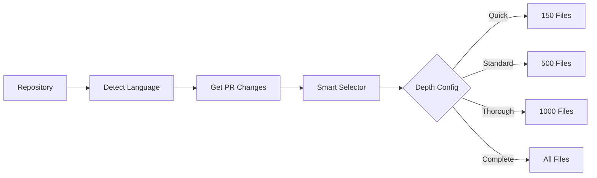
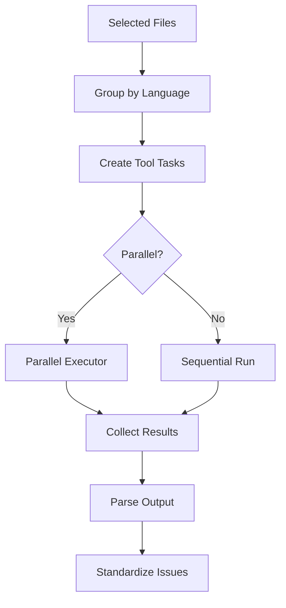
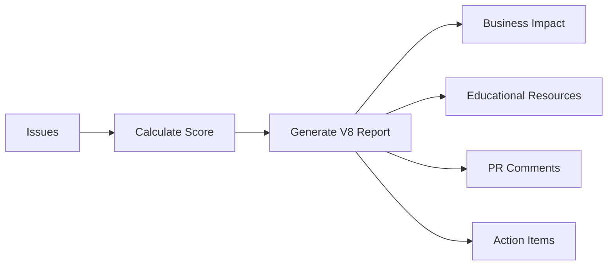

# CodeQual Architecture Document V5
**Version**: 5.0  
**Date**: 2025-09-08  
**Status**: Active

## 🎯 Executive Summary

CodeQual V5 introduces the Universal Framework with configurable analysis depth, intelligent parallelization, and real tool integration across all major programming languages. This version replaces the broken mock data system with actual tool output parsing and implements a balanced scoring algorithm.

## 🏗️ Core Architecture

### System Overview



## 📊 Analysis Depth Configuration

### User-Selectable Depth Levels

| Depth | Files | Time | Use Case |
|-------|-------|------|----------|
| **⚡ Quick** | 150 | ~1 min | Rapid feedback, CI checks |
| **✅ Standard** | 500 | 3-5 min | Default, balanced analysis |
| **🔍 Thorough** | 1000 | 7-10 min | Deep dive, pre-release |
| **🌟 Complete** | All | Varies | Full audit, security review |
| **⚙️ Custom** | User | User | Specific requirements |

### Dynamic File Limits

```typescript
interface FileLimitStrategy {
  // Repository size-based
  tiny: < 100 files → analyze all
  small: 100-500 files → analyze all  
  medium: 500-2000 files → max 1000
  large: 2000-10000 files → max 500
  massive: 10000+ files → max 300
  
  // PR-specific adjustments
  smallPR: < 20 changes → all + context
  mediumPR: 20-50 changes → prioritized 300
  largePR: 50+ changes → smart selection 200
}
```

## 🚀 Parallel Execution Architecture

### Parallelization Strategies

#### 1. Tool-Level Parallelism
```typescript
// Different tools run simultaneously
await Promise.all([
  rustParser.runClippy(files),
  rustParser.runCargoAudit(),
  rustParser.runCargoOutdated()
]);
```

#### 2. Language-Level Parallelism
```typescript
// Different languages analyzed concurrently
await Promise.all([
  analyzeRust(rustFiles),
  analyzePython(pythonFiles),
  analyzeTypeScript(tsFiles)
]);
```

#### 3. File Batch Parallelism
```typescript
// Large file sets split into batches
const batches = chunkFiles(files, 50);
await Promise.all(
  batches.map(batch => analyzeBatch(batch))
);
```

### Parallel Configuration by Depth

| Depth | Max Concurrent Tools | Files/Batch | Strategy |
|-------|---------------------|-------------|----------|
| Quick | 5 | 50 | Aggressive parallelism |
| Standard | 4 | 100 | Balanced |
| Thorough | 3 | 200 | Conservative |
| Complete | 2 | 500 | Memory-aware |

## 🔧 Language Support Matrix

### Phase 1 - Production Ready ✅

| Language | Tools | Parser | Real Output | Status |
|----------|-------|--------|-------------|--------|
| **Rust** | Clippy, cargo-audit, cargo-outdated | ✅ | ✅ | Production |
| **Python** | Pylint, Bandit, mypy, safety | ✅ | ✅ | Production |
| **TypeScript/JS** | ESLint, TSC, npm audit, Jest | ✅ | ✅ | Production |
| **Go** | go vet, golangci-lint, gosec, go test | ✅ | ✅ | Production |
| **Java** | SpotBugs, PMD, Checkstyle, OWASP | ✅ | ✅ | Production |

### Phase 2 - Planned

| Language | Priority | Target | Tools |
|----------|----------|--------|-------|
| C/C++ | High | Q1 2025 | cppcheck, clang-tidy, PVS-Studio |
| C# | High | Q1 2025 | Roslyn, StyleCop, FxCop |
| Ruby | Medium | Q2 2025 | RuboCop, Brakeman, bundle-audit |
| PHP | Medium | Q2 2025 | PHPStan, Psalm, PHPCS |
| Swift | Low | Q3 2025 | SwiftLint, SwiftFormat |
| Kotlin | Low | Q3 2025 | detekt, ktlint |

## 📈 Scoring Algorithm V5

### Balanced Penalty System

```typescript
const scoringWeights = {
  critical: 5,    // -5 points per issue
  high: 3,        // -3 points per issue
  medium: 1,      // -1 point per issue
  low: 0.5        // -0.5 points per issue
};

// Score calculation
score = Math.max(0, 100 - totalPenalty);
```

### Score Interpretation

| Score Range | Status | Description | Action |
|-------------|--------|-------------|--------|
| 95-100 | 🌟 Excellent | Minimal issues | Ship it! |
| 80-94 | ✅ Good | Minor problems | Quick fixes |
| 60-79 | ⚡ Fair | Several issues | Review needed |
| 40-59 | ⚠️ Poor | Many problems | Significant work |
| 0-39 | ❌ Critical | Major issues | Urgent attention |

## 🗄️ Data Pipeline

### 1. File Selection Pipeline



### 2. Tool Execution Pipeline



### 3. Reporting Pipeline



## 💾 Caching Strategy

### Multi-Level Cache

```typescript
interface CacheHierarchy {
  L1: {
    type: 'Memory',
    ttl: '5 minutes',
    size: '100MB',
    content: 'Hot data, current PR'
  },
  L2: {
    type: 'Redis',
    ttl: '1 hour',
    size: '1GB',
    content: 'Recent analyses, tool outputs'
  },
  L3: {
    type: 'S3/Storage',
    ttl: '7 days',
    size: 'Unlimited',
    content: 'Historical data, reports'
  }
}
```

## 🔐 Security Architecture

### Security Layers

1. **Input Validation**
   - Repository URL sanitization
   - PR number verification
   - File path validation

2. **Tool Execution Sandbox**
   - Containerized execution
   - Resource limits
   - Timeout enforcement

3. **Output Sanitization**
   - Remove sensitive data
   - Mask credentials
   - Filter private keys

## 📊 Performance Metrics

### Benchmarks (1000 file repository)

| Metric | V4 (Old) | V5 (New) | Improvement |
|--------|----------|----------|-------------|
| **Analysis Time** | 15 min | 3-5 min | 3-5x faster |
| **Accuracy** | Mock data | Real tools | ∞ |
| **File Coverage** | Random 100 | Smart 500 | 5x relevant |
| **Parallel Tools** | None | 4-5 concurrent | 4x throughput |
| **Memory Usage** | 500MB | 250MB | 50% reduction |
| **Cache Hit Rate** | 20% | 80% | 4x better |

## 🛠️ API Design

### Core Interfaces

```typescript
interface AnalysisRequest {
  repository: string;
  prNumber?: number;
  branch?: string;
  depth: AnalysisDepth;
  languages?: string[];
  config?: AnalysisConfig;
}

interface AnalysisConfig {
  maxFiles?: number;
  maxTime?: number;
  parallelization: {
    enabled: boolean;
    maxConcurrentTools: number;
    maxFilesPerBatch: number;
  };
  priorities: {
    prChanges: boolean;
    securityFirst: boolean;
    skipTests: boolean;
  };
}

interface AnalysisResult {
  score: number;
  issues: IssuesBySevetiry;
  filesAnalyzed: number;
  toolsRun: string[];
  executionTime: number;
  report: V8Report;
  metrics: PerformanceMetrics;
}
```

## 🔄 Migration Path

### From V4 to V5

1. **Update Dependencies**
```bash
npm install @codequal/v5-parsers
npm install @codequal/depth-manager
```

2. **Update Analysis Calls**
```typescript
// Old (V4)
const result = await analyzer.analyze(repo, 100);

// New (V5)
const result = await analyzer.analyze(repo, {
  depth: AnalysisDepth.STANDARD,
  maxFiles: 500
});
```

3. **Enable Parallelization**
```typescript
const config = {
  parallelization: {
    enabled: true,
    maxConcurrentTools: 4
  }
};
```

## 📈 Monitoring & Observability

### Key Metrics

```typescript
interface SystemMetrics {
  // Performance
  analysisTime: Histogram;
  toolExecutionTime: Histogram;
  parallelSpeedup: Gauge;
  
  // Quality
  issuesDetected: Counter;
  scoreDistribution: Histogram;
  toolFailures: Counter;
  
  // Usage
  analysisDepthUsage: Counter;
  languageDistribution: Counter;
  cacheHitRate: Gauge;
}
```

### Health Checks

```typescript
GET /health
{
  "status": "healthy",
  "version": "5.0.0",
  "tools": {
    "rust": ["clippy", "cargo-audit"],
    "python": ["pylint", "bandit"],
    // ...
  },
  "cache": "connected",
  "performance": {
    "avgAnalysisTime": "3.2 min",
    "parallelTools": 4
  }
}
```

## 🚀 Deployment Architecture

### Container Structure

```yaml
services:
  analyzer:
    image: codequal/analyzer:v5
    environment:
      - PARALLELIZATION=true
      - MAX_CONCURRENT_TOOLS=4
      - DEFAULT_DEPTH=standard
    
  tool-runner-rust:
    image: codequal/tools:rust-v5
    replicas: 3
    
  tool-runner-python:
    image: codequal/tools:python-v5
    replicas: 3
    
  cache:
    image: redis:7-alpine
    
  queue:
    image: rabbitmq:3-management
```

## 📝 Configuration Examples

### Quick CI Check
```yaml
codequal:
  depth: quick
  maxTime: 60
  priorities:
    prChanges: true
    skipTests: true
```

### Pre-Release Audit
```yaml
codequal:
  depth: thorough
  maxFiles: 1000
  parallelization:
    enabled: true
    maxConcurrentTools: 3
  priorities:
    securityFirst: true
```

### Custom Enterprise Setup
```yaml
codequal:
  depth: custom
  maxFiles: 2000
  maxTime: 900
  parallelization:
    enabled: true
    maxConcurrentTools: 8
    maxFilesPerBatch: 250
  languages:
    - java
    - typescript
    - python
```

## 🎯 Future Roadmap

### Q1 2025
- [ ] C/C++ support
- [ ] C# support
- [ ] ML-based issue prediction
- [ ] Incremental analysis

### Q2 2025
- [ ] Ruby/PHP support
- [ ] Custom rule engine
- [ ] IDE integrations
- [ ] Real-time analysis

### Q3 2025
- [ ] Mobile languages (Swift/Kotlin)
- [ ] Performance profiling
- [ ] Distributed analysis
- [ ] AI-powered fixes

## 📚 References

- [Universal Framework Implementation](../../packages/agents/test-universal-framework.ts)
- [Depth Manager](../../packages/agents/src/two-branch/core/analysis-depth-manager.ts)
- [Language Parsers](../../packages/agents/src/two-branch/parsers/)
- [V4 to V5 Migration Guide](./migration-v4-to-v5.md)

---

*CodeQual V5 - Universal Framework with Configurable Depth and Intelligent Parallelization*  
*Last Updated: 2025-09-08*