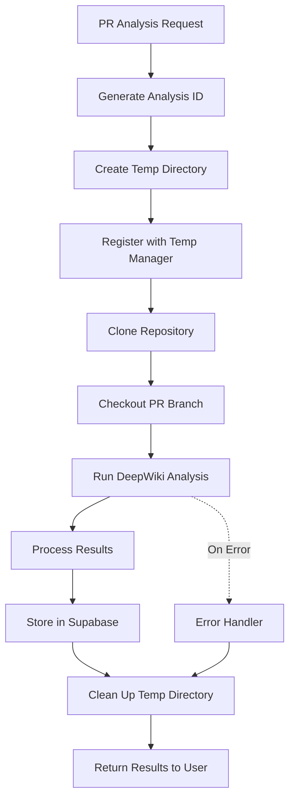

# DeepWiki PR Analysis Flow

## Complete Flow (Fixed)



## Implementation

### 1. API Endpoint
```typescript
// routes/analysis.ts
router.post('/analyze-pr', async (req, res) => {
  const { repositoryUrl, prNumber } = req.body;
  
  try {
    // 1. Run analysis (includes automatic cleanup)
    const result = await deepWikiManager.analyzePullRequest(
      repositoryUrl,
      prNumber
    );
    
    // 2. Store results in Supabase (permanent storage)
    const { data, error } = await supabase
      .from('pr_analyses')
      .insert({
        repository_url: repositoryUrl,
        pr_number: prNumber,
        analysis_id: result.analysis_id,
        analysis_data: result,
        created_at: new Date()
      });
    
    if (error) throw error;
    
    // 3. Return results to user
    res.json({
      success: true,
      analysisId: result.analysis_id,
      results: result
    });
    
  } catch (error) {
    res.status(500).json({ 
      success: false,
      error: error.message 
    });
  }
});
```

### 2. DeepWiki Manager Flow
```typescript
async analyzePullRequest(repoUrl: string, prNumber: number) {
  const startTime = Date.now();
  const analysisId = uuid();
  const tempDir = `/tmp/pr-analysis-${analysisId}`;
  
  try {
    // 1. Setup
    await this.createTempDir(tempDir);
    tempManager.registerAnalysis(analysisId, tempDir, repoUrl, 'pr');
    
    // 2. Clone and checkout PR
    await this.cloneRepo(repoUrl, tempDir);
    await this.checkoutPR(tempDir, prNumber);
    
    // 3. ANALYZE (while repo still exists!)
    const analysisResult = await this.runDeepWikiAnalysis(tempDir);
    
    // 4. Prepare final result
    const finalResult = {
      ...analysisResult,
      metadata: {
        duration: Date.now() - startTime,
        pr_number: prNumber
      }
    };
    
    // 5. ONLY NOW clean up
    await tempManager.cleanupAnalysis(analysisId);
    
    // 6. Return results
    return finalResult;
    
  } catch (error) {
    // Always cleanup on error
    await tempManager.cleanupAnalysis(analysisId);
    throw error;
  }
}
```

### 3. Temp Manager Tracking
```typescript
class TempManager {
  private activeAnalyses = new Map();
  
  registerAnalysis(id, path, url, type) {
    this.activeAnalyses.set(id, {
      path,
      url,
      type,
      startTime: new Date()
    });
    
    // Check if we need more space
    this.checkCapacity();
  }
  
  async cleanupAnalysis(id) {
    const analysis = this.activeAnalyses.get(id);
    if (!analysis) return;
    
    // Remove directory
    await exec(`rm -rf ${analysis.path}`);
    
    // Remove from tracking
    this.activeAnalyses.delete(id);
    
    console.log(`Cleaned up ${analysis.type} analysis ${id}`);
  }
}
```

## Key Points

1. **Analysis First**: We analyze the PR while the repo exists
2. **Results Stored**: Results are saved before cleanup
3. **Then Cleanup**: Only after results are safe, we remove the temp directory
4. **Error Safety**: Cleanup happens even if analysis fails
5. **No Storage**: We never keep the repository after analysis

## Monitoring

```bash
# Check active analyses
curl http://localhost:3001/api/deepwiki/temp/active-analyses

# Response:
{
  "active": 2,
  "analyses": [
    {
      "analysisId": "abc-123",
      "repositoryUrl": "https://github.com/user/repo",
      "type": "pr",
      "duration": 45000,
      "status": "active"
    }
  ]
}
```

## Safety Mechanisms

1. **Timeout Protection**: Long-running analyses (>30min) get flagged
2. **Force Cleanup**: Analyses running >1 hour are force-cleaned
3. **Orphan Cleanup**: Cron job cleans any missed directories
4. **Space Monitoring**: Auto-scales storage based on concurrent analyses

## Cost Impact

- **Temp Storage**: Only during analysis (~5-10 minutes)
- **No Long-term Storage**: Repos deleted immediately
- **Results in Supabase**: Only analysis results stored permanently
- **Cost**: ~$0.01 per analysis (vs $0.50+ with storage)