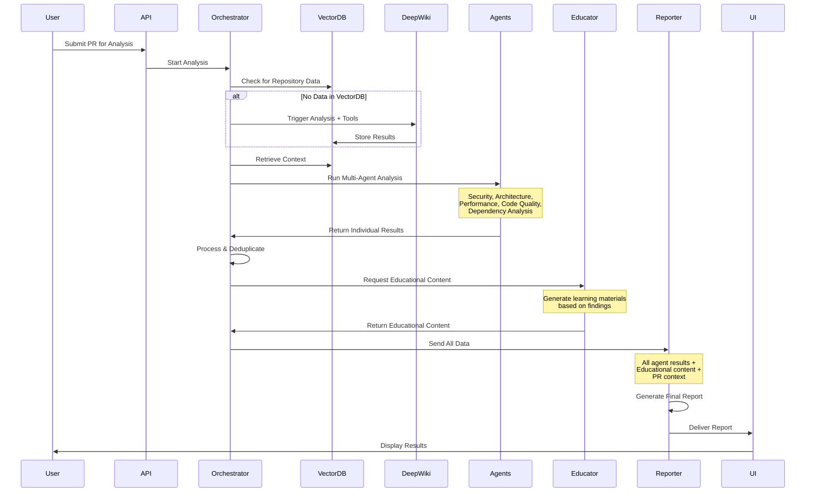

# Complete PR Workflow Implementation Plan

## Current Status & Missing Components

Based on the correct flow, we have the following status:

### ✅ Implemented Components:
1. **Orchestrator** - Result orchestrator that coordinates the flow
2. **Multi-Agent Analysis** - Security, Architecture, Performance, Code Quality, Dependency agents
3. **Vector DB Integration** - Storage and retrieval of DeepWiki + Tool results
4. **Educational Content Service** - Basic implementation exists
5. **DeepWiki + Tools** - Fully deployed and operational

### ❌ Missing Components:
1. **Educator Agent** - Needs to be created as a proper agent
2. **Reporter Agent** - Needs to be created to generate final reports
3. **UI/UX Integration** - API endpoints to deliver reports to frontend

## Correct Flow Implementation



## Implementation Steps

### 1. Create Educator Agent

```typescript
// packages/agents/src/specialized/educator-agent.ts
import { BaseAgent } from '../base/base-agent';
import { EducationalContentService } from './educational-content-service';

export class EducatorAgent extends BaseAgent {
  private contentService: EducationalContentService;
  
  constructor(config: AgentConfig) {
    super({
      ...config,
      role: 'educator',
      capabilities: ['generate_learning_content', 'adapt_to_skill_level']
    });
    
    this.contentService = new EducationalContentService();
  }
  
  async analyze(context: {
    findings: Finding[],
    userProfile: UserProfile,
    repositoryContext: any
  }): Promise<EducationalAgentResult> {
    // 1. Analyze findings to identify learning opportunities
    const learningOpportunities = await this.identifyLearningOpportunities(context.findings);
    
    // 2. Generate educational content for each opportunity
    const educationalContent = await this.contentService.generateContent(
      learningOpportunities,
      context.userProfile.skillLevel
    );
    
    // 3. Create learning paths
    const learningPaths = await this.createLearningPaths(educationalContent);
    
    // 4. Generate interactive examples
    const interactiveExamples = await this.generateInteractiveExamples(context.findings);
    
    return {
      educationalContent,
      learningPaths,
      interactiveExamples,
      recommendedResources: this.getRecommendedResources(context.findings),
      skillLevelRecommendations: this.getSkillLevelRecommendations(context.userProfile)
    };
  }
}
```

### 2. Create Reporter Agent

```typescript
// packages/agents/src/specialized/reporter-agent.ts
import { BaseAgent } from '../base/base-agent';
import { ReportGenerationService } from './report-generation-service';

export class ReporterAgent extends BaseAgent {
  private reportService: ReportGenerationService;
  
  constructor(config: AgentConfig) {
    super({
      ...config,
      role: 'reporter',
      capabilities: ['generate_reports', 'format_pr_comments', 'create_visualizations']
    });
    
    this.reportService = new ReportGenerationService();
  }
  
  async generateReport(context: {
    agentResults: Map<string, AgentResult>,
    educationalContent: EducationalContent[],
    prContext: PRContext,
    analysisMetadata: AnalysisMetadata
  }): Promise<FinalReport> {
    // 1. Aggregate all findings from specialized agents
    const aggregatedFindings = this.aggregateFindings(context.agentResults);
    
    // 2. Create executive summary
    const executiveSummary = await this.createExecutiveSummary(aggregatedFindings);
    
    // 3. Generate detailed sections for each analysis category
    const detailedSections = await this.generateDetailedSections(context.agentResults);
    
    // 4. Integrate educational content
    const enhancedSections = await this.integrateEducationalContent(
      detailedSections,
      context.educationalContent
    );
    
    // 5. Create visualizations (charts, graphs)
    const visualizations = await this.createVisualizations(aggregatedFindings);
    
    // 6. Generate PR comment
    const prComment = await this.generatePRComment(executiveSummary, aggregatedFindings);
    
    // 7. Create different report formats
    const reportFormats = {
      full: await this.createFullReport(enhancedSections, visualizations),
      summary: executiveSummary,
      prComment: prComment,
      dashboard: await this.createDashboardData(aggregatedFindings)
    };
    
    return {
      id: context.analysisMetadata.analysisId,
      timestamp: new Date(),
      repository: context.prContext.repositoryUrl,
      formats: reportFormats,
      metadata: {
        totalFindings: aggregatedFindings.length,
        criticalFindings: aggregatedFindings.filter(f => f.severity === 'critical').length,
        educationalItems: context.educationalContent.length,
        analysisTime: context.analysisMetadata.processingTime
      }
    };
  }
}
```

### 3. Update Orchestrator Integration

```typescript
// apps/api/src/services/result-orchestrator.ts
// Add to existing ResultOrchestrator class

private async runEducatorAgent(
  processedResults: ProcessedResults,
  userProfile: UserProfile
): Promise<EducationalAgentResult> {
  const educatorAgent = await this.agentFactory.createAgent('educator', {
    modelConfig: await this.selectEducatorModel(),
    context: {
      findings: processedResults.findings,
      userProfile,
      repositoryContext: this.repositoryContext
    }
  });
  
  return await educatorAgent.analyze();
}

private async runReporterAgent(
  agentResults: Map<string, AgentResult>,
  educationalContent: EducationalAgentResult,
  prContext: PRContext
): Promise<FinalReport> {
  const reporterAgent = await this.agentFactory.createAgent('reporter', {
    modelConfig: await this.selectReporterModel(),
    context: {
      agentResults,
      educationalContent: educationalContent.content,
      prContext,
      analysisMetadata: this.analysisMetadata
    }
  });
  
  return await reporterAgent.generateReport();
}

// Update the main analyzePR method
async analyzePR(request: PRAnalysisRequest): Promise<AnalysisResult> {
  // ... existing steps 1-6 ...
  
  // Step 7: Process and deduplicate results
  processingSteps.push('Processing agent results');
  const processedResults = await this.processResults(agentResults);
  
  // Step 8: Run Educator Agent
  processingSteps.push('Generating educational content');
  const educationalResults = await this.runEducatorAgent(
    processedResults,
    await this.getUserProfile(request.authenticatedUser)
  );
  
  // Step 9: Run Reporter Agent
  processingSteps.push('Generating final report');
  const finalReport = await this.runReporterAgent(
    agentResults,
    educationalResults,
    prContext
  );
  
  // Step 10: Store final report
  await this.storeFinalReport(finalReport);
  
  // Return result with UI-ready format
  return {
    ...existingResult,
    report: finalReport,
    uiEndpoint: `/api/reports/${finalReport.id}`
  };
}
```

### 4. Create UI Integration Endpoints

```typescript
// apps/api/src/routes/reports.ts
import { Router } from 'express';

export const reportRoutes = Router();

// Get full report
reportRoutes.get('/reports/:id', async (req, res) => {
  const reportId = req.params.id;
  const format = req.query.format || 'full'; // full, summary, dashboard
  
  const report = await reportService.getReport(reportId, format);
  
  if (!report) {
    return res.status(404).json({ error: 'Report not found' });
  }
  
  res.json(report);
});

// Get PR comment
reportRoutes.get('/reports/:id/pr-comment', async (req, res) => {
  const report = await reportService.getReport(req.params.id, 'prComment');
  res.json({ comment: report.formats.prComment });
});

// Get dashboard data
reportRoutes.get('/reports/:id/dashboard', async (req, res) => {
  const report = await reportService.getReport(req.params.id, 'dashboard');
  res.json(report.formats.dashboard);
});

// Stream real-time updates during analysis
reportRoutes.get('/analysis/:id/stream', (req, res) => {
  res.writeHead(200, {
    'Content-Type': 'text/event-stream',
    'Cache-Control': 'no-cache',
    'Connection': 'keep-alive'
  });
  
  const analysisId = req.params.id;
  
  // Send updates as analysis progresses
  const interval = setInterval(async () => {
    const status = await getAnalysisStatus(analysisId);
    res.write(`data: ${JSON.stringify(status)}\n\n`);
    
    if (status.complete) {
      clearInterval(interval);
      res.end();
    }
  }, 1000);
});
```

### 5. Testing the Complete Flow

```bash
# Test script for complete flow
curl -X POST http://localhost:3000/api/analyze-pr \
  -H "Content-Type: application/json" \
  -H "Authorization: Bearer $TOKEN" \
  -d '{
    "repositoryUrl": "https://github.com/test/repo",
    "prNumber": 123,
    "analysisMode": "comprehensive"
  }'

# Monitor progress
ANALYSIS_ID="..."
watch -n 2 "curl -s http://localhost:3000/api/analysis/$ANALYSIS_ID/progress | jq"

# Get final report
curl http://localhost:3000/api/reports/$ANALYSIS_ID?format=full

# Get PR comment
curl http://localhost:3000/api/reports/$ANALYSIS_ID/pr-comment

# Get dashboard data
curl http://localhost:3000/api/reports/$ANALYSIS_ID/dashboard
```

## Scheduling After First Report

Once the first report is generated successfully:

1. **Analyze Report Metrics**:
   - Number of critical findings
   - Repository activity level
   - Code complexity metrics

2. **Determine Schedule**:
   ```typescript
   const schedule = await schedulingService.determineOptimalSchedule({
     repositoryMetrics: report.metadata,
     riskProfile: report.riskProfile,
     userPreferences: user.schedulingPreferences
   });
   ```

3. **Register Schedule**:
   ```typescript
   await schedulingService.registerSchedule(repositoryUrl, {
     frequency: schedule.frequency,
     tools: schedule.enabledTools,
     notificationSettings: {
       onCriticalFindings: true,
       weeklyDigest: true
     }
   });
   ```

## Next Implementation Steps

1. **Create Educator Agent** (2-3 days)
   - Implement agent class
   - Integrate with educational content service
   - Add skill level adaptation

2. **Create Reporter Agent** (2-3 days)
   - Implement report generation
   - Create multiple format outputs
   - Add visualization generation

3. **Update Orchestrator** (1 day)
   - Integrate new agents
   - Update workflow sequence
   - Add error handling

4. **Create UI Endpoints** (1 day)
   - Report retrieval APIs
   - Real-time streaming
   - Format conversion

5. **Test Complete Flow** (1 day)
   - End-to-end testing
   - Performance validation
   - Error scenario testing

Total estimated time: 7-9 days for complete implementation
