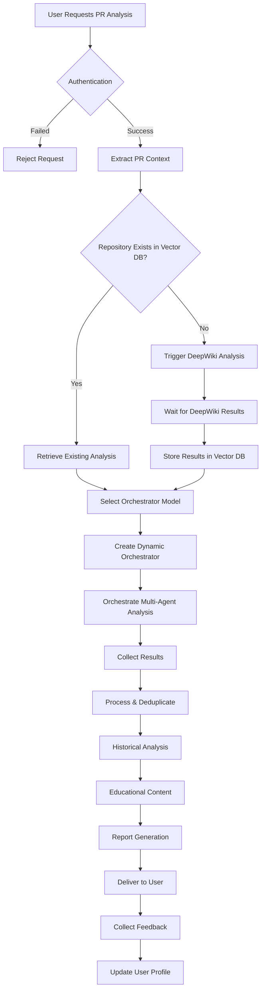

# Result Orchestrator - Complete Gap Analysis

**Date**: June 1, 2025  
**Status**: Gap Analysis Phase  
**Purpose**: Identify all missing components in the complete PR analysis flow

---

## 🔄 Complete Functional Flow

### **1. PR Analysis Request Flow**



---

## ✅ What We Have (Existing Components)

### **1. Infrastructure & Storage**
- ✅ **Vector Database**: Fully integrated with pgvector
- ✅ **Authentication Schema**: Database tables and security model
- ✅ **User Profiles**: Skill tracking and repository access
- ✅ **Security Monitoring**: Grafana dashboard and event tracking
- ✅ **RAG Framework**: Educational content retrieval

### **2. Analysis Components**
- ✅ **Multi-Agent Executor**: Can run agents in parallel
- ✅ **DeepWiki Integration**: Can analyze repositories
- ✅ **Model Configuration System**: Dynamic model selection
- ✅ **Vector Storage Services**: Store/retrieve analysis results

### **3. Configuration & Selection**
- ✅ **ModelVersionSync**: Registry of all available models
- ✅ **ModelConfigurationFactory**: Creates model configs
- ✅ **Repository Model Configs**: Optimal models by language/size

---

## 🔲 What's Missing (Gap Analysis)

### **1. API Layer** 🔴 CRITICAL
**Missing Components:**
- ❌ **PR Analysis Endpoint**: `/api/analyze-pr`
- ❌ **Repository Status Endpoint**: `/api/repository/status`
- ❌ **Feedback Collection Endpoint**: `/api/feedback`
- ❌ **Progress Tracking Endpoint**: `/api/analysis/progress`

**What Needs to Be Built:**
```typescript
// Example API structure needed
interface PRAnalysisAPI {
  // Main analysis endpoint
  POST /api/analyze-pr
  Request: {
    repositoryUrl: string;
    prNumber: number;
    analysisMode: 'quick' | 'comprehensive' | 'deep';
    githubToken?: string;
  }
  Response: {
    analysisId: string;
    status: 'queued' | 'processing' | 'complete';
    estimatedTime: number;
  }
  
  // Progress tracking
  GET /api/analysis/:analysisId/progress
  Response: {
    status: string;
    progress: number;
    currentStep: string;
    results?: AnalysisResults;
  }
}
```

### **2. Authentication Integration** 🔴 CRITICAL BLOCKER
**Missing Components:**
- ❌ **Supabase Auth Middleware**: Validate requests
- ❌ **Token Validation**: Verify JWT tokens
- ❌ **Repository Access Check**: Ensure user can access repo
- ❌ **Session Management**: Handle auth throughout flow

**What Needs to Be Built:**
```typescript
// Authentication middleware
interface AuthMiddleware {
  validateRequest(req: Request): Promise<AuthenticatedUser>;
  checkRepositoryAccess(user: AuthenticatedUser, repoUrl: string): Promise<boolean>;
  refreshSession(user: AuthenticatedUser): Promise<Session>;
}
```

### **3. Result Orchestrator** 🔴 CRITICAL
**Missing Components:**
- ❌ **Main Orchestrator Class**: Core orchestration logic
- ❌ **PR Context Extractor**: Get PR details from GitHub/GitLab
- ❌ **Workflow State Manager**: Track analysis progress
- ❌ **Agent Coordinator**: Manage agent execution flow

**What Needs to Be Built:**
```typescript
class ResultOrchestrator {
  // Core orchestration methods
  async analyzePR(request: PRAnalysisRequest): Promise<AnalysisResult>;
  async checkRepositoryStatus(repoUrl: string): Promise<RepositoryStatus>;
  async triggerDeepWikiAnalysis(repoUrl: string): Promise<void>;
  async coordinateAgents(context: AnalysisContext): Promise<AgentResults>;
  async processResults(results: AgentResults): Promise<ProcessedResults>;
}
```

### **4. PR Context Services** 🟡 HIGH
**Missing Components:**
- ❌ **GitHub PR Service**: Fetch PR details via API
- ❌ **GitLab MR Service**: Fetch MR details via API
- ❌ **Diff Parser**: Parse and analyze code changes
- ❌ **File Change Analyzer**: Categorize changes

**What Needs to Be Built:**
```typescript
interface PRContextService {
  fetchPRDetails(repoUrl: string, prNumber: number): Promise<PRDetails>;
  getDiff(pr: PRDetails): Promise<DiffData>;
  analyzeChanges(diff: DiffData): Promise<ChangeAnalysis>;
  getAffectedFiles(pr: PRDetails): Promise<FileList>;
}
```

### **5. DeepWiki Trigger Service** 🟡 HIGH
**Missing Components:**
- ❌ **DeepWiki Job Manager**: Queue and track analyses
- ❌ **Webhook Handler**: Receive completion notifications
- ❌ **Result Parser**: Parse DeepWiki output
- ❌ **Vector DB Storage**: Store parsed results

**What Needs to Be Built:**
```typescript
interface DeepWikiService {
  triggerAnalysis(repoUrl: string): Promise<JobId>;
  checkJobStatus(jobId: JobId): Promise<JobStatus>;
  parseResults(rawResults: string): Promise<ParsedAnalysis>;
  storeInVectorDB(analysis: ParsedAnalysis): Promise<void>;
}
```

### **6. Result Processing Engine** 🟡 HIGH
**Missing Components:**
- ❌ **Deduplication Service**: Remove duplicate findings
- ❌ **Conflict Resolver**: Handle contradictions
- ❌ **Severity Calculator**: Compute impact scores
- ❌ **Priority Ranker**: Order findings by importance

**What Needs to Be Built:**
```typescript
interface ResultProcessor {
  deduplicate(findings: Finding[]): Promise<Finding[]>;
  resolveConflicts(findings: Finding[]): Promise<Finding[]>;
  calculateSeverity(finding: Finding): Promise<Severity>;
  rankByPriority(findings: Finding[]): Promise<Finding[]>;
}
```

### **7. Historical Analysis Service** 🟡 HIGH
**Missing Components:**
- ❌ **PR History Retriever**: Get past PR analyses
- ❌ **Trend Calculator**: Compute improvement metrics
- ❌ **Pattern Detector**: Find recurring issues
- ❌ **Progress Tracker**: Monitor tech debt reduction

**What Needs to Be Built:**
```typescript
interface HistoricalAnalysisService {
  getPRHistory(userId: string, repoId: string): Promise<PRHistory>;
  calculateTrends(history: PRHistory): Promise<TrendMetrics>;
  detectPatterns(history: PRHistory): Promise<Pattern[]>;
  trackTechDebt(history: PRHistory): Promise<TechDebtMetrics>;
}
```

### **8. Educational Content Service** 🟡 HIGH
**Missing Components:**
- ❌ **Content Matcher**: Match findings to educational content
- ❌ **Skill Level Adapter**: Adjust content to user level
- ❌ **Content Retriever**: Get from RAG framework
- ❌ **Content Formatter**: Format for inclusion in report

**What Needs to Be Built:**
```typescript
interface EducationalService {
  matchContent(finding: Finding, userSkill: SkillLevel): Promise<EducationalContent>;
  retrieveContent(contentIds: string[]): Promise<Content[]>;
  adaptToSkillLevel(content: Content, level: SkillLevel): Promise<Content>;
  formatForReport(content: Content[]): Promise<FormattedContent>;
}
```

### **9. Report Agent** 🟡 HIGH
**Missing Components:**
- ❌ **Report Templates**: Different formats for different contexts
- ❌ **PR Comment Generator**: GitHub/GitLab formatted comments
- ❌ **Detailed Report Generator**: Full analysis document
- ❌ **Metrics Formatter**: Grafana-ready metrics

**What Needs to Be Built:**
```typescript
interface ReportAgent {
  generatePRComment(results: ProcessedResults): Promise<string>;
  generateDetailedReport(results: ProcessedResults): Promise<Report>;
  generateMetrics(results: ProcessedResults): Promise<Metrics>;
  selectTemplate(context: ReportContext): Promise<Template>;
}
```

### **10. Feedback System** 🟢 MEDIUM
**Missing Components:**
- ❌ **Feedback Collection API**: Receive user feedback
- ❌ **Feedback Storage Schema**: Database tables
- ❌ **Feedback Analyzer**: Process feedback
- ❌ **Model Improvement Loop**: Use feedback to improve

**What Needs to Be Built:**
```typescript
interface FeedbackSystem {
  collectFeedback(analysisId: string, feedback: UserFeedback): Promise<void>;
  analyzeFeedback(feedback: UserFeedback[]): Promise<FeedbackInsights>;
  updateUserProfile(userId: string, feedback: UserFeedback): Promise<void>;
  improveModels(insights: FeedbackInsights): Promise<void>;
}
```

### **11. Queue & Job Management** 🟢 MEDIUM
**Missing Components:**
- ❌ **Job Queue**: Manage analysis requests
- ❌ **Priority Queue**: Handle different analysis tiers
- ❌ **Resource Manager**: Prevent overload
- ❌ **Retry Logic**: Handle failures

**What Needs to Be Built:**
```typescript
interface JobManager {
  queueAnalysis(request: AnalysisRequest): Promise<JobId>;
  getJobStatus(jobId: JobId): Promise<JobStatus>;
  prioritizeJob(jobId: JobId, priority: Priority): Promise<void>;
  retryFailedJob(jobId: JobId): Promise<void>;
}
```

### **12. Monitoring & Observability** 🟢 MEDIUM
**Missing Components:**
- ❌ **Performance Metrics**: Track analysis times
- ❌ **Error Tracking**: Monitor failures
- ❌ **Cost Tracking**: Monitor API usage
- ❌ **Quality Metrics**: Track analysis accuracy

---

## 🎯 Implementation Priority Matrix

| Component | Business Impact | Technical Dependency | Complexity | Priority |
|-----------|----------------|---------------------|------------|----------|
| Authentication Integration | 🔴 Blocker | Everything depends on it | Low | **P0 - IMMEDIATE** |
| API Layer | 🔴 Critical | Entry point for system | Medium | **P1 - CRITICAL** |
| Result Orchestrator | 🔴 Critical | Core functionality | High | **P1 - CRITICAL** |
| PR Context Services | 🟡 High | Required for analysis | Medium | **P2 - HIGH** |
| DeepWiki Trigger | 🟡 High | Required for new repos | Medium | **P2 - HIGH** |
| Result Processing | 🟡 High | Quality of output | Medium | **P2 - HIGH** |
| Report Agent | 🟡 High | User-facing output | Low | **P2 - HIGH** |
| Historical Analysis | 🟡 High | Value-add feature | Medium | **P3 - MEDIUM** |
| Educational Service | 🟡 High | Value-add feature | Low | **P3 - MEDIUM** |
| Feedback System | 🟢 Medium | Improvement loop | Low | **P4 - LOW** |
| Job Management | 🟢 Medium | Scalability | Medium | **P4 - LOW** |
| Monitoring | 🟢 Medium | Operations | Low | **P4 - LOW** |

---

## 📋 Recommended Implementation Plan

### **Phase 1: Foundation (Week 1)**
1. **Day 1-2**: Authentication Integration
   - Implement Supabase auth middleware
   - Add repository access checks
   - Update all services to use AuthenticatedUser

2. **Day 3-4**: Basic API Layer
   - Create Express/Fastify API structure
   - Implement `/api/analyze-pr` endpoint
   - Add basic request validation

3. **Day 5**: PR Context Services
   - Implement GitHub PR fetcher
   - Add basic diff parser
   - Create change analyzer

### **Phase 2: Core Orchestration (Week 2)**
1. **Day 1-2**: Result Orchestrator
   - Create main orchestrator class
   - Implement workflow state management
   - Add DeepWiki trigger logic

2. **Day 3-4**: DeepWiki Integration
   - Create job manager
   - Implement result parser
   - Add Vector DB storage

3. **Day 5**: Result Processing
   - Implement deduplication
   - Add conflict resolution
   - Create severity calculator

### **Phase 3: Output & Feedback (Week 3)**
1. **Day 1-2**: Report Agent
   - Create report templates
   - Implement PR comment generator
   - Add metrics formatter

2. **Day 3-4**: Historical Analysis
   - Implement PR history retrieval
   - Add trend calculation
   - Create progress tracker

3. **Day 5**: Educational Integration
   - Connect to RAG framework
   - Implement content matching
   - Add skill level adaptation

### **Phase 4: Polish & Scale (Week 4)**
1. **Day 1-2**: Feedback System
   - Create feedback API
   - Implement storage
   - Add analysis loop

2. **Day 3-4**: Job Management
   - Implement queue system
   - Add retry logic
   - Create resource manager

3. **Day 5**: Monitoring
   - Add performance metrics
   - Implement error tracking
   - Create dashboards

---

## 🚨 Critical Path

**The absolute minimum for a working system:**
1. Authentication Integration (P0)
2. Basic API endpoint (P1)
3. Result Orchestrator (P1)
4. PR Context Service (P2)
5. Basic Report Agent (P2)

Everything else can be added incrementally!

---

## 💡 Key Insights

1. **Authentication is the #1 blocker** - Nothing works without it
2. **API layer is missing entirely** - No entry point exists
3. **Many services can use existing infrastructure** - Vector DB, RAG, etc.
4. **Phased approach is viable** - Can deliver value incrementally
5. **Model configuration is already solved** - Can focus on orchestration

---

## 🎯 Next Decision Point

Based on this analysis, should we:
1. Start with Authentication Integration (recommended)
2. Design the API layer first
3. Build Result Orchestrator in parallel
4. Take a different approach?