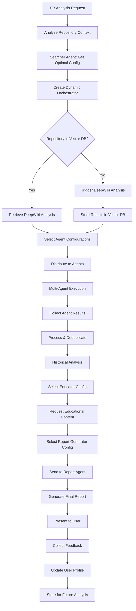

# Result Orchestrator - Requirements Analysis

**Date**: June 1, 2025  
**Status**: Planning Phase  
**Priority**: CRITICAL - Next Implementation Target

---

## 🎯 Result Orchestrator Responsibilities

### 1. **Repository Context Management**
- **Check Repository Status**: Query Vector DB for existing analysis
- **Retrieve Existing Analysis**: Pull DeepWiki results from Vector DB
- **Trigger New Analysis**: Initiate DeepWiki analysis for new repositories
- **Store in Vector DB**: Save DeepWiki results for future use (not cache)
- **Distribute Context**: Send repository context to specialized agents

### 2. **Multi-Agent Coordination**
- **Agent Selection**: Choose which agents to activate based on PR context
- **Work Distribution**: Send relevant portions of DeepWiki report to each agent
- **Parallel Execution**: Manage concurrent agent execution
- **Result Collection**: Gather outputs from all agents
- **Timeout Management**: Handle slow or failed agents gracefully

### 3. **Result Processing & Deduplication**
- **Merge Similar Findings**: Combine duplicate issues from different agents
- **Resolve Conflicts**: Handle contradictory findings between agents
- **Priority Ranking**: Order findings by severity and impact
- **Context Enrichment**: Add repository-specific context to findings
- **Cross-Reference**: Link related findings across different categories

### 4. **Educational Content Integration**
- **Identify Knowledge Gaps**: Determine what educational content is needed
- **Request Educational Material**: Send specific requests to Educator Agent
- **Match Content to User Level**: Consider user's skill level from profile
- **Integrate Learning**: Embed educational content within findings

### 5. **Historical Analysis & Progress Tracking**
- **PR History Retrieval**: Get user's/company's past PR reviews
- **Trend Analysis**: Identify improvement patterns over time
- **Tech Debt Tracking**: 
  - Monitor tech debt accumulation/resolution over time
  - Track refactoring efforts and their impact
  - Measure code quality improvements
  - Identify technical debt hotspots
- **Metrics Calculation**: 
  - Issues per PR trend
  - Category-specific improvements
  - Time to resolution trends
  - Recurring issue patterns
  - Tech debt burn-down rate
  - Code quality score progression
- **Progress Visualization**: Prepare data for trend charts

### 6. **Report Generation & Formatting**
- **Compile Final Report**: Send all data to Report Agent
- **Format Selection**: Choose appropriate format (PR comment, detailed, summary)
- **Grafana Integration**: Prepare metrics for dashboard visualization
- **Export Options**: Support multiple output formats (Markdown, JSON, PDF)

### 7. **User Interaction & Feedback Loop**
- **Present Results**: Deliver formatted report to user
- **Monitor Feedback**: Track user interactions with report
- **Store Feedback**: Save user responses and actions
- **Update User Profile**: Adjust skill assessments based on interactions
- **Learn from Feedback**: Improve future analyses based on feedback

### 8. **Performance & Quality Metrics**
- **Analysis Time Tracking**: Monitor end-to-end processing time
- **Agent Performance**: Track individual agent response times
- **Quality Metrics**: Measure accuracy based on user feedback
- **Cost Tracking**: Monitor API usage and costs per analysis

---

## 🔧 Configuration Selection Architecture

### **Searcher/Researcher Agent Pattern**

**One-Time Manual Task**: Research ONLY the best Researcher/Searcher agent model  
**Everything Else**: The Researcher agent handles ALL configuration discovery automatically

1. **Bootstrap Phase (One-Time Manual)**
   - Manually research and select ONLY the best Researcher/Searcher agent
   - This is the ONLY manual selection ever needed
   - Example: "After research, we determine Claude-3-Opus is best for research tasks"
   - Store this ONE configuration

2. **Researcher Agent Takes Over (Automated)**
   - Using a predefined prompt, the Researcher agent immediately:
     ```typescript
     // Example predefined research prompt
     const RESEARCH_PROMPT = `
       You are a model evaluation researcher. Analyze and recommend optimal AI models for:
       
       1. Orchestrator models for different repository contexts:
          - Python projects (Django, Flask, FastAPI)
          - JavaScript/TypeScript (React, Node.js, Angular)
          - Java (Spring, Maven)
          - etc.
       
       2. Specialized agents by analysis type:
          - Architecture analysis
          - Security scanning
          - Performance optimization
          - etc.
       
       3. Educator models by user skill level
       4. Report generators by output format
       
       For each, evaluate: performance, cost, specialization, speed.
       Output as structured JSON configuration.
     `;
     ```
   - Researches and creates the ENTIRE initial configuration set
   - Stores all configurations in the database
   - No human intervention needed after bootstrap

3. **Runtime Configuration Loading**
   ```typescript
   // The challenge: How to dynamically instantiate orchestrator?
   
   // Option 1: Factory Pattern
   class OrchestratorFactory {
     static async createForRepository(repoContext: RepositoryContext) {
       // Query configuration database (populated by Researcher)
       const config = await db.query(`
         SELECT model, version, parameters, fallback_model 
         FROM model_configurations 
         WHERE component_type = 'orchestrator'
           AND context_key = $1 
         ORDER BY priority DESC 
         LIMIT 1
       `, [repoContext.getContextKey()]);
       
       // Dynamically create orchestrator with retrieved config
       return new DynamicOrchestrator({
         primaryModel: config.model,
         primaryVersion: config.version,
         fallbackModel: config.fallback_model,
         parameters: config.parameters
       });
     }
   }
   
   // Option 2: Dynamic Model Loading
   class DynamicOrchestrator {
     private model: AIModel;
     
     async initialize(repoContext: RepositoryContext) {
       const config = await ConfigService.getOptimalConfig(
         'orchestrator', 
         repoContext
       );
       this.model = await ModelLoader.load({
         provider: config.provider,
         model: config.model,
         version: config.version
       });
     }
     
     async orchestrate(request: AnalysisRequest) {
       if (!this.model) throw new Error('Orchestrator not initialized');
       // Use the dynamically loaded model
       return await this.model.process(request);
     }
   }
   ```

4. **Future Automation**
   - Researcher periodically researches and updates ALL configurations
   - Eventually researches and finds better Researcher models too
   - Updates its own configuration for next iteration

---

## ✅ What We Have

### **1. Multi-Agent Executor** (EnhancedMultiAgentExecutor)
- ✅ Parallel agent execution capability
- ✅ Timeout and retry management
- ✅ Resource optimization
- ✅ Model efficiency tracking
- ✅ Educational agent integration

### **2. Vector Database Integration**
- ✅ Repository analysis storage
- ✅ Context retrieval capabilities
- ✅ Similarity search for related issues
- ✅ Cross-repository pattern matching
- ✅ DeepWiki results storage (not caching)

### **3. DeepWiki Integration**
- ✅ Repository analysis capability
- ✅ Structured output parsing
- ✅ Different analysis tiers (quick, comprehensive, deep)
- ✅ Kubernetes pod access

### **4. User Profile System**
- ✅ User skill tracking schema
- ✅ Repository access control
- ✅ Authentication infrastructure (schema ready)

### **5. RAG Framework**
- ✅ Educational content retrieval
- ✅ Context-aware search
- ✅ Knowledge base integration

### **6. Security Monitoring**
- ✅ Event tracking infrastructure
- ✅ User activity monitoring
- ✅ Grafana dashboard for metrics

---

## 🔲 What's Missing

### **1. Orchestration Logic**
- ❌ Main orchestrator class/service
- ❌ Repository existence checking logic in Vector DB
- ❌ Decision tree for agent selection
- ❌ Workflow state management
- ❌ **Configuration selection logic for orchestrator model/version**

### **2. DeepWiki Integration Layer**
- ❌ Automatic DeepWiki trigger for new repos
- ❌ Vector DB storage for DeepWiki results
- ❌ Result parsing and distribution logic
- ❌ Integration with orchestrator workflow

### **3. Searcher/Researcher Agent**
- ❌ Manual research phase implementation (one-time for Researcher only)
- ❌ Configuration storage schema
- ❌ Model evaluation criteria
- ❌ Automated research scheduling
- ❌ Config selection algorithm
- ❌ Dynamic model loading mechanism

### **Configuration Database Schema**
```sql
-- Store model configurations discovered by Researcher
CREATE TABLE model_configurations (
  id UUID PRIMARY KEY DEFAULT gen_random_uuid(),
  component_type TEXT NOT NULL, -- 'orchestrator', 'agent', 'educator', 'reporter'
  context_key TEXT NOT NULL, -- e.g., 'python-django-large', 'typescript-react-medium'
  provider TEXT NOT NULL, -- 'openai', 'anthropic', 'deepseek', etc.
  model TEXT NOT NULL, -- 'gpt-4', 'claude-3-opus', etc.
  version TEXT NOT NULL,
  parameters JSONB NOT NULL, -- temperature, max_tokens, etc.
  fallback_config_id UUID REFERENCES model_configurations(id),
  priority INTEGER DEFAULT 0,
  cost_per_1k_tokens DECIMAL,
  average_response_time_ms INTEGER,
  quality_score DECIMAL, -- 0-1 based on benchmarks
  last_updated TIMESTAMP DEFAULT NOW(),
  created_by TEXT NOT NULL, -- 'manual' or 'researcher-v1.2'
  metadata JSONB -- additional context, benchmarks, notes
);

-- Index for fast lookup
CREATE INDEX idx_model_config_lookup 
ON model_configurations(component_type, context_key, priority DESC);
```

### **4. Result Processing Engine**
- ❌ Deduplication algorithms
- ❌ Conflict resolution logic
- ❌ Finding merger and prioritization
- ❌ Severity calculation framework

### **5. Historical Analysis Service**
- ❌ PR history retrieval queries
- ❌ Trend calculation algorithms
- ❌ Progress metric definitions
- ❌ Comparative analysis logic

### **6. Report Agent** (Separate component)
- ❌ Report formatting templates
- ❌ PR comment generation
- ❌ Grafana metric preparation
- ❌ Multi-format export capability
- ❌ **Dynamic model selection based on output requirements**

### **7. Feedback System**
- ❌ Feedback collection API
- ❌ Feedback storage schema
- ❌ User interaction tracking
- ❌ Feedback analysis logic

### **8. Integration Points**
- ❌ API endpoint for PR analysis requests
- ❌ GitHub/GitLab webhook handlers
- ❌ Real-time status updates
- ❌ Progress notification system

---

## 🏗️ Implementation Priorities

### **Phase 1: Bootstrap & Core Orchestration** (Week 1)
1. **Manual Research**: Find best Researcher/Searcher agent model
2. **Run Researcher**: Execute with predefined prompt to populate ALL configurations
3. Create ResultOrchestrator class with dynamic model loading
4. Implement repository checking logic against Vector DB
5. Build DeepWiki integration layer with Vector DB storage
6. Create basic workflow engine

### **Phase 2: Result Processing** (Week 1)
1. Implement deduplication algorithms
2. Build conflict resolution system
3. Create finding prioritization logic
4. Develop result compilation

### **Phase 3: Historical & Progress** (Week 2)
1. Build PR history service
2. Implement trend analysis
3. Create progress metrics
4. Develop comparison logic

### **Phase 4: Integration & Feedback** (Week 2)
1. Create feedback collection system
2. Build Report Agent integration
3. Implement Grafana metrics
4. Add user interaction tracking

---

## 🔄 Enhanced Workflow Diagram



---

## 💡 Additional Considerations

### **Configuration Selection Strategy**
- **Initial Phase**: Manual research using Claude Research or similar to find best orchestrator models
- **Future Phase**: Searcher/Researcher agent will automatically discover and update optimal configurations
- **Dynamic Creation**: Orchestrator instantiated with appropriate model/version based on:
  - Repository context (language, framework, size)
  - Analysis requirements (quick vs comprehensive)
  - Available models and their specializations
  - Cost/performance trade-offs

### **Model Selection Flow**
1. **Repository Analysis** → Determine repo characteristics
2. **Config Lookup** → Searcher agent provides optimal config
3. **Orchestrator Creation** → Instantiate with selected model/version
4. **Agent Config Distribution** → Pass appropriate configs to each agent
5. **Report Generator Config** → Select formatting model based on output requirements

### **Error Handling**
- What if DeepWiki is unavailable?
- How to handle partial agent failures?
- Graceful degradation strategies
- Fallback configurations for models

### **Scalability**
- Queue management for multiple PRs
- Resource allocation for concurrent analyses
- Database connection pooling
- Model instance management

### **Security**
- Ensure proper user authentication throughout
- Repository access validation at each step
- Audit trail for all operations
- Secure configuration storage

---

## 🎯 Success Metrics

1. **Performance**
   - End-to-end analysis < 3 minutes (quick mode)
   - Agent coordination overhead < 10%
   - 99% successful orchestrations

2. **Quality**
   - < 5% duplicate findings after deduplication
   - > 90% relevant educational content
   - Positive trend in user metrics
   - Optimal model selection accuracy > 85%

3. **User Experience**
   - Clear progress indicators
   - Meaningful error messages
   - Actionable feedback collection
   - Consistent report quality

---

## 📝 Next Steps

1. **Configuration Research Phase**
   - Research optimal models for common scenarios
   - Create initial configuration profiles
   - Define selection criteria

2. **Technical Design**
   - Create detailed class diagrams
   - Define interfaces and contracts
   - Plan database schema for configurations

3. **Implementation Planning**
   - Break down into sprint tasks
   - Assign complexity estimates
   - Identify dependencies