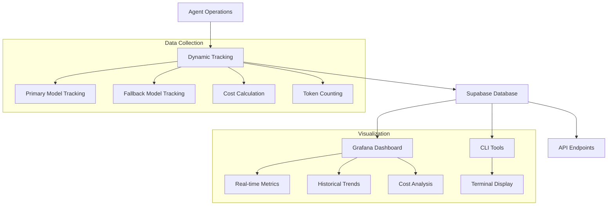

# CodeQual Performance Monitoring & Dashboards

## 🎯 Overview

CodeQual provides comprehensive performance monitoring through integrated tracking in all agents, with visualization via Grafana dashboards and CLI tools. This documentation covers the complete monitoring stack.

## 📊 Architecture



## 🚀 Quick Start

### 1. Verify Metrics Collection

```bash
# Check if metrics are being recorded to Supabase
npm run metrics:check
```

### 2. Import Grafana Dashboard

1. Open Grafana UI
2. Navigate to **Dashboards → Import**
3. Upload `/packages/agents/grafana/codequal-performance-dashboard.json`
4. Select your Supabase PostgreSQL datasource
5. Click **Import**

### 3. View Metrics

- **Grafana**: Access "CodeQual Performance Dashboard"
- **CLI**: Run `npm run metrics` for terminal view
- **API**: Use `/api/monitoring/metrics` endpoints

## 📈 Grafana Dashboard

### Dashboard Panels

#### Top Row - Key Metrics
| Panel | Description | Thresholds |
|-------|-------------|------------|
| Total Operations | Count of all agent operations | - |
| Success Rate | Percentage of successful operations | 🔴 <85% 🟡 85-95% 🟢 >95% |
| Avg Response Time | Average processing duration | 🟢 <500ms 🟡 500-1000ms 🔴 >1000ms |
| Total Cost | Cumulative cost in USD | 🟢 <$50 🟡 $50-100 🔴 >$100 |
| Fallback Rate | Percentage using fallback models | 🟢 <5% 🟡 5-15% 🔴 >15% |
| Active Models | Number of unique models in use | - |

#### Performance Charts
1. **Performance Over Time**: Dual-axis chart showing response time and success rate trends
2. **Cost Distribution by Agent**: Donut chart breaking down costs per agent
3. **Operations by Agent**: Stacked bar chart of successful/failed operations
4. **Agent Performance Details**: Comprehensive table with all metrics

#### Advanced Analytics
- **Response Time Heatmap**: Visual distribution of response times
- **Agent Activity Over Time**: Stacked area chart showing usage patterns

### Custom Queries

Add your own panels using these SQL templates:

```sql
-- Error rate by agent (last hour)
SELECT 
  agent_role,
  ROUND(100.0 * SUM(CASE WHEN NOT success THEN 1 ELSE 0 END) / COUNT(*), 2) as error_rate
FROM agent_activity
WHERE timestamp >= extract(epoch from now() - interval '1 hour')*1000
GROUP BY agent_role
ORDER BY error_rate DESC;

-- Top 10 most expensive operations
SELECT 
  agent_role,
  operation,
  model_used,
  cost,
  duration_ms,
  input_tokens + output_tokens as total_tokens
FROM agent_activity
WHERE timestamp >= extract(epoch from now() - interval '24 hours')*1000
ORDER BY cost DESC
LIMIT 10;

-- Model performance comparison
SELECT 
  model_used,
  COUNT(*) as operations,
  ROUND(AVG(duration_ms), 0) as avg_duration,
  ROUND(100.0 * SUM(CASE WHEN success THEN 1 ELSE 0 END) / COUNT(*), 1) as success_rate,
  ROUND(SUM(cost)::numeric, 2) as total_cost
FROM agent_activity
WHERE timestamp >= extract(epoch from now() - interval '7 days')*1000
GROUP BY model_used
ORDER BY operations DESC;
```

## 🖥️ CLI Tools

### Available Commands

```bash
# View summary metrics
npm run metrics:summary -- --time 1h

# Show agent performance
npm run metrics:agents -- --time 6h

# Analyze costs
npm run metrics:costs -- --time 24h

# View recent operations
npm run metrics:recent -- --limit 20

# Live monitoring mode (auto-refresh)
npm run metrics:watch -- --interval 5

# Check metrics recording
npm run metrics:check
```

### CLI Output Example

```
📊 CodeQual Performance Metrics

┌─────────────────────┬──────────┐
│ Metric              │ Value    │
├─────────────────────┼──────────┤
│ Time Range          │ 1h       │
│ Total Operations    │ 1,247    │
│ Successful          │ 1,176    │
│ Failed              │ 71       │
│ Success Rate        │ 94.3%    │
│ Avg Response Time   │ 342ms    │
│ Total Tokens Used   │ 487,293  │
│ Total Cost          │ $48.73   │
└─────────────────────┴──────────┘
```

## 🔌 API Endpoints

### GET /api/monitoring/metrics

Returns comprehensive metrics for the dashboard.

**Query Parameters:**
- `range`: Time range (1h, 6h, 24h, 7d)

**Response:**
```json
{
  "summary": {
    "totalAnalyses": 1247,
    "successRate": 94.3,
    "avgResponseTime": 342,
    "totalCost": 48.73,
    "activeModels": 6,
    "fallbackRate": 8.2,
    "cacheHitRate": 76.5
  },
  "trends": {
    "analysesChange": 12.5,
    "successChange": -2.1,
    "responseTimeChange": -8.3,
    "costChange": 5.20,
    "cacheChange": 4.2
  },
  "timeSeries": {...},
  "agentMetrics": [...],
  "costByAgent": [...]
}
```

### GET /api/monitoring/agents/:agentName

Returns metrics for a specific agent.

**Response:**
```json
{
  "agentName": "comparator",
  "summary": {
    "totalOperations": 234,
    "successRate": 96.5,
    "avgDuration": 287,
    "totalCost": 12.45,
    "fallbackRate": 5.2
  },
  "operations": [...]
}
```

### GET /api/monitoring/costs

Returns detailed cost analysis.

**Response:**
```json
{
  "totalCost": 148.92,
  "costByAgent": {...},
  "costByModel": {...},
  "topExpensiveAgents": [...],
  "topExpensiveModels": [...]
}
```

## 🎯 Agent Tracking Integration

### How Tracking Works

Each agent automatically tracks:
- **Model Selection**: Primary vs fallback model usage
- **Performance**: Operation duration and success/failure
- **Cost**: Token usage and monetary cost
- **Context**: Repository, language, operation type

### Tracked Agents

| Agent | Role | Tracking |
|-------|------|----------|
| ComparisonAgent | Code comparison analysis | ✅ Integrated |
| EducatorAgent | Educational resource finding | ✅ Integrated |
| ResearcherAgent | Model research & selection | ✅ Integrated |
| Orchestrator | Coordination & management | ✅ Integrated |
| DeepWikiApiWrapper | DeepWiki API calls | ✅ Integrated |

### Implementation Example

```typescript
// Automatic tracking in agents
async analyze(input: AnalysisInput) {
  const startTime = Date.now();
  
  try {
    // Primary model attempt
    const result = await this.callPrimaryModel(input);
    
    // Track success
    await trackDynamicAgentCall({
      agent: 'comparator',
      operation: 'analyze',
      repository: input.repository,
      model: this.primaryModel,
      isFallback: false,
      inputTokens: estimateTokens(input),
      outputTokens: estimateTokens(result),
      duration: Date.now() - startTime,
      success: true
    });
    
    return result;
  } catch (error) {
    // Fallback model attempt
    // Tracking happens automatically
  }
}
```

## 🔧 Performance Optimization

### Database Indexes

Run these in Supabase SQL editor for optimal performance:

```sql
-- Create performance indexes
CREATE INDEX idx_agent_activity_timestamp ON agent_activity(timestamp DESC);
CREATE INDEX idx_agent_activity_agent_role ON agent_activity(agent_role);
CREATE INDEX idx_agent_activity_success ON agent_activity(success);
CREATE INDEX idx_agent_activity_is_fallback ON agent_activity(is_fallback);

-- Composite index for common queries
CREATE INDEX idx_agent_activity_timestamp_agent 
ON agent_activity(timestamp DESC, agent_role);

-- Analyze tables for query optimization
ANALYZE agent_activity;
```

### Data Retention

Set up automatic cleanup for old data:

```sql
-- Create cleanup function
CREATE OR REPLACE FUNCTION cleanup_old_agent_activity()
RETURNS void AS $$
BEGIN
  DELETE FROM agent_activity 
  WHERE timestamp < extract(epoch from now() - interval '90 days') * 1000;
END;
$$ LANGUAGE plpgsql;

-- Schedule weekly cleanup (requires pg_cron)
SELECT cron.schedule(
  'cleanup-agent-activity', 
  '0 2 * * 0', 
  'SELECT cleanup_old_agent_activity();'
);
```

## 📊 Metrics Reference

### Key Performance Indicators (KPIs)

| Metric | Description | Target | Alert Threshold |
|--------|-------------|--------|-----------------|
| Success Rate | % of successful operations | >95% | <90% |
| Avg Response Time | Mean processing duration | <500ms | >1000ms |
| Fallback Rate | % using fallback models | <5% | >15% |
| Cost per Operation | Average cost | <$0.05 | >$0.10 |
| Cache Hit Rate | % served from cache | >70% | <50% |
| Error Rate | % of failed operations | <5% | >10% |

### Agent-Specific Metrics

#### ComparisonAgent
- Lines analyzed per second
- Issues detected per analysis
- Branch comparison accuracy

#### EducatorAgent
- Resources found per query
- Relevance score
- Response time

#### ResearcherAgent
- Model research frequency
- Cost optimization achieved
- Performance improvement

#### Orchestrator
- Coordination overhead
- Agent dispatch efficiency
- Pipeline completion time

#### DeepWikiApiWrapper
- API response time
- Cache effectiveness
- Retry rate

## 🚨 Alerting Configuration

### Grafana Alerts

Set up alerts in Grafana for:

1. **High Error Rate**
   ```sql
   SELECT COUNT(*) FILTER (WHERE NOT success) * 100.0 / COUNT(*)
   FROM agent_activity
   WHERE timestamp >= extract(epoch from now() - interval '5 minutes')*1000
   HAVING COUNT(*) > 10
   ```

2. **Cost Overrun**
   ```sql
   SELECT SUM(cost)
   FROM agent_activity
   WHERE timestamp >= extract(epoch from now() - interval '1 hour')*1000
   HAVING SUM(cost) > 10.0
   ```

3. **Performance Degradation**
   ```sql
   SELECT AVG(duration_ms)
   FROM agent_activity
   WHERE timestamp >= extract(epoch from now() - interval '10 minutes')*1000
   HAVING AVG(duration_ms) > 1000
   ```

## 🔍 Troubleshooting

### Common Issues

#### No Data in Dashboard
1. Check Supabase connection: `npm run metrics:check`
2. Verify agent initialization includes tracking
3. Ensure `USE_DEEPWIKI_MOCK=false` for real tracking
4. Check timestamp format (should be milliseconds)

#### Slow Dashboard Performance
1. Run optimization SQL script
2. Check Grafana time range (shorter = faster)
3. Verify indexes are created
4. Consider data retention policy

#### Incorrect Metrics
1. Verify token counting logic
2. Check cost calculation formulas
3. Ensure proper primary/fallback detection
4. Validate success/failure tracking

### Debug Commands

```bash
# Check database connection
npm run metrics:check

# View raw data
psql $DATABASE_URL -c "SELECT * FROM agent_activity ORDER BY timestamp DESC LIMIT 10"

# Check index usage
psql $DATABASE_URL -c "SELECT * FROM pg_stat_user_indexes WHERE tablename = 'agent_activity'"

# Monitor real-time activity
npm run metrics:watch -- --interval 1
```

## 📚 Additional Resources

- [Grafana Documentation](https://grafana.com/docs/)
- [Supabase PostgreSQL Guide](https://supabase.com/docs/guides/database)
- [Node.js Performance Best Practices](https://nodejs.org/en/docs/guides/simple-profiling/)
- [OpenTelemetry Integration Guide](https://opentelemetry.io/docs/instrumentation/js/)

## 🔄 Version History

| Version | Date | Changes |
|---------|------|---------|
| 1.0.0 | 2024-01-20 | Initial monitoring implementation |
| 1.1.0 | 2024-01-21 | Added Grafana dashboard |
| 1.2.0 | 2024-01-22 | Integrated agent tracking |
| 1.3.0 | 2024-01-23 | Added CLI tools |

---

For support, please contact the CodeQual team or open an issue in the repository.