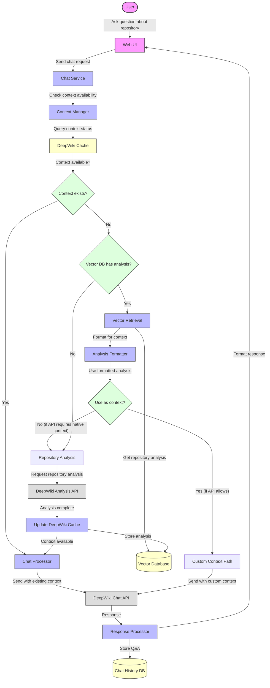

# Production Model for DeepWiki Chat with Vector DB Integration

The above diagram represents the proposed flow for integrating DeepWiki chat with our vector database for efficient repository Q&A. This model addresses various scenarios for context management and ensures optimal user experience.

## Flow Components

### 1. User Interface Layer
- **Web UI**: Provides the chat interface for interacting with repository
- **User**: Initiates questions about a repository

### 2. Service Layer
- **Chat Service**: Manages chat interactions and coordinates with other components
- **Context Manager**: Determines if context exists for a repository
- **Chat Processor**: Handles sending appropriately formatted chat requests
- **Response Processor**: Processes responses and formats them for users

### 3. Data Layer
- **DeepWiki Cache**: Tracks which repositories have context in DeepWiki
- **Vector Database**: Stores repository analyses and embeddings
- **Chat History DB**: Records chat history for reference and analysis

### 4. Integration Layer
- **Vector Retrieval**: Fetches relevant repository information from vector database
- **Analysis Formatter**: Formats vector-based analysis for use as context (if possible)
- **Repository Analysis**: Triggers analysis when no context exists

### 5. External API Layer
- **DeepWiki Chat API**: Provides chat functionality with repository context
- **DeepWiki Analysis API**: Analyzes repositories to create context

## Key Decision Points

### Context Exists Decision
Determines if DeepWiki already has context for the repository:
- If YES: Use existing context for the chat request
- If NO: Proceed to check if our vector database has relevant analysis

### Vector DB Has Analysis Decision
Determines if we already have analysis in our vector database:
- If YES: Retrieve and potentially format for use as context
- If NO: Trigger a repository analysis through DeepWiki

### Use as Context Decision
Determines if retrieved vector analysis can be used directly as context:
- If YES: Format and send with custom context parameters (if API allows)
- If NO: Proceed with standard repository analysis to create native context

## Implementation Considerations

### Context Detection Strategy
- Implement proactive context checking based on research findings
- Use error patterns to detect missing context
- Maintain a registry of repositories with active context

### Performance Optimization
- Cache analysis results in vector database for long-term storage
- Support incremental updates for repository changes
- Pre-warm context for frequently accessed repositories

### Error Handling
- Provide clear messaging when context is unavailable
- Offer estimated wait times for analysis
- Support graceful fallback to general knowledge when appropriate

### Resource Management
- Monitor context storage usage
- Implement context eviction policies based on usage patterns
- Balance performance with storage costs

## Integration Implementation Steps

1. Complete the context mechanism research to confirm behavior
2. Implement the Context Manager service
3. Create the Vector Retrieval service with context formatting
4. Develop the chat history storage and retrieval system
5. Implement the user interface with appropriate status indicators
6. Test with various repositories and usage patterns
7. Monitor performance and refine as needed

This model provides a flexible approach that can adapt to the actual behavior of DeepWiki's context mechanism once fully researched.
