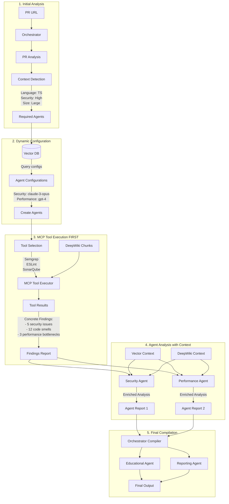
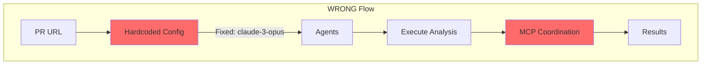

# CodeQual Execution Flow - Visual Guide

## Correct Architecture Flow



## Incorrect Understanding (What We Had)



## Key Differences

### ✅ CORRECT: Tools First, Then Analysis
```
1. MCP Tools Execute → Get concrete findings (ESLint: 12 issues)
2. Agents Analyze → Use findings + add context & intelligence
3. Result: Enriched analysis with actionable insights
```

### ❌ WRONG: Direct Agent Analysis
```
1. Agents Analyze → Without concrete tool data
2. MCP Coordinates → Just shares between agents
3. Result: Abstract analysis without specific findings
```

## Example: Security Analysis

### Correct Flow:
```typescript
// 1. Tool executes first
const semgrepResults = await mcpTools.execute('semgrep', prFiles);
// Returns: { findings: [SQLInjection at line 45, XSS at line 89] }

// 2. Security agent analyzes with tool results
const securityAnalysis = await securityAgent.analyze({
  toolFindings: semgrepResults,
  deepwikiContext: "Repository has history of SQL injection issues",
  vectorContext: "Similar patterns found in 3 other repos"
});
// Returns: Enriched analysis with context and recommendations
```

### Wrong Flow:
```typescript
// Agent tries to analyze without tool results
const analysis = await securityAgent.analyze(prFiles);
// Missing: Concrete vulnerability findings from tools
```

## Configuration Examples

### Dynamic Model Selection:
```yaml
Small PR + JavaScript + Low Complexity:
  → gpt-3.5-turbo (fast, cheap, sufficient)

Large PR + Security Critical + High Complexity:
  → claude-3-opus (best for complex security analysis)

Medium PR + Performance Focus + TypeScript:
  → gpt-4-turbo (good balance for performance analysis)
```

### Tool Selection Based on Agents:
```yaml
Security Agent Required:
  → Tools: [semgrep, sonarqube, mcp-scan]
  
Performance Agent Required:
  → Tools: [lighthouse, bundlephobia, webpack-analyzer]
  
Code Quality Agent Required:
  → Tools: [eslint, prettier, complexity-report]
```

## Implementation Checklist

- [ ] Orchestrator analyzes PR to determine required agents
- [ ] Pull agent configurations from Vector DB (not hardcoded)
- [ ] Select tools based on required agents
- [ ] Execute MCP tools BEFORE agent analysis
- [ ] Pass tool results to agents as primary input
- [ ] Agents enrich tool findings with context
- [ ] Compile enriched reports for final output

This is the correct flow where tools provide the foundation and agents add the intelligence!
