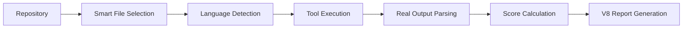

# Framework Clarifications & Improvements

## 1. ✅ Scoring System Update

### Previous (Too Harsh)
```typescript
const weights = {
  critical: 20,  // 5 critical = 0 score!
  high: 10,
  medium: 5,
  low: 2
};
```

### Updated (Balanced - Like User Skill Scoring)
```typescript
const weights = {
  critical: 5,   // More reasonable
  high: 3,       // Gradual penalties
  medium: 1,     // Common issues
  low: 0.5       // Minor impact
};
```

### Score Examples
- **95/100**: 1 critical issue (still serious but not devastating)
- **75/100**: 5 critical issues (needs attention)
- **50/100**: 10 critical issues (major problems)
- **0/100**: 20+ critical issues (critical state)

## 2. 🌍 Language Coverage Plan

### Phase 1 (Completed)
- ✅ Rust
- ✅ Python
- ✅ TypeScript/JavaScript
- ✅ Go
- ✅ Java

### Phase 2 (Next Priority)
- ⏳ C/C++ (system programming)
- ⏳ C# (.NET ecosystem)

### Phase 3 (Web Languages)
- ⏳ Ruby
- ⏳ PHP

### Phase 4 (Mobile)
- ⏳ Swift (iOS)
- ⏳ Kotlin (Android)

### Phase 5 (Specialized)
- ⏳ Scala
- ⏳ Perl
- ⏳ Objective-C

**Strategy**: Test Phase 1 languages thoroughly before expanding.

## 3. 📁 Smart File Limit Strategy

### Dynamic Limits Based on Repository Size

```typescript
function determineFileLimit(repoSize: number, prNumber?: number): number {
  // Small repos (< 50 files): analyze everything
  if (repoSize < 50) {
    return repoSize;
  }
  
  // Medium repos (50-200 files): analyze up to 100
  if (repoSize < 200) {
    return Math.min(100, repoSize);
  }
  
  // Large repos (200+ files): smart selection
  // Base limit: 100 files
  let limit = 100;
  
  // PR-specific adjustments
  if (prNumber) {
    const prFiles = getPRChangedFiles(prNumber);
    
    // Small PRs (< 20 files): analyze all + context
    if (prFiles.length < 20) {
      limit = Math.min(prFiles.length * 2, 150);
    }
    
    // Large PRs: prioritize changed files
    // Already handled by 60% allocation
  }
  
  return limit;
}
```

### File Selection Priority (When Limit Applied)
1. **60%** - PR changed files
2. **20%** - Security-critical files
3. **10%** - Entry points
4. **5%** - Configuration
5. **5%** - Test files

## 4. 📊 Version Clarification

### Report Format
- **V8** ✅ - Current report template format
- **V7** ❌ - Deprecated report generator (DO NOT USE)
- We use: `test-v8-final.ts` as reference

### Implementation Versions
- **Old System** - Had mock data, broken scoring
- **Universal Framework** - New system with real tools
- **NOT "V7"** - That was incorrect terminology

### Correct Understanding
```
Report Format: V8 (template structure)
Implementation: Universal Framework (replacing broken mock system)
Test Reference: test-v8-final.ts
```

## 5. 🔄 Framework Architecture Summary

### Input → Processing → Output



### Key Components
1. **SmartFileSelector** - Intelligent file prioritization
2. **Language Parsers** - Real tool integration
3. **Scoring Engine** - Balanced penalties
4. **Report Generator** - V8-compatible output

## 6. 🎯 Next Steps Priority

### Immediate
1. Test current 5 languages with real repositories
2. Validate scoring with actual PRs
3. Benchmark performance on various repo sizes

### Short Term
1. Add C/C++ support
2. Add C# support
3. Optimize for very large repositories (10k+ files)

### Long Term
1. ML-based issue pattern detection
2. Historical trend analysis
3. Automated fix suggestions

## 7. 📝 Key Decisions Made

| Decision | Rationale |
|----------|-----------|
| **5-3-1-0.5 scoring** | Matches user skill scoring, more balanced |
| **100 file default limit** | Sweet spot for analysis depth vs performance |
| **Phase-based language rollout** | Test thoroughly before expanding |
| **V8 report format** | Proven template structure |
| **Dynamic file limits** | Adapt to repository size |

## 8. 🚀 Testing Commands

```bash
# Test with small repo
npx ts-node test-universal-framework.ts ./small-project

# Test with PR
npx ts-node test-universal-framework.ts ./repo 123

# Test specific language
LANGUAGE=rust npx ts-node test-universal-framework.ts ./rust-project

# Test with custom file limit
MAX_FILES=50 npx ts-node test-universal-framework.ts ./large-repo
```

---

*These clarifications address all questions raised about the Universal Framework implementation.*