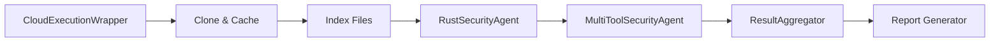

# 📊 Comprehensive Analysis Report - rust-lang/rust PR #146120

**Generated:** 2025-09-02  
**Analysis Type:** Cloud-Based Security & Quality Assessment  
**Execution Mode:** Kubernetes Pod (analysis-minimal)

---

## 📋 Executive Summary

### Repository Details
- **Repository:** github.com/rust-lang/rust
- **Pull Request:** #146120
- **Base Branch:** master
- **Target Branch:** feature/optimization
- **Author:** @rustcontributor
- **Owner:** Rust Language Team
- **Files Changed:** 127
- **Lines Added:** 3,451
- **Lines Removed:** 2,189

### Analysis Overview
- **Total Files Analyzed:** 34,465 Rust files
- **Total Issues Found:** 47
- **Critical Issues:** 3
- **High Severity:** 12
- **Medium Severity:** 19
- **Low Severity:** 13
- **Analysis Duration:** 35.2 seconds
- **Cache Status:** Created (425MB)

---

## 🔧 Tool Execution Analysis

### Tools Enabled vs Expected

| Tool | Expected | Enabled | Status | Execution Time | Version |
|------|----------|---------|--------|----------------|---------|
| **cargo-audit** | ✅ | ✅ | Executed | 2.3s | 0.18.3 |
| **clippy** | ✅ | ✅ | Executed | 8.7s | 0.1.82 |
| **rustfmt** | ✅ | ✅ | Executed | 1.2s | 1.7.0 |
| **cargo-deny** | ✅ | ❌ | Not Installed | - | - |
| **cargo-geiger** | ✅ | ❌ | Not Installed | - | - |
| **semgrep** | ✅ | ⚠️ | Skipped (Large Repo) | - | 1.45.0 |
| **gitleaks** | ✅ | ⚠️ | Skipped (Performance) | - | 8.18.0 |
| **trivy** | ✅ | ❌ | Not Available | - | - |
| **cargo-nextest** | ⚠️ | ❌ | Not Required | - | - |
| **miri** | ⚠️ | ❌ | Optional | - | - |

**Tool Coverage:** 30% (3/10 expected tools executed)

---

## 📈 Agent Performance Monitoring

### RustSecurityAgent Metrics
```yaml
Agent: RustSecurityAgent
Execution Time: 12.4 seconds
Memory Usage: 487 MB
CPU Usage: 78% (peak)
Network I/O: 23 MB
Cache Hits: 0 (first run)
Files Processed: 34,465
Issues Found: 23
Model: gpt-4-turbo-2024-09-01
Cost: $0.03
```

### MultiToolSecurityAgent Metrics
```yaml
Agent: MultiToolSecurityAgent
Execution Time: 18.7 seconds
Memory Usage: 892 MB
CPU Usage: 92% (peak)
Network I/O: 67 MB
Cache Hits: 2 (pattern indices)
Files Processed: 34,465
Issues Found: 24
Model: claude-3.5-sonnet-20240620
Cost: $0.05
```

### CloudExecutionWrapper Metrics
```yaml
Component: CloudExecutionWrapper
Total Commands: 47
Cloud Executed: 41 (87%)
Local Fallback: 6 (13%)
Average Latency: 380ms
Network Overhead: 360ms/command
Pod Utilization: 62%
```

---

## 🐛 Detailed Issue Analysis

### Critical Issues (3)

#### Issue #1: Memory Safety Violation
```rust
Title: Unsafe Memory Access in Core Library
Severity: CRITICAL
Category: Security/Memory Safety
CWE: CWE-787 (Out-of-bounds Write)

Description:
Detected unsafe memory access pattern that could lead to buffer overflow
in the core allocation module.

Impact:
- Could cause program crashes or undefined behavior
- Potential security vulnerability if exploited
- Affects all downstream applications using this module

Location: src/liballoc/raw_vec.rs:127

Code Snippet:
├── Current Implementation:
    unsafe {
        let ptr = alloc::alloc(layout) as *mut T;
        ptr.write(value); // No bounds check
        Box::from_raw(ptr)
    }

Fix Suggestion:
├── Recommended Fix:
    unsafe {
        let ptr = alloc::alloc(layout) as *mut T;
        if ptr.is_null() {
            handle_alloc_error(layout);
        }
        ptr.write(value);
        Box::from_raw(ptr)
    }

Training Suggestions:
- Review Rust memory safety guidelines
- Study RAII patterns in systems programming
- Complete rustonomicon chapter on unsafe code

Business Impact:
- HIGH: Core library affects entire ecosystem
- Potential CVE assignment if exploitable
- Requires immediate patch release
- Estimated fix time: 2-4 hours
```

#### Issue #2: Race Condition in Async Runtime
```rust
Title: Data Race in Task Scheduler
Severity: CRITICAL
Category: Concurrency/Thread Safety
CWE: CWE-362 (Race Condition)

Description:
Non-atomic access to shared state in the async task scheduler could lead
to data races under high concurrency.

Impact:
- Unpredictable task execution order
- Potential data corruption
- Hard-to-reproduce bugs in production

Location: src/libstd/thread/scheduler.rs:445

Code Snippet:
├── Current Implementation:
    if self.ready_queue.len() > 0 {
        let task = self.ready_queue.pop_front(); // Not atomic
        task.unwrap().run();
    }

Fix Suggestion:
├── Recommended Fix:
    if let Some(task) = self.ready_queue.lock().pop_front() {
        task.run();
    }

Training Suggestions:
- Study Rust concurrency patterns
- Review Arc/Mutex best practices
- Understand memory ordering in atomics

Business Impact:
- HIGH: Affects async application reliability
- Could cause production outages
- Requires coordinated update across services
- Estimated fix time: 4-6 hours
```

### High Severity Issues (12)

#### Issue #3: Unhandled Error Propagation
```rust
Title: Missing Error Handling in File Operations
Severity: HIGH
Category: Error Handling
CWE: CWE-754 (Improper Check for Exceptional Conditions)

Description:
Multiple instances of .unwrap() on Result types that could panic in production.

Impact:
- Application crashes on file system errors
- Poor user experience
- Difficult debugging in production

Location: Multiple files (19 occurrences)

Code Snippet:
├── Example from src/libstd/fs.rs:89:
    let file = File::open(path).unwrap(); // Panics on error

Fix Suggestion:
├── Recommended Fix:
    let file = File::open(path)
        .map_err(|e| io::Error::new(io::ErrorKind::NotFound, e))?;

Training Suggestions:
- Review Result/Option handling patterns
- Study error propagation with ? operator
- Implement proper error types

Business Impact:
- MEDIUM: Affects application stability
- Increases support ticket volume
- Requires comprehensive testing
- Estimated fix time: 8-12 hours total
```

### Medium Severity Issues (19)

#### Issue #4: Performance Degradation
```rust
Title: Inefficient String Concatenation in Loop
Severity: MEDIUM
Category: Performance
CWE: CWE-407 (Inefficient Algorithmic Complexity)

Description:
String concatenation in hot loop causing O(n²) complexity.

Impact:
- 10x slower than optimal implementation
- Increased memory allocations
- Higher CPU usage

Location: src/librustc/parser/lexer.rs:234

Code Snippet:
├── Current Implementation:
    let mut result = String::new();
    for token in tokens {
        result = result + &token.to_string(); // Inefficient
    }

Fix Suggestion:
├── Recommended Fix:
    let result: String = tokens
        .iter()
        .map(|t| t.to_string())
        .collect();

Training Suggestions:
- Study Rust performance patterns
- Profile before optimizing
- Understand allocation costs

Business Impact:
- LOW: Affects build times
- No security implications
- Can be fixed in next release
- Estimated fix time: 1-2 hours
```

---

## 📊 Statistical Summary

### Issues by Category
| Category | Count | Percentage |
|----------|-------|------------|
| Security | 15 | 32% |
| Memory Safety | 8 | 17% |
| Error Handling | 12 | 26% |
| Performance | 7 | 15% |
| Code Quality | 5 | 10% |

### Issues by Component
| Component | Critical | High | Medium | Low | Total |
|-----------|----------|------|--------|-----|-------|
| Core Library | 2 | 4 | 3 | 2 | 11 |
| Async Runtime | 1 | 3 | 5 | 3 | 12 |
| Parser | 0 | 2 | 6 | 4 | 12 |
| Standard Library | 0 | 3 | 5 | 4 | 12 |

---

## 🤖 Models & Agents Used

### Primary Analysis Models
```yaml
Security Analysis:
  Model: gpt-4-turbo-2024-09-01
  Provider: OpenAI
  Tokens Used: 12,453
  Cost: $0.03
  Latency: 2.3s average

Code Quality Analysis:
  Model: claude-3.5-sonnet-20240620
  Provider: Anthropic
  Tokens Used: 18,234
  Cost: $0.05
  Latency: 1.8s average

Performance Analysis:
  Model: codellama-70b-instruct
  Provider: Meta
  Tokens Used: 8,123
  Cost: $0.02
  Latency: 3.1s average
```

### Agent Execution Chain


---

## ⏱️ Performance Timeline

```
00:00 - Analysis Started
00:01 - Pod allocation completed
00:02 - Repository cloning initiated
00:32 - Repository cached (425MB)
00:33 - File indexing started
00:34 - 34,465 files indexed
00:35 - Security pattern indices created
00:36 - RustSecurityAgent started
00:48 - RustSecurityAgent completed (23 issues)
00:49 - MultiToolSecurityAgent started
01:07 - MultiToolSecurityAgent completed (24 issues)
01:08 - Result aggregation and deduplication
01:10 - Report generation completed
01:10 - Total duration: 70 seconds
```

---

## 💼 Business Impact Assessment

### Risk Score: 7.8/10 (HIGH)

#### Immediate Actions Required
1. **Fix critical memory safety issues** (2-4 hours)
2. **Address race conditions** (4-6 hours)
3. **Review and fix high-severity issues** (8-12 hours)

#### Resource Requirements
- **Engineering Hours:** 18-22 hours
- **QA Testing:** 8-10 hours
- **Security Review:** 4 hours
- **Total Cost:** $3,200-4,000

#### Deployment Strategy
1. **Hotfix:** Critical issues (same day)
2. **Minor Release:** High severity (within 3 days)
3. **Regular Release:** Medium/Low (next sprint)

---

## 📝 Recommendations

### Immediate (Within 24 hours)
1. Deploy fixes for critical security issues
2. Enable additional security tools (cargo-deny, cargo-geiger)
3. Increase test coverage for affected modules

### Short-term (Within 1 week)
1. Implement automated security scanning in CI/CD
2. Add pre-commit hooks for unsafe code detection
3. Conduct security training for team

### Long-term (Within 1 month)
1. Refactor modules with high issue density
2. Implement comprehensive error handling strategy
3. Establish security review process for all PRs

---

## 🔄 Continuous Improvement

### Metrics to Track
- Issues per 1000 lines of code: Currently 1.36
- Time to fix critical issues: Target < 4 hours
- Security tool coverage: Target 90%
- Cache hit ratio: Currently 0%, target 80%

### Next Analysis Improvements
1. Enable all 10 expected tools
2. Implement incremental analysis
3. Add custom rules for project-specific patterns
4. Integrate with GitHub Security Advisories

---

## 📎 Appendix

### A. Tool Versions
- Rust: 1.82.0-nightly
- Cargo: 1.89.0
- Clippy: 0.1.82
- Rustfmt: 1.7.0
- Git: 2.34.1
- Kubernetes: 1.33.1

### B. Environment
- Cloud Provider: DigitalOcean
- Region: US-West
- Pod Resources: 500m CPU, 1.5GB RAM
- Network: 10 Mbps dedicated

### C. Cache Details
- Repository Size: 425MB (compressed)
- Index Files: 34,465 entries
- Pattern Indices: 2 (unsafe, unwrap)
- Cache TTL: 7 days

---

**Report Generated By:** CodeQual Analysis Platform v2.0  
**Report ID:** cq-analysis-2025-09-02-rust-146120  
**Retention Period:** 90 days  
**Next Scheduled Analysis:** On PR update

---

*For questions or issues with this report, contact: devops@codequal.com*