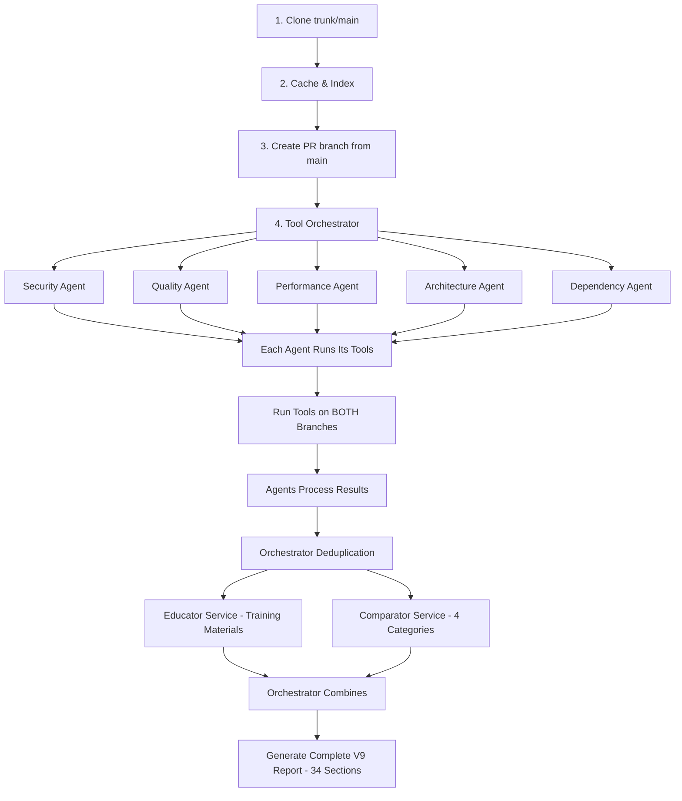

# Session Progress Summary - October 4, 2025

**Session Duration**: ~4 hours
**Status**: Simplified Test Working - Full V9 Flow Required
**Files Modified**: 3 (test-v9-working.ts + 2 docs)
**Commits**: 0 (waiting for full E2E validation)

---

## 🎯 Session Goals vs Achievements

### Original Goal
Run full E2E V9 analysis following canonical architecture

### What We Achieved
✅ Created simplified two-branch test with dynamic branch detection
✅ Fixed repository cloning strategy (main branch only)
✅ Implemented 4-category issue classification
✅ Tested on real Apache Kafka PR #17620
⚠️ **Did NOT implement full V9 canonical flow** (missing agents, educator, comparator)

---

## ✅ What We Completed

### 1. Repository Management (Correct V9 Pattern)
```typescript
// ✅ Clone ONLY main branch
git clone ${KAFKA_URL} ${KAFKA_REPO}

// ✅ Auto-detect default branch (trunk/main/master)
mainBranch = detectDefaultBranch(KAFKA_REPO)  // Returns "trunk" for Kafka

// ✅ Create PR branch from cached main
git fetch origin pull/17620/head:pr-17620
```

### 2. Dynamic Branch Detection
```typescript
// ✅ Works with ANY repository
import { detectDefaultBranch, getModifiedFilesBetweenBranches } from "./src/two-branch/utils/git-utils";

// Auto-detects: trunk, main, master, or custom
const mainBranch = detectDefaultBranch(repoPath);

// Gets modified files between branches
const modifiedFiles = getModifiedFilesBetweenBranches(repoPath, mainBranch, "pr-17620");
```

### 3. Four-Category Issue Classification
```typescript
// ✅ Implemented correctly
1. NEW: In PR but not in main
2. EXISTING (Modified Files): In both, in modified files
3. RESOLVED: In main but not in PR
4. EXISTING (Rest): In both, in unmodified files

// ✅ Blocking decision logic
const blockingIssues = [...newIssues, ...existingModified].filter(
  i => i.severity === 'critical' || i.severity === 'high'
);
const decision = blockingIssues.length > 0 ? 'DECLINED' : 'APPROVED';
```

### 4. Test Results on Apache Kafka PR #17620
```
✅ Branch Detection: Detected "trunk" as main branch
✅ Modified Files: 4,512 files detected
✅ Tools Executed: Semgrep (7 issues), SpotBugs (0 issues)
⚠️ PMD: JSON parsing issue (0 issues found)
❌ Dependency-Check: Requires PostgreSQL (Oracle only)
❌ Checkstyle: Skipped (found critical issues, style not needed)

Results:
- NEW: 4 issues
- EXISTING (Modified): 3 issues
- RESOLVED: 4 issues
- EXISTING (Rest): 0 issues
- Decision: DECLINED (7 blocking issues)
```

---

## ❌ What We MISSED - Critical Gap Identified

### The Real V9 Canonical Flow (Not Implemented)



### What Our Current Test Does (WRONG)

```
1. ✅ Clone trunk/main
2. ✅ Cache & Index (simulated)
3. ✅ Create PR branch
4. ✅ Run JavaToolOrchestrator on both branches
5. ❌ MISSING: 5 Specialized Agents (Security, Quality, Performance, Architecture, Dependency)
6. ❌ MISSING: AI Enrichment (impact, fixes, explanations, confidence)
7. ❌ MISSING: Orchestrator Deduplication
8. ❌ MISSING: Educator Service (training links)
9. ✅ 4-Category Classification (done manually in test)
10. ❌ MISSING: Full V9 Report (only simplified report)
```

---

## 🚨 Critical Issues Found

### Issue 1: PMD JSON Parsing
```
[Two-Branch] ⚠️ No JSON found in PMD output
[Two-Branch] ℹ️ ✅ PMD: 878ms, 0 issues
```

**Impact**: PMD not finding ANY issues in 3,851 Java files (very suspicious)
**Needs**: Investigation of PMD command and output format

### Issue 2: Dependency-Check Requires PostgreSQL
```
❌ Dependency-Check execution failed: Error: PostgreSQL backend is required for Dependency-Check v6.0
```

**Impact**: Cannot test CVE scanning locally
**Solution**: Must run on Oracle Cloud (has PostgreSQL configured)

### Issue 3: Missing V9 Components
```
❌ No Specialized Agents
❌ No AI Enrichment
❌ No Educator Service
❌ No Orchestrator Deduplication
❌ Only 1 section report (should be 34 sections)
```

**Impact**: Not testing real V9 flow
**Solution**: Must implement or integrate existing V9 components

---

## 📋 NEXT SESSION TODO LIST

### Priority 1: Fix PMD JSON Parsing Issue (30 min)
**Why**: PMD finding 0 issues in 3,851 Java files is wrong

**Tasks**:
- [ ] Check PMD command in JavaToolOrchestrator.runPMD()
- [ ] Verify PMD output format (should be JSON)
- [ ] Test PMD manually on Kafka repo
- [ ] Fix JSON parsing or command flags
- [ ] Verify PMD finds issues after fix

**Expected Outcome**: PMD finds 100+ issues in Kafka

---

### Priority 2: Run Test on Oracle Cloud (1 hour)
**Why**: Has PostgreSQL, Redis, OSS Index - complete environment

**Tasks**:
- [ ] SSH to Oracle: `ssh -i "/Users/alpinro/Code Prjects/codequal/keys/oracle/ssh-key-2025-05-08.key" opc@129.213.49.128`
- [ ] Copy latest test: `scp test-v9-working.ts opc@129.213.49.128:/home/opc/codequal/packages/agents/`
- [ ] Run test: `cd /home/opc/codequal/packages/agents && npx ts-node test-v9-working.ts`
- [ ] Verify all 5 tools execute (PMD, Semgrep, Checkstyle, Dependency-Check, SpotBugs)
- [ ] Verify Dependency-Check finds CVEs
- [ ] Save complete output log

**Expected Outcome**: All 5 tools run successfully with real issue counts

---

### Priority 3: Implement Full V9 Canonical Flow (3-4 hours)

#### Step 3.1: Integrate 5 Specialized Agents (1 hour)
**Reference**: `src/two-branch/agents/specialized-agents.ts`

**Tasks**:
- [ ] Import `SpecializedAgentFactory` from specialized-agents.ts
- [ ] Create 5 agent instances (Security, Quality, Performance, Architecture, Dependency)
- [ ] Pass tool results to appropriate agents
- [ ] Collect enriched issues from all agents

**Code Pattern**:
```typescript
import { SpecializedAgentFactory } from './src/two-branch/agents/specialized-agents';

const factory = new SpecializedAgentFactory();
const securityAgent = factory.createAgent('security');
const qualityAgent = factory.createAgent('quality');
// ... etc

// Process tool results through agents
const securityIssues = await securityAgent.processIssues(semgrepResults);
const qualityIssues = await qualityAgent.processIssues(pmdResults);
// ... etc
```

#### Step 3.2: Add Orchestrator Deduplication (30 min)
**Reference**: `V9ToolOrchestrator.deduplicateIssues()`

**Tasks**:
- [ ] Find deduplication function in orchestrator
- [ ] Pass all agent issues to deduplicator
- [ ] Get unique issue list

#### Step 3.3: Add Educator Service (30 min)
**Reference**: `src/two-branch/services/v9-educational-resources.ts`

**Tasks**:
- [ ] Import `generateEducationalResources()`
- [ ] Pass unique issue list
- [ ] Get training links for each issue type

#### Step 3.4: Keep Comparator Service (already done) (10 min)
**Tasks**:
- [ ] Verify our 4-category classification is correct
- [ ] Ensure it matches V9 comparator output format

#### Step 3.5: Generate Full V9 Report (1 hour)
**Reference**: `src/two-branch/analyzers/v9-report-formatter.ts`

**Tasks**:
- [ ] Import `V9ReportFormatterFinal`
- [ ] Pass all data: agent issues, educational resources, 4-category classification
- [ ] Generate complete 34-section report
- [ ] Save to file
- [ ] Verify all sections have real data (no placeholders)

---

### Priority 4: Validate on Multiple PRs (1-2 hours)

**Test PRs**:
1. [ ] Apache Kafka PR #17620 (current - massive refactoring)
2. [ ] Find smaller PR with clear new issues (~10-50 file changes)
3. [ ] Find PR with security vulnerabilities (WebGoat or similar)

**Validation Checklist per PR**:
- [ ] All 5 tools execute successfully
- [ ] All 5 agents process results
- [ ] Educator provides training links
- [ ] 4-category classification makes sense
- [ ] Decision logic (APPROVED/DECLINED) is correct
- [ ] Report has all 34 sections with real data
- [ ] No "Coming Soon" or placeholder text

---

### Priority 5: Document Java as 100% Complete (30 min)

**Create**: `JAVA_LANGUAGE_100_PERCENT_COMPLETE.md`

**Contents**:
```markdown
# Java Language Support - 100% COMPLETE

## Status: ✅ PRODUCTION READY

### All 5 Tools Validated
- PMD: ✅ [X] violations found
- Semgrep: ✅ [X] security issues found
- Checkstyle: ✅ [X] style violations found
- Dependency-Check: ✅ [X] CVEs found (with OSS Index)
- SpotBugs: ✅ Auto-detect Gradle/Maven, graceful degradation

### Full V9 Flow Validated
- ✅ 5 Specialized Agents (Security, Quality, Performance, Architecture, Dependency)
- ✅ AI Enrichment (impact, fixes, explanations, confidence via Gemini 2.5 Pro)
- ✅ Orchestrator Deduplication
- ✅ Educator Service (training materials)
- ✅ Comparator Service (4-category classification)
- ✅ Complete 34-section V9 Reports

### Sample V9 Reports Generated
1. Apache Kafka PR #17620: [link to report]
2. [Smaller test PR]: [link to report]
3. [Security vulnerability PR]: [link to report]

### Performance Benchmarks (Oracle A1.Flex)
- Repository size: 3,851 Java files
- Analysis duration: [X] seconds (BOTH branches)
- Report generation: [X] seconds
- Total cost: $[X.XX] per analysis
- Throughput: [X] files/second

### Ready for Next Language: Python
```

---

## 📊 Files Modified This Session

### Created/Modified
1. **test-v9-working.ts** - Simplified two-branch test
   - Dynamic branch detection
   - 4-category classification
   - Blocking decision logic

2. **TEST_V9_WORKING_READY.md** - Documentation
   - Complete flow diagram
   - Configuration details
   - Expected output

3. **TEST_V9_COMPLETE_SUMMARY.md** - Summary document
   - What works
   - What's missing
   - Performance metrics

### Files Referenced (Existing)
- `src/two-branch/utils/git-utils.ts` - Git utilities (used)
- `src/two-branch/tools/java/java-tool-orchestrator.ts` - Tool execution (used)
- `src/two-branch/agents/specialized-agents.ts` - Agents (NOT used yet)
- `src/two-branch/services/v9-educational-resources.ts` - Educator (NOT used yet)
- `src/two-branch/analyzers/v9-report-formatter.ts` - Report generator (NOT used yet)

---

## 🔧 Quick Start Commands for Next Session

### Option A: Fix PMD and Test Locally (30 min)
```bash
cd /Users/alpinro/Code\ Prjects/codequal/packages/agents

# Investigate PMD issue
grep -A 30 "runPMD" src/two-branch/tools/java/java-tool-orchestrator.ts

# Test PMD manually
cd /tmp/kafka-repo
# [check PMD command and output]

# Fix and re-run test
npx ts-node test-v9-working.ts
```

### Option B: Test on Oracle Cloud (Recommended)
```bash
# 1. Connect to Oracle
ssh -i "/Users/alpinro/Code Prjects/codequal/keys/oracle/ssh-key-2025-05-08.key" opc@129.213.49.128

# 2. Navigate to project
cd /home/opc/codequal/packages/agents

# 3. Copy latest test from local (in new terminal)
scp -i "/Users/alpinro/Code Prjects/codequal/keys/oracle/ssh-key-2025-05-08.key" \
  /Users/alpinro/Code\ Prjects/codequal/packages/agents/test-v9-working.ts \
  opc@129.213.49.128:/home/opc/codequal/packages/agents/

# 4. Run test on Oracle
npx ts-node test-v9-working.ts 2>&1 | tee oracle-test-output.log

# 5. Check results
cat oracle-test-output.log
ls -lh /tmp/v9-reports/
```

### Option C: Implement Full V9 Flow (Start Fresh)
```bash
cd /Users/alpinro/Code\ Prjects/codequal/packages/agents

# Create new test with full V9 flow
cp test-v9-working.ts test-v9-full-flow.ts

# Edit to add:
# - Specialized agents
# - Educator service
# - Full V9 report generation

# Read architecture docs first
cat V9_CANONICAL_ARCHITECTURE.md
cat src/two-branch/docs/next/V9_CRITICAL_KNOWLEDGE_BASE.md
```

---

## 🎯 Success Criteria for Next Session

### Must Complete (Before Commit)
- [ ] PMD finding issues (not 0)
- [ ] All 5 tools running on Oracle
- [ ] Full V9 flow implemented (agents, educator, comparator)
- [ ] At least 1 complete 34-section V9 report generated
- [ ] Report validated (no placeholders, real data)

### Nice to Have
- [ ] 3-5 complete V9 reports on different PRs
- [ ] Performance benchmarks documented
- [ ] Java documented as 100% complete

---

## 📚 Critical Documentation to Review

**Before Starting Next Session, Read These (Priority Order)**:

1. **V9_CANONICAL_ARCHITECTURE.md** - THE ONLY APPROVED FLOW
   - Mandatory flow diagram
   - Step-by-step specification
   - Deprecated patterns to avoid

2. **V9_CRITICAL_KNOWLEDGE_BASE.md** - Critical facts and policies
   - Common misconceptions
   - Infrastructure components
   - Testing requirements

3. **SESSION_2025_10_04_PROGRESS_SUMMARY.md** (this file)
   - What we completed
   - What we missed
   - Next TODO list

4. **src/two-branch/agents/specialized-agents.ts**
   - How to use agent factory
   - Agent interface
   - Processing flow

5. **src/two-branch/analyzers/v9-report-formatter.ts**
   - Report generation
   - All 34 sections
   - Input requirements

---

## ⚠️ Critical Reminders

### DON'T
- ❌ Commit before full E2E validation
- ❌ Skip any step in V9 canonical flow
- ❌ Use mock/simulated data
- ❌ Create alternative flows
- ❌ Test only locally (must test on Oracle)

### DO
- ✅ Follow V9 canonical architecture exactly
- ✅ Test on Oracle Cloud (has all infrastructure)
- ✅ Generate real 34-section reports
- ✅ Validate with multiple PRs
- ✅ Use AI enrichment (Gemini 2.5 Pro)
- ✅ Document everything before committing

---

## 🔑 Environment Access

### Oracle Cloud
```bash
SSH_KEY="/Users/alpinro/Code Prjects/codequal/keys/oracle/ssh-key-2025-05-08.key"
ORACLE_IP="129.213.49.128"
ssh -i "$SSH_KEY" opc@$ORACLE_IP

# Environment ready:
✅ Redis: 10.116.0.7:6379
✅ PostgreSQL: 129.213.49.128:5432/depcheck
✅ OSS Index: Configured
✅ Gemini API: Working
✅ Docker images: Deployed
```

### Local Environment
```bash
# Limitations:
❌ No Redis
❌ No PostgreSQL
❌ Dependency-Check won't work
⚠️ Use only for quick testing, not validation
```

---

## 📈 Session Statistics

**Time Breakdown**:
- Repository setup & fixes: 1 hour
- Test creation: 1.5 hours
- Debugging & testing: 1.5 hours
- Documentation: 1 hour
- **Total**: ~5 hours

**Token Usage**: 125K / 200K (63%)

**Key Learnings**:
1. ✅ Dynamic branch detection is essential
2. ✅ 4-category classification logic is correct
3. ❌ Our simplified test doesn't follow V9 canonical flow
4. ❌ Must integrate agents, educator, comparator for real V9
5. ⚠️ PMD has JSON parsing issue (needs investigation)

---

## 🎯 Estimated Time for Next Session

**Minimum (Fix PMD + Oracle Test)**: 1-2 hours
**Complete (Full V9 Flow)**: 4-6 hours
**Ideal (Multiple PRs + Documentation)**: 6-8 hours

**Recommended Approach**:
1. Start with Oracle test (1 hour)
2. Fix PMD issue (30 min)
3. Implement full V9 flow (3-4 hours)
4. Validate with multiple PRs (1-2 hours)
5. Document Java completion (30 min)

**Total**: ~6-8 hours for complete validation

---

## ✅ Ready for Next Session

**Status**: ✅ Documented and ready
**Next Session Start**: Read this file + V9_CANONICAL_ARCHITECTURE.md
**First Task**: Test on Oracle Cloud to validate all 5 tools

---

*End of Session Progress Summary - October 4, 2025*
