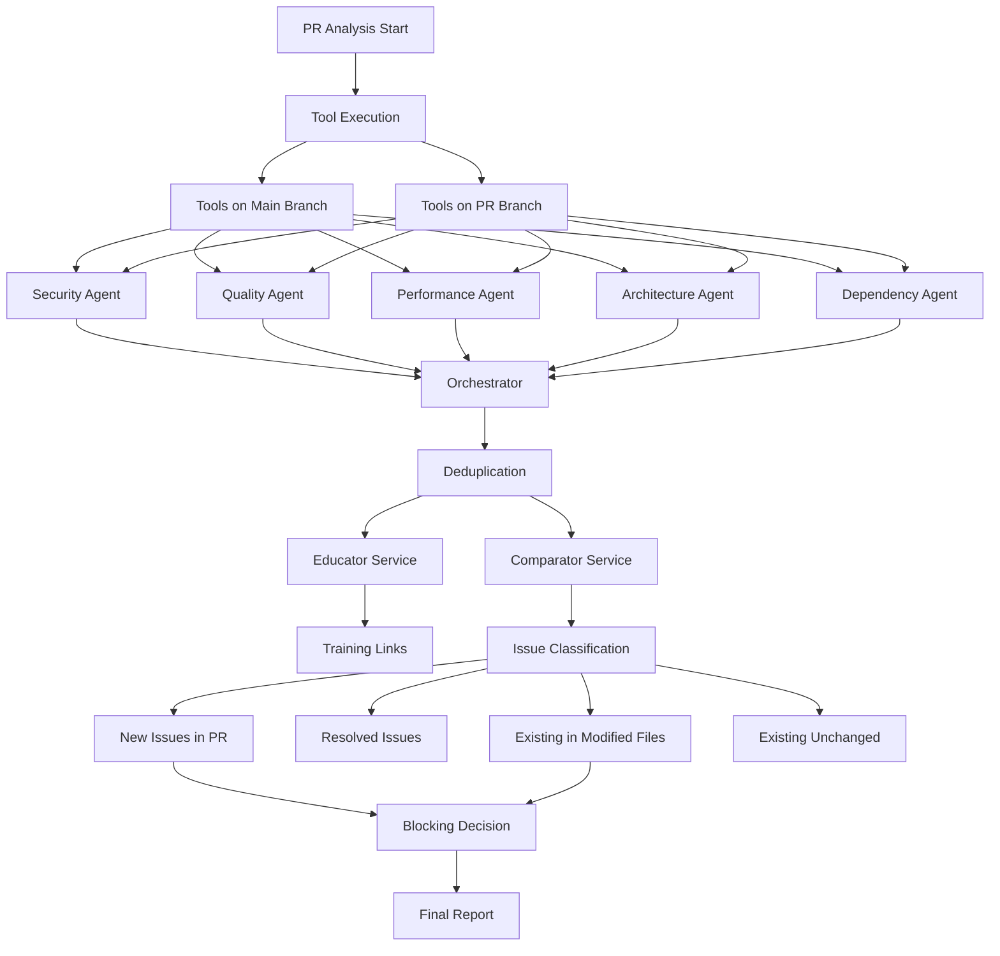

# V9 CANONICAL ARCHITECTURE - MANDATORY FLOW

## ⚠️ CRITICAL: THIS IS THE ONLY APPROVED FLOW

**Date Established**: 2025-09-17
**Status**: MANDATORY - All implementations MUST follow this architecture
**Enforcement**: Any deviation requires explicit approval and must be documented

---

## 🎯 THE ONE TRUE FLOW



---

## 📝 DETAILED FLOW SPECIFICATION

### STEP 1: Tool Execution
- **Location**: `v9-tool-orchestrator.ts`
- **Function**: `orchestrateAnalysis()`
- **Actions**:
  - Execute tools on BOTH branches (main and PR)
  - Tools: SpotBugs, PMD, Checkstyle, Semgrep, etc.
  - Output: Raw tool results

### STEP 2: Agent Processing
- **Location**: `specialized-agents.ts`
- **Agents**: Security, Quality, Performance, Architecture, Dependency
- **Each Agent MUST**:
  1. Receive raw tool output for its category
  2. Deduplicate issues from multiple tools
  3. Enrich with AI using pre-selected model:
     - Impact description
     - Fix suggestion with code
     - Explanation
     - Confidence score
  4. Return `ProcessedIssue[]` to orchestrator

### STEP 3: Orchestrator Compilation
- **Location**: `v9-tool-orchestrator.ts`
- **Function**: `deduplicateIssues()`
- **Actions**:
  1. Collect enriched issues from all agents
  2. Deduplicate across agents
  3. Create unique issue list

### STEP 4: Parallel Services
- **Split Flow** (BOTH run in parallel):

#### 4.1: Educator Service
- **Location**: `v9-educational-resources.ts`
- **Input**: Unique list of issue titles and descriptions
- **Output**: Training links and educational resources
- **Function**: `generateEducationalResources()`

#### 4.2: Comparator Service
- **Location**: `two-branch-comparator.ts`
- **Input**: Issues from both branches
- **Output**: Issue classification:
  - **NEW**: Only in PR branch (BLOCKING if critical/high)
  - **RESOLVED**: Only in main branch
  - **EXISTING_MODIFIED**: In modified files (BLOCKING if critical/high)
  - **EXISTING_UNCHANGED**: In unmodified files

### STEP 5: Blocking Decision
- **Rule**: Block PR if:
  - NEW critical/high issues found
  - EXISTING critical/high issues in modified files
- **Location**: `blocking-logic.ts`

### STEP 6: Final Report
- **Location**: `v9-report-formatter.ts`
- **Includes**:
  - Issue classification
  - AI-generated fixes
  - Educational resources
  - Blocking status

---

## 🚫 DEPRECATED FLOWS TO REMOVE

### Remove These Alternative Implementations:
1. **Direct tool-to-report flows** (bypass agents)
2. **Template-based fix generation** (use AI only)
3. **Single-branch analysis** (always compare both)
4. **Manual model selection** (use DynamicModelSelector)
5. **Synchronous processing** (use parallel services)
6. **Fallback simulations** (fail fast on errors)

### Files to Deprecate:
```
- test-v9-*.js (except test-v9-final-report.js)
- enhanced-fix-generator.ts (if using templates)
- tool-connection-manager.ts (old implementation)
- Any *-fallback.ts files
- Any *-simulation.ts files
```

---

## ✅ ENFORCEMENT RULES

### 1. Code Review Checklist
- [ ] Uses v9-tool-orchestrator.ts for tool execution
- [ ] All 5 agents process their respective tools
- [ ] Orchestrator performs deduplication
- [ ] Educator service generates training links
- [ ] Comparator classifies issues correctly
- [ ] No alternative flows or bypasses
- [ ] No hardcoded models or templates

### 2. Testing Requirements
- Must test both branches
- Must verify all 5 agents work
- Must check deduplication
- Must validate educator output
- Must verify comparator classification

### 3. Architecture Violations
**CRITICAL**: Any code that:
- Bypasses agent enrichment
- Uses templates instead of AI
- Skips deduplication
- Doesn't split to educator/comparator
- Creates alternative flows

**MUST BE REJECTED** in code review.

---

## 📊 Data Structures

### ProcessedIssue (Canonical)
```typescript
interface ProcessedIssue {
  // Identity
  id: string;
  tool: string;
  agent: string;

  // Location
  file: string;
  line: number;
  column?: number;

  // Classification
  title: string;
  category: string;
  severity: 'critical' | 'high' | 'medium' | 'low';

  // AI-Enriched Data (REQUIRED)
  description: string;      // Impact description
  suggestion?: string;      // Fix suggestion
  codeSnippet?: string;     // Current code
  suggestedFix?: string;    // Fixed code
  confidence: number;

  // Branch Comparison (Added by Comparator)
  classification?: 'NEW' | 'RESOLVED' | 'EXISTING_MODIFIED' | 'EXISTING_UNCHANGED';

  // Educational (Added by Educator)
  trainingLinks?: string[];
  bestPractices?: string[];
}
```

---

## 🔒 IMMUTABLE PRINCIPLES

1. **ALWAYS** run tools on both branches
2. **ALWAYS** use all 5 agents for processing
3. **ALWAYS** deduplicate at orchestrator level
4. **ALWAYS** split to educator and comparator
5. **ALWAYS** use AI for fix generation (no templates)
6. **NEVER** create alternative flows
7. **NEVER** bypass any step
8. **NEVER** use fallback simulations

---

## 📝 Implementation Files (Canonical)

### Core Components:
- `/two-branch/analyzers/v9-tool-orchestrator.ts` - Tool execution and orchestration
- `/two-branch/agents/specialized-agents.ts` - All 5 agent implementations
- `/two-branch/services/dynamic-model-selector.ts` - Model selection
- `/two-branch/comparator/two-branch-comparator.ts` - Issue classification
- `/two-branch/educators/v9-educational-resources.ts` - Training resources
- `/two-branch/analyzers/v9-report-formatter.ts` - Final report generation

### DO NOT CREATE NEW VERSIONS OF THESE FILES

---

## 🛑 STOP CONDITIONS

Before implementing ANY PR analysis feature, verify:
1. Does it follow this exact flow?
2. Does it use the canonical files?
3. Does it avoid all deprecated patterns?

If NO to any → STOP and align with this architecture.

---

**This document supersedes all other architectural decisions for V9.**
**Last Updated**: 2025-09-17
**Approved By**: System Architecture Team
**Enforcement Level**: MANDATORY