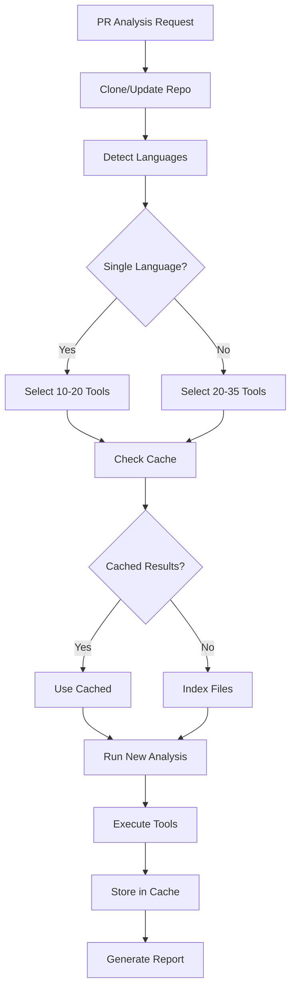

# Language-Based Orchestrator Design

## Overview

The Language-Based Orchestrator optimizes CodeQual's analysis by running only language-specific tools instead of all 85 tools for every PR. This reduces analysis time from 10+ minutes to 2-4 minutes while maintaining comprehensive quality coverage.

## Architecture

### Core Components

```typescript
interface LanguageOrchestrator {
  detectLanguages(repository: Repository): LanguageProfile;
  selectTools(profile: LanguageProfile): Tool[];
  scheduleAnalysis(tools: Tool[], resources: ResourcePool): ExecutionPlan;
  executeAnalysis(plan: ExecutionPlan): AnalysisResult;
}
```

### Language Detection

**IMPORTANT**: We use the existing `LanguageDetector` from `packages/agents/src/two-branch/utils/language-detector.ts` to avoid code duplication. This service is already battle-tested and comprehensive.

```typescript
// Using existing LanguageDetector service
import { LanguageDetector } from '../two-branch/utils/language-detector';

async detectLanguages(repoPath: string): Promise<LanguageProfile> {
  // Use existing service - no duplication!
  const stats = await LanguageDetector.analyzeDirectory(repoPath);
  
  return {
    primary: stats[0]?.language || 'unknown',
    secondary: stats.slice(1).filter(s => s.percentage > 10),
    distribution: stats,
    recommendedTools: this.selectToolsForProfile(stats)
  };
}
```

## Tool Selection Strategy

### Language-Tool Mapping

| Language | Tool Count | Memory Required | Execution Time |
|----------|------------|-----------------|----------------|
| Python | 17 + 5 universal | ~800MB | 2-3 minutes |
| JavaScript | 10 + 5 universal | ~600MB | 1-2 minutes |
| Java | 9 + 5 universal | ~700MB | 1-2 minutes |
| Rust | 16 + 5 universal | ~900MB | 2-3 minutes |
| Go | 12 + 5 universal | ~600MB | 1-2 minutes |
| Ruby | 9 + 5 universal | ~500MB | 1-2 minutes |
| PHP | 7 + 5 universal | ~400MB | 1 minute |
| C++ | 5 + 5 universal | ~500MB | 1 minute |

### Mixed Language Projects

For projects with multiple languages:
1. Run universal tools once (5 tools)
2. Run primary language tools (60-80% of files)
3. Run secondary language tools if >10% of files
4. Total: 15-35 tools instead of 85

## Execution Flow



## Concurrency Model

### Resource Allocation

```typescript
class ResourceManager {
  private readonly MEMORY_PER_POD = 3500; // MB
  private readonly CPU_PER_POD = 2000; // millicores
  
  canSchedule(analysis: Analysis): boolean {
    const requiredMemory = this.calculateMemory(analysis.tools);
    const availableSlots = this.getAvailableSlots();
    
    return availableSlots.some(slot => 
      slot.memory >= requiredMemory && 
      slot.cpu >= analysis.estimatedCPU
    );
  }
  
  scheduleAnalysis(analysis: Analysis): ExecutionSlot {
    // Find best available slot
    const slot = this.findOptimalSlot(analysis);
    
    // Reserve resources
    slot.reserve(analysis);
    
    return slot;
  }
}
```

### Concurrent Execution Scenarios

#### Single Node (8GB)
```
Time    | Slot 1 (3.5GB)      | Slot 2 (3.5GB)       | Queue
--------|---------------------|----------------------|-------
0:00    | Java PR (9 tools)   | Python PR (17 tools) | Rust PR
0:02    | Complete ✓          | Running...           | Rust PR
0:02    | Rust PR (16 tools)  | Running...           | Empty
0:03    | Running...          | Complete ✓           | Empty
0:04    | Running...          | JS PR (10 tools)     | Empty
0:05    | Complete ✓          | Complete ✓           | Empty
```

#### Scaled (3 Nodes, 24GB)
```
Time    | Node 1         | Node 2         | Node 3         | Queue
--------|---------------|----------------|----------------|-------
0:00    | Java PR #1    | Python PR #1   | Rust PR #1    | 5 PRs
0:01    | Java PR #2    | Python PR #1   | Rust PR #1    | 4 PRs
0:02    | Go PR #1      | JS PR #1       | Rust PR #1    | 3 PRs
0:03    | Ruby PR #1    | PHP PR #1      | Java PR #3    | Empty
```

## Caching Strategy

### Cache Key Structure
```typescript
interface CacheKey {
  repoId: string;
  fileHash: string;
  toolName: string;
  toolVersion: string;
}

// Example keys
"cache:repo:facebook/react:file:a3f5d2:tool:eslint:v8.45.0"
"cache:repo:rust-lang/rust:file:b7e9c1:tool:clippy:v0.1.72"
```

### Cache Hit Rates by Scenario

| Scenario | First Run | Second Run | Third Run |
|----------|-----------|------------|-----------|
| Same PR | 0% | 95-100% | 95-100% |
| New PR, same repo | 0% | 60-80% | 70-90% |
| Feature branch | 0% | 50-70% | 60-80% |
| Hotfix | 0% | 80-95% | 85-95% |

## Queue Management

### Priority Queue
```typescript
enum Priority {
  CRITICAL = 0,  // Security hotfixes
  HIGH = 1,      // Production PRs
  NORMAL = 2,    // Feature PRs
  LOW = 3        // Documentation, tests
}

class AnalysisQueue {
  private queues: Map<Priority, Analysis[]> = new Map();
  
  enqueue(analysis: Analysis, priority: Priority) {
    const queue = this.queues.get(priority) || [];
    queue.push(analysis);
    this.queues.set(priority, queue);
  }
  
  dequeue(): Analysis | null {
    for (const priority of [Priority.CRITICAL, Priority.HIGH, Priority.NORMAL, Priority.LOW]) {
      const queue = this.queues.get(priority);
      if (queue && queue.length > 0) {
        return queue.shift()!;
      }
    }
    return null;
  }
}
```

## Performance Metrics

### Expected Performance

| Metric | Single Node | 3 Nodes | 5 Nodes |
|--------|------------|---------|---------|
| Concurrent PRs | 2-4 | 6-12 | 10-20 |
| Avg Wait Time | 0-2 min | 0-30 sec | 0-10 sec |
| Throughput | 20-30 PRs/hr | 60-90 PRs/hr | 100-150 PRs/hr |
| Cache Hit Rate | 60-80% | 60-80% | 60-80% |

### Resource Utilization

```typescript
interface ResourceMetrics {
  memoryUtilization: number; // 0-100%
  cpuUtilization: number;    // 0-100%
  cacheHitRate: number;       // 0-100%
  queueDepth: number;         // waiting PRs
  averageWaitTime: number;    // seconds
  averageAnalysisTime: number; // seconds
}
```

## Implementation Classes

### Main Orchestrator
```typescript
export class LanguageAwareOrchestrator {
  private detector: LanguageDetector;
  private scheduler: ResourceScheduler;
  private executor: ToolExecutor;
  private cache: CacheManager;
  private queue: AnalysisQueue;
  
  async analyzePR(pr: PullRequest): Promise<AnalysisResult> {
    // 1. Detect languages
    const languages = await this.detector.detect(pr.repository);
    
    // 2. Select tools (10-30 instead of 85)
    const tools = this.selectToolsForLanguages(languages);
    
    // 3. Check cache
    const cachedResults = await this.cache.getCachedResults(pr, tools);
    const pendingTools = tools.filter(t => !cachedResults.has(t.name));
    
    // 4. Queue if needed
    if (!this.scheduler.canScheduleNow(pendingTools)) {
      await this.queue.enqueue(pr, pendingTools);
      return this.waitForExecution(pr);
    }
    
    // 5. Execute
    const newResults = await this.executor.execute(pendingTools, pr);
    
    // 6. Cache results
    await this.cache.store(pr, newResults);
    
    // 7. Combine and return
    return this.combineResults(cachedResults, newResults);
  }
}
```

## Monitoring & Alerts

### Key Metrics to Track

1. **Queue Depth**: Alert if > 10 PRs waiting
2. **Analysis Time**: Alert if > 5 minutes for single language
3. **Cache Hit Rate**: Alert if < 50%
4. **Memory Pressure**: Alert if > 90% utilized
5. **Tool Failures**: Alert if any tool fails > 3 times

### Dashboard Metrics
```yaml
dashboard:
  realtime:
    - active_analyses
    - queue_depth
    - memory_usage
    - cpu_usage
  
  historical:
    - analyses_per_hour
    - average_analysis_time
    - cache_hit_rate
    - language_distribution
    
  alerts:
    - queue_backup: depth > 10
    - slow_analysis: time > 300s
    - low_cache: hit_rate < 0.5
    - high_memory: usage > 0.9
```

## Migration Plan

### Phase 1: Development Testing
- Implement language detection
- Test with single language PRs
- Measure performance improvement

### Phase 2: Staging Deployment
- Deploy to staging cluster
- Test with real PRs
- Monitor resource usage

### Phase 3: Production Rollout
- Gradual rollout (10% → 50% → 100%)
- Monitor metrics closely
- Keep fallback to full analysis

### Phase 4: Optimization
- Tune cache parameters
- Optimize tool batching
- Add predictive scheduling

## Configuration

### Environment Variables
```bash
# Orchestrator Configuration
ORCHESTRATOR_MODE=language-aware
MAX_CONCURRENT_ANALYSES=4
DEFAULT_TIMEOUT_SECONDS=300
CACHE_TTL_SECONDS=86400

# Language-Specific Timeouts
PYTHON_TIMEOUT=180
JAVASCRIPT_TIMEOUT=120
JAVA_TIMEOUT=120
RUST_TIMEOUT=180
GO_TIMEOUT=120

# Queue Configuration
MAX_QUEUE_SIZE=50
QUEUE_TIMEOUT_SECONDS=600
PRIORITY_BOOST_AGE_SECONDS=300

# Resource Limits
MAX_MEMORY_PER_ANALYSIS=3500
MAX_CPU_PER_ANALYSIS=2000
```

## Benefits

1. **Faster Analysis**: 2-4 minutes instead of 10+
2. **Higher Throughput**: 3-4x more PRs per hour
3. **Better Resource Usage**: Only relevant tools run
4. **Improved UX**: Developers get results faster
5. **Cost Efficiency**: Less compute needed per PR

## Future Enhancements

1. **Predictive Caching**: Pre-warm cache for likely changes
2. **Smart Scheduling**: ML-based queue optimization
3. **Tool Versioning**: Support multiple tool versions
4. **Language-Specific Pods**: Optimized containers per language
5. **Incremental Analysis**: Only analyze changed functions