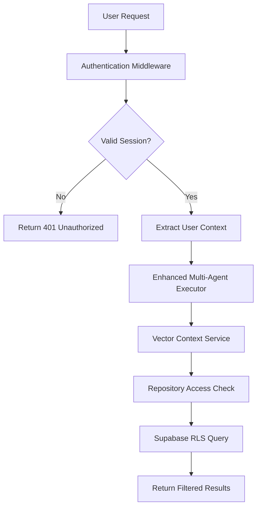

# 🔐 Authentication Integration Plan for Vector DB Multi-Agent System

## Executive Summary

Based on our security audit, the Vector DB implementation requires proper authentication integration to ensure secure multi-tenant operations. This document outlines the authentication requirements, integration points, and implementation strategy.

## 🎯 Current State Analysis

### ✅ **What We Have**
- **Row Level Security (RLS)** policies in Supabase
- **AuthenticatedRAGService** with basic user context
- **Security placeholders** in Vector services (userId parameters)
- **Repository access filtering** infrastructure

### ❌ **What's Missing**
- **Actual authentication flow** for multi-agent executor
- **User session management** throughout agent execution
- **Permission validation** before agent operations
- **Token/session passing** between services
- **Authentication error handling** and fallbacks

### 🚨 **Security Gaps Identified**
```typescript
// CURRENT: Mock user context
const context = await prepareAgentContext(agentRole, 'user-123', additionalContext);

// NEEDED: Real authenticated user
const context = await prepareAgentContext(agentRole, authenticatedUser, additionalContext);
```

## 🏗️ Authentication Architecture Requirements

### **1. Authentication Flow Integration**



### **2. User Context Propagation**

Every service in the chain needs authenticated user context:

```typescript
interface AuthenticatedUser {
  id: string;
  email: string;
  organizationId?: string;
  permissions: UserPermissions;
  session: {
    token: string;
    expiresAt: Date;
    refreshToken?: string;
  };
}

interface UserPermissions {
  repositories: {
    [repositoryId: string]: {
      read: boolean;
      write: boolean;
      admin: boolean;
    };
  };
  organizations: string[];
  globalPermissions: string[];
}
```

## 📋 Integration Requirements by Component

### **1. EnhancedMultiAgentExecutor**

#### **Current Signature**:
```typescript
constructor(
  config: MultiAgentConfig,
  repositoryData: RepositoryData,
  vectorContextService: VectorContextService,
  options?: EnhancedExecutionOptions
)

private async prepareAgentContext(
  agentRole: string,
  userId: string, // ❌ Just a string
  additionalContext?: Record<string, any>
): Promise<EnhancedAgentContext>
```

#### **Required Changes**:
```typescript
constructor(
  config: MultiAgentConfig,
  repositoryData: RepositoryData,
  vectorContextService: VectorContextService,
  authenticatedUser: AuthenticatedUser, // ✅ Full user context
  options?: EnhancedExecutionOptions
)

private async prepareAgentContext(
  agentRole: string,
  authenticatedUser: AuthenticatedUser, // ✅ Full user context
  additionalContext?: Record<string, any>
): Promise<EnhancedAgentContext>
```

#### **Security Validations Needed**:
1. **Repository Access**: Verify user can access `repositoryData.repository`
2. **Agent Permissions**: Check if user can execute multi-agent analysis
3. **Resource Limits**: Apply user-specific quotas and rate limits
4. **Session Validation**: Ensure session is still valid throughout execution

### **2. VectorContextService**

#### **Current Implementation**:
```typescript
async getRepositoryContext(
  repositoryId: string,
  agentRole: AgentRole,
  userId: string, // ❌ Just a string
  options: {...}
): Promise<RepositoryVectorContext>
```

#### **Required Changes**:
```typescript
async getRepositoryContext(
  repositoryId: string,
  agentRole: AgentRole,
  authenticatedUser: AuthenticatedUser, // ✅ Full user context
  options: {...}
): Promise<RepositoryVectorContext>
```

#### **Security Enhancements**:
1. **Permission Check**: Validate repository access before any queries
2. **Audit Logging**: Log all access attempts with user context
3. **Content Filtering**: Apply user-specific content filters
4. **Rate Limiting**: Implement per-user query limits

### **3. VectorStorageService**

#### **Current Implementation**:
```typescript
async storeAnalysisResults(
  repositoryId: string,
  analysisResults: AnalysisResult[],
  userId: string, // ❌ Just a string
  options: {...}
): Promise<{stored: number; errors: number}>
```

#### **Required Changes**:
```typescript
async storeAnalysisResults(
  repositoryId: string,
  analysisResults: AnalysisResult[],
  authenticatedUser: AuthenticatedUser, // ✅ Full user context
  options: {...}
): Promise<{stored: number; errors: number}>
```

#### **Security Enhancements**:
1. **Write Permission**: Verify user can modify repository data
2. **Content Validation**: Ensure user owns the analysis being stored
3. **Quota Management**: Check storage limits per user/organization
4. **Audit Trail**: Log all storage operations with user context

## 🔗 Integration Points with Existing Infrastructure

### **1. Supabase Authentication**

#### **Current AuthenticatedRAGService Integration**:
```typescript
// In authenticated-rag-service.ts
async search(options: AuthenticatedSearchOptions, user: AuthenticatedUser): Promise<AuthenticatedSearchResult[]>
```

#### **Required Extension**:
```typescript
// Extend to support full multi-agent workflow
interface SupabaseAuthIntegration {
  validateSession(token: string): Promise<AuthenticatedUser>;
  refreshToken(refreshToken: string): Promise<AuthenticatedUser>;
  getRepositoryPermissions(userId: string): Promise<UserPermissions>;
  logSecurityEvent(event: SecurityEvent): Promise<void>;
}
```

### **2. API Integration Layer**

#### **New Authentication Middleware**:
```typescript
class MultiAgentAuthMiddleware {
  async validateRequest(request: MultiAgentRequest): Promise<AuthenticatedUser> {
    // 1. Extract token from request
    // 2. Validate with Supabase
    // 3. Check session expiry
    // 4. Load user permissions
    // 5. Return full user context
  }

  async authorizeRepositoryAccess(
    user: AuthenticatedUser, 
    repositoryId: string, 
    permission: 'read' | 'write' | 'admin'
  ): Promise<boolean> {
    // Validate specific repository access
  }
}
```

### **3. Error Handling and Security**

#### **Authentication Error Types**:
```typescript
enum AuthenticationError {
  INVALID_TOKEN = 'INVALID_TOKEN',
  EXPIRED_SESSION = 'EXPIRED_SESSION',
  INSUFFICIENT_PERMISSIONS = 'INSUFFICIENT_PERMISSIONS',
  REPOSITORY_ACCESS_DENIED = 'REPOSITORY_ACCESS_DENIED',
  RATE_LIMIT_EXCEEDED = 'RATE_LIMIT_EXCEEDED',
  SESSION_REFRESH_FAILED = 'SESSION_REFRESH_FAILED'
}
```

#### **Security Event Logging**:
```typescript
interface SecurityEvent {
  type: 'AUTH_SUCCESS' | 'AUTH_FAILURE' | 'ACCESS_DENIED' | 'PERMISSION_ESCALATION';
  userId?: string;
  sessionId: string;
  repositoryId?: string;
  agentRole?: string;
  ipAddress: string;
  userAgent: string;
  timestamp: Date;
  details: Record<string, any>;
}
```

## 🛠️ Implementation Strategy

### **Phase 1: Core Authentication Integration**
1. **Update EnhancedMultiAgentExecutor** to require AuthenticatedUser
2. **Modify Vector services** to use full user context
3. **Implement authentication middleware** for request validation
4. **Add repository permission checks** before operations

### **Phase 2: Security Enhancements**
1. **Add comprehensive audit logging** throughout the system
2. **Implement rate limiting** per user/organization
3. **Add session management** with refresh capabilities
4. **Create security event monitoring** dashboard

### **Phase 3: Advanced Features**
1. **Organization-level permissions** and multi-tenancy
2. **Role-based access control** (RBAC) integration
3. **Advanced threat detection** and anomaly monitoring
4. **Compliance reporting** and audit trails

## 📊 API Changes Required

### **Breaking Changes**

#### **EnhancedMultiAgentExecutor Constructor**:
```typescript
// BEFORE
new EnhancedMultiAgentExecutor(
  config,
  repositoryData,
  vectorContextService,
  options
)

// AFTER
new EnhancedMultiAgentExecutor(
  config,
  repositoryData,
  vectorContextService,
  authenticatedUser, // ✅ New required parameter
  options
)
```

#### **Service Method Signatures**:
```typescript
// ALL userId: string parameters become authenticatedUser: AuthenticatedUser
```

### **New API Endpoints**

#### **Authentication Endpoints**:
```typescript
POST /api/auth/validate-session
POST /api/auth/refresh-token
GET  /api/auth/user-permissions
GET  /api/auth/repository-access/:repositoryId
```

#### **Multi-Agent Execution**:
```typescript
POST /api/multi-agent/execute
// Body: { config, repositoryData, options }
// Headers: { Authorization: "Bearer <token>" }
```

## 🔒 Security Considerations

### **1. Token Management**
- **Short-lived access tokens** (15-30 minutes)
- **Secure refresh token rotation** 
- **Token revocation** on suspicious activity
- **Per-session security context** tracking

### **2. Permission Validation**
- **Fail-secure defaults** (deny by default)
- **Principle of least privilege** enforcement
- **Dynamic permission loading** from database
- **Permission caching** with TTL for performance

### **3. Session Security**
- **Session fingerprinting** to detect hijacking
- **IP address validation** for session binding
- **Concurrent session limits** per user
- **Session invalidation** on permission changes

### **4. Audit and Monitoring**
- **Comprehensive security logging** for all operations
- **Real-time threat detection** based on patterns
- **Compliance reporting** for SOC 2, GDPR, etc.
- **Security metrics** and alerting

## 📈 Performance Considerations

### **1. Authentication Overhead**
- **Token validation caching** to reduce database calls
- **Permission caching** with Redis/in-memory store
- **Batch permission checks** for efficiency
- **Async validation** where possible

### **2. Database Impact**
- **Connection pooling** for auth-related queries
- **Read replicas** for permission lookups
- **Optimized RLS policies** for performance
- **Permission denormalization** for faster checks

### **3. Scalability**
- **Stateless authentication** for horizontal scaling
- **Distributed session storage** with Redis
- **Load balancer session affinity** if needed
- **Authentication service separation** for scaling

## 🧪 Testing Requirements

### **1. Authentication Testing**
- **Unit tests** for all auth integration points
- **Integration tests** for end-to-end auth flows
- **Security tests** for permission bypass attempts
- **Performance tests** under authentication load

### **2. Mock Authentication**
```typescript
// For testing environments
class MockAuthenticationService {
  createTestUser(permissions: UserPermissions): AuthenticatedUser;
  simulateExpiredSession(): void;
  simulateInvalidToken(): void;
}
```

### **3. Security Testing**
- **Permission escalation** testing
- **Token manipulation** testing
- **Session hijacking** simulation
- **Rate limiting** validation

## 🚀 Migration Strategy

### **1. Backward Compatibility**
```typescript
// Provide compatibility wrapper during migration
class LegacyMultiAgentExecutor extends EnhancedMultiAgentExecutor {
  constructor(config, repositoryData, vectorContextService, options) {
    const mockUser = createMockUser(); // For migration period
    super(config, repositoryData, vectorContextService, mockUser, options);
  }
}
```

### **2. Gradual Rollout**
1. **Phase 1**: Add authentication as optional parameter
2. **Phase 2**: Make authentication required in new endpoints
3. **Phase 3**: Deprecate legacy endpoints
4. **Phase 4**: Remove legacy compatibility

### **3. Feature Flags**
```typescript
interface AuthenticationConfig {
  requireAuthentication: boolean;
  enablePermissionChecking: boolean;
  enableAuditLogging: boolean;
  enableRateLimiting: boolean;
}
```

## 📝 Documentation Requirements

### **1. Security Documentation**
- **Authentication flow diagrams**
- **Permission model documentation**
- **Security best practices guide**
- **Threat model and mitigations**

### **2. API Documentation**
- **Updated endpoint documentation**
- **Authentication requirements**
- **Error response formats**
- **Rate limiting information**

### **3. Developer Guides**
- **Integration guide** for existing applications
- **Migration guide** from legacy implementation
- **Testing guide** with mock authentication
- **Troubleshooting guide** for auth issues

## ✅ Success Criteria

### **1. Security**
- [ ] All operations require valid authentication
- [ ] Repository access properly validated
- [ ] Comprehensive audit logging implemented
- [ ] Rate limiting prevents abuse

### **2. Performance**
- [ ] Authentication adds <100ms overhead
- [ ] Permission checks cached effectively
- [ ] No database connection leaks
- [ ] Scales to 1000+ concurrent users

### **3. Compliance**
- [ ] SOC 2 compliance requirements met
- [ ] GDPR data access controls implemented
- [ ] Audit logs meet compliance standards
- [ ] Security incident response procedures

### **4. Developer Experience**
- [ ] Clear migration path provided
- [ ] Comprehensive testing utilities
- [ ] Good error messages and debugging
- [ ] Documentation covers all scenarios

## 🎯 Next Steps

1. **Review this plan** with security and architecture teams
2. **Define authentication provider** choice (Supabase Auth, Auth0, etc.)
3. **Create detailed implementation tickets** for each phase
4. **Set up testing environment** with mock authentication
5. **Begin Phase 1 implementation** with core integration

---

**This authentication integration is critical for production deployment of the Vector DB multi-agent system. All security vulnerabilities identified in the audit depend on proper authentication implementation.**