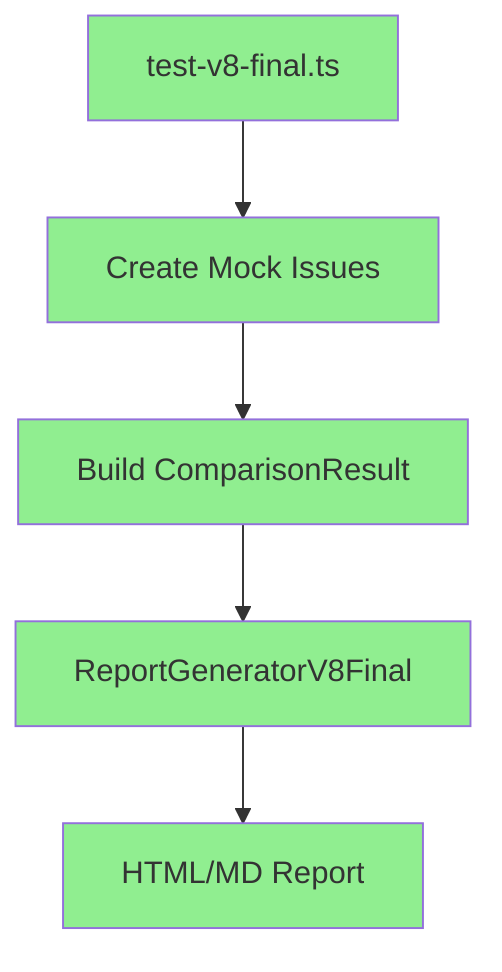
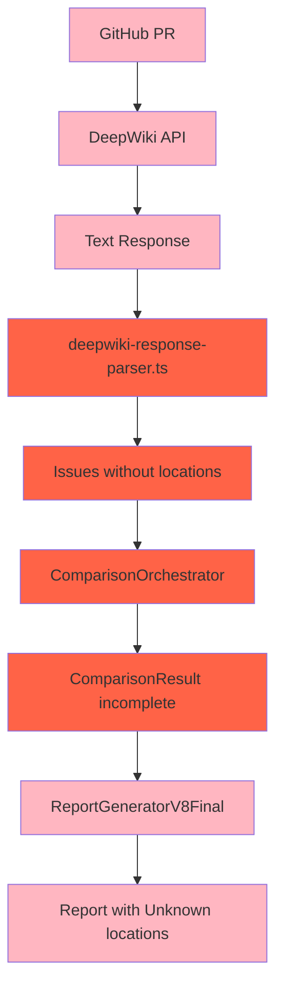

# Data Flow Guide - CodeQual Analysis Pipeline

## Overview

This guide documents the exact data structures and flow through the CodeQual analysis pipeline, showing what works and what's broken.

## 📊 Core Data Structures

### 1. Issue Structure (Required Fields)

```typescript
interface Issue {
  // Identification
  id?: string;                    // Unique identifier
  type: string;                    // 'security' | 'performance' | 'code-quality' | etc.
  severity: string;                // 'critical' | 'high' | 'medium' | 'low'
  category: string;                // Specific category like 'SQL Injection'
  
  // Description
  message: string;                 // Brief description of the issue
  description?: string;            // Detailed explanation
  
  // Location (ALL THREE REQUIRED for proper display)
  file: string;                    // 'src/models/user.py'
  line: number;                    // 456
  location: string;                // Legacy field, same as file
  
  // Optional location object (alternative format)
  location?: {
    file: string;
    line: number;
    column?: number;
  }
  
  // Additional context
  codeSnippet?: string;           // The problematic code
  suggestion?: string;            // How to fix it
  impact?: string;                // Business impact
  effort?: number;                // Fix effort (1-5)
}
```

### 2. ComparisonResult Structure (V8 Generator Input)

```typescript
interface ComparisonResult {
  // Required
  success: boolean;               // Must be true for valid result
  newIssues: Issue[];            // Issues found in feature branch only
  resolvedIssues: Issue[];       // Issues fixed in feature branch
  unchangedIssues: Issue[];      // Issues in both branches
  
  // Optional but recommended
  prMetadata?: {
    repository: string;           // 'sindresorhus/ky'
    prNumber: number;            // 700
    title: string;               // PR title
    author: string;              // GitHub username
    baseRef: string;             // 'main'
    headRef: string;             // 'feature-branch'
    filesChanged: number;        // Count of changed files
    additions: number;           // Lines added
    deletions: number;           // Lines removed
  };
  
  // Analysis metadata
  timestamp?: string;            // ISO date string
  aiInsights?: {
    educationalContent?: string[];
    performanceImpact?: string;
    securityAssessment?: string;
  };
}
```

### 3. DeepWiki Response (Raw API Output)

```typescript
interface DeepWikiResponse {
  choices: [{
    message: {
      content: string;  // Text analysis with issues described
    }
  }];
  // Location data is embedded in text like:
  // "In file src/api/handler.js at line 234..."
  // "The SQL injection vulnerability at database/query.py:456..."
}
```

## 🔄 Data Flow Paths

### Path 1: Mock Data (✅ WORKING)



**Key Points:**
- Mock data includes all required fields
- Locations are hardcoded correctly
- Direct pass to V8 generator
- No transformations needed

### Path 2: Real DeepWiki (❌ BROKEN)



**Failure Points:**
1. **D → E**: Parser doesn't extract file:line from text
2. **F → G**: PR metadata not passed through
3. **G**: Missing location data propagates

## 🔧 Data Transformations

### ✅ Correct Transformation (Mock)

```typescript
// Input: Raw issue data
const rawIssue = {
  type: 'security',
  message: 'SQL Injection vulnerability',
  file: 'api/db.py',
  line: 123
};

// Transform: Add required fields
const issue: Issue = {
  ...rawIssue,
  severity: 'critical',
  category: 'SQL Injection',
  location: rawIssue.file,  // Legacy field
  location: {               // Object format
    file: rawIssue.file,
    line: rawIssue.line
  }
};

// Output: Ready for V8 generator
const comparison: ComparisonResult = {
  success: true,
  newIssues: [issue],
  resolvedIssues: [],
  unchangedIssues: []
};
```

### ❌ Broken Transformation (DeepWiki)

```typescript
// Input: DeepWiki text response
const deepwikiText = "SQL injection found in api/db.py at line 123";

// Current parser (BROKEN)
const parsed = {
  type: 'security',
  message: deepwikiText,
  file: 'unknown',      // ❌ Lost location
  line: 0,              // ❌ Lost line number
  location: 'unknown'   // ❌ Lost location
};

// What it SHOULD do
const parsed = {
  type: 'security',
  message: 'SQL injection found',
  file: 'api/db.py',    // ✅ Extracted from text
  line: 123,            // ✅ Extracted from text
  location: 'api/db.py' // ✅ Set to file path
};
```

## 📝 Format Examples

### Example 1: Valid Issue (Will Display Correctly)

```json
{
  "type": "security",
  "severity": "critical",
  "category": "SQL Injection",
  "message": "User input directly concatenated into SQL query",
  "file": "src/api/database.py",
  "line": 234,
  "location": "src/api/database.py",
  "codeSnippet": "query = f\"SELECT * FROM users WHERE id = {user_id}\"",
  "suggestion": "Use parameterized queries or an ORM"
}
```

### Example 2: Invalid Issue (Shows "Unknown location")

```json
{
  "type": "security",
  "severity": "critical",
  "message": "SQL injection vulnerability detected",
  "file": "unknown",
  "line": 0
}
```

## 🔍 Debugging Data Flow

### Check Issue Structure

```typescript
// Add this to debug issues before report generation
console.log('Issue structure check:', {
  hasFile: !!issue.file && issue.file !== 'unknown',
  hasLine: !!issue.line && issue.line > 0,
  hasLocation: !!issue.location,
  locationValue: issue.location,
  fullIssue: issue
});
```

### Validate ComparisonResult

```typescript
function validateComparisonResult(result: ComparisonResult): boolean {
  const hasSuccess = result.success === true;
  const hasArrays = Array.isArray(result.newIssues) && 
                   Array.isArray(result.resolvedIssues) && 
                   Array.isArray(result.unchangedIssues);
  
  const allIssuesValid = [...result.newIssues, 
                          ...result.resolvedIssues, 
                          ...result.unchangedIssues]
    .every(issue => 
      issue.file && 
      issue.file !== 'unknown' && 
      issue.line > 0
    );
    
  return hasSuccess && hasArrays && allIssuesValid;
}
```

## 🚀 Quick Fixes

### Fix 1: Force Location in Pipeline

```typescript
// Add after DeepWiki parsing
issues.forEach(issue => {
  if (!issue.file || issue.file === 'unknown') {
    // Try to extract from message
    const match = issue.message.match(/(\S+\.\w+):(\d+)/);
    if (match) {
      issue.file = match[1];
      issue.line = parseInt(match[2]);
      issue.location = match[1];
    }
  }
});
```

### Fix 2: Use Mock Service

```typescript
// Replace DeepWiki with mock for testing
if (process.env.USE_DEEPWIKI_MOCK === 'true') {
  return mockDeepWikiService.analyze(repo);
} else {
  // Real DeepWiki (broken)
  return deepWikiService.analyze(repo);
}
```

## 📋 Validation Checklist

Before generating a report, ensure:

- [ ] All issues have `file` field (not 'unknown')
- [ ] All issues have `line` > 0
- [ ] All issues have `type` and `severity`
- [ ] ComparisonResult has `success: true`
- [ ] PR metadata is present (if analyzing PR)
- [ ] At least one issue array is non-empty

## 🎯 Target State

The goal is to have all data flow paths produce:

```typescript
{
  success: true,
  newIssues: [
    {
      type: 'security',
      severity: 'high',
      category: 'Input Validation',
      message: 'Unvalidated user input',
      file: 'src/api/endpoint.js',
      line: 123,
      location: 'src/api/endpoint.js',
      codeSnippet: 'const data = req.body.data;',
      suggestion: 'Validate and sanitize input'
    }
  ],
  prMetadata: {
    repository: 'org/repo',
    prNumber: 500,
    title: 'Add new feature',
    author: 'developer'
  }
}
```

---

*Use this guide to understand and debug data flow issues in the pipeline.*