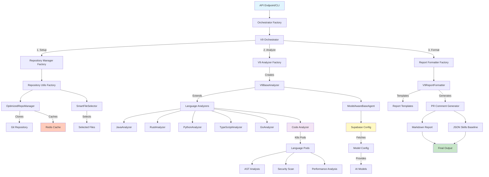
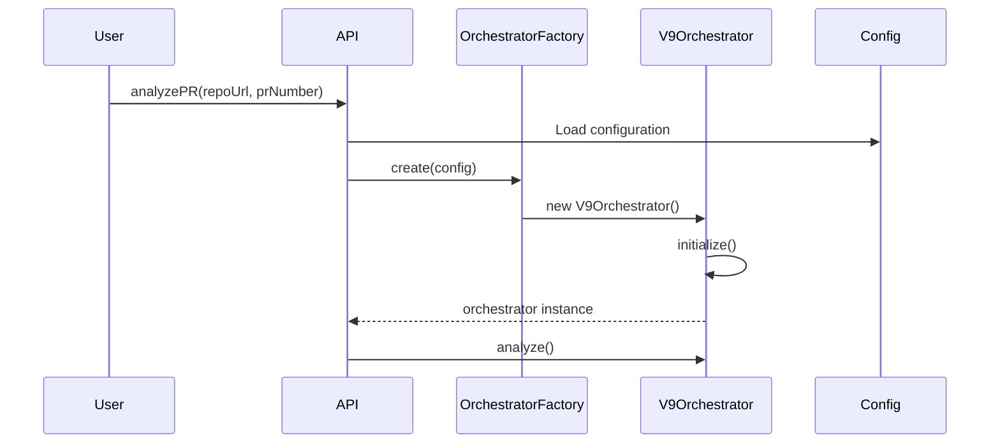
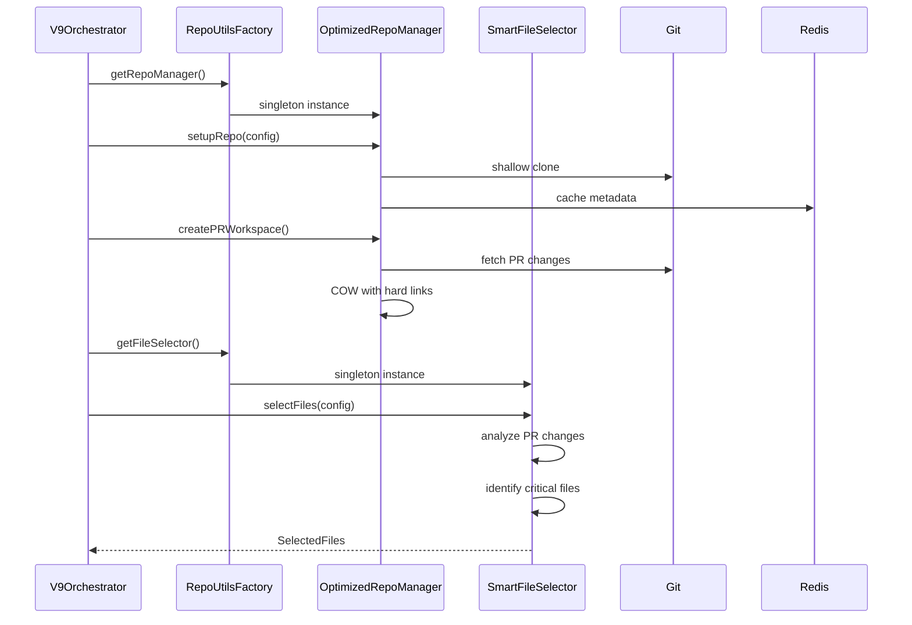
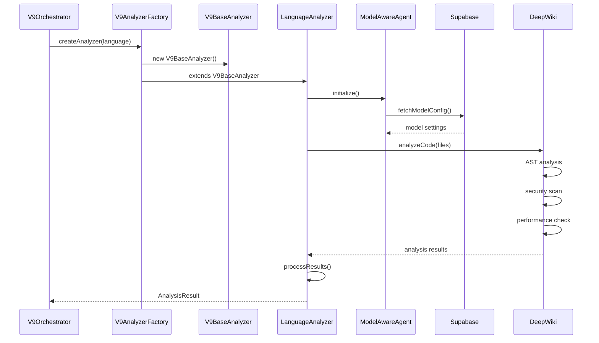
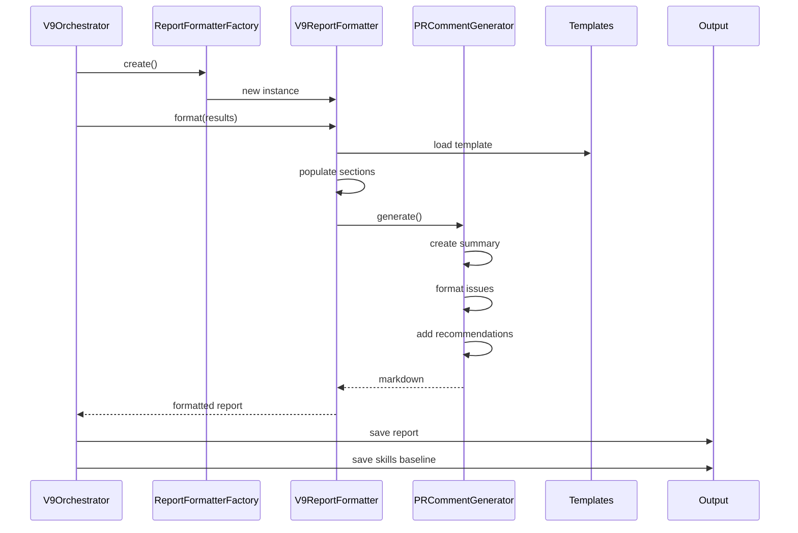
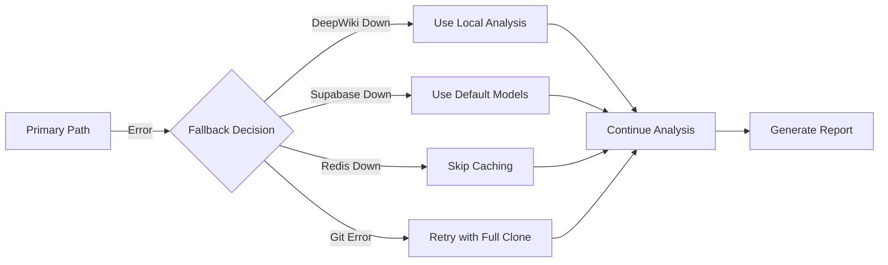

# V9 Analyzer Architecture Flow

## Complete System Architecture



## Detailed Component Flow

### 1. Entry Point & Orchestration



### 2. Repository Setup Flow



### 3. Analysis Flow



### 4. Report Generation Flow



## Key Components & Responsibilities

### Core Components

| Component | Responsibility | Location |
|-----------|---------------|----------|
| **V9Orchestrator** | Main coordination of analysis flow | `/src/two-branch/orchestrator/` |
| **V9AnalyzerFactory** | Creates language-specific analyzers | `/src/two-branch/analyzers/v9-analyzer-factory.ts` |
| **V9BaseAnalyzer** | Base class for all analyzers | `/src/two-branch/analyzers/v9-base-analyzer.ts` |
| **ModelAwareBaseAgent** | Handles AI model integration | `/src/two-branch/agents/model-aware-base-agent.ts` |
| **RepositoryUtilsFactory** | Manages repo utilities | `/src/two-branch/utils/repository-utils-factory.ts` |

### Repository Management

| Component | Responsibility | Features |
|-----------|---------------|----------|
| **OptimizedRepoManager** | Efficient repo cloning | - Shallow clones<br>- COW workspaces<br>- Redis caching |
| **SmartFileSelector** | Intelligent file selection | - PR change detection<br>- Critical path identification<br>- Size-based strategies |

### Language Analyzers

| Analyzer | Special Features |
|----------|-----------------|
| **JavaAnalyzer** | Spring Boot patterns, JPA detection |
| **RustAnalyzer** | Unsafe block detection, ownership analysis |
| **TypeScriptAnalyzer** | Type safety checks, React patterns |
| **PythonAnalyzer** | Django/Flask patterns, type hints |
| **GoAnalyzer** | Goroutine analysis, interface checks |

### External Services

| Service | Purpose | Integration |
|---------|---------|-------------|
| **Supabase** | Model configuration storage | REST API |
| **Redis** | Repository metadata cache | ioredis client |
| **OpenRouter** | AI model access | API calls |

## Data Flow

### Input Data
```typescript
interface AnalysisRequest {
  repositoryUrl: string;
  prNumber: number;
  branch?: string;
  config?: {
    useSmartSelection: boolean;
    maxFiles: number;
    forceFullAnalysis: boolean;
    models?: string[];
  };
}
```

### Intermediate Data
```typescript
interface AnalysisContext {
  repository: {
    mainPath: string;
    prPath: string;
    changedFiles: string[];
  };
  selectedFiles: SelectedFiles;
  language: string;
  modelConfig: ModelConfig;
  deepWikiResults?: DeepWikiAnalysis;
}
```

### Output Data
```typescript
interface AnalysisResult {
  summary: {
    totalIssues: number;
    criticalIssues: number;
    score: number;
  };
  issues: Issue[];
  recommendations: string[];
  prDecision: 'APPROVE' | 'REQUEST_CHANGES' | 'COMMENT';
  report: {
    markdown: string;
    json: SkillsBaseline;
  };
}
```

## Error Handling & Fallbacks



## Configuration Hierarchy

1. **Environment Variables** (highest priority)
   - `SUPABASE_URL`, `SUPABASE_KEY`
   - `REDIS_URL`
   - `OPENROUTER_API_KEY`
   - `USE_MOCK_ANALYZER`

2. **Supabase Configuration**
   - Model tiers and capabilities
   - Repository-specific settings
   - Feature flags

3. **Default Configuration** (lowest priority)
   - Built-in analyzer settings
   - Fallback model choices
   - Standard file patterns

## Testing Strategy

### Unit Tests
- Individual analyzer components
- Factory pattern validation
- Utility function testing

### Integration Tests
- End-to-end flow validation
- Service integration checks
- Error handling verification

### Test Files
```
test-v9-minimal-working.ts    # Core functionality
test-v9-baseline.ts           # Skills baseline generation
test-v9-real-pr-analysis.ts   # Real PR testing
test-repository-utils.ts      # Utility validation
```

## Performance Optimizations

1. **Repository Caching**
   - Shallow clones (depth=500)
   - COW workspaces with hard links
   - Redis metadata caching

2. **Smart File Selection**
   - Analyze only changed files for small PRs
   - Priority-based selection for large repos
   - Language-specific critical paths

3. **Parallel Processing**
   - Concurrent analysis execution
   - Parallel file analysis
   - Batch API calls

4. **Resource Management**
   - Singleton pattern for heavy objects
   - Connection pooling
   - Automatic cleanup

## Monitoring & Observability

- **Logging**: Structured logs at each layer
- **Metrics**: Analysis time, cache hits, model usage
- **Tracing**: Request ID propagation
- **Health Checks**: Service availability monitoring

---

*This architecture ensures scalability, maintainability, and efficient resource usage while providing comprehensive code analysis capabilities.*