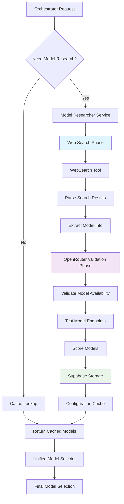

# Model Research Flow Architecture

## Overview

The CodeQual model research system provides dynamic AI model discovery, validation, and selection capabilities. This system researches the latest AI models quarterly and maintains optimal model configurations for different development contexts.

## Architecture Diagram



## Core Components

### 1. Model Researcher Service (`model-researcher-service.ts`)

**Primary Responsibilities:**
- Quarterly model discovery and research
- Model validation with OpenRouter API
- Context-specific model optimization
- Supabase configuration management

**Key Methods:**
```typescript
async performResearch(context?: ContextRequest): Promise<ModelResearchResult[]>
async searchWebForLatestModels(): Promise<any[]>
async researchModel(model: any): Promise<ModelResearchResult>
async storeModelConfiguration(models: ModelResearchResult[]): Promise<void>
getFallbackModel(context: ContextRequest): string
```

### 2. Web Search Integration

**Current Implementation:**
- **Tool Integration**: Uses MCP WebSearch tool when available
- **AI Fallback**: Falls back to AI-based web search researcher
- **Dynamic Extraction**: Extracts model information without hardcoded names

**Search Queries:**
```typescript
const searchQueries = [
  `latest AI models ${currentYear} OpenRouter supported`,
  `new language models ${currentYear} API available`,
  `coding AI models ${currentYear} programming assistance`,
  `multimodal AI models ${currentYear} text code`,
  `AI model releases ${currentYear} comparison benchmark`
];
```

**WebSearch Tool Integration:**
```typescript
// Note: WebSearch would be injected from the MCP environment
if (typeof WebSearch !== 'undefined') {
  const searchResults = await WebSearch({ query });
  const modelsFromSearch = this.parseWebSearchResults(searchResults);
  discoveredModels.push(...modelsFromSearch);
}
```

### 3. OpenRouter Validation Flow

**Validation Process:**
1. **Discovery**: Web search discovers potential models
2. **Endpoint Testing**: Validate model availability via OpenRouter API
3. **Capability Assessment**: Test model responses and capabilities
4. **Scoring**: Calculate quality, speed, and price scores
5. **Storage**: Store validated configurations in Supabase

**Fallback Mechanisms:**
- **Service Unavailable**: Uses cached models from last successful research
- **Network Errors**: Returns descriptive model names for manual mapping
- **API Failures**: Falls back to known working models

### 4. Supabase Configuration Storage

**Database Schema:**
```sql
CREATE TABLE model_research_results (
  id UUID PRIMARY KEY,
  model_id TEXT NOT NULL,
  provider TEXT NOT NULL,
  quality_score NUMERIC,
  speed_score NUMERIC,
  price_score NUMERIC,
  context_length INTEGER,
  specializations TEXT[],
  optimal_for JSONB,
  research_date TIMESTAMP,
  next_research_date TIMESTAMP,
  metadata JSONB
);
```

**Storage Operations:**
- **Upsert**: Update existing models or insert new ones
- **Versioning**: Track model changes over time
- **Expiration**: Automatic re-research every 90 days
- **Context Indexing**: Optimize for context-specific queries

### 5. Unified Model Selector Integration

**Integration Points:**
- **Model Provision**: Research service provides discovered models
- **Cache Management**: Unified selector caches research results
- **Role-Specific Selection**: Uses research data for role-based selection
- **Availability Validation**: Pre-filters models based on research

**Model Selection Flow:**
```typescript
// In UnifiedModelSelector
if (this.providedModels && this.providedModels.length > 0) {
  const preFiltered = this.availabilityValidator.preFilterModels(this.providedModels);
  return preFiltered;
}
```

## Data Flow

### 1. Research Trigger
```typescript
// Orchestrator requests model research
const context: ContextRequest = {
  language: 'typescript',
  repo_size: 'large',
  framework: 'react',
  task_type: 'code_review'
};
```

### 2. Web Discovery Phase
```typescript
// Dynamic model discovery
const discoveredModels = await searchWebForLatestModels();
// Returns: [{ name: 'gpt-4-turbo', provider: 'openai', ... }]
```

### 3. Validation Phase
```typescript
// Validate each discovered model
const validatedModels = await Promise.all(
  discoveredModels.map(model => this.researchModel(model))
);
```

### 4. Storage and Retrieval
```typescript
// Store in Supabase for future use
await this.storeModelConfiguration(validatedModels);

// Retrieve for specific contexts
const contextModels = await this.getModelsForContext(context);
```

## Configuration Management

### Environment Variables
```bash
# Supabase Configuration
SUPABASE_URL=https://your-project.supabase.co
SUPABASE_SERVICE_ROLE_KEY=your-service-role-key

# OpenRouter API (for validation)
OPENROUTER_API_KEY=your-openrouter-key

# Research Settings
MODEL_RESEARCH_ENABLED=true
RESEARCH_INTERVAL_DAYS=90
```

### Research Weights
```typescript
private readonly QUALITY_WEIGHT = 0.70;  // Prioritize model quality
private readonly SPEED_WEIGHT = 0.20;    // Response time matters
private readonly PRICE_WEIGHT = 0.10;    // Cost efficiency
```

## Files Involved

### Core Implementation
- `/src/standard/services/model-researcher-service.ts` - Main research service
- `/src/model-selection/unified-model-selector.ts` - Model selection integration
- `/src/model-selection/enhanced-model-selection-rules.ts` - Selection logic
- `/src/researcher/web-search-researcher.ts` - Web search fallback

### Supporting Files
- `/src/model-selection/model-availability-validator.ts` - Validation utilities
- `/src/researcher/researcher-service.ts` - Legacy research interface
- `/src/standard/services/model-selection-service.ts` - Selection service

### Test Files
- `/test-integrated-model-research.ts` - Integration testing
- `/test-dynamic-model-selection.ts` - Selection testing
- `/v8-model-validation/` - V8 validation results

## Fallback Mechanisms

### 1. WebSearch Tool Unavailable
```typescript
if (typeof WebSearch === 'undefined') {
  console.log('WebSearch tool not available, using AI-based search...');
  const { searchWebForLatestModels } = await import('../../researcher/web-search-researcher');
  return await searchWebForLatestModels();
}
```

### 2. Supabase Connection Failed
```typescript
private getFallbackModel(context: ContextRequest): string {
  return `high-quality-${context.repo_size}-model`;
}
```

### 3. Research Service Down
```typescript
// UnifiedModelSelector falls back to ModelVersionSync
const providers = ['openai', 'anthropic', 'google', 'openrouter'];
const models = providers.flatMap(provider => 
  this.modelVersionSync.getModelsForProvider(provider)
);
```

## Performance Considerations

### 1. Caching Strategy
- **Research Results**: Cached for 90 days
- **Model Selections**: Cached for 5 minutes
- **Validation Results**: Pre-filtered to avoid repeated checks

### 2. Batch Operations
- **Model Discovery**: Batch web searches for efficiency
- **Validation**: Parallel validation of discovered models
- **Storage**: Bulk upserts to Supabase

### 3. Rate Limiting
- **Web Search**: Respects MCP tool rate limits
- **OpenRouter API**: Built-in rate limit handling
- **Supabase**: Connection pooling for concurrent operations

## Error Handling

### 1. Network Failures
```typescript
try {
  const models = await this.searchWebForLatestModels();
  return await this.validateAndStoreModels(models);
} catch (error) {
  console.warn('Research failed, using fallback models:', error);
  return this.getFallbackModels();
}
```

### 2. Validation Errors
```typescript
const validatedModels = await Promise.allSettled(
  discoveredModels.map(model => this.researchModel(model))
);
// Handle both fulfilled and rejected promises
```

### 3. Storage Failures
```typescript
try {
  await this.storeModelConfiguration(models);
} catch (error) {
  console.warn('Storage failed, models will not be cached:', error);
  // Continue with in-memory models
}
```

## Future Enhancements

### 1. Real-time Model Monitoring
- **Status Tracking**: Monitor model availability in real-time
- **Performance Metrics**: Track actual usage statistics
- **Cost Optimization**: Dynamic pricing-based selection

### 2. Enhanced Validation
- **Capability Testing**: Automated capability assessment
- **Quality Benchmarking**: Standardized quality tests
- **Context Validation**: Test models against specific contexts

### 3. Machine Learning Integration
- **Usage Pattern Analysis**: Learn from actual usage patterns
- **Predictive Selection**: Predict optimal models for contexts
- **Feedback Loop**: Improve selection based on outcomes

## Security Considerations

### 1. API Key Management
- **Environment Variables**: Never commit API keys
- **Rotation Strategy**: Regular key rotation
- **Access Controls**: Restrict API key access

### 2. Data Privacy
- **Model Configurations**: No sensitive data in configurations
- **Research Results**: Anonymized performance metrics
- **Validation Logs**: Sanitized error logs

### 3. Rate Limit Protection
- **Circuit Breaker**: Prevent API abuse
- **Backoff Strategy**: Exponential backoff for failures
- **Quota Management**: Track and enforce API quotas

This architecture provides a robust, scalable foundation for dynamic AI model research and selection, ensuring CodeQual always uses the most appropriate models for each development context.