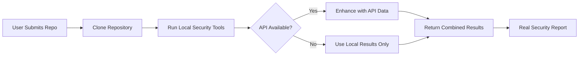

# Production Scanning Strategy - No Mock Data

## The Right Approach for Production

### 1. When API Calls Fail - Return Empty or Error

```typescript
private async scanDependencies(owner: string, repo: string): Promise<any[]> {
  if (!this.token) {
    console.log('No API token available');
    return []; // Return empty array, not mock data
  }

  try {
    const response = await this.makeGitHubRequest(
      `/repos/${owner}/${repo}/dependabot/alerts`,
      'GET'
    );
    return this.parseAlerts(response);
  } catch (error: any) {
    if (error.statusCode === 404) {
      // Feature not enabled - this is valid, return empty
      console.log('Dependabot not enabled for this repository');
      return [];
    }
    if (error.statusCode === 403) {
      // No permission - log it but return empty
      console.log('No permission to access Dependabot alerts');
      return [];
    }
    // Actual error - throw it or handle appropriately
    throw new Error(`Failed to scan dependencies: ${error.message}`);
  }
}
```

### 2. Use Local Scanning as Primary Method

Since you clone repositories, this should be your main approach:

```typescript
async analyzeRepository(repoUrl: string): Promise<SecurityReport> {
  // Step 1: Clone the repository
  const localPath = await this.cloneRepository(repoUrl);
  
  // Step 2: Run LOCAL security tools (REAL RESULTS)
  const results = {
    dependencies: await this.scanDependenciesLocally(localPath),
    secrets: await this.scanSecretsLocally(localPath),
    codeIssues: await this.scanCodeLocally(localPath)
  };
  
  // Step 3: Try to enhance with API data if available
  try {
    const apiData = await this.getGitHubAPIData(repoUrl);
    results.metadata = apiData; // Add stars, language stats, etc.
  } catch (error) {
    // API failed? No problem, we have local scan results
    console.log('API data not available, using local scan only');
  }
  
  return results;
}
```

### 3. Clear Communication About Data Sources

```typescript
interface SecurityReport {
  results: SecurityIssue[];
  metadata: {
    scanType: 'local' | 'api' | 'hybrid';
    dataSource: {
      dependencies: 'npm-audit' | 'github-api' | 'not-available';
      secrets: 'gitleaks' | 'github-api' | 'not-available';
      code: 'semgrep' | 'codeql' | 'not-available';
    };
    limitations?: string[];
  };
}

// Example response:
{
  results: [...], // Real security issues
  metadata: {
    scanType: 'local',
    dataSource: {
      dependencies: 'npm-audit',
      secrets: 'gitleaks',
      code: 'semgrep'
    },
    limitations: [
      'GitHub API access not available for this repository'
    ]
  }
}
```

## Remove Mock Data From These Files

1. **SimplifiedGitHubPlatformAgent.ts**
   - Remove: `getMockDependencyAlerts()`, `getMockCodeScanningAlerts()`, `getMockSecretAlerts()`
   - Replace with: Return `[]` or throw error

2. **SimplifiedGitLabPlatformAgent.ts**
   - Remove: All mock data methods
   - Replace with: Return `[]` or throw error

3. **Language Agents** (Python, JavaScript, etc.)
   - Remove: Mock data fallbacks
   - Keep: Only real tool execution

## The Correct Production Flow



## Benefits of No Mock Data

1. **Trust** - Users get real results they can act on
2. **Accuracy** - No false positives from fake data
3. **Value** - Every issue found is actionable
4. **Transparency** - Clear about what was scanned and how

## Implementation Example

```typescript
export class ProductionGitHubAgent {
  async analyze(repository: string): Promise<SecurityReport> {
    const report: SecurityReport = {
      results: [],
      metadata: {
        repository,
        scanDate: new Date(),
        scanType: 'local'
      }
    };

    try {
      // Clone and scan locally - PRIMARY method
      const localPath = await this.cloneRepo(repository);
      const localResults = await this.runLocalScans(localPath);
      report.results.push(...localResults);
      
      // Try API enhancement - OPTIONAL
      if (this.hasAPIAccess()) {
        const apiResults = await this.fetchAPIData(repository);
        report.results.push(...apiResults);
        report.metadata.scanType = 'hybrid';
      }
    } catch (error) {
      // Log error but don't return mock data
      console.error('Scan failed:', error);
      report.metadata.error = error.message;
    }

    return report; // Real results or empty, never mock
  }

  private async runLocalScans(path: string): Promise<SecurityIssue[]> {
    const issues: SecurityIssue[] = [];
    
    // Run REAL tools
    const tools = [
      { name: 'npm-audit', command: 'npm audit --json' },
      { name: 'gitleaks', command: 'gitleaks detect --no-git' },
      { name: 'semgrep', command: 'semgrep --config=auto' }
    ];

    for (const tool of tools) {
      try {
        const result = execSync(tool.command, { cwd: path });
        const parsed = this.parseToolOutput(tool.name, result);
        issues.push(...parsed);
      } catch (error) {
        console.log(`${tool.name} not available or found no issues`);
        // Don't add mock data here!
      }
    }

    return issues; // Only real issues
  }
}
```

## Summary

**Remove all mock data for production.** Instead:
1. Use local scanning as primary method (you clone repos anyway)
2. Return empty arrays when tools aren't available
3. Be transparent about what was scanned
4. Only show real, actionable security issues

This gives your users real value and builds trust in your service.