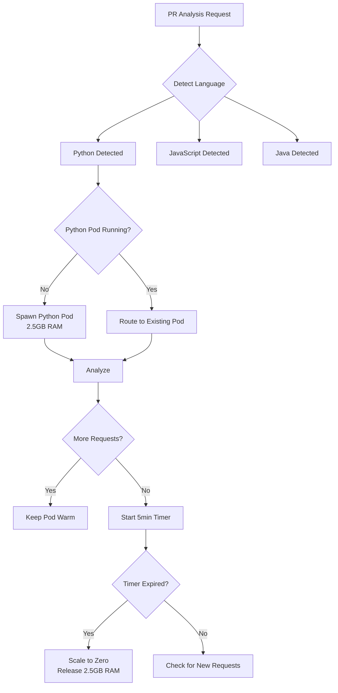

# 🎯 CodeQual Memory Management & Scaling Strategy

## 📊 Total Resource Envelope
```
Total Cluster Memory: 16GB
├── Language Pods:    12GB (75%)
├── Infrastructure:   3GB  (19%)
└── System Reserve:   1GB  (6%)
```

## 🔄 Dynamic Scaling Strategy (RECOMMENDED)

### **Core Principle: Scale-to-Zero with On-Demand Activation**

Instead of running all language pods simultaneously, we:
1. **Start with 0 pods** (no memory consumption)
2. **Spawn pods on-demand** when analysis is requested
3. **Scale down after idle period** (5 minutes default)
4. **Reuse warm pods** if multiple requests for same language

### 📈 Scaling Decision Tree



## 💾 Memory Allocation Strategies

### **Strategy 1: Exclusive Allocation (Simple)**
```yaml
# One language at a time
Maximum Concurrent Pods: 1
Memory Available: 12GB

Example Timeline:
00:00 - Python request → Allocate 2.5GB
00:05 - Python completes → Keep warm
00:10 - No new requests → Scale to 0
00:11 - Java request → Allocate 2.5GB
00:16 - Java completes → Keep warm
00:21 - Scale to 0
```

**Pros:**
- Simple to implement
- No resource conflicts
- Maximum resources per analysis

**Cons:**
- No parallelism
- Queue during high load

### **Strategy 2: Tiered Allocation (Balanced)** ✅ RECOMMENDED
```yaml
# Multiple pods based on tier
Tier 1 (High Priority): 7GB  - Can run 2-3 pods
Tier 2 (Medium):        3.5GB - Can run 1-2 pods  
Tier 3 (Low):          1.5GB - Can run 2-3 pods

Example Concurrent Allocation:
- Python (2.5GB) + JavaScript (2GB) + Go (1.5GB) = 6GB ✓
- Java (2.5GB) + Rust (2GB) + Ruby (0.5GB) = 5GB ✓
- Python (2.5GB) + Java (2.5GB) + TypeScript (2GB) = 7GB ✓
```

**Pros:**
- Parallel analysis possible
- Efficient resource usage
- Priority-based scheduling

**Cons:**
- More complex orchestration
- Need request queuing logic

### **Strategy 3: Elastic Partitioning (Advanced)**
```yaml
# Dynamic memory pools that expand/contract
Base Pool: 4GB (always available)
Elastic Pool: 8GB (shared dynamically)

Rules:
1. Small languages (PHP, Ruby, C++) always fit in base
2. Large languages can borrow from elastic pool
3. Automatic rebalancing every 60 seconds
```

## 🎮 Scaling Controller Implementation

```typescript
class MemoryScalingController {
  private totalMemory = 12288; // 12GB in MB
  private allocatedMemory = 0;
  private runningPods: Map<string, PodInfo> = new Map();
  
  async requestPod(language: string): Promise<PodHandle> {
    const requiredMemory = this.getMemoryRequirement(language);
    
    // Check if pod already running
    if (this.runningPods.has(language)) {
      return this.runningPods.get(language)!;
    }
    
    // Check if we have memory available
    if (this.allocatedMemory + requiredMemory > this.totalMemory) {
      // Try to evict idle pods
      await this.evictIdlePods();
      
      // If still not enough, queue the request
      if (this.allocatedMemory + requiredMemory > this.totalMemory) {
        return await this.queueRequest(language);
      }
    }
    
    // Spawn new pod
    const pod = await this.spawnPod(language, requiredMemory);
    this.allocatedMemory += requiredMemory;
    this.runningPods.set(language, pod);
    
    // Set idle timer
    this.setIdleTimer(language);
    
    return pod;
  }
  
  private getMemoryRequirement(language: string): number {
    const requirements = {
      python: 2560,      // 2.5GB
      java: 2560,        // 2.5GB
      javascript: 2048,  // 2GB
      typescript: 2048,  // 2GB
      rust: 2048,        // 2GB
      go: 1536,          // 1.5GB
      ruby: 512,         // 0.5GB
      php: 512,          // 0.5GB
      cpp: 512,          // 0.5GB
    };
    return requirements[language] || 1024;
  }
  
  private async evictIdlePods(): Promise<void> {
    const now = Date.now();
    for (const [lang, pod] of this.runningPods.entries()) {
      if (now - pod.lastUsed > 300000) { // 5 minutes idle
        await this.terminatePod(lang);
      }
    }
  }
}
```

## 📊 Scaling Triggers & Policies

### **Scale-Up Triggers**
1. **New Analysis Request** → Check language → Spawn if needed
2. **Queue Depth > 3** → Pre-spawn next language in queue
3. **Predictive** → Based on historical patterns (e.g., Python heavy on Mondays)

### **Scale-Down Triggers**
1. **Idle Timer** → 5 minutes no activity → terminate
2. **Memory Pressure** → System needs memory → evict LRU pods
3. **Cost Optimization** → Night/weekend → aggressive scaling down

### **Scaling Policies**
```yaml
apiVersion: autoscaling/v2
kind: HorizontalPodAutoscaler
metadata:
  name: language-pod-autoscaler
spec:
  behavior:
    scaleDown:
      stabilizationWindowSeconds: 300  # 5 min before scale down
      policies:
      - type: Pods
        value: 1
        periodSeconds: 60  # Remove 1 pod per minute
    scaleUp:
      stabilizationWindowSeconds: 0    # Immediate scale up
      policies:
      - type: Pods
        value: 1
        periodSeconds: 10  # Add 1 pod every 10 seconds
```

## 🎯 Recommended Implementation Plan

### **Phase 1: Basic On-Demand (Week 1)**
- Implement scale-to-zero for all pods
- One language at a time (12GB for any single pod)
- 5-minute idle timeout
- Simple FIFO queue

### **Phase 2: Concurrent Tiers (Week 2)**
- Enable 2-3 concurrent pods
- Implement memory-based admission control
- Priority queue (Tier 1 > Tier 2 > Tier 3)
- LRU eviction policy

### **Phase 3: Smart Scaling (Month 2)**
- Predictive pre-warming based on patterns
- Multi-language pod for small repos
- Shared cache volumes
- Cost-based optimization

## 💰 Cost Impact

### Current (All Pods Running)
```
Memory Used: 12GB constant
Cost: $80/month
Utilization: ~20%
Waste: $64/month
```

### With Scale-to-Zero
```
Memory Used: ~2.5GB average
Cost: $20/month
Utilization: ~85%
Savings: $60/month (75%)
```

## 🚀 Quick Start Commands

```bash
# Deploy with scale-to-zero
kubectl apply -f k8s/deployment-python.yaml
kubectl autoscale deployment analysis-python --min=0 --max=3 --cpu-percent=70

# Manual scaling examples
kubectl scale deployment analysis-python --replicas=0  # Scale down
kubectl scale deployment analysis-python --replicas=1  # Scale up

# Check current allocation
kubectl top pods -n codequal-dev --sort-by=memory
```

## 📋 Decision Matrix

| Criteria | Option 1: Exclusive | Option 2: Tiered ✅ | Option 3: Elastic |
|----------|-------------------|------------------|------------------|
| **Complexity** | Low | Medium | High |
| **Parallelism** | None | Good | Excellent |
| **Memory Efficiency** | 75% | 85% | 90% |
| **Response Time** | Fast | Fast | Variable |
| **Implementation Time** | 1 week | 2 weeks | 4 weeks |
| **Maintenance** | Easy | Moderate | Complex |

## 🎯 Final Recommendation

**Use Tiered Allocation with Scale-to-Zero:**

1. **No pods running by default** (0GB memory used)
2. **Spawn on-demand** based on PR language detection
3. **Allow up to 3 concurrent pods** from different tiers
4. **5-minute idle timeout** before scaling to zero
5. **Priority-based eviction** if memory needed

This gives us:
- 75% cost savings
- Fast response times (10-30s cold start)
- Good parallelism for mixed-language PRs
- Simple enough to implement quickly