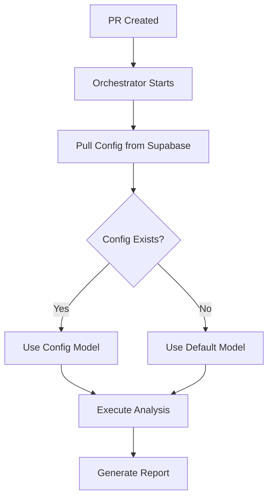
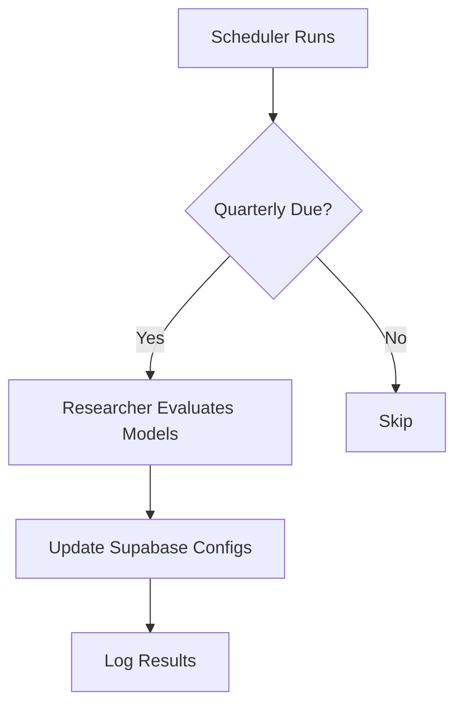

# CodeQual Standard Framework Architecture

## Overview

The Standard Framework implements a clean, interface-based architecture for code analysis. The orchestrator pulls model configurations from Supabase without validation, while a separate scheduler service manages quarterly model updates.

## Core Components

### 1. **Orchestrator** (`comparison-orchestrator.ts`)
The central coordinator that manages the analysis flow:
- Pulls model configuration from Supabase (no validation)
- Executes comparison analysis with configured model
- Updates developer skills with equal penalties for unfixed issues
- Generates comprehensive 12-section reports via ReportGeneratorV7Complete
- Optionally adds educational enhancements
- **Important**: The orchestrator ONLY pulls configuration, it does NOT evaluate or validate models

### 2. **Model Selection Service** (`model-selection-service.ts`)
**Runs independently** via scheduler to evaluate models:
- **Quarterly Evaluation**: Every 3 months, evaluates available models
- **Researcher Integration**: Uses Researcher Agent to find best models
- **Supabase Updates**: Stores model configurations for orchestrator to use
- **Independent Operation**: Runs separately from the orchestrator via scheduler

### 3. **Scheduler Service** (`scheduler-service.ts`)
Manages scheduled tasks independently:
- Quarterly model evaluations (1st day of Jan/Apr/Jul/Oct)
- Weekly performance checks
- Runs as a separate service/cron job
- Can be triggered manually for immediate evaluation
- Reports health status and failures to monitoring

### 4. **Monitoring Service** (`monitoring-service.ts`)
Provides system health monitoring and alerting:
- **Config Monitoring**: Alerts when configs are missing or stale (>90 days)
- **Researcher Monitoring**: Tracks evaluation success/failure
- **Scheduler Monitoring**: Ensures scheduler runs regularly
- **Health Checks**: Monitors all services
- **Alerting**: Sends notifications via Slack webhook
- **Metrics**: Records performance and error metrics

### 5. **Report Generation System**
Comprehensive PR analysis reporting:
- **ReportGeneratorV7Complete**: Generates 12-section analysis reports
- **Dynamic Architecture Diagrams**: Based on repository type
- **Dynamic Username Extraction**: From repository URLs
- **Enhanced Dependencies**: Container size analysis with Dockerfile examples
- **Complete Code Snippets**: For all issues with required fixes
- **Skill Tracking**: Detailed calculations with equal penalties for unfixed issues
- See `REPORT_GENERATION_GUIDE.md` for full details

## Data Providers

### Production Providers (Supabase)
- **SupabaseConfigProvider**: Stores model configurations and analysis settings
- **SupabaseSkillProvider**: Tracks developer skill progression
- **SupabaseDataStore**: Persists analysis reports with caching

### Mock Providers (Testing)
- **MockConfigProvider**: In-memory configuration storage
- **MockSkillProvider**: Simulated skill tracking
- **MockDataStore**: In-memory data storage
- **MockEducatorAgent**: Simulated educational content

## Integration Points

All integration channels use `createProductionOrchestrator()` which:
- Pulls current model configuration from Supabase
- Uses the configured model without any validation
- Returns ready-to-use orchestrator instance

### 1. **API Integration** (REST/GraphQL)
```typescript
import { createProductionOrchestrator } from '@codequal/agents/infrastructure/factory';

app.post('/api/analyze', async (req, res) => {
  const orchestrator = await createProductionOrchestrator();
  const result = await orchestrator.executeComparison(req.body);
  res.json(result);
});
```

### 2. **CLI Integration**
```typescript
import { createProductionOrchestrator } from '@codequal/agents/infrastructure/factory';

const orchestrator = await createProductionOrchestrator();
const result = await orchestrator.executeComparison(cliArgs);
console.log(result.report);
```

### 3. **IDE Extensions** (VS Code, JetBrains)
```typescript
import { createProductionOrchestrator } from '@codequal/agents/infrastructure/factory';

vscode.commands.registerCommand('codequal.analyze', async () => {
  const orchestrator = await createProductionOrchestrator();
  const result = await orchestrator.executeComparison(context);
  showResults(result);
});
```

### 4. **CI/CD Webhooks** (GitHub Actions, GitLab CI)
The webhook endpoint internally uses:
```typescript
const orchestrator = await createProductionOrchestrator();
const result = await orchestrator.executeComparison(webhookPayload);
```

### 5. **Web Interface**
The web UI calls the API endpoints which use `createProductionOrchestrator()` internally.

## Model Selection Flow

### Orchestrator Flow (Simple Pull)


### Scheduler Flow (Independent)


## Quarterly Evaluation Process (Independent)

The scheduler runs **independently** from the orchestrator:

1. **Cron/Scheduler** triggers evaluation script on 1st day of quarter
2. **Model Selection Service** calls Researcher Agent
3. **Researcher Agent** evaluates current model landscape
4. **Benchmarks** run for different scenarios:
   - Repository types (Node, Python, Java, etc.)
   - Task types (comparison, security, performance)
5. **Configurations** are updated in Supabase
6. **Orchestrator** will use updated configs on next initialization

### Running the Scheduler

```bash
# Single run (check and run due tasks)
npm run scheduler

# Manual trigger evaluation
npm run scheduler -- --trigger-evaluation

# Run as daemon (checks every hour)
npm run scheduler -- --daemon

# As a cron job
0 0 * * * cd /path/to/project && npm run scheduler
```

### Monitoring the System

```bash
# View monitoring dashboard
npm run monitor

# Show only alerts
npm run monitor -- --alerts

# Show only health status
npm run monitor -- --health
```

## Safeguards and Alerts

### Orchestrator Safeguards
- Checks if configuration exists in Supabase
- Validates configuration age (alerts if >90 days old)
- Falls back to defaults if no config found
- Logs all config usage with age and cost info

### Monitoring Alerts
1. **config_missing**: No configuration found in Supabase (HIGH severity)
2. **config_stale**: Configuration older than 90 days (MEDIUM severity)
3. **researcher_failed**: Quarterly evaluation failed (CRITICAL severity)
4. **scheduler_failed**: Scheduler execution failed (HIGH severity)
5. **evaluation_overdue**: More than 100 days since last evaluation (HIGH severity)

### Health Checks
- **Orchestrator**: Monitors error rates
- **Researcher**: Checks last evaluation date
- **Scheduler**: Verifies recent runs (within 48 hours)

## Factory Pattern

The `factory.ts` provides convenient creation methods:

```typescript
// Production with all real providers
const orchestrator = await createProductionOrchestrator();

// Testing with all mock providers
const orchestrator = await createTestOrchestrator();

// Custom configuration
const orchestrator = await createOrchestrator(env, {
  useMock: false,
  useCache: true,
  cacheProvider: 'redis'
});
```

## Environment Variables

```env
# Supabase Configuration
SUPABASE_URL=your-supabase-url
SUPABASE_ANON_KEY=your-anon-key

# Optional
REDIS_URL=redis://localhost:6379
SEARCH_MODEL_API_KEY=your-perplexity-key
LOG_LEVEL=info
NODE_ENV=production
```

## Testing

Integration tests are located in `src/standard/tests/integration/`:
- `orchestrator-flow.test.ts`: Full end-to-end orchestrator test
- `deepwiki/` directory: Contains all DeepWiki integration tests

### DeepWiki Testing

For DeepWiki integration testing, see `docs/deepwiki/DEEPWIKI_QUICK_START.md`.

Quick setup:
```bash
# From project root
./setup-deepwiki.sh

# Run DeepWiki tests
cd packages/agents
USE_DEEPWIKI_MOCK=false npm test src/standard/tests/integration/deepwiki/
```

Run tests:
```bash
npm run test
```

## Future Enhancements

1. **Redis Caching**: Implement Redis wrapper for DataStore
2. **Metrics Collection**: Add monitoring service interface
3. **Error Tracking**: Implement structured error logging
4. **Multi-Model Ensemble**: Use multiple models for critical analyses
5. **A/B Testing**: Compare model performance in production