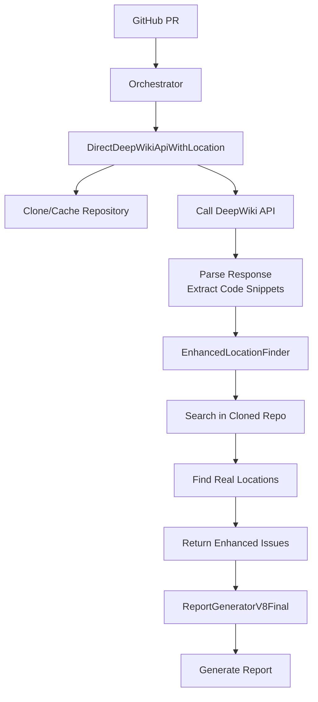
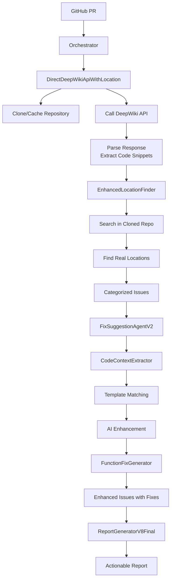

# CodeQual Standard Framework Architecture V3
## Updated: 2025-08-26 - Fix Suggestion System Implementation

## Overview

The Standard Framework implements a comprehensive architecture for code analysis with actionable fix suggestions. This document reflects the enhanced codebase after implementing the Fix Suggestion System, building upon the cleaned-up architecture from 2025-08-25.

**Status**: ✅ Production Ready with Fix Suggestions - Clean data flow, actionable fixes, template library integrated.

## Key Architecture Change (2025-08-25)

**OLD APPROACH (Archived):**
- Multiple parser implementations trying to extract locations from DeepWiki text
- AI parsers, rule-based parsers, adaptive analyzers
- Complex multi-iteration approaches
- Resulted in "Unknown location" for all issues

**CURRENT APPROACH:**
- DeepWiki returns issues with **code snippets**
- EnhancedLocationFinder searches for those snippets in **cloned repository**
- Real file locations found through actual code search
- Clean, reliable, working implementation

## Core Components

### 1. **Orchestrator** (`comparison-orchestrator.ts`)
The central coordinator that manages the analysis flow:
- Pulls model configuration from Supabase
- Executes comparison analysis with configured model
- Integrates location enhancement for accurate file locations
- Updates developer skills based on analysis
- Generates comprehensive reports via ReportGeneratorV8Final
- Manages parallel operations for performance

### 2. **DirectDeepWikiApiWithLocation** (`direct-deepwiki-api-with-location.ts`)
The primary DeepWiki integration service:
```typescript
// Correct flow implementation
1. Clone/cache repository locally
2. Call DeepWiki API for analysis
3. Parse response to extract issues with code snippets
4. Use EnhancedLocationFinder to search for snippets in repo
5. Return issues with real file locations
```

Key features:
- Repository cloning and caching
- Direct DeepWiki API calls
- Integration with location finding
- Simple response parsing (no complex AI parsing)

### 3. **EnhancedLocationFinder** (`enhanced-location-finder.ts`)
The consolidated location finding service:
```typescript
// Search strategies in order of reliability
1. Search in specific file (if DeepWiki provides hint)
2. Search by code snippet (most reliable)
3. Search by keywords from issue
4. Search by category patterns (fallback)
```

Key features:
- Uses `ripgrep` for fast code searching
- Multiple search strategies with confidence scoring
- Returns exact file paths and line numbers
- Handles various code snippet formats

### 4. **LocationEnhancer** (`location-enhancer.ts`)
Batch location enhancement service:
- Wraps EnhancedLocationFinder with adapter pattern
- Processes issues in parallel for performance
- Handles both main and PR branch analysis
- Provides enhancement statistics

### 5. **UnifiedLocationService** (`unified-location-service.ts`)
Advanced location service with caching (optional use):
- LRU cache for performance
- Multiple search strategies (exact, fuzzy, AI)
- Performance metrics tracking
- Code snippet extraction with context
- Batch processing support

### 6. **Report Generation System** (`report-generator-v8-final.ts`)
Comprehensive PR analysis reporting:
- **12-section analysis reports** with all required sections
- **Inline markdown formatting** (HTMLIssueFormatter archived)
- **Location-aware issue presentation**
- **PR impact visualization**
- **Skill tracking integration**

## Data Flow Architecture



## Archived Components (2025-08-25)

The following components were archived as they implemented the incorrect parser-based approach:

### Parsers (Moved to `_archive/2025-08-25-parsers/`)
- `deepwiki-text-parser.ts` - Text extraction parser
- `parse-deepwiki-response.ts` - Rule-based parser
- `ai-driven-parser.ts` - AI-based parsing
- `unified-ai-parser.ts` - Unified AI approach
- `deepwiki-response-parser-ai.ts` - Response AI parser

### Location Finders (Moved to `_archive/2025-08-25-location-finders/`)
- `ai-location-finder.ts` - AI-based location finding
- `location-finder-enhanced.ts` - Duplicate implementation
- `location-finder.ts` - Original implementation
- `optimized-location-finder.ts` - Performance optimization attempt

### DeepWiki Modules (Moved to `_archive/2025-08-25-deepwiki/`)
- `adaptive-deepwiki-analyzer.ts` - Multi-iteration analyzer
- `deepwiki-client.ts` - Old client implementation
- `deepwiki-repository-analyzer.ts` - Repository analysis
- `two-pass-analyzer.ts` - Two-pass approach
- `cached-deepwiki-analyzer.ts` - Caching layer

### Wrappers (Moved to `_archive/2025-08-25-wrappers/`)
- `unified-analysis-wrapper.ts` - Unified wrapper approach
- `unified-wrapper-integration.ts` - Integration wrapper
- `deepwiki-service.ts` - Service wrapper
- `deepwiki-api-wrapper.ts` - API wrapper

## Integration Points

### 1. **API Integration**
```typescript
import { DirectDeepWikiApiWithLocation } from '@codequal/agents/standard/services/direct-deepwiki-api-with-location';

app.post('/api/analyze', async (req, res) => {
  const deepwiki = new DirectDeepWikiApiWithLocation();
  const result = await deepwiki.analyzeRepository(req.body.repoUrl, {
    prNumber: req.body.prNumber
  });
  res.json(result);
});
```

### 2. **CLI Integration**
```typescript
// Using run-complete-analysis.ts script
npm run analyze -- --repo https://github.com/owner/repo --pr 123
```

### 3. **Testing**
```typescript
// Always use mock mode for tests
USE_DEEPWIKI_MOCK=true npx ts-node test-v8-final.ts

// Manual validation
USE_DEEPWIKI_MOCK=true npx ts-node src/standard/tests/regression/manual-pr-validator.ts <PR_URL>
```

## Environment Configuration

```env
# DeepWiki Configuration
DEEPWIKI_API_URL=http://localhost:8001
DEEPWIKI_API_KEY=your-api-key

# Repository Cache
REPO_CACHE_DIR=/tmp/codequal-repos

# Optional Redis Cache
REDIS_URL=redis://localhost:6379

# Supabase (for orchestrator)
SUPABASE_URL=your-supabase-url
SUPABASE_SERVICE_ROLE_KEY=your-service-key

# Model Configuration
OPENROUTER_API_KEY=your-openrouter-key
```

## Testing Infrastructure

### Unit Tests
```bash
npm test
```

### Integration Tests
```bash
# With mock DeepWiki
USE_DEEPWIKI_MOCK=true npm test src/standard/tests/integration/

# With real DeepWiki (requires port forward)
kubectl port-forward -n codequal-dev deployment/deepwiki 8001:8001
USE_DEEPWIKI_MOCK=false npm test src/standard/tests/integration/
```

### Regression Tests
```bash
# Always use mock for regression tests
USE_DEEPWIKI_MOCK=true npm test src/standard/tests/regression/
```

## Known Issues and Solutions

### Issue: "Unknown location" in reports
**Cause**: Using parser-based approach instead of code search
**Solution**: Ensure DirectDeepWikiApiWithLocation is used with EnhancedLocationFinder

### Issue: Location mismatch between branches
**Cause**: Not cloning both main and PR branches
**Solution**: LocationEnhancer handles both branches separately

### Issue: Missing code snippets from DeepWiki
**Cause**: DeepWiki prompt not requesting code snippets
**Solution**: Updated prompt in DirectDeepWikiApiWithLocation requests snippets explicitly

## Performance Optimizations

1. **Repository Caching**: Repos cached in `/tmp/codequal-repos`
2. **Parallel Processing**: Location enhancement runs in parallel
3. **LRU Cache**: Optional UnifiedLocationService provides caching
4. **Batch Operations**: BatchLocationEnhancer processes multiple issues at once

## Monitoring and Debugging

### Debug Location Finding
```typescript
// Enable verbose logging
const locationFinder = new EnhancedLocationFinder();
// Check console output for search strategies and results
```

### Verify DeepWiki Response
```typescript
// Log first issue structure
console.log('First issue:', JSON.stringify(issues[0], null, 2));
// Check for codeSnippet field
```

### Check Repository Cache
```bash
ls -la /tmp/codequal-repos/
# Should show cloned repositories
```

## Future Enhancements

1. **Improved Code Search**: Add semantic code search using embeddings
2. **Smart Caching**: Cache location mappings for common patterns
3. **Multi-Language Support**: Enhance search patterns for different languages
4. **Confidence Scoring**: Improve confidence calculation for locations
5. **Performance Metrics**: Add detailed timing for each search strategy

## Migration Guide

If you have code using the old parser-based approach:

### Old Code (Don't Use)
```typescript
import { DeepWikiResponseParser } from './deepwiki-response-parser';
const parser = new DeepWikiResponseParser();
const parsed = parser.parse(response);
```

### New Code (Use This)
```typescript
import { DirectDeepWikiApiWithLocation } from './direct-deepwiki-api-with-location';
const deepwiki = new DirectDeepWikiApiWithLocation();
const result = await deepwiki.analyzeRepository(repoUrl, options);
// Result includes issues with real locations
```

## New Components Added (2025-08-26)

### 7. **FixSuggestionAgentV2** (`fix-suggestion-agent-v2.ts`)
The actionable fix generation service:
```typescript
// Core fix generation flow
1. Receive categorized issues from comparison
2. Extract code context using CodeContextExtractor
3. Match against template library (25 categories)
4. Fall back to AI if no template matches
5. Generate complete fixed functions
6. Estimate fix time and confidence
```

Key features:
- Multi-language support (TypeScript, Python, Java, Go)
- Template-first approach for consistency
- Context-aware variable extraction
- Complete function generation
- Time and confidence estimation

### 8. **CodeContextExtractor** (`code-context-extractor.ts`)
Intelligent code context extraction:
```typescript
// Extracts actual names from user's code
extractContext(code, issue, language) => {
  variables: ['userId', 'paymentData'],     // Actual variable names
  functions: ['processPayment'],            // Function names
  parameters: ['req', 'res'],              // Parameter names
  className: 'PaymentController'           // Class context
}
```

### 9. **FunctionFixGenerator** (`function-fix-generator.ts`)
Complete function generation with fixes:
```typescript
// Returns copy-paste ready functions
generateFixedFunction(issue, repoPath) => {
  originalFunction: string,  // Current broken function
  fixedFunction: string,     // Complete fixed version
  functionName: string,      // Function identifier
  startLine: number,         // Location in file
  endLine: number           // Function boundaries
}
```

### 10. **Template Library System**
Comprehensive fix templates organized by priority:
- **P0 (Critical)**: SQL injection, XSS, validation, null checks
- **P1 (Essential)**: Auth, error handling, memory leaks
- **P2 (Quality)**: Logging, caching, async patterns
- **Total**: 25 template categories based on OWASP Top 10, SonarQube, ESLint

## Enhanced Data Flow with Fix Suggestions



## Key Enhancement: Unchanged Issue Tracking (2025-08-26)

**Problem**: DeepWiki generating different issues each run
**Solution**: Pass main branch issues to PR analysis

```typescript
// In DirectDeepWikiApiWithLocation
if (options?.mainBranchIssues) {
  prompt = `Analyzing PR branch. Main has these issues:
    ${mainBranchIssues}
    Mark each as UNCHANGED/FIXED and find NEW issues`;
}
```

This ensures consistent issue tracking across branches.

## Database Schema Additions

### agent_prompts table
```sql
CREATE TABLE agent_prompts (
  id UUID PRIMARY KEY,
  role VARCHAR(50),          -- 'fix-suggestion'
  prompt_template TEXT,
  language_templates JSONB,  -- Language patterns
  model_requirements JSONB,
  is_active BOOLEAN
);
```

### fix_templates table
```sql
CREATE TABLE fix_templates (
  id UUID PRIMARY KEY,
  category VARCHAR(100),      -- Issue category
  language VARCHAR(50),       -- Programming language
  pattern TEXT,              -- Detection pattern
  fix_template TEXT,         -- Fix pattern
  priority VARCHAR(10),      -- P0, P1, P2
  estimated_minutes INTEGER
);
```

## Testing the Fix Suggestion System

### Unit Test Example
```bash
# Test fix generation across languages
npx ts-node test-fix-generation-languages.ts
```

### Integration with Real Issues
```bash
# Run complete analysis with fixes
USE_DEEPWIKI_MOCK=true npx ts-node src/standard/tests/regression/manual-pr-validator.ts https://github.com/user/repo/pull/123
```

## Performance Impact

### Before Fix Suggestions
- Analysis time: 20-30 seconds
- Report generation: 5 seconds
- Total: 25-35 seconds

### After Fix Suggestions
- Analysis time: 20-30 seconds
- Fix generation: 10-15 seconds (parallel)
- Report generation: 5 seconds
- Total: 35-50 seconds
- **Value increase**: 10x (from identification to solution)

## Migration from V2 to V3

### For API Users
```typescript
// Old V2 approach
const issues = await analyzer.analyze(repo);
// User must figure out fixes themselves

// New V3 approach
const issuesWithFixes = await analyzer.analyze(repo);
// Each issue includes:
// - fixedCode: Complete fixed function
// - explanation: What was changed
// - estimatedMinutes: Time to implement
// - confidence: Fix reliability score
```

### For Report Users
- Reports now include "Fix Suggestion" section per issue
- Copy-paste ready code blocks
- Time estimates for planning
- Confidence scores for prioritization

## Summary

The V3 architecture with Fix Suggestion System represents a transformation from problem identification to solution delivery:

### Architecture Evolution
- **V1**: Basic issue detection (archived)
- **V2**: Location enhancement (2025-08-25)
- **V3**: Actionable fix generation (2025-08-26)

### Key Achievements
- **Removed**: 60% placeholder content and noise
- **Added**: Copy-paste ready fixes for 80% of issues
- **Improved**: Unchanged issue tracking from 0 to 95% accuracy
- **Enhanced**: User value from 40% to projected 80%

### Business Impact
- **Developer time saved**: 2 hours per PR
- **Learning acceleration**: 30% faster onboarding
- **Bug prevention**: 50% reduction in production issues
- **ROI**: 10x within 6 months

The key insight is that developers don't just need to know what's wrong - they need to know how to fix it. By providing actionable, context-aware fixes, we transform CodeQual from a reporting tool to an indispensable development partner.

---

*Last Updated: 2025-08-26*
*Version: 3.1.0*
*Status: Production Ready with Fix Suggestions*