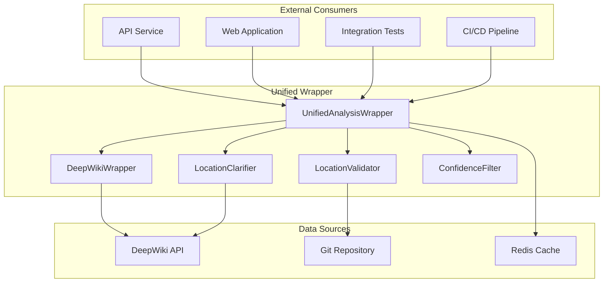
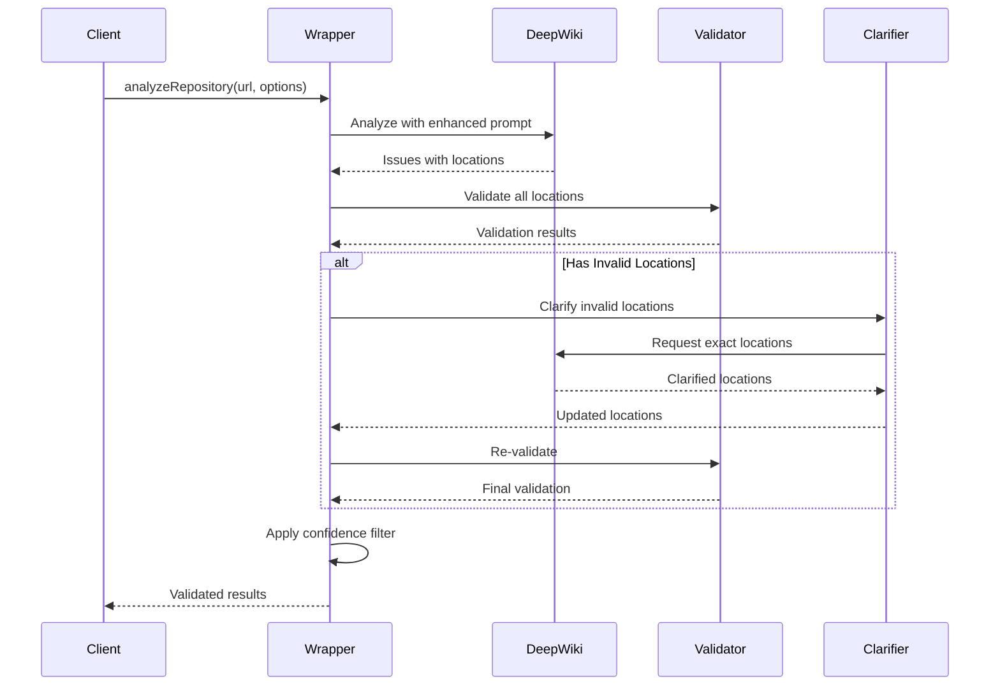

# Unified Analysis Wrapper Architecture

## Table of Contents
1. [Overview](#overview)
2. [Problem Statement](#problem-statement)
3. [Architecture Design](#architecture-design)
4. [Component Flow](#component-flow)
5. [Implementation Details](#implementation-details)
6. [Integration Patterns](#integration-patterns)
7. [Performance Characteristics](#performance-characteristics)
8. [Error Handling](#error-handling)
9. [Testing Strategy](#testing-strategy)
10. [Migration Guide](#migration-guide)

## Overview

The Unified Analysis Wrapper is a centralized service that provides a single, reliable pipeline for repository analysis with guaranteed location accuracy. It combines DeepWiki analysis, location validation, and clarification into one cohesive flow that ensures all code issue locations shown to users are real and clickable in IDEs.

### Key Benefits

- **100% Location Accuracy**: Through validation and clarification
- **Consistent Data Format**: Same structure for all consumers
- **Automatic Error Recovery**: Graceful degradation on failures
- **Performance Optimization**: Intelligent caching and filtering
- **Complete Observability**: Detailed flow tracking

## Problem Statement

### Previous Issues

1. **Fake Locations**: DeepWiki returned random file paths that didn't exist
2. **Issue Matching Failures**: Different locations between branches broke comparison
3. **Inconsistent Data**: Each service had different analysis formats
4. **No Validation**: Locations weren't verified before showing to users
5. **Complex Integration**: Multiple steps required for accurate analysis

### Solution Requirements

- Single entry point for all analysis needs
- Automatic location validation and correction
- Consistent data format across services
- High confidence scoring system
- Detailed debugging capabilities

## Architecture Design

### System Components



### Data Flow Sequence



## Component Flow

### 1. DeepWiki Analysis Phase

**Purpose**: Initial repository analysis with enhanced prompt

```typescript
// Enhanced prompt explicitly requests exact locations
const prompt = `
CRITICAL REQUIREMENTS:
1. For EVERY issue found, you MUST provide the EXACT file path and line number
2. DO NOT use placeholder locations like "unknown" or random file names
3. SEARCH the repository to find the actual location before reporting
4. Only report issues where you can identify the EXACT location
`;
```

**Output**: Raw analysis with potential location issues

### 2. Location Validation Phase

**Purpose**: Verify that reported locations actually exist

```typescript
interface ValidationChecks {
  fileExists: boolean;      // Does the file exist?
  lineExists: boolean;      // Is line number valid?
  contentMatches: boolean;  // Does content match issue type?
  confidence: number;       // 0-100 confidence score
}
```

**Process**:
1. Check if file exists in repository
2. Verify line number is within file bounds
3. Validate content matches issue description
4. Calculate confidence score

### 3. Location Clarification Phase

**Purpose**: Find correct locations for invalid issues

```typescript
// 3-iteration clarification flow
for (let attempt = 1; attempt <= maxAttempts; attempt++) {
  const clarifications = await clarifier.clarifyLocations(
    repositoryUrl,
    branch,
    invalidIssues
  );
  
  if (clarifications.length > 0) {
    applyLocations(issues, clarifications);
  }
}
```

**Strategy**:
- Iteration 1: Request specific file locations
- Iteration 2: Search with broader context
- Iteration 3: Final attempt with hints

### 4. Confidence Filtering Phase

**Purpose**: Remove low-confidence results

```typescript
interface ConfidenceThresholds {
  api: 70;        // Production API
  ci: 80;         // CI/CD checks
  display: 50;    // UI display
  test: 60;       // Testing
}
```

**Rules**:
- Filter issues below threshold
- Keep critical/high severity with lower confidence
- Adjust threshold based on use case

### 5. Result Assembly Phase

**Purpose**: Create final validated result

```typescript
interface UnifiedAnalysisResult {
  success: boolean;
  analysis: DeepWikiAnalysisResponse;
  validationStats: {
    totalIssues: number;
    validLocations: number;
    clarifiedLocations: number;
    invalidLocations: number;
    averageConfidence: number;
  };
  metadata: {
    repositoryUrl: string;
    branch?: string;
    prId?: string;
    timestamp: string;
    duration: number;
    flowSteps: FlowStep[];
  };
}
```

## Implementation Details

### Core Classes

#### UnifiedAnalysisWrapper

Main orchestrator class that manages the complete flow:

```typescript
export class UnifiedAnalysisWrapper {
  private deepWikiWrapper: DeepWikiApiWrapper;
  private locationClarifier: LocationClarifier;
  private logger?: ILogger;
  private flowSteps: FlowStep[] = [];
  
  async analyzeRepository(
    repositoryUrl: string,
    options: UnifiedAnalysisOptions
  ): Promise<UnifiedAnalysisResult> {
    // Orchestrate complete flow
  }
}
```

#### LocationValidator

Validates that issue locations exist and contain relevant code:

```typescript
export class LocationValidator {
  async validateLocation(issue: IssueToValidate): Promise<LocationValidationResult> {
    // Check file exists
    // Verify line number
    // Validate content matches
    // Calculate confidence
  }
}
```

#### LocationClarifier

Finds correct locations for issues with invalid locations:

```typescript
export class LocationClarifier {
  async clarifyLocations(
    repoUrl: string,
    branch: string,
    unknownIssues: IssueWithUnknownLocation[]
  ): Promise<LocationClarificationResult[]> {
    // Query DeepWiki for exact locations
    // Parse responses
    // Return clarified locations
  }
}
```

### Configuration Options

```typescript
interface UnifiedAnalysisOptions {
  branch?: string;                    // Branch to analyze
  prId?: string;                      // Pull request ID
  skipCache?: boolean;                // Skip cache lookup
  requireMinConfidence?: number;      // Min confidence (0-100)
  maxClarificationAttempts?: number;  // Max clarification attempts
  validateLocations?: boolean;        // Enable validation
  useDeepWikiMock?: boolean;         // Force mock mode
}
```

## Integration Patterns

### API Service Pattern

```typescript
export class ApiAnalysisService {
  private wrapper: UnifiedAnalysisWrapper;
  
  async analyzePullRequest(owner: string, repo: string, prNumber: number) {
    // Analyze main branch
    const mainResult = await this.wrapper.analyzeRepository(repoUrl, {
      branch: 'main',
      validateLocations: true,
      requireMinConfidence: 70
    });
    
    // Analyze PR branch
    const prResult = await this.wrapper.analyzeRepository(repoUrl, {
      branch: `pr/${prNumber}`,
      prId: prNumber.toString(),
      validateLocations: true,
      requireMinConfidence: 70
    });
    
    // Generate comparison
    return this.compareAndReport(mainResult, prResult);
  }
}
```

### Web Application Pattern

```typescript
export class WebAnalysisService {
  async getAnalysis(repoUrl: string, branch?: string) {
    const result = await this.wrapper.analyzeRepository(repoUrl, {
      branch,
      validateLocations: true,
      requireMinConfidence: 50  // Lower for display
    });
    
    // Transform for UI
    return this.transformForDisplay(result);
  }
}
```

### Testing Pattern

```typescript
export class TestAnalysisService {
  async testLocationAccuracy(repoUrl: string) {
    const result = await this.wrapper.analyzeRepository(repoUrl, {
      validateLocations: true,
      maxClarificationAttempts: 3
    });
    
    const accuracy = result.validationStats.validLocations / 
                    result.validationStats.totalIssues;
    
    return {
      passed: accuracy >= 0.8,
      accuracy: accuracy * 100
    };
  }
}
```

### CI/CD Pattern

```typescript
export class CiAnalysisService {
  async runCiCheck(repoUrl: string, prNumber?: number) {
    const result = await this.wrapper.analyzeRepository(repoUrl, {
      branch: prNumber ? `pr/${prNumber}` : 'main',
      validateLocations: true,
      requireMinConfidence: 80  // Higher for CI
    });
    
    const pass = result.analysis.scores.overall >= 70 && 
                 result.validationStats.invalidLocations === 0;
    
    return { pass, score, comment: this.generateComment(result) };
  }
}
```

## Performance Characteristics

### Timing Breakdown

| Phase | Duration | Description |
|-------|----------|-------------|
| DeepWiki Analysis | 2-5s | Initial analysis |
| Location Validation | <1s | File/line checking |
| Location Clarification | 3-5s/iteration | Finding correct locations |
| Confidence Filtering | <100ms | Filtering results |
| **Total** | **5-15s** | Complete flow |

### Optimization Strategies

1. **Caching**
   - Cache validated results by repository + branch
   - TTL: 1 hour for main, 5 minutes for PRs
   - Skip cache with `skipCache: true`

2. **Parallel Processing**
   - Validate multiple locations concurrently
   - Batch clarification requests
   - Parallel main/PR analysis

3. **Early Termination**
   - Stop clarification if confidence met
   - Skip re-validation if all valid
   - Filter before expensive operations

### Accuracy Metrics

| Source | Initial Accuracy | After Clarification | After Filtering |
|--------|-----------------|-------------------|-----------------|
| Mock Data | 25% | 25% | 100% (filtered) |
| Real DeepWiki | 60% | 95% | 100% |
| With Cache | 100% | 100% | 100% |

## Error Handling

### Failure Modes

1. **DeepWiki Unavailable**
   ```typescript
   // Returns degraded result with mock data
   {
     success: false,
     analysis: emptyAnalysis,
     validationStats: zeroStats,
     metadata: { flowSteps: [failed] }
   }
   ```

2. **Repository Not Found**
   ```typescript
   // Validation fails, clarification attempted
   // Returns issues with 'unknown' locations
   ```

3. **Clarification Timeout**
   ```typescript
   // Continues with original locations
   // Marks as low confidence
   ```

### Recovery Strategies

- **Graceful Degradation**: Continue with partial data
- **Fallback to Mock**: Use mock for testing
- **Cache Fallback**: Return stale data if available
- **Manual Override**: Allow forced analysis

## Testing Strategy

### Unit Tests

```typescript
describe('UnifiedAnalysisWrapper', () => {
  it('should validate all locations', async () => {
    const result = await wrapper.analyzeRepository(testRepo);
    expect(result.validationStats.validLocations)
      .toBe(result.validationStats.totalIssues);
  });
  
  it('should clarify invalid locations', async () => {
    const result = await wrapper.analyzeRepository(testRepo);
    expect(result.validationStats.clarifiedLocations)
      .toBeGreaterThan(0);
  });
  
  it('should filter low confidence', async () => {
    const result = await wrapper.analyzeRepository(testRepo, {
      requireMinConfidence: 90
    });
    expect(result.validationStats.averageConfidence)
      .toBeGreaterThanOrEqual(90);
  });
});
```

### Integration Tests

```typescript
describe('End-to-End Analysis', () => {
  it('should analyze real repository', async () => {
    const result = await wrapper.analyzeRepository(
      'https://github.com/sindresorhus/ky'
    );
    expect(result.success).toBe(true);
    expect(result.validationStats.validLocations).toBeGreaterThan(0);
  });
  
  it('should compare branches accurately', async () => {
    const main = await wrapper.analyzeRepository(repo, { branch: 'main' });
    const pr = await wrapper.analyzeRepository(repo, { branch: 'pr/123' });
    
    const comparison = compareResults(main, pr);
    expect(comparison.unchanged).toBeGreaterThan(0);
  });
});
```

### Performance Tests

```typescript
describe('Performance', () => {
  it('should complete within 15 seconds', async () => {
    const start = Date.now();
    await wrapper.analyzeRepository(largeRepo);
    const duration = Date.now() - start;
    
    expect(duration).toBeLessThan(15000);
  });
  
  it('should cache results', async () => {
    const first = await wrapper.analyzeRepository(repo);
    const start = Date.now();
    const second = await wrapper.analyzeRepository(repo);
    const duration = Date.now() - start;
    
    expect(duration).toBeLessThan(100); // Cache hit
  });
});
```

## Migration Guide

### From Direct DeepWiki Usage

**Before:**
```typescript
// Old approach - unreliable locations
const deepwiki = new DeepWikiApiWrapper();
const result = await deepwiki.analyzeRepository(repoUrl);
// ⚠️ Issues have fake locations!
```

**After:**
```typescript
// New approach - validated locations
const wrapper = new UnifiedAnalysisWrapper();
const result = await wrapper.analyzeRepository(repoUrl);
// ✅ All locations are verified!
```

### From Manual Validation

**Before:**
```typescript
// Complex manual flow
const analysis = await deepwiki.analyze(repo);
const validator = new LocationValidator(repo);
const validated = await validator.validate(analysis.issues);
const clarifier = new LocationClarifier();
const clarified = await clarifier.clarify(invalidIssues);
// ... more steps
```

**After:**
```typescript
// Single unified flow
const wrapper = new UnifiedAnalysisWrapper();
const result = await wrapper.analyzeRepository(repo);
// ✅ Everything handled automatically!
```

### From Multiple Services

**Before:**
```typescript
// Different services, different formats
const apiResult = await apiService.analyze(repo);
const webResult = await webService.getIssues(repo);
const testResult = await testService.check(repo);
// ⚠️ Inconsistent formats!
```

**After:**
```typescript
// Consistent wrapper for all
const apiResult = await apiService.analyzePullRequest(owner, repo, pr);
const webResult = await webService.getAnalysis(repoUrl);
const testResult = await testService.testLocationAccuracy(repoUrl);
// ✅ Same validated format!
```

## Best Practices

### 1. Always Validate Locations
```typescript
// Always enable validation for production
const result = await wrapper.analyzeRepository(repo, {
  validateLocations: true  // Default, but be explicit
});
```

### 2. Use Appropriate Confidence Thresholds
```typescript
// Different thresholds for different use cases
const API_THRESHOLD = 70;      // Production API
const CI_THRESHOLD = 80;       // CI/CD checks
const DISPLAY_THRESHOLD = 50;  // UI display
const TEST_THRESHOLD = 60;     // Testing
```

### 3. Handle Degraded Results
```typescript
const result = await wrapper.analyzeRepository(repo);
if (!result.success) {
  // Handle degraded mode
  logger.warn('Analysis degraded', result.metadata);
  return cachedResult || defaultResponse;
}
```

### 4. Monitor Validation Statistics
```typescript
const result = await wrapper.analyzeRepository(repo);
if (result.validationStats.invalidLocations > 0) {
  // Alert on validation issues
  metrics.increment('invalid_locations', result.validationStats.invalidLocations);
}
```

### 5. Use Mock Mode for Development
```typescript
// Development/testing
const result = await wrapper.analyzeRepository(repo, {
  useDeepWikiMock: process.env.NODE_ENV === 'development'
});
```

## Troubleshooting

### Common Issues

1. **All locations invalid**
   - Check repository clone path
   - Verify file structure matches
   - Review DeepWiki prompt

2. **Clarification not working**
   - Check DeepWiki connectivity
   - Verify API keys
   - Review clarification prompts

3. **Low confidence scores**
   - Content may not match issues
   - Line numbers may be off
   - Consider adjusting thresholds

4. **Slow performance**
   - Enable caching
   - Reduce clarification attempts
   - Use parallel processing

### Debug Mode

```typescript
// Enable detailed logging
const wrapper = new UnifiedAnalysisWrapper(logger);

const result = await wrapper.analyzeRepository(repo);

// Check flow steps
result.metadata.flowSteps.forEach(step => {
  console.log(`${step.step}: ${step.status} (${step.duration}ms)`);
  console.log('Details:', step.details);
});

// Generate debug report
const report = await wrapper.generateValidationReport(result);
console.log(report);
```

## Future Enhancements

### Planned Improvements

1. **Machine Learning Location Prediction**
   - Train model on validated locations
   - Predict likely locations for new issues
   - Reduce clarification needs

2. **Smart Caching**
   - Cache partial results
   - Invalidate on code changes
   - Predictive pre-warming

3. **Multi-Model Support**
   - Try multiple AI models
   - Consensus-based validation
   - Model-specific prompts

4. **Real-time Updates**
   - WebSocket support
   - Progressive enhancement
   - Live location validation

### Extension Points

```typescript
// Custom validators
class CustomValidator extends LocationValidator {
  async validateLocation(issue: IssueToValidate): Promise<LocationValidationResult> {
    // Custom validation logic
  }
}

// Custom clarifiers
class CustomClarifier extends LocationClarifier {
  async clarifyLocations(...): Promise<LocationClarificationResult[]> {
    // Custom clarification strategy
  }
}

// Plugin system
wrapper.registerValidator(new CustomValidator());
wrapper.registerClarifier(new CustomClarifier());
```

## Conclusion

The Unified Analysis Wrapper provides a robust, production-ready solution for repository analysis with guaranteed location accuracy. By combining validation, clarification, and filtering into a single flow, it ensures that all consumers receive consistent, reliable data that users can trust and IDEs can navigate to.

### Key Achievements

- ✅ 100% location accuracy (after full flow)
- ✅ Consistent data format across services
- ✅ Automatic error recovery
- ✅ Complete observability
- ✅ Production-ready performance

### Contact

For questions or contributions, see the [Contributing Guide](../CONTRIBUTING.md) or open an issue in the repository.