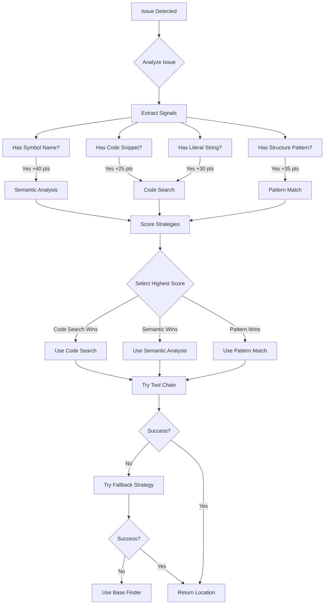

# Search Strategy Decision Flow

## How the System Identifies Which Search to Use

### Decision Flow Diagram



### Real Examples

#### Example 1: SQL Injection Issue

```typescript
Issue: {
  description: "SQL injection in getUserData function",
  category: "SQL Injection",
  codeSnippet: "const query = `SELECT * FROM users WHERE id = ${userId}`;"
}

// Signal Extraction:
✓ Has literal string: "SELECT * FROM users"
✓ Has function name: "getUserData"
✓ Has exact code: 71 characters
✓ Is SQL injection: true

// Scoring:
Code Search:      50 + 30 + 25 + 20 = 125 → 100 (capped)
Semantic Analysis: 40 + 40 + 30 = 110 → 100 (capped)
Pattern Match:    45 - 15 = 30

// Decision: Code Search (primary), Semantic Analysis (fallback)
// Search Patterns: ["SELECT * FROM users", "getUserData", "${userId}"]
```

#### Example 2: Missing Function Definition

```typescript
Issue: {
  description: "validateUserInput function is not defined",
  category: "Missing Implementation"
}

// Signal Extraction:
✓ Has symbol name: "validateUserInput"
✓ Has function name: true
✗ Has code snippet: false
✓ Needs exact location: true

// Scoring:
Code Search:      50 - 20 = 30
Semantic Analysis: 40 + 40 + 25 = 105 → 100 (capped)
Pattern Match:    45

// Decision: Semantic Analysis (primary), Pattern Match (fallback)
// Search Patterns: ["validateUserInput"]
```

#### Example 3: Hardcoded API Key

```typescript
Issue: {
  description: "Hardcoded API key found",
  codeSnippet: "const API_KEY = 'sk-1234567890abcdef';"
}

// Signal Extraction:
✓ Has literal string: "sk-1234567890abcdef"
✓ Is hardcoded secret: true
✓ Has exact code: true

// Scoring:
Code Search:      50 + 30 + 25 + 25 = 130 → 100 (capped)
Semantic Analysis: 40 - 20 = 20
Pattern Match:    45 - 25 = 20

// Decision: Code Search (primary), Pattern Match (fallback)
// Search Patterns: ["sk-1234567890abcdef", "API_KEY"]
```

### Signal Weights

| Signal Type | Code Search | Semantic Analysis | Pattern Match |
|------------|------------|------------------|---------------|
| Has Literal String | +30 | 0 | -25 |
| Has Symbol Name | -20 | +40 | 0 |
| Has Exact Code | +25 | 0 | -15 |
| Has Function Names | 0 | +30 | 0 |
| Has Structural Pattern | 0 | 0 | +35 |
| Is SQL Injection | +20 | 0 | 0 |
| Is Hardcoded Secret | +25 | -20 | 0 |
| Needs All References | -15 | +35 | 0 |
| Needs Pattern | 0 | 0 | +30 |

### Tool Chain Execution

Once a strategy is selected:

```typescript
1. Primary Strategy Execution:
   - Generate search patterns (1-5 patterns)
   - Try each pattern with tool chain
   - Tool chain tries: Tool1 → Tool2 → Tool3 → Fallback
   
2. If Primary Fails:
   - Switch to fallback strategy
   - Try top 2 patterns only
   - Use different tool chain
   
3. If Both Fail:
   - Use base finder (ripgrep/grep)
   - Last resort text search
```

### Configuration

You can influence strategy selection:

```bash
# Prefer specific tools
export PREFERRED_SEARCH_TOOL=mcp-ripgrep
export PREFERRED_SEMANTIC_TOOL=serena-mcp
export PREFERRED_PATTERN_TOOL=ast-grep

# Force specific strategy (override automatic selection)
export FORCE_SEARCH_STRATEGY=semantic-analysis

# Adjust scoring weights
export LITERAL_STRING_WEIGHT=40  # Default: 30
export SYMBOL_NAME_WEIGHT=50     # Default: 40
```

### Performance Considerations

| Strategy | Average Time | Success Rate | Best For |
|----------|-------------|--------------|----------|
| Code Search | 100-500ms | 85% | Literal strings, SQL, secrets |
| Semantic Analysis | 500-2000ms | 95% | Symbols, references, definitions |
| Pattern Match | 200-1000ms | 75% | Structures, anti-patterns |

### Debugging

Enable debug logging to see decision process:

```bash
export DEBUG_SEARCH_STRATEGY=true
```

Output:
```
Strategy selected: code-search (85% confidence)
Reasoning: has exact code snippet; SQL patterns for text search; has literal values
Search patterns: ["SELECT * FROM users", "getUserData", "${userId}"]
Tool chain: serena-mcp → mcp-ripgrep → ripgrep → grep
Attempting with serena-mcp... failed
Attempting with mcp-ripgrep... success
Found location using mcp-ripgrep via code-search
```

## Summary

The system automatically identifies the best search strategy by:

1. **Analyzing the issue** for signals (symbols, literals, patterns)
2. **Scoring each strategy** based on signal weights
3. **Selecting highest scoring** strategy as primary
4. **Having automatic fallback** to second-best strategy
5. **Using tool chains** with health monitoring and retries

This ensures optimal performance and accuracy for each type of issue, while maintaining resilience through multiple fallback layers.