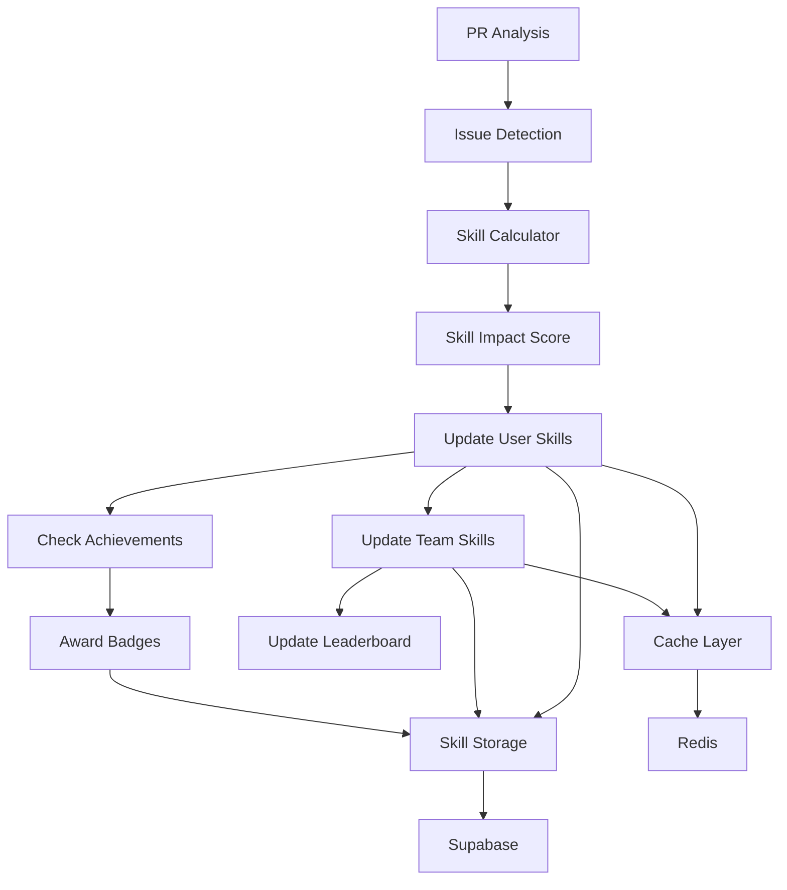

# Skill System Design & Implementation

## Overview
Comprehensive skill tracking, achievement, and team analytics system for CodeQual V8.

## Core Components

### 1. Skill Storage Service
```typescript
// src/standard/skills/storage/skill-storage-service.ts
export class SkillStorageService {
  async updateUserSkills(userId: string, prId: string, skills: SkillUpdate): Promise<void>;
  async getUserSkills(userId: string): Promise<UserSkills>;
  async getSkillHistory(userId: string, days: number): Promise<SkillHistory[]>;
  async getTeamSkills(teamId: string): Promise<TeamSkills>;
  async updateTeamSkills(teamId: string): Promise<void>;
}
```

### 2. Achievement Service
```typescript
// src/standard/skills/achievements/achievement-service.ts
export class AchievementService {
  async checkAchievements(userId: string, prData: PRAnalysis): Promise<Achievement[]>;
  async awardAchievement(userId: string, achievementId: string): Promise<void>;
  async getUserAchievements(userId: string): Promise<UserAchievement[]>;
  async getAchievementProgress(userId: string): Promise<AchievementProgress[]>;
}
```

### 3. Skill Calculator
```typescript
// src/standard/skills/calculation/skill-calculator.ts
export class SkillCalculator {
  calculateSkillImpact(issues: Issue[]): SkillImpact;
  calculateTeamAverage(userSkills: UserSkills[]): TeamSkills;
  calculateSkillTrend(history: SkillHistory[]): SkillTrend;
  calculateSkillDecay(lastActivity: Date, currentScore: number): number;
}
```

## Data Flow



## Skill Calculation Formula

```typescript
// Base score calculation
const calculateSkillScore = (
  currentScore: number,
  issuesResolved: number,
  issuesIntroduced: number,
  issueSeverity: Severity[]
): number => {
  const severityWeights = {
    critical: 5,
    high: 3,
    medium: 1,
    low: 0.5
  };
  
  // Calculate positive impact
  const positiveImpact = issuesResolved.reduce((sum, issue, index) => {
    return sum + severityWeights[issueSeverity[index]];
  }, 0);
  
  // Calculate negative impact
  const negativeImpact = issuesIntroduced.reduce((sum, issue, index) => {
    return sum + severityWeights[issueSeverity[index]];
  }, 0);
  
  // Apply formula with decay prevention
  const impactScore = positiveImpact - (negativeImpact * 1.5); // Penalty for introducing issues
  const newScore = Math.max(0, Math.min(100, currentScore + impactScore));
  
  return newScore;
};
```

## Achievement Criteria

```typescript
export const ACHIEVEMENT_CRITERIA = {
  // Quantity-based
  'bug-hunter': {
    condition: (stats) => stats.bugsFixed >= 100,
    points: 500,
    tier: 'gold'
  },
  
  // Quality-based
  'perfect-pr': {
    condition: (pr) => pr.score === 100 && pr.newIssues === 0,
    points: 200,
    tier: 'platinum'
  },
  
  // Streak-based
  'improvement-streak': {
    condition: (history) => hasConsecutiveImprovement(history, 10),
    points: 300,
    tier: 'gold'
  },
  
  // Team-based
  'team-mentor': {
    condition: (stats) => stats.prsReviewed >= 50 && stats.helpfulComments >= 100,
    points: 400,
    tier: 'platinum'
  },
  
  // Special
  'zero-vulnerability': {
    condition: (pr) => pr.securityIssues === 0 && pr.linesOfCode > 500,
    points: 600,
    tier: 'legendary'
  }
};
```

## Team Skills Aggregation

```typescript
interface TeamSkillAggregation {
  teamId: string;
  members: string[];
  skills: {
    security: {
      average: number;
      top: number;
      bottom: number;
      trend: 'improving' | 'declining' | 'stable';
    };
    performance: {
      average: number;
      top: number;
      bottom: number;
      trend: 'improving' | 'declining' | 'stable';
    };
    // ... other categories
  };
  overallRank: number;
  strongestArea: string;
  weakestArea: string;
  recommendedTraining: string[];
}
```

## Gamification Elements

### XP System
```typescript
export const XP_REWARDS = {
  // Issue resolution
  fixCriticalIssue: 50,
  fixHighIssue: 30,
  fixMediumIssue: 10,
  fixLowIssue: 5,
  
  // PR quality
  perfectPR: 100,
  highQualityPR: 50, // score > 90
  goodPR: 25,        // score > 80
  
  // Team contribution
  helpTeammate: 20,
  reviewPR: 15,
  provideGoodFeedback: 25,
  
  // Achievements
  unlockAchievement: (tier) => ({
    bronze: 50,
    silver: 100,
    gold: 200,
    platinum: 500,
    legendary: 1000
  })[tier]
};

// Level progression
export const LEVEL_THRESHOLDS = [
  0,      // Level 1
  100,    // Level 2
  300,    // Level 3
  600,    // Level 4
  1000,   // Level 5
  1500,   // Level 6
  2200,   // Level 7
  3000,   // Level 8
  4000,   // Level 9
  5200,   // Level 10
  // ... continues with exponential growth
];
```

### Skill Decay System
```typescript
export const calculateSkillDecay = (
  lastActivityDate: Date,
  currentScore: number,
  category: string
): number => {
  const daysSinceActivity = getDaysSince(lastActivityDate);
  
  // No decay for first 7 days
  if (daysSinceActivity <= 7) return currentScore;
  
  // Gradual decay after 7 days
  const decayRate = {
    security: 0.5,      // Slower decay for critical skills
    performance: 0.7,
    codeQuality: 0.8,
    testing: 0.9,
    documentation: 1.0  // Faster decay for soft skills
  }[category] || 0.8;
  
  const decayAmount = Math.floor(
    (daysSinceActivity - 7) * decayRate * 0.1
  );
  
  return Math.max(0, currentScore - decayAmount);
};
```

## API Endpoints

```typescript
// Skill endpoints
GET  /api/skills/user/:userId
POST /api/skills/update
GET  /api/skills/history/:userId
GET  /api/skills/team/:teamId
GET  /api/skills/leaderboard

// Achievement endpoints
GET  /api/achievements/user/:userId
GET  /api/achievements/available
POST /api/achievements/claim/:achievementId
GET  /api/achievements/progress/:userId

// Analytics endpoints
GET  /api/analytics/team-comparison
GET  /api/analytics/skill-trends
GET  /api/analytics/improvement-suggestions
GET  /api/analytics/training-recommendations
```

## Caching Strategy

```typescript
export const CACHE_KEYS = {
  userSkills: (userId: string) => `skills:user:${userId}`,
  teamSkills: (teamId: string) => `skills:team:${teamId}`,
  achievements: (userId: string) => `achievements:${userId}`,
  leaderboard: (teamId: string) => `leaderboard:${teamId}`,
  
  // TTL values (seconds)
  TTL: {
    userSkills: 300,      // 5 minutes
    teamSkills: 600,      // 10 minutes
    achievements: 3600,   // 1 hour
    leaderboard: 1800     // 30 minutes
  }
};
```

## Implementation Checklist

### Phase 1: Core Infrastructure
- [ ] Create Supabase tables for skills
- [ ] Create achievement matrix table
- [ ] Implement skill storage service
- [ ] Add Redis caching layer

### Phase 2: Calculation Engine
- [ ] Build skill calculator
- [ ] Implement achievement checker
- [ ] Create team aggregation logic
- [ ] Add skill decay mechanism

### Phase 3: Integration
- [ ] Integrate with V8 report generator
- [ ] Update ComparisonAgent to track skills
- [ ] Add skill updates to PR workflow
- [ ] Create achievement notifications

### Phase 4: Analytics
- [ ] Build team comparison API
- [ ] Create skill trend analysis
- [ ] Generate improvement suggestions
- [ ] Implement training recommendations

### Phase 5: Gamification
- [ ] Add XP system
- [ ] Create level progression
- [ ] Build badge display system
- [ ] Add leaderboards

## Testing Requirements

```typescript
// Unit tests
describe('SkillCalculator', () => {
  it('should calculate skill impact correctly');
  it('should apply decay after inactivity');
  it('should not exceed max score of 100');
  it('should handle negative impact');
});

describe('AchievementService', () => {
  it('should detect unlocked achievements');
  it('should not award duplicate achievements');
  it('should calculate progress correctly');
});

// Integration tests
describe('Skill System Integration', () => {
  it('should update skills after PR analysis');
  it('should update team scores in real-time');
  it('should persist all changes to database');
  it('should invalidate cache on updates');
});
```

## Performance Targets

- Skill calculation: < 50ms
- Achievement check: < 100ms
- Team aggregation: < 200ms
- Leaderboard generation: < 500ms
- Cache hit rate: > 80%

## Monitoring Metrics

```typescript
export const SKILL_METRICS = {
  // Performance metrics
  'skill.calculation.duration': 'histogram',
  'skill.storage.duration': 'histogram',
  'achievement.check.duration': 'histogram',
  
  // Business metrics
  'skill.updates.count': 'counter',
  'achievements.awarded': 'counter',
  'team.rankings.calculated': 'counter',
  
  // Error metrics
  'skill.calculation.errors': 'counter',
  'skill.storage.errors': 'counter',
  'achievement.errors': 'counter'
};
```