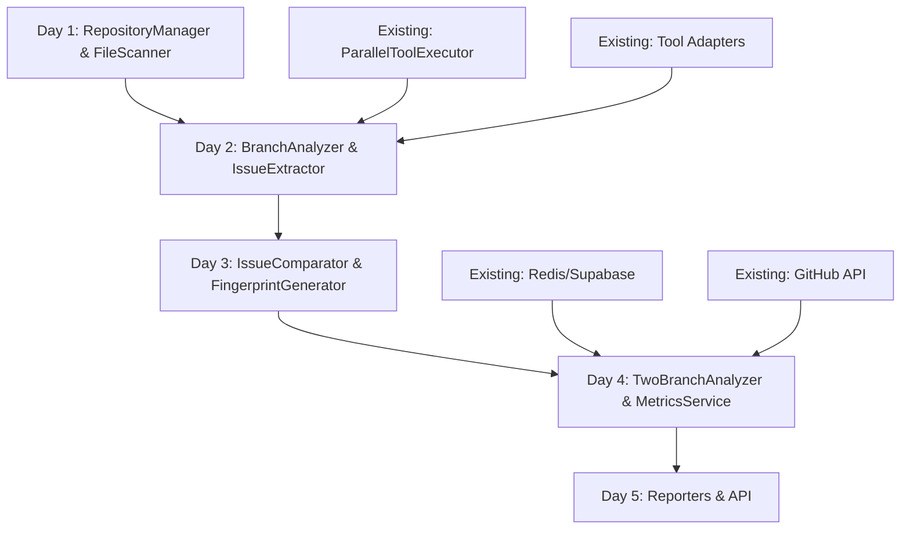

# Implementation Status - Two-Branch Analysis System

## Overview
This document tracks what components already exist vs. what needs to be built for the two-branch analysis system.

---

## ✅ EXISTING COMPONENTS (90% of infrastructure is ready!)

### 1. Tool Execution Framework ✅
```typescript
// Location: packages/mcp-hybrid/src/integration/
✅ ParallelToolExecutor      - Executes tools in parallel by priority
✅ ToolRegistry              - Manages tool registration
✅ ToolResultsAggregator     - Aggregates results by role
✅ PreprocessingExecutor     - Pre-computation of tool results
```

### 2. Tool Adapters (30+ tools integrated!) ✅
```typescript
// Location: packages/mcp-hybrid/src/adapters/

// Security Tools
✅ SemgrepMCPAdapter        - Security vulnerability scanning
✅ MCPScanAdapter           - Security scan
✅ TrivyDirectAdapter       - Container security
✅ GitLeaksDirectAdapter    - Secret detection

// Code Quality Tools  
✅ ESLintDirectAdapter      - JavaScript/TypeScript linting
✅ SonarJSDirectAdapter     - Advanced JS quality rules
✅ JSCPDDirectAdapter       - Copy-paste detection
✅ PrettierDirectAdapter    - Code formatting check

// Dependency Tools
✅ NPMAuditDirectAdapter    - NPM vulnerability scan
✅ LicenseCheckerAdapter    - License compliance
✅ DependencyCruiserAdapter - Dependency analysis
✅ NPMOutdatedAdapter       - Outdated packages

// Performance Tools
✅ LighthouseDirectAdapter  - Performance metrics
✅ BundlephobiaAdapter      - Bundle size analysis

// Context Tools
✅ TavilyMCPAdapter         - Web search for context
✅ SerenaMCPAdapter         - Code understanding
✅ GitMCPAdapter            - Git operations
```

### 3. Storage Infrastructure ✅
```typescript
// Redis Cache
✅ packages/agents/src/infrastructure/redis/RedisCache.ts

// Supabase Database  
✅ packages/agents/src/infrastructure/supabase/SupabaseClient.ts

// Vector Database
✅ packages/mcp-hybrid/src/db/vector-db.ts
```

### 4. GitHub Integration ✅
```typescript
✅ packages/agents/src/services/github/GitHubAPI.ts
✅ PR information retrieval
✅ File content fetching
✅ Diff extraction
```

### 5. Agent Framework ✅
```typescript
✅ BaseAgent class
✅ AgentFactory
✅ Agent roles (Security, Quality, Performance, etc.)
✅ Multi-agent orchestration
```

### 6. Existing Types & Utils ✅
```typescript
✅ Logger utilities
✅ Error handling
✅ Configuration management
✅ Environment variables
```

---

## ❌ NEW COMPONENTS TO BUILD

### Week 1: Core Implementation (MVP)

#### Day 1: Repository Management
```typescript
❌ RepositoryManager.ts
   - cloneRepository(url: string): Promise<string>
   - checkoutBranch(path: string, branch: string): Promise<void>
   - fetchPR(path: string, prNumber: number): Promise<void>
   - getCurrentBranch(path: string): Promise<string>
   - getCommitHash(path: string): Promise<string>

❌ FileScanner.ts
   - getAllFiles(repoPath: string): Promise<FileInfo[]>
   - detectLanguage(file: string): string
   - getFileStats(path: string): Promise<FileStats>
```

#### Day 2: Branch Analysis
```typescript
❌ BranchAnalyzer.ts
   - analyzeRepository(path: string, branch: string): Promise<BranchAnalysisResult>
   - selectTools(files: FileInfo[]): ToolConfig[]
   - runTools(path: string, files: FileInfo[], tools: ToolConfig[]): Promise<ToolResults>

❌ IssueExtractor.ts
   - extractIssues(toolResults: Map<string, ToolOutput>): ToolIssue[]
   - normalizeIssue(toolId: string, finding: any): ToolIssue
   - generateFingerprint(toolId: string, finding: any): string

❌ ToolResultParser.ts
   - parseSemgrepResult(result: any): ToolFinding[]
   - parseESLintResult(result: any): ToolFinding[]
   - parseNPMAuditResult(result: any): ToolFinding[]
```

#### Day 3: Issue Comparison
```typescript
❌ IssueComparator.ts
   - compare(baseIssues: ToolIssue[], prIssues: ToolIssue[]): ComparisonResult
   - findNewIssues(base: ToolIssue[], pr: ToolIssue[]): EnhancedIssue[]
   - findFixedIssues(base: ToolIssue[], pr: ToolIssue[]): EnhancedIssue[]
   - findUnchangedIssues(base: ToolIssue[], pr: ToolIssue[]): EnhancedIssue[]

❌ FingerprintGenerator.ts
   - generate(issue: ToolIssue): string
   - normalizeLocation(file: string, line: number): string
   - hashContent(content: string): string

❌ IssueMapper.ts
   - mapIssuesToFiles(issues: ToolIssue[]): Map<string, ToolIssue[]>
   - findSimilarIssues(issue: ToolIssue, candidates: ToolIssue[]): ToolIssue[]
```

#### Day 4: Services & Metrics
```typescript
❌ TwoBranchAnalyzer.ts (Main Orchestrator)
   - analyzePR(repoUrl: string, prNumber: number): Promise<PRAnalysisReport>
   - analyzeMainBranch(repoPath: string): Promise<BranchAnalysisResult>
   - analyzePRBranch(repoPath: string, prNumber: number): Promise<BranchAnalysisResult>
   - compareResults(main: BranchAnalysisResult, pr: BranchAnalysisResult): ComparisonResult

❌ MetricsService.ts
   - calculate(comparison: ComparisonResult): AnalysisMetrics
   - calculateScores(comparison: ComparisonResult): Scores
   - assessRisk(newIssues: EnhancedIssue[]): RiskLevel
   - calculateImprovement(comparison: ComparisonResult): number
```

#### Day 5: Report Generation
```typescript
❌ MarkdownReporter.ts
   - generate(comparison: ComparisonResult, prInfo: PRInfo): string
   - formatNewIssues(issues: EnhancedIssue[]): string
   - formatFixedIssues(issues: EnhancedIssue[]): string
   - formatUnchangedIssues(issues: EnhancedIssue[]): string

❌ JsonReporter.ts
   - generate(comparison: ComparisonResult, prInfo: PRInfo): object
   - toAPIFormat(report: PRAnalysisReport): APIResponse

❌ SummaryGenerator.ts
   - generateExecutiveSummary(comparison: ComparisonResult): string
   - identifyKeyFindings(comparison: ComparisonResult): KeyFinding[]
   - generateRecommendations(comparison: ComparisonResult): string[]
```

### Week 2: Enhancement

```typescript
❌ CacheManager.ts
   - Multi-level caching (Memory → Redis → VectorDB)
   - Cache invalidation strategies
   - TTL management

❌ IncrementalAnalyzer.ts
   - Analyze only changed files
   - Smart dependency detection
   - Cache reuse for unchanged files
```

### Week 3: AI Enhancement

```typescript
❌ AIEnhancer.ts
   - Pattern recognition
   - Fix generation
   - Priority scoring
   - Natural language explanations

❌ FixGenerator.ts
   - Generate fixes for common issues
   - AI-powered fix suggestions
   - Code snippet generation
```

---

## Implementation Order & Dependencies



---

## Quick Start Commands

### 1. Set up the development environment
```bash
cd /Users/alpinro/Code\ Prjects/codequal
git checkout -b feature/two-branch-analyzer
cd packages/agents/src/two-branch
```

### 2. Install dependencies
```bash
npm install simple-git @types/simple-git
npm install crypto @types/crypto
```

### 3. Run the integration test
```bash
npm test tests/integration/complete-flow.test.ts
```

### 4. Start implementing (Day 1)
```bash
# Create the first component
touch core/RepositoryManager.ts
touch core/FileScanner.ts
```

---

## Success Criteria for MVP (End of Week 1)

- [ ] Can clone and analyze any GitHub repository
- [ ] Runs at least 3 tools (Semgrep, ESLint, npm-audit)
- [ ] Correctly identifies new, fixed, and unchanged issues
- [ ] Generates readable markdown report
- [ ] Analysis completes in < 2 minutes for small repos
- [ ] Finds real issues (not hallucinated)
- [ ] API endpoint working

---

## Notes

1. **We're not starting from scratch!** 90% of the infrastructure exists.
2. **Focus on integration** - Most tools and frameworks are ready.
3. **Prioritize MVP** - Get basic functionality working first.
4. **Test with real repos** - Use sindresorhus/ky PR #700 for initial testing.
5. **Iterate quickly** - Ship working code, then enhance.