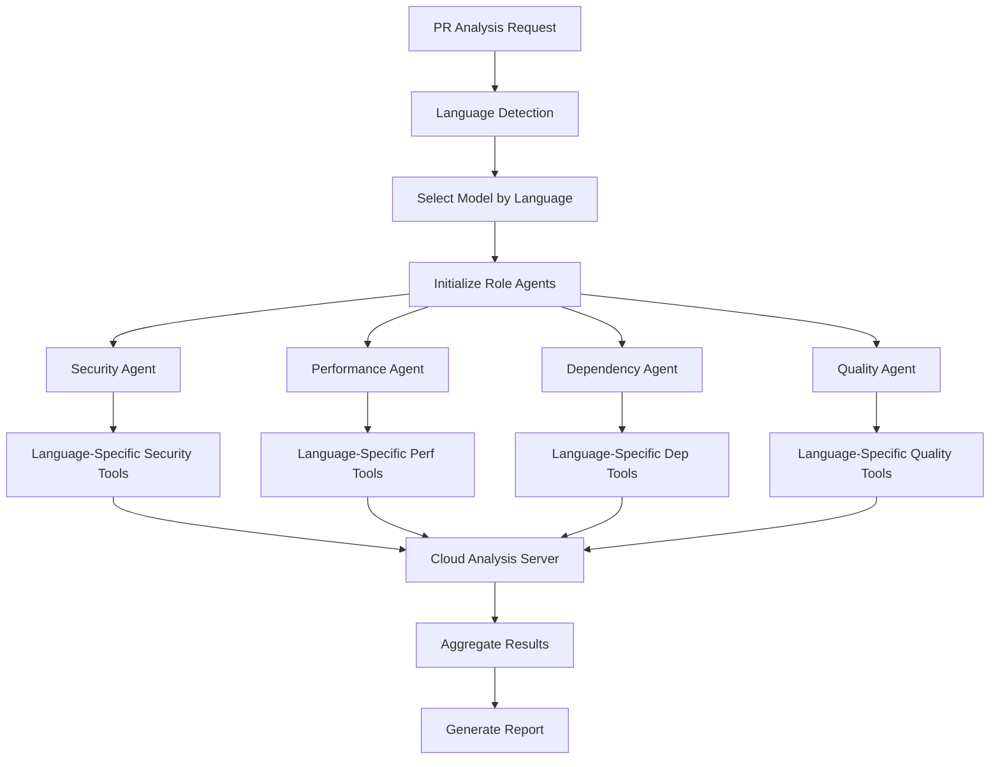

# Agent-Tool-Language Matrix

## Complete Mapping of Role-Based Agents to Language-Specific Tools

### 🔐 Security Agent

| Language | Tools | Support Level |
|----------|-------|---------------|
| **JavaScript/TypeScript** | `semgrep`, `eslint-plugin-security`, `snyk` | ✅ Full |
| **Python** | `bandit`, `semgrep`, `safety`, `pip-audit` | ✅ Full |
| **Java** | `spotbugs`, `find-sec-bugs`, `semgrep`, `owasp-dependency-check` | ✅ Full |
| **Go** | `gosec`, `semgrep`, `nancy` | ✅ Full |
| **Ruby** | `brakeman`, `bundler-audit`, `semgrep` | ✅ Full |
| **PHP** | `psalm`, `security-checker`, `semgrep` | ⚠️ Good |
| **C#/.NET** | `security-scan`, `semgrep` | ⚠️ Good |
| **Rust** | `cargo-audit`, `semgrep` | ⚠️ Good |
| **C/C++** | `cppcheck`, `flawfinder`, `semgrep` | ⚠️ Good |
| **Swift** | `semgrep` | 🔶 Basic |
| **Kotlin** | `detekt`, `semgrep` | 🔶 Basic |
| **Objective-C** | `oclint`, `semgrep` | 🔶 Basic |

### ⚡ Performance Agent

| Language | Tools | Support Level |
|----------|-------|---------------|
| **JavaScript/TypeScript** | `lighthouse`, `k6`, `clinic`, `autocannon` | ✅ Full |
| **Python** | `py-spy`, `memory-profiler`, `line-profiler` | ✅ Full |
| **Java** | `jmh`, `jprofiler`, `visualvm`, `async-profiler` | ✅ Full |
| **Go** | `pprof`, `go-torch`, `benchstat` | ✅ Full |
| **Ruby** | `ruby-prof`, `memory_profiler`, `benchmark-ips` | ⚠️ Good |
| **PHP** | `blackfire`, `xdebug`, `phpbench` | ⚠️ Good |
| **C#/.NET** | `dotnet-trace`, `perfview`, `benchmarkdotnet` | ⚠️ Good |
| **Rust** | `cargo-bench`, `flamegraph`, `criterion` | ⚠️ Good |
| **C/C++** | `valgrind`, `perf`, `vtune`, `gprof` | ✅ Full |
| **Swift** | `instruments` (macOS only) | 🔶 Basic |
| **Kotlin** | `jmh`, `async-profiler` | ⚠️ Good |
| **Objective-C** | `instruments`, `xcode-profiler` (macOS only) | 🔶 Basic |

### 📦 Dependency Agent

| Language | Tools | Support Level |
|----------|-------|---------------|
| **JavaScript/TypeScript** | `npm-audit`, `snyk`, `dependency-cruiser`, `madge` | ✅ Full |
| **Python** | `safety`, `pip-audit`, `pipdeptree` | ✅ Full |
| **Java** | `owasp-dependency-check`, `maven-dependency-plugin`, `gradle-versions-plugin` | ✅ Full |
| **Go** | `go mod audit`, `nancy`, `go-licenses` | ✅ Full |
| **Ruby** | `bundler-audit`, `bundle-leak` | ✅ Full |
| **PHP** | `composer-audit`, `security-checker` | ⚠️ Good |
| **C#/.NET** | `dotnet list package --vulnerable`, `nuget-audit` | ⚠️ Good |
| **Rust** | `cargo-audit`, `cargo-outdated`, `cargo-deny` | ✅ Full |
| **C/C++** | `conan`, `cve-bin-tool` | 🔶 Basic |
| **Swift** | `swift-package-audit` | 🔶 Basic |
| **Kotlin** | `gradle-versions-plugin`, `owasp-dependency-check` | ⚠️ Good |
| **Objective-C** | `cocoapods-audit`, `pod-audit` | 🔶 Basic |

### 🎨 Code Quality Agent

| Language | Tools | Support Level |
|----------|-------|---------------|
| **JavaScript/TypeScript** | `eslint`, `jshint`, `prettier`, `standard` | ✅ Full |
| **Python** | `pylint`, `flake8`, `black`, `isort` | ✅ Full |
| **Java** | `pmd`, `checkstyle`, `spotbugs`, `google-java-format` | ✅ Full |
| **Go** | `golangci-lint`, `staticcheck`, `gofmt`, `golint` | ✅ Full |
| **Ruby** | `rubocop`, `reek`, `flog` | ✅ Full |
| **PHP** | `phpcs`, `phpstan`, `psalm`, `php-cs-fixer` | ✅ Full |
| **C#/.NET** | `dotnet-format`, `roslynator`, `stylecop` | ⚠️ Good |
| **Rust** | `cargo-clippy`, `rustfmt` | ✅ Full |
| **C/C++** | `cppcheck`, `clang-tidy`, `clang-format` | ✅ Full |
| **Swift** | `swiftlint`, `swift-format` | 🔶 Basic |
| **Kotlin** | `detekt`, `ktlint` | ⚠️ Good |
| **Objective-C** | `oclint`, `clang-format` | 🔶 Basic |

### 🏗️ Architecture Agent

| Language | Tools | Support Level |
|----------|-------|---------------|
| **JavaScript/TypeScript** | `madge`, `dependency-cruiser`, `arkit` | ✅ Full |
| **Python** | `pydeps`, `import-linter`, `py-depgraph` | ⚠️ Good |
| **Java** | `jdepend`, `structure101`, `archunit` | ⚠️ Good |
| **Go** | `go-cleanarch`, `goda` | ⚠️ Good |
| **Ruby** | `packwerk`, `rubrowser` | 🔶 Basic |
| **PHP** | `deptrac`, `phpda` | 🔶 Basic |
| **C#/.NET** | `ndepend`, `archunitnet` | 🔶 Basic |
| **Rust** | `cargo-deps`, `cargo-modules` | 🔶 Basic |
| **C/C++** | `cppdepend`, `include-what-you-use` | 🔶 Basic |
| **All** | `sonarqube`, `codescene` | ⚠️ Good |

### 🔄 Duplicate Detection Agent

| Language | Tools | Support Level |
|----------|-------|---------------|
| **All Languages** | `jscpd`, `pmd-cpd`, `simian` | ✅ Full |

### 📊 Metrics Agent

| Language | Tools | Support Level |
|----------|-------|---------------|
| **All Languages** | `cloc`, `scc`, `tokei`, `sonarqube` | ✅ Full |

## Tool Installation Status

### ✅ Already Installed (from previous sessions)
- ESLint, TSC, JSHint
- Bandit, Pylint, MyPy, Safety
- Semgrep, JSCPD, CLOC
- npm-audit, Madge, dependency-cruiser
- CppCheck

### 📦 To Be Installed (run `install-all-language-tools.sh`)

#### Java Tools
- SpotBugs, PMD, Checkstyle
- OWASP Dependency Check
- JMH, JProfiler

#### Go Tools
- gosec, staticcheck, golangci-lint
- pprof, go-torch

#### Ruby Tools
- Brakeman, RuboCop, bundler-audit

#### PHP Tools
- Psalm, PHPStan, PHP_CodeSniffer

#### .NET Tools
- security-scan, dotnet-format, roslynator

#### Rust Tools
- cargo-audit, cargo-clippy, cargo-bench

#### Kotlin Tools
- detekt, ktlint

#### Objective-C Tools (Linux alternatives)
- clang-static-analyzer
- Note: Most Obj-C tools require macOS

## Cloud Server Integration

All tools are installed on: `157.230.9.119:3010`

### API Endpoints
```
POST /analyze
{
  "repository": "https://github.com/user/repo",
  "tools": ["eslint", "semgrep", "bandit"],
  "language": "python",
  "branch": "main"
}
```

## Orchestrator Flow



## Support Tiers

- **✅ Full Support (Tier 1)**: Complete tool coverage, production-ready
- **⚠️ Good Support (Tier 2)**: Most tools available, some gaps
- **🔶 Basic Support (Tier 3)**: Minimal tools, relies on universal tools like Semgrep

## Next Steps

1. ✅ Language Router Implementation - DONE
2. ✅ Agent Tool Configuration - DONE
3. ⏳ Install Missing Tools - Run `scripts/install-all-language-tools.sh`
4. 📝 Review Role Prompts - Next task
5. 🔬 Request Researcher for Configs - After prompt review