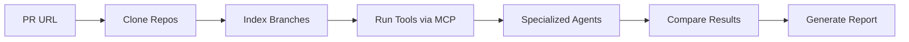

# 🚀 QUICK START - Two-Branch Analysis System
## Session Date: 2025-08-28 | Next Priority: MCP Integration

---

## 📍 WHERE WE LEFT OFF

We successfully built a **Two-Branch Analysis System** to replace the broken DeepWiki integration that was returning hallucinated/fake responses. The system is architecturally complete but needs MCP-hybrid package built to enable actual tool execution.

---

## ⚡ QUICK START COMMANDS

```bash
# 1. Navigate to project
cd /Users/alpinro/Code\ Prjects/codequal/packages/agents

# 2. Check system status
npx ts-node src/two-branch/__tests__/integration-smoke-test.ts

# 3. CRITICAL: Build MCP package (if not done)
cd ../mcp-hybrid && npm install && npm run build && cd ../agents

# 4. Test with mock PR
USE_DEEPWIKI_MOCK=false npx ts-node src/two-branch/__tests__/test-pr-analysis.ts
```

---

## 🎯 IMMEDIATE PRIORITIES

### 1. **BUILD MCP-HYBRID PACKAGE** (2-3 hours)
**File**: `packages/mcp-hybrid/`
```bash
cd /Users/alpinro/Code\ Prjects/codequal/packages/mcp-hybrid
npm install
npm run build
```
**Why Critical**: Without this, no tools can execute - system runs on mocks only

### 2. **Test Real PR Analysis** (1-2 hours)
**File**: `packages/agents/src/two-branch/core/TwoBranchAnalyzer.ts:155-275`
```typescript
// Test with a real GitHub PR
const analyzer = new TwoBranchAnalyzer();
const result = await analyzer.analyzePullRequest(
  'https://github.com/sindresorhus/ky/pull/700'
);
```

### 3. **Configure Environment Variables** (30 mins)
**File**: `.env`
```bash
SUPABASE_URL=<your-url>
SUPABASE_SERVICE_ROLE_KEY=<your-key>
OPENROUTER_API_KEY=<your-key>
REDIS_URL=redis://localhost:6379
```

---

## 📂 KEY FILES TO REFERENCE

### Core System Components
- **Main Orchestrator**: `src/two-branch/core/TwoBranchAnalyzer.ts`
- **Branch Analyzer**: `src/two-branch/analyzers/BranchAnalyzer.ts`
- **Repository Manager**: `src/two-branch/core/RepositoryManager.ts`
- **Type Definitions**: `src/two-branch/types/index.ts`

### Specialized Agents (NEW)
- **Security**: `src/specialized/security-agent.ts`
- **Performance**: `src/specialized/performance-agent.ts`
- **Code Quality**: `src/specialized/code-quality-agent.ts`

### Documentation
- **Architecture**: `src/two-branch/ARCHITECTURE.md`
- **Implementation Plan**: `src/two-branch/IMPLEMENTATION_PLAN.md`
- **Session Summary**: `src/two-branch/SESSION_SUMMARY_2025_08_28.md`

---

## 🐛 ACTIVE BUGS TO TRACK

### BUG-087: MCP-hybrid package not built
- **Severity**: CRITICAL
- **Impact**: Tools cannot execute without this
- **Fix**: Build the package as shown above

### BUG-088: Missing environment variables
- **Severity**: MEDIUM
- **Impact**: Caching and model selection use defaults
- **Fix**: Add credentials to .env file

---

## ✅ WHAT'S WORKING

1. **Two-Branch Analysis Architecture** - Complete and tested
2. **TypeScript Compilation** - All errors fixed
3. **Specialized Agents** - All three created and integrated
4. **Caching System** - Multi-level with Redis/memory fallback
5. **Comparison Engine** - Deterministic issue categorization
6. **Report Generation** - V9 with dynamic model selection

---

## 🔄 SYSTEM FLOW RECAP



---

## 💡 KEY INSIGHTS

1. **DeepWiki Replacement**: We moved from hallucinated AI responses to deterministic tool analysis
2. **Parallel Architecture**: Tools run in parallel on both branches for efficiency
3. **Smart Caching**: Different TTLs for different data types (tools: 7 days, branches: 1 hour, PRs: 5 mins)
4. **Extensible Design**: Easy to add new tools or specialized agents

---

## 📝 TESTING COMMANDS

```bash
# Test core system (with mocks)
npx ts-node src/two-branch/__tests__/integration-smoke-test.ts

# Test PR analysis (needs MCP)
USE_DEEPWIKI_MOCK=false npm run analyze -- --repo https://github.com/sindresorhus/ky --pr 700

# Test with mock data (no MCP needed)
USE_DEEPWIKI_MOCK=true npx ts-node src/two-branch/__tests__/test-pr-analysis.ts

# Check TypeScript compilation
npx tsc --noEmit
```

---

## 🎯 SUCCESS CRITERIA FOR NEXT SESSION

1. [ ] MCP-hybrid package successfully built
2. [ ] Real PR analyzed with actual tool results
3. [ ] Performance metrics collected (analysis time < 2 mins for medium repos)
4. [ ] Integration test suite passes with real tools
5. [ ] Production deployment plan created

---

## 📊 METRICS TO TRACK

- **Analysis Time**: Target < 2 minutes for repos under 10k LOC
- **Tool Success Rate**: Target > 90% successful executions
- **Cache Hit Rate**: Target > 60% for repeated analyses
- **Issue Accuracy**: Compare with manual review for validation

---

## 🚨 IF SOMETHING BREAKS

1. **MCP build fails**: Check Node version (needs 18+), clear node_modules
2. **Tools timeout**: Increase timeout in `BranchAnalyzer:125` (default 30s)
3. **Memory issues**: Enable sequential mode in `TwoBranchAnalyzer:195`
4. **Cache errors**: Fallback to memory cache automatically (check logs)

---

## 📞 CONTEXT FOR AI ASSISTANT

When starting next session, mention:
- "Continue Two-Branch Analysis System implementation"
- "MCP integration is the blocker"
- "Reference NEXT_SESSION_QUICKSTART_TWO_BRANCH_2025_08_28.md"
- "Check src/two-branch/ARCHITECTURE.md for system design"

---

**Ready to continue? Start with the MCP build!** 🚀