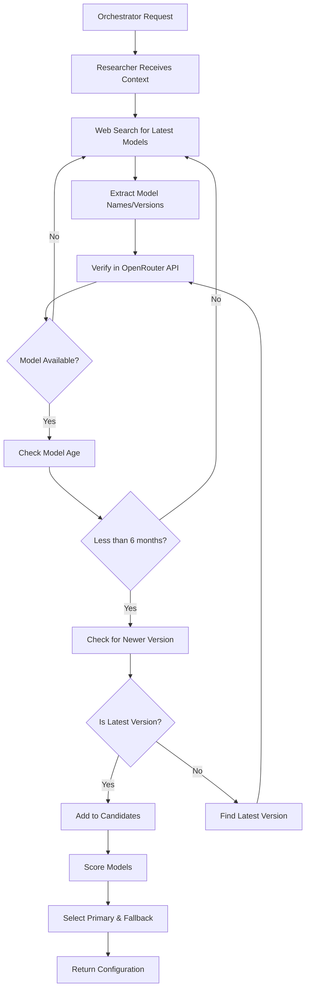

# Researcher Agent Model Selection Request

## CRITICAL REQUIREMENTS

### ⚠️ ABSOLUTELY NO HARDCODED MODELS OR VERSIONS
- **NEVER** specify exact model names like "claude-opus-4" or "gpt-5"
- **NEVER** hardcode version numbers
- **ALWAYS** search for the latest available models
- **ALWAYS** verify models are less than 6 months old
- **ALWAYS** choose the newest version (e.g., Opus 4.1 over Opus 4)

## Model Selection Flow



## Research Process for Each Configuration

### 1. Context Input from Orchestrator
```typescript
{
  role: 'security' | 'performance' | 'quality' | 'dependency' | 'architecture',
  language: 'javascript' | 'python' | 'java' | ... (16 languages),
  repoSize: 'small' | 'medium' | 'large',
  timestamp: '2025-08-29T00:00:00Z'  // Current date for age validation
}
```

### 2. Dynamic Web Search Queries

The researcher should construct search queries like:
```
"latest AI models for code security analysis August 2025"
"best LLM for JavaScript vulnerability detection 2025"
"newest GPT Claude Gemini models programming August 2025"
"OpenRouter available models code analysis latest 2025"
```

**IMPORTANT**: Use the current month/year dynamically, not hardcoded dates.

### 3. Model Discovery Rules

#### Step 1: Web Search for Latest Models
- Search for models released in the last 6 months
- Look for announcements of new versions
- Check AI news sites, OpenRouter blog, provider announcements
- Identify model families (GPT, Claude, Gemini, Llama, etc.)

#### Step 2: Extract Model Information
From search results, extract:
- Model family (e.g., "Claude Opus")
- Version indicators (e.g., "4.1", "latest", "August 2025")
- Release dates
- Capabilities mentioned

#### Step 3: Verify in OpenRouter
```typescript
// Pseudo-code for verification
const openRouterModels = await fetchOpenRouterModels();
const candidates = [];

for (const discoveredModel of webSearchResults) {
  // Find exact match in OpenRouter
  const match = openRouterModels.find(m => 
    m.id.includes(discoveredModel.family) && 
    m.id.includes(discoveredModel.version)
  );
  
  if (match) {
    // Verify it's the latest version
    const newerVersion = openRouterModels.find(m =>
      m.id.includes(discoveredModel.family) &&
      compareVersions(m.version, discoveredModel.version) > 0
    );
    
    if (!newerVersion) {
      candidates.push(match);
    }
  }
}
```

### 4. Model Scoring Based on Context

#### For Security Agent
```typescript
const securityWeights = {
  quality: 0.45,      // High quality for accurate vulnerability detection
  speed: 0.15,        // Less important
  cost: 0.20,         // Moderate importance
  freshness: 0.10,    // Prefer newer models
  contextWindow: 0.10 // Need reasonable context
};
```

Apply these weights to score each candidate model.

### 5. Selection Criteria

#### Primary Model Selection
- Highest weighted score
- Must be from a major provider (OpenAI, Anthropic, Google)
- Must support the required context window
- Must be the LATEST version of its family

#### Fallback Model Selection
- Different provider than primary (for redundancy)
- Lower cost than primary
- Still meets minimum quality threshold
- Must be the LATEST version of its family

## Configuration Output Format

```typescript
{
  role: 'security',
  language: 'javascript',
  size_category: 'medium',
  primary: {
    provider: 'anthropic',  // Discovered, not hardcoded
    model: 'claude-opus-4.1-20250815',  // Exact ID from OpenRouter
    reasoning: [
      'Latest Claude Opus version as of August 2025',
      'Excellent at security pattern recognition',
      'Released 2 weeks ago, newest in family'
    ]
  },
  fallback: {
    provider: 'openai',  // Different provider
    model: 'gpt-5-20250801',  // Exact ID from OpenRouter
    reasoning: [
      'Latest GPT-5 version available',
      'Good security analysis capabilities',
      'Lower cost than primary'
    ]
  },
  weights: {
    quality: 0.45,
    speed: 0.15,
    cost: 0.20,
    freshness: 0.10,
    contextWindow: 0.10
  },
  search_queries_used: [
    'latest AI models security code analysis August 2025',
    'Claude Opus 4.1 vs 4.0 comparison',
    'GPT-5 availability OpenRouter'
  ],
  models_considered: [
    { model: 'claude-opus-4.1-20250815', score: 8.5, reason: 'selected as primary' },
    { model: 'gpt-5-20250801', score: 8.2, reason: 'selected as fallback' },
    { model: 'claude-opus-4-20250601', score: 7.8, reason: 'rejected: newer version exists' },
    { model: 'gemini-2.5-pro', score: 7.5, reason: 'rejected: lower score' }
  ],
  timestamp: '2025-08-29T12:00:00Z',
  valid_until: '2025-09-29T12:00:00Z'  // Revalidate monthly
}
```

## Total Configurations Needed: 273

### Universal Roles (3 configs)
1. **Orchestrator** - Single config for overall coordination
2. **Researcher** - Single config for research tasks
3. **Educator** - Single config for educational content

### Specialized Roles (270 configs = 9 roles × 10 languages × 3 sizes)

#### Roles:
1. DeepWiki (analysis)
2. Comparator (PR comparison)
3. Location Finder (finding code locations)
4. Security (vulnerability detection)
5. Performance (optimization)
6. Architecture (design patterns)
7. Code Quality (best practices)
8. Testing (test coverage)
9. Documentation (docs generation)

#### Languages:
1. JavaScript
2. TypeScript
3. Python
4. Java
5. Go
6. Ruby
7. PHP
8. C#
9. C/C++
10. Rust

#### Sizes:
1. Small (< 50 files)
2. Medium (50-500 files)
3. Large (> 500 files)

## Validation Checklist for Each Config

- [ ] Model exists in OpenRouter API
- [ ] Model is less than 6 months old
- [ ] Model is the LATEST version in its family
- [ ] Primary and fallback are from different providers
- [ ] Weights are appropriate for the role
- [ ] Language-specific considerations applied
- [ ] Size-specific adjustments made
- [ ] No hardcoded model names or versions
- [ ] Search queries documented
- [ ] Reasoning clearly explained

## Example Research Prompts

### For Security + JavaScript + Medium
```
Research the latest AI models (August 2025) best suited for JavaScript security analysis in medium-sized repositories. 

Requirements:
- Find models excellent at detecting XSS, injection, npm vulnerabilities
- Must be available in OpenRouter
- Must be latest version (no older versions if newer exists)
- Need good pattern recognition for security issues
- Consider models released in last 6 months only

Search for:
1. Latest Claude models for code security
2. Newest GPT versions for vulnerability detection  
3. Recent Gemini updates for code analysis
4. Check which versions are actually available in OpenRouter
5. Verify no newer versions exist for each model family
```

### For Performance + Python + Large
```
Research the latest AI models (August 2025) for Python performance optimization in large repositories.

Requirements:
- Find models that understand GIL, async patterns, NumPy optimization
- Must handle large context windows (100k+ tokens)
- Must be available in OpenRouter
- Must be newest version of each model family
- Fast inference speed important for large repos

Search for:
1. Latest models with Python expertise
2. Models with large context windows
3. Fast inference models from last 6 months
4. Verify exact versions in OpenRouter
5. Ensure using newest, not older versions
```

## Error Handling

If suitable models cannot be found:
```typescript
throw new Error(
  `Cannot find suitable models for configuration:
   Role: ${role}, Language: ${language}, Size: ${size}
   Searched queries: ${searchQueries.join(', ')}
   Reason: No models found less than 6 months old with required capabilities
   Please expand search or wait for new model releases`
);
```

## Implementation Notes

1. **NO HARDCODING** - The researcher must discover models dynamically
2. **VERSION VALIDATION** - Always verify you have the latest version
3. **AGE CHECK** - Reject models older than 6 months
4. **PROVIDER DIVERSITY** - Primary and fallback from different providers
5. **DOCUMENT SEARCHES** - Keep record of what was searched
6. **EXPLAIN REASONING** - Clear explanation for each selection

## Success Criteria

A successful configuration will:
1. Use only dynamically discovered models
2. Select the absolute latest versions
3. Provide clear reasoning for selections
4. Include search documentation
5. Meet all role/language/size requirements
6. Have no hardcoded model names or versions