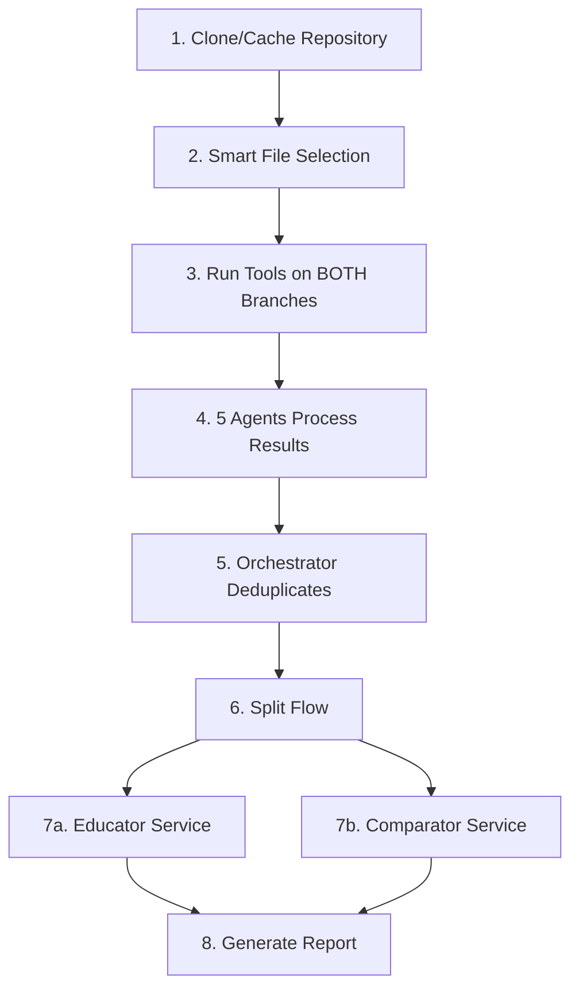

# V9 SYSTEM OVERVIEW - CANONICAL REFERENCE

## ⚠️ CRITICAL: READ THIS FIRST IN EVERY SESSION

**DO NOT CREATE NEW TOOL EXECUTION LOGIC** - The system already has everything built!

## 🏗️ What Already Exists (DO NOT RECREATE)

### 1. Repository Management & Caching
- **Location**: `/packages/agents/src/two-branch/analyzers/v9-repository-manager.ts`
- **Purpose**: Handles repository cloning, caching, and indexing
- **Features**:
  - Automatic workspace creation in Kubernetes PVC
  - Smart caching for large repositories
  - Two-branch comparison (main vs PR)

### 2. Smart File Selection
- **Location**: `/packages/agents/src/two-branch/utils/smart-file-selector.ts`
- **Rules**:
  - < 10,000 files → 100% coverage
  - > 10,000 files → Smart selection (~500 most important files)
  - Prioritizes: PR changes > Critical files > Entry points > Config > Tests
- **DO NOT** create new file selection logic - use `SmartFileSelector` class

### 3. Tool Execution Infrastructure
- **Location**: `/packages/agents/src/two-branch/analyzers/v9-tool-orchestrator.ts`
- **Deployment**: Direct Docker on Oracle Cloud VMs (NOT Kubernetes)
- **Container Images** (in iad.ocir.io/codequal/):
  - `analyzer:lang-java-v5.3` - Java tools (PMD, Checkstyle, Semgrep, SpotBugs, Dependency-Check)
  - `analyzer:lang-python-v4.3` - Python tools (Pylint, Bandit, MyPy, Safety)
  - `analyzer:lang-javascript-v4.3` - JavaScript/TypeScript tools (ESLint, TSC, npm audit)
  - `analyzer:lang-go-v2.1` - Go tools (golangci-lint, gosec, go vet)
  - `analyzer:lang-rust-v1.3` - Rust tools (Clippy, cargo-audit)
- **DO NOT** try to use generic Docker images - use our specialized analyzers

### 4. Oracle Cloud Infrastructure
- **Cloud Provider**: Oracle Cloud Infrastructure (OCI)
- **VM**: A1.Flex (4 OCPU, 24GB RAM, ARM64)
- **Registry**: Oracle Container Image Repository (OCIR) - `iad.ocir.io/codequal/`
- **Storage**: `/data/` volumes on VM (CVE database, repository cache)
- **Deployment Model**: Direct Docker execution (no Kubernetes overhead)

### 5. The 5 Mandatory Agents
All located in `/packages/agents/src/two-branch/agents/specialized-agents.ts`:
1. **Security Agent** - Security vulnerability analysis
2. **Quality Agent** - Code quality and maintainability
3. **Performance Agent** - Performance bottlenecks
4. **Architecture Agent** - Architectural patterns and design
5. **Dependency Agent** - Dependency vulnerabilities

### 6. AI-Powered Fix Generation
- **Location**: `/packages/agents/src/two-branch/services/enhanced-fix-generator.ts`
- **Features**:
  - Uses OpenRouter API with dynamic model selection
  - Generates fixes based on issue context, NOT templates
  - Batch processing (Security: 10, Quality: 5, etc.)

## 🔄 The Canonical V9 Flow (NEVER DEVIATE)



## 📁 Key Files to Reference

### For Testing V9 System
```bash
# The WORKING test that uses all infrastructure correctly
/packages/agents/test-v8-final.ts

# V9 test runner with all components
/packages/agents/src/standard/tests/regression/v9-test-runner.ts
```

### For Understanding Architecture
```bash
# Complete V9 architecture documentation
/packages/agents/V9_CANONICAL_ARCHITECTURE.md

# Repository manager with caching
/packages/agents/src/two-branch/analyzers/v9-repository-manager.ts

# Tool orchestrator
/packages/agents/src/two-branch/analyzers/v9-tool-orchestrator.ts

# Smart file selector
/packages/agents/src/two-branch/utils/smart-file-selector.ts
```

## 🚫 Common Mistakes to Avoid

### ❌ DON'T DO THIS:
1. Create new tool execution logic
2. Try to run tools directly with kubectl
3. Use generic Docker images (busybox, openjdk, etc.)
4. Create new file selection algorithms
5. Implement new caching mechanisms
6. Write simulation/fallback code
7. Create alternative flows to the canonical V9 flow

### ✅ DO THIS INSTEAD:
1. Use `V9ToolOrchestrator` for tool execution
2. Use `V9RepositoryManager` for repo management
3. Use our `analyzer:lang-*` images from the registry
4. Use `SmartFileSelector` for file selection
5. Use existing Redis caching
6. Fail fast with real errors
7. Follow the canonical V9 flow exactly

## 🔍 Quick Diagnostic Commands

```bash
# Check Oracle VM connectivity
ssh opc@<oracle-vm-ip>

# Check Docker containers
docker ps

# Check if analyzer images are available
docker images | grep ocir

# Check shared volumes
ls -lh /data/dependency-check/active
ls -lh /data/repositories/

# Check environment variables
env | grep -E "(SUPABASE|OPENROUTER|REDIS|NVD_API_KEY)"

# Check cron jobs
crontab -l

# Run the WORKING test
cd /Users/alpinro/Code\ Prjects/codequal/packages/agents
npx ts-node test-v8-final.ts
```

## 📊 Real Infrastructure Status

### What's Actually Running:
- ✅ Oracle Cloud VM (A1.Flex, 4 OCPU, 24GB RAM)
- ✅ Direct Docker execution (no Kubernetes)
- ✅ Analyzer containers in Oracle Container Registry (OCIR)
- ✅ Shared CVE database cache (3GB + 2GB indexes)
- ✅ Redis cache for analysis results
- ✅ Supabase for persistence
- ✅ UnifiedMonitoringService + Grafana dashboards

### What Needs Manual Setup:
- Oracle VM SSH access
- OCIR registry login credentials
- Environment variables (.env file)
- NVD API key for Dependency-Check
- System cron for daily database updates

## 🎯 Testing Apache Kafka PR #17620

### The Correct Way:
```javascript
// Use the existing V9 components
const { V9ToolOrchestrator } = require('./packages/agents/dist/two-branch/analyzers/v9-tool-orchestrator');
const { V9RepositoryManager } = require('./packages/agents/dist/two-branch/analyzers/v9-repository-manager');
const { SmartFileSelector } = require('./packages/agents/dist/two-branch/utils/smart-file-selector');

// Configure for Kafka
const config = {
  repository: 'apache/kafka',
  prNumber: 17620,
  useSmartSelection: true,  // Will use smart selection for > 10k files
  maxFiles: 500,
  forceFullAnalysis: false
};

// Let the existing infrastructure handle everything
const repoManager = new V9RepositoryManager(config);
const { mainPath, prPath } = await repoManager.prepareRepositories(
  'https://github.com/apache/kafka',
  17620
);
```

## 🔴 CRITICAL REMINDERS

1. **THE SYSTEM IS 70% PRODUCTION READY** - Don't recreate what works
2. **USE THE ANALYZE FRAMEWORK** - It handles caching, indexing, and file selection
3. **NO SIMULATION** - Always use real cloud execution
4. **NO FALLBACKS** - Fail fast with real errors
5. **FOLLOW V9 CANONICAL FLOW** - No alternatives allowed

## 📝 Session Startup Checklist

When starting a new session on V9:
1. ✅ Read this document first
2. ✅ Check V9_CANONICAL_ARCHITECTURE.md
3. ✅ Verify environment variables are set
4. ✅ Check Kubernetes connectivity
5. ✅ Use existing V9 components (DON'T CREATE NEW ONES)
6. ✅ Reference test-v8-final.ts for working implementation

---

**REMEMBER**: The infrastructure is already built. Your job is to use it, not rebuild it!