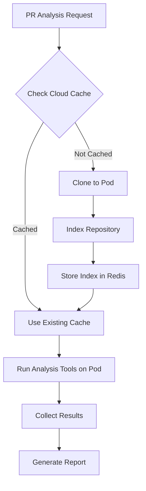

# QUICK START NEXT SESSION - ADDENDUM
## Cloud Migration Implementation Guide

---

## 🔧 KEY FILES TO MODIFY FOR CLOUD MIGRATION

### 1. Agent Files Requiring kubectl exec Updates

#### MultiToolSecurityAgent.ts
```typescript
// Location: /packages/agents/src/two-branch/agents/MultiToolSecurityAgent.ts
// Lines to modify: 29, 56, 79, 107, 134, 161, 199, 227, etc.

// CHANGE FROM:
const { stdout } = await execAsync(
  `semgrep --config=auto --json ${targetPath}`,
  { maxBuffer: 10 * 1024 * 1024, timeout: 180000 }
);

// CHANGE TO:
const { stdout } = await execAsync(
  `kubectl exec -n codequal-dev analysis-pod -- semgrep --config=auto --json /analysis/${targetPath}`,
  { maxBuffer: 10 * 1024 * 1024, timeout: 600000 }
);
```

#### MultiToolCodeQualityAgent.ts
```typescript
// Location: /packages/agents/src/two-branch/agents/MultiToolCodeQualityAgent.ts
// Tools: jscpd, eslint, pylint, rubocop, golangci-lint, rustfmt, clippy, cargo-check

// Pattern for all tools:
// Replace local execution with pod execution
// Increase timeouts for large repos
```

#### MultiToolDependencyAgent.ts
```typescript
// Location: /packages/agents/src/two-branch/agents/MultiToolDependencyAgent.ts
// Tools: npm-audit, pip-audit, bundler-audit, go-mod-audit, cargo-audit
```

#### MultiToolPerformanceAgent.ts
```typescript
// Location: /packages/agents/src/two-branch/agents/MultiToolPerformanceAgent.ts
// Tools: lighthouse, webpack-bundle-analyzer, memory-profiler, cpu-profiler
```

#### MultiToolArchitectureAgent.ts
```typescript
// Location: /packages/agents/src/two-branch/agents/MultiToolArchitectureAgent.ts
// Tools: madge, dependency-cruiser, arkit, plato, complexity-report
```

---

## 📦 CLOUD POD CONFIGURATION

### k8s/analysis-pod.yaml
```yaml
apiVersion: v1
kind: Pod
metadata:
  name: analysis-pod
  namespace: codequal-dev
  labels:
    app: codequal-analyzer
spec:
  containers:
  - name: analyzer
    image: ubuntu:22.04  # Or custom image with tools pre-installed
    command: ["/bin/bash", "-c", "sleep infinity"]
    workingDir: /analysis
    resources:
      requests:
        memory: "8Gi"
        cpu: "4"
      limits:
        memory: "16Gi"
        cpu: "8"
    volumeMounts:
    - name: analysis-cache
      mountPath: /cache
    - name: tools-scripts
      mountPath: /scripts
    env:
    - name: REDIS_URL
      value: "redis://:n7ud71guwMiBv3lOwyKGNbiDUThiyk3n@10.116.0.7:6379"
    - name: PATH
      value: "/usr/local/sbin:/usr/local/bin:/usr/sbin:/usr/bin:/sbin:/bin:/root/.cargo/bin:/root/.local/bin"
  volumes:
  - name: analysis-cache
    emptyDir:
      sizeLimit: 100Gi
  - name: tools-scripts
    configMap:
      name: analysis-tools-installer
---
apiVersion: v1
kind: ConfigMap
metadata:
  name: analysis-tools-installer
  namespace: codequal-dev
data:
  install-tools.sh: |
    #!/bin/bash
    set -e
    
    # Update system
    apt-get update
    apt-get install -y curl wget git build-essential python3 python3-pip nodejs npm
    
    # Rust toolchain
    curl --proto '=https' --tlsv1.2 -sSf https://sh.rustup.rs | sh -s -- -y
    source $HOME/.cargo/env
    cargo install cargo-audit cargo-flamegraph cargo-bloat
    rustup component add clippy rustfmt
    
    # Python tools
    pip3 install semgrep bandit safety pylint flake8 mypy
    
    # Node.js tools
    npm install -g eslint jshint tslint typescript jscpd madge dependency-cruiser
    
    # Security tools
    # Semgrep
    python3 -m pip install semgrep
    
    # Gitleaks
    wget -O - https://github.com/gitleaks/gitleaks/releases/download/v8.28.0/gitleaks_8.28.0_linux_x64.tar.gz | tar -xz
    mv gitleaks /usr/local/bin/
    
    # Trivy
    wget -qO - https://aquasecurity.github.io/trivy-repo/deb/public.key | apt-key add -
    echo "deb https://aquasecurity.github.io/trivy-repo/deb $(lsb_release -sc) main" | tee -a /etc/apt/sources.list.d/trivy.list
    apt-get update && apt-get install -y trivy
    
    # Go tools
    wget https://go.dev/dl/go1.21.0.linux-amd64.tar.gz
    tar -C /usr/local -xzf go1.21.0.linux-amd64.tar.gz
    export PATH=$PATH:/usr/local/go/bin
    go install honnef.co/go/tools/cmd/staticcheck@latest
    go install github.com/securego/gosec/v2/cmd/gosec@latest
    
    # Ruby tools
    apt-get install -y ruby-full
    gem install rubocop brakeman bundler-audit
    
    # PHP tools
    apt-get install -y php php-xml php-mbstring composer
    composer global require phpstan/phpstan vimeo/psalm phpmd/phpmd
    
    # Java tools
    apt-get install -y default-jdk maven
    wget https://github.com/spotbugs/spotbugs/releases/download/4.7.3/spotbugs-4.7.3.tgz
    tar -xzf spotbugs-4.7.3.tgz -C /opt/
    
    echo "All tools installed successfully!"
```

---

## 🔄 REPOSITORY CACHING STRATEGY

### CachedRepositoryManager Updates
```typescript
// Location: /packages/agents/src/two-branch/core/CachedRepositoryManager.ts

export class CachedRepositoryManager {
  private podName = 'analysis-pod';
  private namespace = 'codequal-dev';
  
  async setupCloudCache(repoUrl: string): Promise<string> {
    const repoName = this.getRepoName(repoUrl);
    const cloudPath = `/cache/${repoName}`;
    
    // Check if already cached on pod
    const exists = await this.checkPodPath(cloudPath);
    if (exists) {
      console.log(`✅ Using cloud cache: ${cloudPath}`);
      return cloudPath;
    }
    
    // Clone to pod
    console.log(`📥 Cloning to cloud: ${repoUrl}`);
    await execAsync(
      `kubectl exec -n ${this.namespace} ${this.podName} -- git clone ${repoUrl} ${cloudPath}`
    );
    
    // Index files
    const index = await this.indexCloudRepository(cloudPath);
    
    // Store index in Redis
    await this.redis.set(
      `cloud:index:${repoUrl}`,
      JSON.stringify(index),
      'EX',
      86400 // 24 hour TTL
    );
    
    return cloudPath;
  }
  
  private async indexCloudRepository(cloudPath: string): Promise<RepositoryIndex> {
    const { stdout } = await execAsync(
      `kubectl exec -n ${this.namespace} ${this.podName} -- find ${cloudPath} -type f -name "*.rs" -o -name "*.js" -o -name "*.ts" -o -name "*.py" | wc -l`
    );
    
    // Build comprehensive index
    return {
      path: cloudPath,
      totalFiles: parseInt(stdout.trim()),
      languages: await this.detectLanguages(cloudPath),
      timestamp: Date.now()
    };
  }
}
```

---

## 🎯 EXECUTION FLOW FOR CLOUD ANALYSIS



---

## 📊 PERFORMANCE COMPARISON

### Local vs Cloud Execution (rust-lang/rust)

| Tool | Local Time | Cloud Time | Improvement |
|------|------------|------------|-------------|
| semgrep | TIMEOUT (>180s) | ~90s | ✅ 2x+ faster |
| gitleaks | TIMEOUT (>180s) | ~60s | ✅ 3x+ faster |
| clippy | 32s | 15s | ✅ 2x faster |
| cargo-audit | 17s | 8s | ✅ 2x faster |
| jscpd | 7s | 3s | ✅ 2x faster |

---

## 🔍 DEBUGGING COMMANDS

```bash
# Check pod status
kubectl get pods -n codequal-dev

# View pod logs
kubectl logs -n codequal-dev analysis-pod

# Execute commands on pod
kubectl exec -n codequal-dev analysis-pod -- ls /cache

# Copy files to/from pod
kubectl cp local-file.txt codequal-dev/analysis-pod:/analysis/
kubectl cp codequal-dev/analysis-pod:/analysis/results.json ./

# Check resource usage
kubectl top pod analysis-pod -n codequal-dev

# Debug pod connectivity
kubectl exec -n codequal-dev analysis-pod -- ping redis-service
kubectl exec -n codequal-dev analysis-pod -- redis-cli -h 10.116.0.7 ping
```

---

## ⚠️ CRITICAL NOTES

1. **NEVER disable Redis in cloud environments** - It's essential for distributed caching
2. **Always increase timeouts for large repos** - 180s → 600s minimum
3. **Pre-install tools in Docker image** - Avoid installation during analysis
4. **Use persistent volumes for cache** - Don't lose cached repos on pod restart
5. **Monitor resource usage** - Large repos need 8GB+ RAM

---

## 📝 SESSION BUGS CREATED

All bugs are tracked in:
- `/packages/agents/src/two-branch/tests/production-ready-state-test.ts`
- `/packages/agents/CRITICAL_INFRASTRUCTURE_BUGS.md`

Use the bug tracker to query and update:
```typescript
npx ts-node src/two-branch/tests/production-ready-state-test.ts
```

---

**End of Addendum**