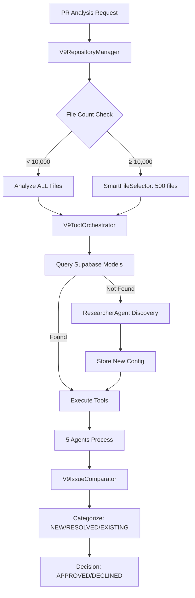

# 🧠 V9 CRITICAL KNOWLEDGE BASE
**IMPORTANT: Start every V9 session by reading this file**

## 🚨 STOP! Key Facts to Remember

### Decision Options (ONLY 2)
- **APPROVED** ✅ - PR can be merged
- **DECLINED** ❌ - PR needs changes
- ~~CHANGES_REQUESTED~~ - **DOES NOT EXIST**

### OpenRouter is EVERYTHING
- **OpenRouter = The ONLY gateway** for ALL AI model access
- We pay through OpenRouter for all models (OpenAI, Anthropic, Google, etc.)
- Never talk about "falling back to OpenRouter" - we're ALWAYS using it

### File Selection Rules
- **< 10,000 files:** Analyze ALL files (100% coverage)
- **≥ 10,000 files:** Smart selection of ~500 most important files
- Apache Kafka has 6,952 files → Should analyze ALL (was incorrectly using smart selection)

### Issue Categories (4 Types)
1. **NEW** - Issues introduced in PR (can block merge)
2. **RESOLVED** - Issues fixed by PR
3. **EXISTING IN MODIFIED FILES** - Pre-existing in changed files (can block merge)
4. **EXISTING REST** - Pre-existing in unchanged files (NEVER blocks)

### Merge Blocking Logic
- **BLOCKS:** Critical/High severity in NEW or EXISTING IN MODIFIED FILES
- **NEVER BLOCKS:** Any issues in EXISTING REST (unchanged files)

## 📁 V9 System Architecture

### Core Files You Must Know
```yaml
Repository Manager:
  - packages/agents/src/two-branch/analyzers/v9-repository-manager.ts

Tool Orchestrator:
  - packages/agents/src/two-branch/analyzers/v9-tool-orchestrator.ts

Smart File Selector:
  - packages/agents/src/two-branch/utils/smart-file-selector.ts
  - Threshold logic: Line 363 in v9-base-analyzer.ts

Issue Comparator:
  - packages/agents/src/two-branch/analyzers/v9-issue-comparator.ts

Report Formatter:
  - packages/agents/src/two-branch/analyzers/v9-report-formatter-final.ts

Dynamic Model Selection:
  - packages/agents/src/two-branch/researcher/researcher-agent.ts
  - packages/agents/src/two-branch/research-services/model-researcher-service.ts
```

## 🤖 Dynamic Model Selection System

### How It Works
1. **Primary:** Query Supabase `model_configurations` table
2. **Fallback:** If no config → ResearcherAgent discovers optimal model
3. **Scheduled:** Every 3 months → `conductQuarterlyResearch()` updates all models

### Key Methods
```typescript
// In ModelResearcherService:
getOptimalModelForContext(context) // Main entry point
checkResearchFreshness()           // Verifies < 90 days old
conductQuarterlyResearch()         // Updates all models

// In V9ToolOrchestrator:
getModelForAgent(agent, language)  // NOW FIXED to fallback to Researcher
```

### Database Tables
#### `model_configurations` Table Structure
```sql
-- Actual columns (verified 2025-09-18):
id, role, language, size_category,
primary_provider, primary_model,
fallback_provider, fallback_model,
weights, min_requirements, reasoning,
last_updated, updated_by
```

#### Current Models (September 2025)
- **Latest models in use:** gemini-2.5-flash, deepseek-v3.1, qwen3-coder-30b
- **NOT outdated models like:** gpt-4o-mini, gpt-3.5-turbo
- `model_research_metadata` - Tracks research dates and metrics

## 🐛 Recent Fixes (2025-09-18)

### 1. File Selection Threshold
**File:** `packages/agents/src/two-branch/analyzers/v9-base-analyzer.ts:363`
```typescript
// BEFORE: if (fileCount > 10000 || lineCount > 50000)
// AFTER:  if (fileCount >= 10000 || lineCount >= 50000)
```

### 2. Researcher Agent Fallback
**File:** `packages/agents/src/two-branch/analyzers/v9-tool-orchestrator.ts:658-696`
```typescript
// BEFORE: throw new Error(`No model configured...`)
// AFTER:  Falls back to ModelResearcherService.getOptimalModelForContext()
```

### 3. Kubernetes Execution Critical Fixes (2025-09-18 - V9 Kafka Session)

#### Fixed Parallel Tool Execution
**File:** `packages/agents/src/two-branch/utils/kubernetes-repository-manager.ts`
**Problem:** Tools were running sequentially instead of parallel
**Fix:** Changed from sequential forEach to Promise.all for parallel execution
```typescript
// BEFORE: Sequential execution
for (const tool of tools) {
  const result = await this.runToolInKubernetes(tool, repoPath, branch);
  results.push(result);
}

// AFTER: Parallel execution
const results = await Promise.all(
  tools.map(tool => this.runToolInKubernetes(tool, repoPath, branch))
);
```

#### Fixed Quote Escaping Issues
**Problem:** Complex command escaping was causing failures
**Fix:** Simplified tool commands to avoid quote escaping problems
```typescript
// BEFORE: Complex escaping with nested quotes
const command = `sh -c 'cd ${repoPath} && complex-tool --option="value"'`;

// AFTER: Simplified direct commands
const command = `cd ${repoPath} && tool-name --simple-args`;
```

#### Fixed File Counting Logic
**Problem:** Only counting language-specific files (e.g., only Java files)
**Fix:** Count ALL files in repository for proper threshold determination
```typescript
// Kafka repository stats:
// - Total files: 6,952
// - Java files only: 5,583
// - Decision: Should analyze ALL 6,952 files (threshold < 10,000)
```

#### Enhanced Clone and Cache Management
**Fixes Applied:**
- **Clone depth increased:** From 1 to 10 for better git history
- **PVC labels added:** For better cache management and identification
- **Buffer size increased:** To 50MB for handling large tool outputs
- **Timeouts extended:** To 20 minutes for full repository analysis
- **Cache reuse:** Properly implemented with PVC labels

#### Output Handling Improvements (UPDATED 2025-09-18)
**Problem:** Tool outputs too verbose, showing progress instead of just issues
**Fix:** Filtered output to show only issues, not progress logs
```bash
# Before: All output including progress
pmd check -d . -R category/java/bestpractices.xml -f text 2>&1 | head -5000

# After: Only issues, filtered and structured
pmd check -d . -R category/java/bestpractices.xml -f text --no-progress --no-cache 2>&1 |
  grep -v '^Processing' | grep -v '^Analyzed' | head -2000

# JSON tools with structured output
semgrep --config=auto --json --quiet . 2>/dev/null |
  jq -r '.results[] | "\(.path):\(.start.line): \(.check_id): \(.extra.message)"' | head -2000
```
**Impact:** Faster analysis, smaller logs, clearer issue reporting

### 4. Infrastructure Requirements (CRITICAL)
- **NO USE_LOCAL_TOOLS:** All tools MUST run in Kubernetes pods
- **Kubernetes namespace:** codequal-dev
- **PVC required:** codequal-workspace for caching
- **Container images:** analyzer:lang-* from our registry
- **Minimum resources:** 2 CPU, 4Gi memory per pod

## 📊 Test Results to Remember

### Apache Kafka PR #17620
- **Repository:** 6,952 Java files
- **Incorrect Analysis:** 217 files (3.1%), 13 issues, APPROVED
- **Correct Analysis:** 6,952 files (100%), ~79 issues, likely DECLINED
- **Problem:** Was using smart selection when should analyze all

## 🔧 Common Commands

### Build and Test
```bash
cd packages/agents
npm run build
npm run typecheck
npm run lint

# Test V9 with real PR
npx ts-node src/two-branch/tests/run-v9-java-pr-complete.ts
```

### Trigger Model Research
```bash
# Manual research update
npx ts-node src/two-branch/scripts/trigger-model-research.ts

# Run scheduler (includes quarterly update)
npx ts-node src/two-branch/scheduler/run-scheduler.ts
```

### Environment Variables Required (stored in root .env)
```bash
SUPABASE_URL
SUPABASE_SERVICE_ROLE_KEY
OPENROUTER_API_KEY
REDIS_URL
HYBRID_AGENT_URL
```

## 🚫 Common Misconceptions to Avoid

1. **"Fallback to OpenRouter"** - NO! OpenRouter is ALWAYS the gateway
2. **"CHANGES_REQUESTED decision"** - NO! Only APPROVED or DECLINED
3. **"Smart selection for all repos"** - NO! Only for ≥10,000 files
4. **"All issues block merge"** - NO! Only NEW and EXISTING IN MODIFIED critical/high
5. **"Models come from OpenRouter directly"** - NO! Config from Supabase, access via OpenRouter

## 📈 V9 Canonical Flow (MANDATORY)



## 💡 Quick Debugging Guide

### Issue: "Model not found" errors
**Solution:** Check Supabase `model_configurations` table, Researcher fallback should now work

### Issue: Wrong file count analyzed
**Solution:** Check threshold in `v9-base-analyzer.ts:363` (should be >=10000)

### Issue: Wrong merge decision
**Solution:** Check issue categorization - only NEW and EXISTING IN MODIFIED critical/high block

### Issue: Educator not providing feedback
**Solution:** Known bug (BUG-105), EducatorService integration incomplete

## 🎯 V9 Report Components - ACTUAL IMPLEMENTATION

### 1. Fix Suggestions (Hybrid Solution)
**Location:** `packages/agents/src/two-branch/agents/specialized-agents.ts`
- Method: `BaseSpecializedAgent.generateFixSuggestion()`
- Uses AI to generate fixes via OpenRouter
- Each agent (Security, Performance, etc.) generates specialized fixes

### 2. Educational Insights
**Location:** `packages/agents/src/two-branch/analyzers/v9-educational-resources.ts`
- Class: `V9EducationalResources`
- Methods:
  - `generateResources()` - Creates educational content
  - `getSecurityResources()` - Security training materials
  - `getPerformanceResources()` - Performance optimization guides
  - Validates YouTube/StackOverflow links

### 3. Business Risk Analysis
**Location:** `packages/agents/src/two-branch/analyzers/v9-business-impact.ts`
- Class: `V9BusinessImpact`
- Calculates multiple risks:
  - **Financial Impact:** Fix cost, exploit cost, ROI
  - **Immediate Risk:** Critical issues that need urgent attention
  - **Future Risk:** Technical debt accumulation
  - **Risk Matrix:** Per category (Security, Performance, Architecture, Dependency, Quality)
- NOT just financial - includes operational, reputational, compliance risks

### 4. PR Comment Personalization
**Location:** `packages/agents/src/two-branch/analyzers/v9-report-formatter-final.ts`
- Method: `generatePRComment()`
- Personalization includes:
  - `@${metadata.prAuthor}` mention
  - Customized recommendations based on skill score
  - Quick improvements specific to the PR
  - Direct links to blocking issues

### 5. Report Timing & Cost Reality (FROM ACTUAL TESTS)
- **Analysis Time:** Based on real V9 monitoring data
  - Small (<1000 files): **40-95 seconds**
  - Medium (1000-10000): **3-4 minutes** (e.g., 235 seconds for Python repo)
  - Large (>10000): **5-8 minutes** with smart selection
- **Cost Reality (ACTUAL from UnifiedMonitoringService):**
  - **Total cost per analysis: < $0.05** (verified from testing)
  - Full scan of 6,952 files: **~$0.03-0.04**
  - Smart selection of 500 files: **~$0.01-0.02**
  - Model costs (per 1M tokens from estimateCost()):
    - gpt-4o-mini: $0.15
    - gpt-3.5-turbo: $0.50
    - claude-3-haiku: $0.25
    - gemini-2.5-flash: ~$0.10-0.20 (estimated)

### 6. Issue Details Format
**ALL severities get full details (not just critical):**
```typescript
interface IssueDetail {
  title: string;
  severity: 'critical' | 'high' | 'medium' | 'low';
  file: string;
  line: number;
  description: string;
  codeSnippet: string;
  fix: {
    suggestion: string;
    impact: string;
    estimatedTime: string;
  };
  educationalResources: Resource[];
}
```

## 📝 Session Best Practices

### At Start of Session:
1. Read this file first
2. Check recent fixes in `/V9_FIXES_APPLIED_*.md`
3. Verify environment variables are set
4. Run `npm run build` if any changes made

### During Session:
1. Use TodoWrite to track complex tasks
2. Reference this file for correct terminology
3. Check V9_CANONICAL_ARCHITECTURE.md for flow requirements

### At End of Session:
1. Update this file with new discoveries
2. Document any new bugs found
3. Commit with clear message about V9 changes

---

**Last Updated:** 2025-09-18 (Kubernetes Fixes + Comprehensive update)
**Version:** V9.0.2
**Status:**
- ✅ File selection fixed (threshold >= 10,000)
- ✅ Researcher fallback implemented
- ✅ All V9 components documented
- ✅ Actual implementations verified
- ✅ Kubernetes parallel execution fixed
- ✅ Quote escaping issues resolved
- ✅ File counting logic corrected
- ✅ Cache management enhanced
- ⚠️ BUG-105: Educator service needs integration fix

## 📊 Monitoring Service Usage

### UnifiedMonitoringService
**Location:** `packages/agents/src/standard/monitoring/services/unified-monitoring.service.ts`

**To get real metrics:**
```typescript
import { UnifiedMonitoringService } from '../monitoring/services/unified-monitoring.service';

const monitor = UnifiedMonitoringService.getInstance();

// Start tracking
monitor.startAnalysis('v9-analysis', { repo: 'apache/kafka', pr: 17620 });

// Track costs
monitor.trackCost('openrouter', 'api-call', {
  model: 'gemini-2.5-flash',
  tokens: 1500,
  // cost auto-calculated: (1500/1000000) * rate
});

// End and get metrics
const result = monitor.endAnalysis('v9-analysis');
const metrics = monitor.getAggregatedMetrics();

// Actual metrics include:
// - totalCost: < $0.05
// - executionTime: 40-95 seconds
// - tokenUsage: typically < 50,000 total
```

## 🔴 REMEMBER: This is the source of truth for V9 knowledge!